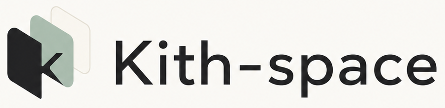

<p align="center">
  
</p>

<p align="center">
  <a href="https://github.com/CKang-J/Kith-space/actions/workflows/ci.yml"></a>
  <a href="https://github.com/CKang-J/Kith-space/stargazers"></a>
  <a href="./LICENSE"></a>
  
  
  
</p>

一个桌面优先、单人使用的**个人 AgentOS**：一个 Human 和本机一队有身份、职责、记忆的 agent，在多个本地 Space 中持续协作。

本轮 UI 实现、自动化验证与用户手动验收已结束。P-A9 桌面模块化单体架构收敛已完成 P-A9.0–P-A9.7 的实现、文档、全量门禁、性能回归、packaged/browser smoke 与约定的一次独立只读终审，并已提交；继续保留 Electron/Core/Worker 拓扑与 TypeScript 主栈。真实存量数据随后暴露的 Runtime admission 队列饥饿、queued 假工作态与失败 wake 残留回复占位也已完成根因修复。

基于 Helio Desktop 的本机实测，P-A10 Agent Harness v2 的P-A10.0–P-A10.7已完成代码、迁移、文档、自动化与全新Desktop/Web真实验收。当前具备Claude Code、Codex、OpenCode、Pi四家Runtime v2、per-surface session、durable delivery/turn、可审计Context Envelope、broker-backed MCP/CLI Gateway、revisioned episodic memory、restricted advisor、snapshot与compaction telemetry。workspace schema v11与app.db v10承载安装级模型供应商/模型配置/运行器控制面、三态默认绑定、Agent跨安装确认快照、runtime epoch屏障和三类全局字体设置、UI 字号及全局颜色模式。

自动记忆提炼现已与聊天runtime解耦：新安装默认使用产品内置、精确锁版的Pi SDK Provider，Claude Code可显式切换；Provider与结构化记忆模型供应商/模型/凭据来源/数据目的地分别版本化，并支持Human显式、安全地导入本机Pi CLI全局模型配置。默认选择不等于默认外发，模型设置、能力探测与per-Agent consent未完成时保持setup；Claude Code、Codex、opencode聊天Agent在授权后可共用同一系统Provider。完整边界见[`系统级可替换Memory Advisor Provider方案`](./docs/superpowers/specs/2026-07-22-system-memory-advisor-provider-design.md)。

你在频道里群聊、也能和每个 agent 私聊；agent 由你本机的 Claude Code / Codex / opencode 承载，隔着 MCP 操控你的模块（任务、记忆，后续邮箱 / 日历 / 画布）。你 @leader 提一个需求，它能自己拆解、分派给其他 agent、最后汇总交付给你。

Kith 意为"你熟识信任的一圈自己人"——正是这些懂你（有记忆）、各有职责的 agent；`-space` 是你和它们共处的协作空间。

## 状态

开发进行中。以 open-tag 为底座（Apache-2.0）二次开发，吸收 OpenLoaf 的界面气质与理念。已完成 SQLite（每 Space 独立 db）、编排护栏、三层记忆、任务后端，以及 Chat 常驻、右侧资源标签按 Space 恢复的单窗口生产壳。

共享前端当前使用 React 19.2.8 + TypeScript + Vite 5；自 2026-07-24 起，新增 UI 统一使用 Tailwind CSS v4 与 shadcn/ui，存量 CSS 按触达组件渐进迁移，不做一次性视觉重写。首批迁移已覆盖通用搜索、Space 新建/卡片菜单、Space 重命名和频道删除确认。开发约束见 [`AGENTS.md`](./AGENTS.md)，组件命令见 [`docs/dev-commands.md`](./docs/dev-commands.md)。

Settings 已新增“外观”分区，可分别选择界面、消息与文档、代码三类字体及 UI 字号；选择写入安装级 app.db 并即时应用。默认保持 Sora Variable + 中文系统回退、界面和消息正文 14px、标题 16px，消息与文档跟随界面，代码使用系统等宽字体；另内置 Inter、Geist、JetBrains Mono、Fira Code 与 Geist Mono，不依赖网络字体。

当前最高优先级是 2026-07-11 锁定的本机化转向：正式产品只有 Electron Desktop，一个 Human、一个本机 Local Runtime Worker、多个本地 Space；浏览器入口是 Desktop 可选开放的本机/LAN 附属能力。多真人、多机器、服务器部署、云同步、Docker、账户登录和独立 Web 发行路线已经取消。完整规格见 [`个人 AgentOS 本机化路线设计`](./docs/superpowers/specs/2026-07-11-personal-agent-os-local-pivot-design.md)。

本机化 A2-A6 原定代码切片与 P-A7 H1-H4 已完成并通过本轮用户验收：中央 `app.db`、唯一 Human、canonical Space 契约、安装级唯一 Local Runtime Worker、19 表 workspace.db baseline、浏览器 Token/Cookie 安全边界和 Electron Desktop 宿主均已落地；app data 与默认 Space 容器已经分离，Home 使用 app.db 中的稳定身份并默认位于用户可见的 `~/Kith-space/Home`；Claude Code、Codex、opencode 以所属 Space root 为 cwd，Agent Memory 随 Space 存放；用户可在 Home-only Spaces 模块搜索、刷新、新建、接入、重连并同窗打开普通 Space。常驻图标栏顶部的 SpaceSwitcher 只负责快速切换、失联恢复和进入 Home Spaces。普通冷启动默认进入 Home Chat，显式可用 Space 深链接仍优先；普通 Space 不显示也不能激活 Spaces 模块。H5 尚未实现；P-A10 Agent Harness v2已完整落地，后续不把H5、P-A11、P-A12或P-S1并回该切片。完整补充规格见 [`Home 与 Space root 设计`](./docs/superpowers/specs/2026-07-12-home-space-and-space-root-design.md)。

P-A8 Agent 频道响应模式与频道全体提及已实现并通过本轮用户验收：当前 Space 的 Agent 默认值可由顶层频道 membership 覆盖，三档为主动/被动/静音；Human-Agent 私聊和明确任务指派始终直达，话题继承父频道。“指派任务 + 单一 @Agent”会形成真实 assignee，无 `@` 保持未指派，多个 Agent mention 或 `@all` 在任务模式发送前拒绝。Human 在频道/话题发送语言无关的规范 token `@all` 时，按发送瞬间的父频道 Agent 成员生成接收者快照，主动/被动目标必须回应，静音目标不自动唤醒；Agent-authored 与 DM 文本不会群体展开。界面标签通过 i18n 显示“所有人 / Everyone”，历史消息和协议始终保留 `@all`。实时 wake、Worker reconnect、Agent message check 与 prompt 共用统一响应指令，Agent 详情默认卡片、消息头像 Agent 卡片内的频道覆盖控件和 Composer 全体候选均已落地。Composer 已把照片/文件与“指派任务”合并到左下角圆形“+”菜单，任务启用后显示可移除胶囊并与正文共享单行空间；短单行草稿保持紧凑，只有任务胶囊与文字的合计占位接近右侧安全区、显式换行或附件存在时才展开。完整边界见 [`Agent 频道响应模式设计`](./docs/superpowers/specs/2026-07-14-agent-channel-response-mode-design.md)。

聊天消息流继续复用统一 `ChatMessageItem` 表现层，主会话、话题、action card 与加载 Skeleton 共用头像、紧凑身份行和内容气泡；正文保持 `14.5px`，行高提高到 `1.68`，消息流与 Composer 沿用 `1040px` 居中上限。Human 使用右对齐 `#e7f0fe` 浅蓝气泡，Agent 使用左对齐 `#f7f8fa` 浅灰气泡；两类气泡统一使用 `16px 18px` 内距。头像统一为36px，频道 Agent 气泡顶部落在头像圆心、昵称使用常规字重，私聊隐藏重复昵称并与头像顶部平齐。Agent 时间只显示气泡下方的 `HH:mm`，仅在消息 hover/focus 时出现；悬浮工具栏与“更多”菜单共用白色表面、浅边线、圆角和投影，并分别优先显示在 Agent 气泡右侧或 Human 气泡左侧，空间不足时移到上方。日期、时间和话题最新回复统一为12px低对比元数据。Markdown 段落、列表和小型标题采用气泡内阅读尺度；行内代码使用低对比浅底，代码块使用带复制按钮的深色表面，引用与表格使用轻边界且表格只在气泡内部横向滚动。话题回复预览为气泡外独立 hover 卡片；展开话题不移动主标题栏右侧按钮，标题栏底部分割线保持连续，话题分栏从其下方开始并使用44px紧凑工具栏，父消息无重复背景且消息使用对称安全边距。普通链尾间距为26px，日期分隔为居中灰色胶囊。连续消息分组、Agent 状态点、归档只读、任务、附件、响应模式和深链契约保持不变。基础消息规格见 [`聊天消息流密度与交互重构设计`](./docs/superpowers/specs/2026-07-15-chat-message-ui-density-design.md)，最新覆盖见 [`图标导航栏与消息中栏设计`](./docs/superpowers/specs/2026-07-23-chat-icon-rail-message-pane-design.md)。

当前 Chat 壳层使用可折叠常驻侧栏、Chat 基础工作面和右侧 Workspace Tabs；业务模块通过资源标签与 Chat 并排，标签可关闭、聚焦并按 Space 恢复。聚合面板使用与 Chat 对齐的52px标题栏、圆形hover关闭按钮和无额外横线的“轨迹 / 话题 / 文件”分段控制器。Human 消息右对齐使用浅蓝气泡，Agent 消息左对齐使用浅灰气泡。Settings 使用独立模态层，Dock 和案例展示继续保持退役。完整边界见 [`Chat 壳层与侧栏模块导航设计`](./docs/superpowers/specs/2026-07-15-chat-shell-sidebar-module-navigation-design.md)。

2026-08-15 已确认 Recombyn Canvas Workspace 方案，当前状态是“设计完成、实现未开始”：直接移植 Recombyn RCB 编辑器内部 UI 和原生能力，接入现有 Workspace Tabs 与 Kith Harness；不迁入 Recombyn AgentDock、云栈、Tauri、Yjs 服务或 Python/LangGraph runtime。MVP 包括多 Canvas 标签、选区发 Chat 和一个明确 Agent 的 revisioned 回写；MCP `2026-07-28` 不作为前置。完整方案见 [`Recombyn Canvas Workspace 设计`](./docs/superpowers/specs/2026-08-15-recombyn-canvas-workspace-design.md)。

P-A9 采用 Desktop 监督的模块化单体：保留 Core 作为 Desktop、授权浏览器和 Agent CLI 的本机权威，保留 Worker 隔离外部 runtime；`src/server/` 收窄为组合根与 Transport Adapter，业务按深 Module 与窄 Interface 收敛。P-A9.0 已冻结生产写入/Agent 端点/Worker transport 当前事实，P-A9.1a–P-A9.7 的实现与最终门禁已完成；当前 Core total 口径已切到 `admission ack`，P-A9.0 total 只止于 socket enqueue。持久 wake `get-or-reserve`、`RuntimeWorkerPort` admission ack、`capacity=4`、`queue=128`、`ttl=120s` 与 1/5/10/20 Agent Core、100/500/1000 消息 Chat 基线/回归都已落地；AgentManager 按实际消息合并批次使用既有 activity 终态判断空闲，完成会话仅在无排队压力时保温，有其他 Agent 等待时立即让出容量，同时保护尚未完成的批次不被误休眠。P-A9.6 的 20-Agent SQL 已从 260 降到 151 且 Core/Runtime/UI 绝对 SLO 通过。完整方案见 [`桌面模块化单体架构收敛设计`](./docs/superpowers/specs/2026-07-18-desktop-modular-monolith-architecture-design.md)，冻结数据见 [`P-A9 性能基线`](./docs/performance/p-a9-baseline.md)。

全局 UI 和消息正文字号默认统一为 `14px`，标题为 `16px`，并在外观设置中提供 `12–16px` 的安装级字号选项；标题始终为当前正文字号 `+2px`，时间、状态、路径、数量和说明等辅助信息为 `max(12px, 正文字号 - 2px)`。非消息 UI 使用常规字重，消息 Markdown 的标题和粗体统一为 `600`。该规则覆盖上文仍记录为历史实现过程的旧消息字号。

## Desktop 开发启动

包管理器是 **pnpm**。日常命令见 [`docs/dev-commands.md`](./docs/dev-commands.md)，低频调试见 [`docs/dev-debugging.md`](./docs/dev-debugging.md)。

推荐由 Desktop 启动完整开发进程组。全新数据目录无需预先 seed，首次窗口会要求填写 Human 名称（必填）、邮箱和描述（选填），随后进入 `Home`：

```bash
pnpm install
pnpm run desktop:dev        # 构建 Electron main/preload，并启动 Core + Worker + Vite + Electron
```

Desktop 每次启动或重启进程组都会生成相互独立的 Desktop/Worker 临时凭据，渲染器不可读取；Core 端口以 `app.db` 为准，并在 ready 后才启动 Worker 与 Vite。`pnpm run seed` 仅保留为手动分进程调试或测试 fixture 辅助；手动分起的 `server`、`daemon` 和 `web` 命令继续保留给调试，此时才需要开发者自行提供内部凭据。日常启动见 [`docs/dev-commands.md`](./docs/dev-commands.md)，Web 模式、访问 Token 与低频联调见 [`docs/dev-debugging.md`](./docs/dev-debugging.md)。测试：`pnpm test --unit` / `pnpm test --integration`；2026-07-25 Windows三端兼容收口实跑为962通过、1个平台条件skip、1个既有CSS契约失败，typecheck、完整integration和production bundle通过。三端CI与剩余发行缺口见 [`跨平台兼容性基线`](./docs/cross-platform-compatibility.md)。

Windows 构建分为四层：

```bash
pnpm run desktop:build       # 仅 Electron main/preload
pnpm run desktop:bundle      # Web + Core/Worker/agent CLI 生产 bundle
pnpm run desktop:pack        # dist/desktop/win-unpacked
pnpm run desktop:dist        # x64、per-user、assisted NSIS 安装器
```

当前生成的是可复现的本地/CI **未签名**安装器，不等于已公开发布。公开分发前仍需 Windows 代码签名证书；真实 NSIS 安装/卸载流程尚未执行验收。

当前发行范围仍是 Windows x64；macOS/Linux 尚未完成打包与实机验收。共享代码的新开发已经采用 Windows/macOS/Linux 三端工程兼容规则，现有缺口、证据和处理顺序见 [`跨平台兼容性基线与审计清单`](./docs/cross-platform-compatibility.md)。

## 文档

- 当前进度与续接指南（新会话先读）：[`docs/progress.md`](./docs/progress.md)
- Home 总控 Space、路径/cwd/记忆与跨 Space 委派：[`2026-07-12-home-space-and-space-root-design.md`](./docs/superpowers/specs/2026-07-12-home-space-and-space-root-design.md)
- Agent 默认/频道覆盖、任务指派与唤醒矩阵：[`2026-07-14-agent-channel-response-mode-design.md`](./docs/superpowers/specs/2026-07-14-agent-channel-response-mode-design.md)
- 纯图标导航、消息中栏、单主工作区切换与消息气泡：[`2026-07-23-chat-icon-rail-message-pane-design.md`](./docs/superpowers/specs/2026-07-23-chat-icon-rail-message-pane-design.md)
- Desktop/Core/Worker 模块边界、实施切片与 Rust 决策门：[`2026-07-18-desktop-modular-monolith-architecture-design.md`](./docs/superpowers/specs/2026-07-18-desktop-modular-monolith-architecture-design.md)
- 会话、上下文、记忆、工具与消息链路机制全景：[`agent-harness-v2-mechanisms.md`](./docs/kith-space/agent-harness-v2-mechanisms.md)
- P-A10完整契约、ADR、失败模式与43场景：[`2026-07-19-agent-harness-session-context-memory-tools-design.md`](./docs/superpowers/specs/2026-07-19-agent-harness-session-context-memory-tools-design.md)
- 内置Pi默认Advisor、Claude切换、独立模型设置与Pi CLI安全导入：[`2026-07-22-system-memory-advisor-provider-design.md`](./docs/superpowers/specs/2026-07-22-system-memory-advisor-provider-design.md)
- Recombyn Canvas 移植、MVP、Agent/Context/Gateway 与后续路线：[`2026-08-15-recombyn-canvas-workspace-design.md`](./docs/superpowers/specs/2026-08-15-recombyn-canvas-workspace-design.md)
- 日常开发命令（启动/测试/打包）：[`docs/dev-commands.md`](./docs/dev-commands.md)
- 高级开发与调试（Token/Web/数据库/E2E）：[`docs/dev-debugging.md`](./docs/dev-debugging.md)
- Windows/macOS/Linux 工程规则与已知缺口：[`docs/cross-platform-compatibility.md`](./docs/cross-platform-compatibility.md)
- 理念与长远愿景：[`docs/vision.md`](./docs/vision.md)
- 全部设计决策与推理：[`docs/decisions.md`](./docs/decisions.md)
- 能力路线图（MVP 与之后）：[`docs/roadmap.md`](./docs/roadmap.md)
- 术语表：[`docs/glossary.md`](./docs/glossary.md)
- 专项设计（定位 / MVP / 架构 / UI / 迁移）：[`docs/kith-space/`](./docs/kith-space/)
- 参与开发：[`CONTRIBUTING.md`](./CONTRIBUTING.md)
- 项目背景与 AI 接手入口：[`AGENTS.md`](./AGENTS.md)

## 核心理念

harness 优先、角色通用，不做场景专用硬流程；不自研 runtime，模块经 MCP 暴露；local-first、Desktop-first、一个 Human、一台本机；Space 根植本地文件夹、自包含可移植。浏览器访问不改变单 Human、本机 agent 和本地数据边界。

## 许可证

Apache-2.0（继承自底座 open-tag，见 `LICENSE` / `NOTICE`）。
