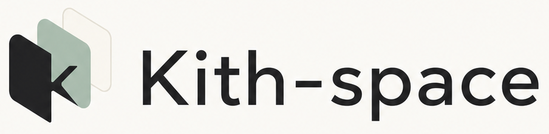
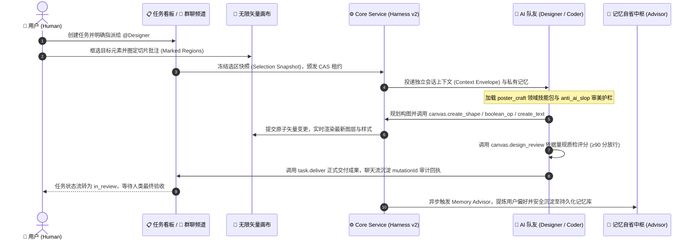
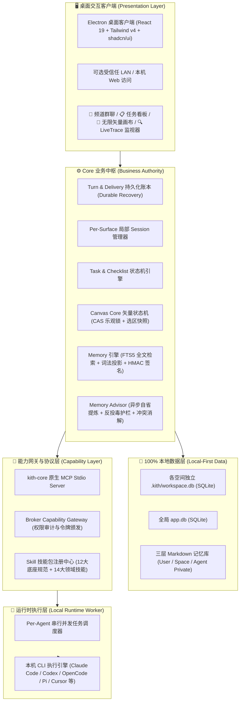

<p align="center">
  
</p>

<p align="center">
  <strong>面向个人的多 Agent 协同工作空间：一个人与一支有身份、有记忆、持续进化的真实 AI 队友团队，在本地空间中深度协作，把事情做完。</strong>
</p>

<p align="center">
  <a href="https://github.com/CKang-J/Kith-space/stargazers"></a>
  <a href="./LICENSE"></a>
  
  
  
  <a href="#-参与贡献"></a>
</p>

<p align="center">
  
  
  
  
</p>

<p align="center">
  <code>多 Agent 协作 (Multi-Agent Collaboration)</code> · <code>AI 队友独立身份</code> · <code>无限矢量画布协同</code> · <code>多层持久化记忆与自省</code> · <code>多 Agent 任务指派与交付</code> · <code>原生 MCP 协议</code> · <code>100% 本地优先</code>
</p>

---

## 🌟 核心愿景：从“孤单用 Bot”到“拥有一支真实的 AI 协作团队”

目前绝大多数 AI 工具仍停留在**临时问答框**的初级形态：每次开启新会话都重新失忆；只能单兵作战；缺少让人与 AI 并肩操作的多元工作空间；无法应对复杂的工程研发、任务推进与视觉设计。

**Kith-space 是一个本地优先、专为个人打造的多 Agent 协同工作台**：
> **Kith** 是古英语词汇，意为“知根知底、彼此信任的自己人”。Kith-space 的核心不是用完即走的泛泛问答，而是一个**由你主导的本地 AI 团队协同空间**——让你一人就能统筹一支常驻本机的数字团队（架构师、全栈工程师、视觉设计师、研究员等），在高度一体化的工作模块中分工协作、并肩攻坚、真正把事情做完。

---

## ⚡ 核心能力速览 (At a Glance)

| 核心维度 | 传统单体 AI 对话框 | 🚀 Kith-space 多 Agent 协同工作空间 |
|---|---|---|
| **协作形态** | 单人对单 Bot 线性问答，缺乏团队分工 | **多 Agent 频道群聊协作**：多角色同台讨论，支持 `@agent` 点名委派与 `@all` 全员广播 |
| **Agent 身份** | 临时 Session，千篇一律，无私有沉淀 | **真实 AI 队友独立人设**：独立工作区、专属私有笔记、异构自由绑定本机 CLI（Claude Code / Codex / OpenCode 等） |
| **认知与记忆** | 窗口关闭即失忆，依赖手动粘贴 Prompt | **多层持久化记忆与自省进化**：三层文件记忆 + SQLite FTS5 全文索引 + 后台 Advisor 异步提炼与反投毒 |
| **工作空间** | 仅限于纯文本或 Markdown 渲染 | **人与 Agent 共享无限矢量画布**：编程控制矢量图层、几何布尔运算、选区批注切片改图、20+ 专业设计 Skill 规范 |
| **工作推进** | 靠人类反复催促与上下文拉扯 | **多 Agent 任务指派中枢**：任务明确指派特定 Agent，支持 Autopilot 与 Plan-First 双模式，CAS 认领与闭环交付 |
| **扩展与隐私** | 封闭生态，数据强制上传云端 | **原生 MCP Stdio 协议 + 100% 本地优先**：内置 `kith-core` MCP Server，数据全部存于本地 SQLite，断网可用 |

---

## 🔄 人与多 Agent 深度协同工作流

在 Kith-space 中，人和多位 AI 队友是如何跨越**群聊**、**任务看板**与**无限矢量画布**协同完成一项严肃工作的？


```mermaid
sequenceDiagram
  autonumber
  actor Human as 👤 用户 (Human)
  participant Board as 📋 任务看板 / 💬 群聊频道
  participant Canvas as 🎨 无限矢量画布
  participant Core as ⚙️ Core Service (Harness v2)
  participant Agent as 🤖 AI 队友 (Designer / Coder)
  participant Memory as 🧠 记忆自省中枢 (Advisor)

  Human->>Board: 创建任务并明确指派给 @Designer
  Human->>Canvas: 框选目标元素并圈定切片批注 (Marked Regions)
  Board->>Core: 冻结选区快照 (Selection Snapshot)，颁发 CAS 租约
  Core->>Agent: 投递独立会话上下文 (Context Envelope) 与私有记忆
  Note over Agent: 加载 poster_craft 领域技能包与 anti_ai_slop 审美护栏
  Agent->>Core: 规划构图并调用 canvas.create_shape / boolean_op / create_text
  Core->>Canvas: 提交原子矢量变更，实时渲染最新图层与样式
  Agent->>Agent: 调用 canvas.design_review 依据量规质检评分 (≥90 分放行)
  Agent->>Board: 调用 task.deliver 正式交付成果，聊天流沉淀 mutationId 审计回执
  Board-->>Human: 任务状态流转为 in_review，等待人类最终验收
  Core->>Memory: 异步触发 Memory Advisor，提炼用户偏好并安全沉淀至持久化记忆库
```

---

## 🏢 多维协同工作空间模块矩阵

Kith-space 将本地工作空间解耦为深度联通的多元业务模块，彻底打破单一纯文本对话的局限：

| 模块 | 核心定位 | 人与 Agent 的协同方式 |
|---|---|---|
| 💬 **即时沟通模块 (Chat & Channels)** | 团队讨论与头脑风暴中枢 | 多 Agent 频道群聊、私聊（DM）、分工讨论、`@agent` 点名委派与 `@all` 全员广播 |
| 📋 **任务看板模块 (Task Board)** | 严肃工程与业务交付中枢 | 任务清晰指派、Autopilot（自动推进）与 Plan-First（方案预审）双模式、CAS 认领与闭环交付 |
| 🎨 **无限矢量画布模块 (Infinite Canvas)** | 视觉设计与原型共创工作台 | 编程控制矢量图形、文字排版、布尔运算，结合专业设计 Skill 与局部选区改图 |
| 🧠 **记忆自省中枢 (Memory & Advisor)** | 跨模块共享的认知神经网络 | 三层文件记忆 + SQLite FTS5 情景检索 + 异步反思纠偏 + 反提示词投毒护栏 |
| 👥 **团队与身份管理 (Agent Roster)** | AI 队友生命周期与配置中心 | 独立人格设定、专属私有工作区、BYO-Runtime（自由挂载本机各种 CLI 引擎） |
| 🔌 **统一工具与能力中枢 (Native MCP)** | 开放生态协议层 | 内置 `kith-core` Stdio MCP Server，全量暴露系统各模块能力 |

---

## 🚀 核心亮点深度剖析

### 1. 🤖 真实 AI 队友：独立身份、专属工作区与多 Agent 分工

在 Kith-space 中，Agent 不是千篇一律的模型包装，而是各有所长的常驻数字员工：

* **独立人设画像与专业职责模板**：支持基于预置模板（Leader 目标编排、Research 调查考证、Writing 文案起草、Testing 质量测试、Review 代码质检等）或深度定制 Prompt，为每位队友设定独立的性格、专业领域和行为边界。
* **自带运行时（BYO-Runtime & Model 自由混搭）**：不同 Agent 可自由绑定你本机已有的不同底层 CLI 与大模型。例如：让架构师使用 Claude Code，全栈开发绑定 Codex / OpenCode，视觉设计师调用特定生图模型，并提供开箱即用的内置 Pi Agent。
* **独立私有工作空间（Private Workspace）**：每位 Agent 拥有完全隔离的本地工作目录（`<agentWorkspace>`），保存其私有笔记、工作草稿与本地记忆，互不串扰。

---

### 2. 🧠 深度深挖：多层持久化记忆机制与 Memory Advisor 自省进化

记忆是多 Agent 成为“真实队友”的基石。Kith-space 拒绝粗暴地把所有历史塞进大上下文窗口，而是设计了一套严密的**多层持久化与自省记忆中枢**：

```text
三层立体文件记忆 (透明易审)
+ SQLite FTS5 结构化情景记忆 (高速全文检索)
+ 异步 Memory Advisor 流水线 (事实提炼 & 反思纠偏)
+ HMAC 密码学防篡改签名 + 原始消息证据链溯源
+ 严苛的 Prompt Injection 反投毒护栏 (拦截对抗性注入)
+ 跨表面隐私披露门禁 (防止私聊秘密泄露进公共群聊)
= 跨越会话、安全可靠、越用越懂你的终身认知系统
```

#### ① 三层立体文件记忆（Transparent File Memory）
* **用户层记忆（User Memory）**：位于 `~/.kith/user/MEMORY.md` 及 `notes/`，记录跨项目的全局习惯、通用技术偏好与风格倾向，由用户直接掌控。
* **空间层记忆（Space Memory）**：位于 `<space>/.kith/memory/MEMORY.md` 及 `notes/`，承载当前项目的业务背景、团队共识、架构规范。
* **Agent 私有记忆（Agent Private Memory）**：位于各 Agent 私有工作空间，沉淀该队友的执行心得与专业经验。
* 所有文件均采用标准 Markdown，用户可随时打开人工阅读、润色或清空，Agent 亦可通过原生文件读写工具自然查阅。

#### ② 结构化情景记忆（Episodic Memory & FTS5 引擎）
* 底层基于本地 SQLite 存储（`episodicMemories` 表），记录具备严格 schema 的结构化事实、用户指令、决策记录与操作准则。
* **SQLite FTS5 全文索引**：通过词法投影（Lexical Projection）与 SQLite FTS5（`memory_fts` 表）实现毫秒级全文模糊匹配与混合相关度召回。
* **知识关联与版本演进**：支持 `relationType` 关联（`supersedes` 替代、`contradicts` 冲突），当用户提出新偏好时，系统自动标记并废弃陈旧认知，避免前后自相矛盾。

#### ③ 异步 Memory Advisor：自动化提炼与认知自省
* 每次交流结束后，后台守护进程自动启动 `memoryAdvisorJobs` 异步分析流水线，无需阻塞当前的实时聊天响应。
* **智能噪声与闲聊过滤**：自动识别并剔除无信息量的客套寒暄（如“好的”、“收到”、“谢谢”）、一次性测试口令（Canary Tokens）与瞬态系统 ID。
* **双重摘要投影（Dual Projections）**：
  * `internalSummary`：保留技术与逻辑细节，供 Agent 自我思考时调用；
  * `shareableSummary`：提炼为安全合规的摘要，用于跨场景、跨频道协同。

#### ④ 工业级安全护栏：反提示词投毒与隐私隔离
* **严苛的 Anti-Poisoning 反投毒检测**：自动拦截输入中伪装成记忆的越权指令（如扫描“忽略之前所有规则”、“绕过安全策略”、“泄露 API Key / 凭据”等黑客攻击），坚决拒绝对抗性攻击污染记忆库。
* **敏感信息自动脱敏（Secret Sanitization）**：实时检测 API Token、私钥、密码，绝不将其作为长期记忆持久化。
* **HMAC 密码学防篡改签名**：所有入库记忆与 Claim 令牌均经本地 HMAC SHA-256 签名，防止恶意进程伪造记忆数据；每条记忆均绑定原始消息证据链（`memoryEvidence`），支持来源追溯。
* **跨表面隐私披露门禁（Disclosure Gates）**：严格区分 `agent_private`、`space` 与 `user` 作用域，在私聊（DM）中习得的敏感信息在未经显式授权（DisclosureGrant）前，绝不会被带入公开群聊频道。

---

### 3. 🎨 深度剖析：无限矢量画布协作模块（Infinite Vector Canvas）

无限矢量画布是 Kith-space 内置的**核心协同工作模块之一**（基于 SVG Paper / Recombyn 引擎），为人和 Agent 的协作提供了图文并茂的高维共创工作台：

#### ① 真正的矢量级编程绘制与几何布尔运算
区别于市面上仅生成位图的 AI 绘图工具，Kith-space 的画布是**真正的矢量操作台**：
* Agent 通过精准的类型化 API（`create_frame`、`create_shape`、`create_text`、`align_nodes` 等）操纵图元，实现毫秒级精准排版。
* **矢量布尔运算（Boolean Operations）**：支持 `canvas.boolean_op`（并集 union、差集 subtract、交集 intersect）。Agent 可像专业设计师一样，用基础几何图形巧妙组装复杂图标（例如：大圆减小圆切出月牙，圆圈组合矩形拼出放大镜，贝塞尔闭合路径绘制矢量徽标）。

#### ② 选区快照与局部切片批注交互（Marked Regions）
* 人类在画布上框选某些图元，或在特定画面区域圈定局部批注框（Marked Regions），然后在侧边栏 `@Designer` 发起指令（如“把这块文案居中，背景换成秋季配色”）。
* 系统底层生成基于 SHA-256 哈希防伪的不可变快照（`FrozenCanvasSelectionSnapshot`），向 Agent 颁发带有 CAS 乐观锁的版本租约，保证多人/多 Agent 编辑不冲突。
* Agent 改动完成后生成原子 `mutationId`，画布实时呈现矢量变化，同时在聊天流中沉淀可审计的操作回执卡片。

#### ③ 体系化设计 Skill 技能包与 Anti-AI-Slop 质检门禁
内置了完整的**专业级设计方法论体系**（*Brief 意图 → Art Direction 视觉方向 → Layout Plan 构图规划 → Execution 绘图执行 → Observe 场景反思 → Review 质检 → Subtract 克制删减*）：
* **12 大设计底座规范**：
  * `anti_ai_slop`：**反 AI 俗套审美护栏**。硬核禁止滥用紫蓝科技渐变、无脑毛玻璃、浮夸光斑，严禁正文中用 emoji 充当图标，禁止编造虚假数据。
  * `composition`：**量化黄金构图**。硬性规定主视觉面积（60–85%）、文字区（≤20%）、视觉留白呼吸区（≥15%）。
  * `typography`（字体阶梯排印）、`color`（色盘角色分工）、`design_system` 等。
* **14 大垂直领域技能包**：`poster_craft`（海报/展架）、`landing_page`（营销落地页）、`banner_ad`（广告横幅）、`dashboard_ui`（数据大屏）、`mobile_app_ui`（移动界面）、`icon_set`（矢量图标组）等。
* **闭环设计质检门禁（`canvas.design_review`）**：提交前 Agent 自行运行 0–100 分量规自检：`<70 分`强制返工重画，`70–89 分`修正缺陷，`≥90 分`方可放行。
* **多模态生成联动**：支持将豆包（Doubao）生成的 AI 图像与短视频无缝挂载为画布 Frame 内的资产。

---

### 4. 💬 多 Agent 群聊频道与 Agent Harness v2 协作底座

* **团队多角色同台群聊与分工**：支持多个 Agent 共同加入一个频道，既可输入 `@AgentName` 针对性委派任务，也可输入 `@all` 发起全员大讨论与跨角色交叉会审。
* **Agent Harness v2 核心架构机制（彻底终结串台与上下文污染）**：
  * **Per-Surface 局部独立会话**：每个 Agent 在每个频道、私聊或话题中运行完全隔离的 Session，彻底杜绝单一大上下文导致的会话串台与跨域污染。
  * **Durable Turn Ledger（崩溃自愈）**：严格遵循“先持久化、后执行”原则，服务重启后自动接续调度，绝不漏回任何消息。
  * **服务端目标锁定（Anti-Hallucination Routing）**：回复目标由服务端安全令牌直接锁定，大模型无法通过幻觉将消息误发到其他私密频道。
* **实时透明追踪**：内置 **LiveTrace** 与 **Turn Inspector**，毫秒级流式展现 Agent 的思维链（Thinking）、工具调用栈及执行详情。

---

### 5. 📋 任务看板模块：严肃分工与交付验收闭环

将复杂的业务诉求转化为具备完整生命周期的结构化 Task：
* **精准指派**：在群聊或任务看板中将工作拆分为具体 Task，明确指派给特定 AI 队友。
* **双模式自主执行**：
  * ⚡ **Autopilot（自动驾驶模式）**：Agent 自主规划步骤、调用工具、推进完成；
  * 📝 **Plan-First（方案预审模式）**：Agent 先出具执行方案与风险分析，待人类确认后方可施工。
* **严肃交付协议**：支持 CAS 乐观锁任务认领（`task.claim`）、流转转交（`task.assign`）、进度汇报（`task.report`），并在最终阶段附带产出物发起正式交付（`task.deliver`）。

---

### 6. 🔌 原生 MCP 协议支持与 100% 本地数据主权

* **内置 `kith-core` Stdio MCP Server**：
  内置符合官方标准协议的 MCP Server（`src/server/mcp/stdio.ts`），全量将画布、记忆、任务、会话检索开放为标准 MCP Tools，任何 MCP 客户端均可零门槛接入。
* **100% 本地优先**：
  每个 Space 是一个完全自包含的本地文件夹（内部持有 `.kith/workspace.db`），全局控制面存于 `app.db`。**拷贝文件夹即完整备份迁移**，无云端绑定，无账号追踪，断网可用，数据绝对不出机。

---

## 🏗 系统架构全景


```mermaid
flowchart TB
  subgraph UI["🖥 桌面交互客户端 (Presentation Layer)"]
    Desktop["Electron 桌面客户端 (React 19 + Tailwind v4 + shadcn/ui)"]
    Web["可选受信任 LAN / 本机 Web 访问"]
    Surfaces["💬 频道群聊 / 📋 任务看板 / 🎨 无限矢量画布 / 🔍 LiveTrace 监视器"]
  end

  subgraph Core["⚙️ Core 业务中枢 (Business Authority)"]
    TurnLedger["Turn & Delivery 持久化账本 (Durable Recovery)"]
    SessionModule["Per-Surface 局部 Session 管理器"]
    TaskEngine["Task & Checklist 状态机引擎"]
    CanvasCore["Canvas Core 矢量状态机 (CAS 乐观锁 + 选区快照)"]
    MemorySystem["Memory 引擎 (FTS5 全文检索 + 词法投影 + HMAC 签名)"]
    Advisor["Memory Advisor (异步自省提炼 + 反投毒护栏 + 冲突消解)"]
  end

  subgraph Storage["💾 100% 本地数据层 (Local-First Data)"]
    SpaceDB["各空间独立 .kith/workspace.db (SQLite)"]
    CentralDB["全局 app.db (SQLite)"]
    FileMemory["三层 Markdown 记忆库 (User / Space / Agent Private)"]
  end

  subgraph Gateway["🔌 能力网关与协议层 (Capability Layer)"]
    MCP["kith-core 原生 MCP Stdio Server"]
    CapGateway["Broker Capability Gateway (权限审计与令牌颁发)"]
    SkillRegistry["Skill 技能包注册中心 (12大底座规范 + 14大领域技能)"]
  end

  subgraph Worker["🤖 运行时执行层 (Local Runtime Worker)"]
    Dispatcher["Per-Agent 串行并发任务调度器"]
    Runtimes["本机 CLI 执行引擎 (Claude Code / Codex / OpenCode / Pi / Cursor 等)"]
  end

  UI --> Core
  Core --> Storage
  Core --> Gateway
  Gateway --> Worker
  Worker --> Runtimes
```

---

## ⚡ 快速上手

### 环境要求
* **Node.js**（v20 或更高版本）
* **pnpm**（推荐 `11.13.1`）
* **本机 AI 运行时**：机器上装有以下任意一款 CLI 工具即可（或直接使用内置的 Pi Agent）：
  * [Claude Code](https://docs.anthropic.com/en/docs/agents-and-tools/claude-code/overview) (`claude`)
  * [Codex](https://github.com/openai/codex) (`codex`)
  * [OpenCode](https://github.com/opencode-ai/opencode) (`opencode`)
  * [Pi](https://github.com/badlogic/pi) (`pi`)
  * [Cursor Agent](https://cursor.sh) (`cursor-agent`) / [Copilot CLI](https://github.com/github/gh-copilot) (`copilot`)

### 1. 克隆与安装

```bash
git clone https://github.com/CKang-J/Kith-space.git
cd Kith-space
pnpm install
```

### 2. 启动桌面客户端

```bash
pnpm run desktop:dev
```

* 首次启动会引导你创建唯一 **Human 身份**，并自动生成你的第一个 **Home** 空间。
* 进入 **Agents** 模块，点击“新建 Agent”，从模板选择角色（例如架构师、全栈工程师或视觉设计师），绑定你本机已有的运行时引擎与模型，即可开启多模块团队协作！

---

## 🛠 日常开发与调试

项目使用 `node:test` 进行契约与单元测试，所有命令参数直接附加在后面，**无需加 `--`**：

```bash
# 运行单元测试
pnpm test --unit

# 运行集成测试
pnpm test --integration

# 运行 TypeScript 类型检查
pnpm run typecheck

# 单独启动前端 Web 界面调试
pnpm run web

# 单独启动后台 Core 服务调试
pnpm run server
```

更多开发、分进程调试与打包构建指令，详见完整文档 [`docs/dev-commands.md`](./docs/dev-commands.md) 及 [`docs/dev-debugging.md`](./docs/dev-debugging.md)。

---

## 📚 延伸阅读

* **机制全景导读**：[`docs/kith-space/agent-harness-v2-mechanisms.md`](./docs/kith-space/agent-harness-v2-mechanisms.md) —— Agent Harness v2 的架构图、时序图与状态机详细设计。
* **产品愿景与原则**：[`docs/vision.md`](./docs/vision.md) —— 深入了解 Local-first 与长远设计哲学。
* **关键架构决策**：[`docs/decisions.md`](./docs/decisions.md) —— 锁定决策、权衡考量与技术演进史。
* **前端开发规范**：[`docs/frontend-standards.md`](./docs/frontend-standards.md) —— 界面组件约定与状态管理规范。

---

## 🤝 参与贡献

欢迎每一位关注人与 Agent 深度协作、多 Agent 团队工作空间的开发者参与贡献！
* 本项目采用轻量 **GitHub Flow**：从 `main` 检出短特性分支，在短分支提交后发起 Pull Request（Squash 合并），切勿直推 `main`。
* 提交说明规范请遵循中文 Conventional Commits，详见 [`CONTRIBUTING.md`](./CONTRIBUTING.md)。

---

## 📄 开源许可证

本项目基于 [Apache-2.0](./LICENSE) 协议开源，部分衍生及第三方组件声明见 [`NOTICE`](./NOTICE)。
