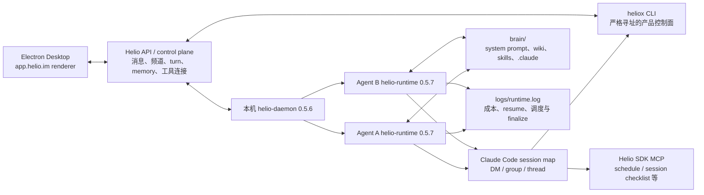
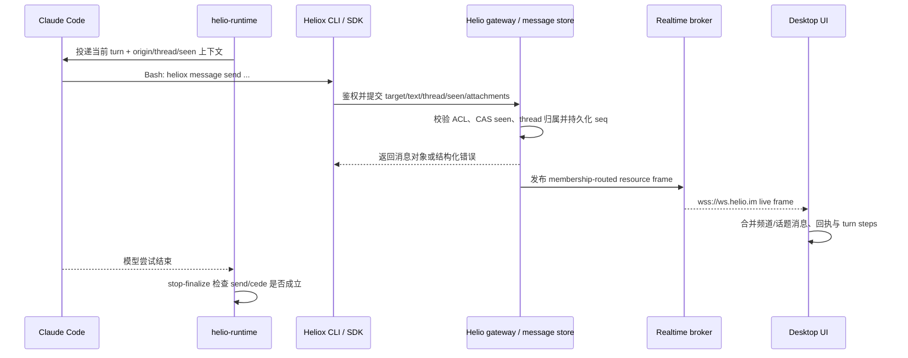

# Helio Agent 会话、上下文、记忆与工具机制实测

> 调研日期：2026-07-19
> 实测版本：Helio Desktop / daemon / heliox `0.5.6`，helio-runtime `0.5.7`，Claude Code `2.1.210`
> 调研对象：本机 Helio.app、两个本地 Agent（“周报助手”“Helio AI”）、三个群频道（原有 `#交流`、新建私有/公开实验频道）、两个私信及多个话题
> 目的：作为 Kith-space 的产品与 harness 设计参考。本文描述的是本次安装与实验所见，不代表 Helio 的稳定公开协议。

## 1. 结论先行

Helio 的“像一个真实队友、能跨私信/频道/话题记得事情”并不是因为一个 Agent 在所有地方共用同一个无限上下文 session。实测显示，它采用的是**每个交流表面独立 session，加多层上下文桥接与持久记录**：

1. **私信、频道、话题分别拥有独立 runtime session。** 群频道 session key 是频道 ID，私信是另一频道 ID，话题是 `thread:<root-message-id>`。同一话题内后续 turn 用 Claude Code `--resume <session-id>` 延续。
2. **新话题至少以根消息启动，不能假设自动获得父频道最近 N 条原文。** runtime 日志明确记录“从 root message bootstrap”；本次新话题没有自动拿到紧邻根消息之前的频道实验值，Agent 是后来用 `heliox message list` 主动查到的。
3. **跨表面的自然连续感来自三条桥：** turn 前自动语义召回 `<memory-context>`、Agent 主动查询完整消息记录、Agent 私有 wiki 中的人工提炼笔记。它们共同掩盖了 session 彼此隔离这一事实。
4. **消息记录才是事实来源。** Helio 的内置操作规范反复要求 Agent 在回答前查询相应频道、私信、话题或自己的 turn ledger，而不能把模糊记忆当成记录。
5. **自动召回、Agent CLI 和 Human 记忆面板是三个身份相关的投影视图。** 它们都以同一个 Assistant ID 调用 `/assistants/<id>/memory*`，但相同时间可见的条目、内容和状态不同；差异来自调用身份、provider 投影、生命周期过滤或最终一致性，不是简单的 `app-id` 不同。
6. **话题运行实例会在约 30 分钟空闲后逐出，但 Claude session 仍可恢复。** 两个 Agent 的旧话题实例分别在空闲 1,807 秒和 1,820 秒后被逐出；35 分钟后重启该话题仍记录 `had_resume: true`，Agent 无需查询工具即可看到完整旧话题消息。
7. **Heliox CLI 是 Helio 产品能力的主要 Agent 控制面。** 聊天、频道、话题、任务、自动化、文档、记忆、凭据、外部工具等都通过一个严格寻址、有游标并发保护的 CLI 暴露；少量 session 能力通过 Helio SDK MCP 暴露。
8. **“私有”主要是 Helio API ACL 与提示词行为约束，不是本机 OS 沙箱。** 两个 runtime 的 API 只能列出各自的私信，但它们都以同一 macOS 用户运行并开启 `bypassPermissions`；从 OS 层可以读取另一个 Agent 的目录。
9. **Agent 回复不是从 Claude stdout 直接画到 UI。** 模型必须调用 `heliox message send`；gateway 校验目标、`seen` 游标和 thread 归属，持久化后返回新 seq，Desktop 再从 `wss://ws.helio.im` 的实时资源流收到消息并渲染。未 send/cede 的模型停止会被 finalize gate 拦下。
10. **频道之间没有自动原文继承，跨频道连续性仍靠记忆与查询。** 新建私有、公开频道后，无工具对照均回答 `NO-VISIBLE`；允许调用 `heliox message list` 后，Agent 可按自己的频道成员权限查回另一频道的精确消息。
11. **公开/私有是发现与成员 ACL，不是不同的 session 模型。** 公开频道进入 `/channels/discover` 并可自行 join；私有频道只对受邀成员可见。Agent 在公开频道 turn 中仍能读取自己已加入的私有频道，权限跟 Agent 身份而不是当前表面绑定。
12. **Agent runtime 根目录并不会自动跨 Agent 共享。** 一个 Agent 写入自己所谓的“shared workspace”后，另一个 Agent 的 runtime 没有镜像、挂载或 workspace binding；真正共享仍需频道 workspace binding、附件、文档或显式文件传递。

最值得 Kith-space 借鉴的不是“共享一个大 session”，而是以下组合：

- 稳定的 per-surface session 身份与可恢复 session ID；
- 可追溯的 Context Envelope；
- 完整消息记录与 Agent 自己的 turn ledger；
- 自动召回、私有 wiki、共享知识和 engine-native memory 的明确分层；
- 严格的消息寻址、`seen` 游标、`cede` 静默协议；
- Agent 每条回复可展开的工具/推理审计；
- 话题成员加入语义与低成本空闲逐出。

## 2. 证据等级与方法

本文用以下标记区分事实和推断：

- **A：直接证据**——Helio UI、可展开步骤、本机进程 argv、本机 runtime 日志、Heliox CLI 帮助、本地提示词/目录。
- **B：交叉证据**——Agent 回答中展示了实际工具调用，且与本机日志、文件或另一 Agent 的独立实验一致。
- **C：推断**——由多项 A/B 证据推导，但没有数据库 schema、服务端源码或公开协议直接证明。

本轮共执行了十六组实验；R11–R16 是针对首轮未证实问题的第二轮取证：

| 实验 | 操作 | 主要结果 |
|---|---|---|
| R1 | 在“周报助手”私信中保存两个偏好样本，并允许长期记忆 | Agent 创建 `brain/wiki/zinci-preferences.md` 并更新索引；后续话题能从 wiki 读取 |
| R2 | 在同一私信放入短期样本，明确要求不写 wiki/文件 | 新话题没有自动得到；Agent 通过 DM `message list` 找回 |
| R3 | 在“Helio AI”私信放入另一组短期样本 | 该 Agent 新话题中同样需主动查询 DM；另一 Agent 的 API 看不到此私信 |
| R4 | 在 `#交流` 发送未 @ 的团队临时事实并要求不回复 | 两个主动模式 Agent 都被唤醒并 `cede`；说明主动模式会接收普通频道消息并自主判断 |
| R5 | 在频道 @“周报助手”自动创建话题 | 形成独立 `thread:` session；父频道的紧邻事实未自动出现，Agent 查询频道后取得；DM 短期值也靠查询 |
| R6 | 在频道 @“Helio AI”自动创建另一话题 | 得到相同 session/查询结论；`memory recall` 对私信样本返回空；只列出自己的 DM |
| R7 | 要求枚举 Heliox CLI、插件、skills、权限和 OS 隔离 | 得到命令面、插件面与安全边界；用只读权限探针确认另一 Agent 目录可读 |
| R8 | 要求先实际加载 `heliox:memory` / `heliox:user-guide`，再分析多层记忆 | 两个 Skill 调用均 `Unknown skill`；基础 `act.md` 与 CLI help 仍可用；自动 memory 非空但 CLI memory 为空 |
| R9 | 重新激活已被空闲逐出的最早话题，禁止主动查历史 | `had_resume: true`；Agent直接复述旧分工，完整 seq 5–10 在 turn 输入中，无 summary/compaction 标记 |
| R10 | 临时把“Helio AI”依次切为被动、静音，发送普通消息和结构化 @；再展开成功回复的发送步骤 | 被动不消费普通消息、@ 后创建 thread turn；静音连 @ 都不消费；gateway 拒绝缺 `--thread` 的话题回复，补 root seq 后返回持久化消息对象；实验后恢复全局默认主动模式 |
| R11 | 对比自动 `<memory-context>`、`memory list/recall/show --app-id self` 与 Human 记忆面板 | 三个视图共用 Assistant ID 和同一路径族，但条目集合不同；`self` 解析为当前 Assistant ID；provider/ACL/生命周期投影不同 |
| R12 | 连续发送 8 条探针、制造 turn 中新消息，并测试新 root 的直接输入 | 观察到 2/8/9 条重叠批次、`peer_activity_since_turn_start`、旧 cursor floor 与重复 replay；新 root 只收到自己，不含父频道最近窗口 |
| R13 | 让一个 Agent 在“共享工作区”写文件，再让另一 Agent 仅检查自己的 cwd | 文件只存在于写入者 runtime；另一 runtime 无镜像、符号链接、挂载或 binding |
| R14 | 同一事实重复两次、随后权威更正，并对比面板、active/archived list 与 recall | 数十秒内异步提炼；旧事实被改写为“已作废”，新事实为权威；出现独立 active insight、自动 archive 近重复项和三种可见投影 |
| R15 | 新建私有与公开实验频道，加入两个 Agent，双向做无工具/有工具跨频道探针 | 自动原文隔离；显式查询按成员 ACL 成功；公开频道可发现，私有频道不出现在 discover；系统入会事件也会唤醒主动模式 Agent |
| R16 | 只读执行 approval/vault help/list/search | approval asker/approver 与 vault own/requestable 查询均成功、当前为空；未执行 secret reveal、消费、决策或任何写操作 |

实验中使用的颜色、代号和吉祥物均为专门生成的无业务意义 canary，用来区分自动注入、主动查询和持久笔记。

## 3. 总体运行架构

以下是本次安装能由直接证据支持的最小模型：



直接观察到的本机进程拓扑是一个 Desktop/daemon 加每 Agent 一个 `helio-runtime`。每次 Agent turn 再启动 Claude Code 子进程。典型 argv 包含：

```text
claude
  --output-format stream-json
  --verbose
  --system-prompt-file <runtime>/brain/system-prompt.md
  --allowedTools Bash,mcp__helio__schedule_wakeup,Skill
  --disallowedTools TaskCreate,TaskUpdate,TaskGet,TaskList,TodoWrite,
                    ScheduleWakeup,AskUserQuestion
  --model claude-opus-4-8[1m]
  --permission-mode bypassPermissions
  [--resume <claude-session-id>]
  --add-dir <runtime>/brain
  --mcp-config {"mcpServers":{"helio":{"name":"helio","type":"sdk"}}}
  --include-partial-messages
  --setting-sources=user,project
  --thinking adaptive
  --thinking-display summarized
  --input-format stream-json
```

这里的 `--allowedTools` 更接近“显式预批准”而不是“唯一存在的工具集合”。Agent 的步骤面板仍显示了 Read/Write/Edit 等 Claude 工具；`--disallowedTools` 才是明确屏蔽项。`bypassPermissions` 表明本次本地 runtime 没有交互式文件/命令审批。

## 4. Session 与消息路由

### 4.1 不是一个 Agent 一个全局 session

runtime 成本日志直接记录不同 `session_id`：

| 交流表面 | runtime session key | 说明 |
|---|---|---|
| 群频道 | `<channel-id>` | 该 Agent 在该频道的长期 session |
| 私信 | `<dm-channel-id>` | 与该 Agent 的私信 session；与群频道隔离 |
| 话题 | `thread:<root-message-id>` | 每个 Agent、每个话题各自独立 session |

同一表面第一轮记录 `had_resume:false`，后续轮次通常为 `had_resume:true`。这意味着“session 归属”至少由 Agent 与 origin 共同确定，而不是全局共享一份 Claude 对话。

一个适合 Kith-space 的抽象键是：

```text
RuntimeSessionKey = (space_id, agent_id, origin_kind, origin_id)
origin_kind       = dm | channel | thread | task | automation
```

这比只存一个 `agent.sessionId` 更接近真实产品需求。

### 4.2 频道 @ 的产品意图是把对话路由到话题

多数实测与 UI 说明都与用户补充一致：在频道顶层消息中 @Agent 后，Helio 希望以这条消息为 root 创建话题，让 Agent 的实际回复进入话题侧栏，而不是继续污染频道主流。但这不是 gateway 自动完成的硬路由；频道 session 中被唤醒的 Agent 仍须按注入提示使用 `message send --thread <root-id>`。R12 证明模型漏掉该参数时会退化成父频道引用回复，详见 18.4。

话题 UI 明示的参与规则是：

- AI 不会因为存在一个话题就自动加入；
- @ 一次后加入；
- 加入后该话题中的后续消息无需反复 @；
- 静音模式的 AI 即使被 @ 也不加入。

这将“频道唤醒策略”和“话题成员资格”拆成两个状态：

```text
ChannelResponseMode  决定是否消费频道顶层消息
ThreadParticipation  决定是否持续消费某个已加入话题
```

Kith-space 已有 `active / mention_only / silent` 响应模式；Helio 的 UI 对应语义是：

| Helio | UI 说明 | Kith-space 近似项 |
|---|---|---|
| 主动模式 | 接收所有消息，自行判断是否回应 | `active` |
| 被动模式 | 只在被 @ 提及时回应 | `mention_only` |
| 静音模式 | 只读取消息，@ 也不会回应 | `silent`，但“是否仍读取”需单独定义 |

响应方式有两级配置：

- Agent 资料页提供**全局默认**；
- 每个频道可以选择“跟随全局”或做**仅本频道覆盖**；
- 修改频道覆盖时，runtime 日志收到 `member_updated` 并刷新 self config；
- 消息旁的模式 chip 显示的是 Agent **当前频道配置**，修改模式后历史消息的 chip 也会一起变化，因此不能把它当作“发送该消息时的历史模式快照”。

Desktop bundle 暴露的 wire enum 与字段进一步说明了内部模型：

```text
mode = all | mentions | observer

assistant.response_mode_default       # Agent 全局默认
channel_member.ai_response_mode       # 单频道 raw override
channel_member.default_response_mode  # 解析时使用的全局值
channel_member.effective_response_mode
channel_member.response_mode_effective_at
```

单频道修改调用 group channel member 的 response-mode endpoint，并由频道 owner 权限控制；传空值清除 override，DM 明确拒绝这类覆盖。Desktop 的 engagement policy 对 DM 固定返回 `all`，所以三种响应方式是**群频道策略**，不是让 1:1 私信中的 Agent 静音。

话题策略也不是简单继承频道的字符串：`observer` 始终排除；`all` 与 `mentions` 在尚未加入某个话题时都按 `mentions` 对待，被 @/产生或处理 thread turn 后进入 participating set，随后在该话题按 `all` 对待。这正是“请进来一次，之后无需再 @”的状态转换。

消息回执/期待列表还用 `max(member.created_at, response_mode_effective_at)` 作为 join floor。也就是说，切换模式不会让旧消息被追溯地标成“本应由该 Agent 处理”。这是 Kith-space 已采用非追溯 wake watermark 的同类设计证据。

R10 对三种模式做了实际路由验证：

| 当前模式 | 顶层普通消息 | 顶层结构化 @ | 已加入话题的后续消息 | 实测证据 |
|---|---|---|---|---|
| 主动 | 创建频道 turn；Agent 自行 send 或 cede | 创建/进入 @ 根消息的话题 | 持续消费，无需重复 @ | R4 普通消息让两个 Agent 都产生 turn 并 cede；R9 无 @ 唤醒已加入旧话题的 Agent |
| 被动 | 不创建该 Agent 的 runtime turn | 创建 `thread:<root-id>` 首轮并回复 | 加入后持续消费 | R10 普通消息只有主动的“周报助手”产生 turn；@Helio AI 后 Helio AI 出现新话题 `had_resume:false` |
| 静音 | 不创建 turn | 不创建 turn、不加入话题 | 已有话题是否立即退订未单测；UI 契约是 muted Agent 从不加入新话题 | 提及选择器直接标注“@ 后也不会回应”；R10 @ 后两份 runtime 日志都无新增 turn |

“静音模式只读取消息”中的“读取”不等于“运行一次模型后 cede”。本次静音 @ 没有 Claude turn，说明至少在该路径上，过滤发生在模型 admission 之前；消息可能仍进入服务端记录或 runtime 的非唤醒 cursor，但没有证据证明会进入该 Agent 的 Claude 上下文。

### 4.3 主动模式不是“每条都发言”

R4 的普通频道消息没有 @，但两个 Agent 都产生了 turn，随后都没有发消息。步骤和日志显示它们执行了静默决策。Helio 把静默做成显式协议：

```text
heliox message cede --reason <reason> --seen <latest-seq>
```

`cede` 的价值是让调度器区分：

- Agent 没有收到；
- Agent 正在处理；
- Agent 收到后判断无需回复；
- Agent 执行失败。

这比“没有输出就当作没事”更可观测，也能清理 UI 中的运行占位。

### 4.4 消息写入有严格目标与乐观并发保护

Heliox 的消息规范要求：

- 目标必须是 `#channel` 或 `@handle`，裸名称和内部 ID 被拒绝；
- 发送必须带 `--seen <latest-seq>`；
- 如果期间有新消息导致游标过期，返回 `stale_seen_id`，Agent 要重读、重新推理、再发送；
- 话题回复必须附 root seq；
- 在群组中指向特定收件人时要保留 @mention；
- Agent 的普通 stdout 文本不会交付，最终回复必须经 `heliox message send`；
- 复杂正文应先写 JSON args file，再用 `--args-file` 调用，避免 shell 插值和特殊字符问题。

`message send` 还支持：

- `--thread <root-seq>`：把消息持久化为原生话题回复；
- `--in-reply-to <seq>`：引用某条消息，但引用本身不会创建/切换 thread；
- `--attachment <local-path>`：可重复；附件按顺序上传，任一失败则整次发送中止；
- 正文可为空，但必须至少有附件。

这是一套很实用的 Agent 写入契约：**可寻址、可并发校验、可审计、与模型 stdout 解耦**。

### 4.5 Agent 回复进入 Helio 界面的完整链路

R10 展开步骤给出了一次可复现的端到端样本。该 turn 被路由到 root seq `28` 的话题，但 Agent 首次遗漏了 `--thread`：

```text
heliox message send '#交流' \
  'R10-PASSIVE-MENTION: reply with passive mention received.' \
  --seen 28 --json

exit 2
message send: this turn belongs to thread 28 in this channel;
resend with --thread 28
```

这证明 thread 锁定不是前端建议，而是 gateway 的服务端/CLI 契约。Agent 按返回值重试：

```text
heliox message send '#交流' \
  'R10-PASSIVE-MENTION: reply with passive mention received.' \
  --seen 28 --thread 28 --json
```

成功返回：

```json
{
  "attachments": 0,
  "channel_id": "<channel-id>",
  "in_reply_to_id": "",
  "seq": 29,
  "target": "#交流",
  "text": "R10-PASSIVE-MENTION: reply with passive mention received.",
  "text_generated": false,
  "thread_id": "28"
}
```

由提示词、CLI 返回、runtime 日志和 Desktop bundle 可还原出以下交付链：



各阶段的证据与边界如下：

1. **模型到 Heliox（A）**：`act.md` 明确规定任何回复、确认、进度和 handoff 都必须经 Heliox；普通 assistant text 不会交付。步骤面板显示实际 Bash 命令。
2. **Heliox 到后端（A/B）**：成功返回包含 channel、seq、thread、正文和附件数的持久化消息对象；CLI 内嵌 `helio-sdk-go`，并有 `HELIO_API_BASE_URL`、gateway gRPC 等接入点。具体这条 send 在 HTTP、gRPC 或 SDK realtime publish 中选择哪条传输，本轮没有抓包，图中统一称 gateway。
3. **后端到 Desktop（A）**：Desktop bundle 配置 `https://api.helio.im`、`wss://ws.helio.im` 和独立协作文档 `wss://api.helio.im/collab`。聊天 `RealtimeClient` 使用 per-resource 订阅、membership-routed frame、broker ack、断线 catch-up 和 last-seen cursor；因此聊天消息不是靠界面轮询 Heliox stdout。
4. **消息与步骤合并（A）**：UI 中最终正文作为 seq 29 的 thread message 出现，同时“展开步骤”保留第一次 exit 2、第二次成功和“Sent — seq 29 in thread 28”。正文记录与 turn 轨迹是两个关联对象。
5. **最终化（A）**：runtime 的 stop hook 只有在 `message send` 或 `cede` 成功后才允许 chat turn 完成；遗漏交付时会继续驱动模型 finalize。

Desktop 实时层还区分 `history` 与 `runtime` cursor，并在重新连接后对已订阅 resource 做 catch-up；live observer 又能收到尚未在本地显式订阅、但用户属于其成员的频道 frame。这解释了以下 UI 行为：

- 新 DM/新加入频道的消息能立即让侧栏出现未读；
- 断线恢复后从消息历史补齐，而不是只信 WebSocket 的瞬时事件；
- runtime 执行状态/步骤与持久消息可以分别到达，再由 UI 投影成回执和可展开步骤；
- `seen` 不只防重复，还把 Agent 的推理依据固定在一个频道序列水位上。

对 Kith-space 最重要的设计点是：**模型输出、消息写入、实时投递和 turn 完成必须是四个不同状态**。不要在收到 Claude text block 时就直接把它当作已发送消息。

## 5. 新话题到底注入什么

### 5.1 已证明：根消息是 bootstrap 锚点

新话题日志出现：

```text
runtime: thread session bootstrapped from root message
key: thread:<root-message-id>
parent_channel: <channel-id>
root_seq: <seq>
```

因此根消息至少是话题冷启动的明确输入和稳定锚点。

### 5.2 未证明：固定注入父频道“最近 N 条”

R5/R6 的根消息之前紧邻一条频道 canary：“铜色猫头鹰 / 林脊-5521”。两个新话题中的 Agent 都没有从初始上下文直接得到它，而是显式运行 `heliox message list '#交流'` 后才取得。

同时，话题 turn 又可能收到来自父频道或私信的 `<memory-context>` 语义条目，而且其中常常是更早的消息。这说明：

- root bootstrap 是确定规则；
- 语义 recall 是另一条独立规则；
- “最近几条频道原文”即使存在，也是有界、条件化或不保证覆盖的，不能当作产品契约；
- Agent 对“系统给了最近 N 条”的自述不能替代 injection manifest 或日志证据。

Kith-space 如果要做“从消息开启话题”，建议明确构造并记录：

```text
ThreadContextEnvelope
  root_message
  parent_snapshot_as_of_root   # 可选，明确条数/字节/token 上限
  recent_thread_messages
  recalled_memories[]          # 带 source / score / occurred_at
  private_context_refs[]       # 默认只给引用，不自动泄露私信原文
```

这样 UI 才能回答“为什么它知道这件事”，测试也不需要猜测 prompt。

## 6. 跨私信、频道、话题的连续感如何形成

### 6.1 自动语义 recall

runtime 在 turn 开始前记录：

```text
memory: injecting recall context
session_id: ...
count: N
items[]:
  id
  occurred_at
  score
  source_id
  source_kind: channel
  triggered_by_message_ids
  triggered_by_source_order
  text_score
  vector_score
```

最关键的一项证据发生在“周报助手”第一次进入 `#交流` 时：在建立群频道 session 前，日志向它注入了三条来自该 Agent 私信 source 的记忆。这直接解释了用户观察到的“我先私聊，再去群里聊，它仍知道我的偏好”——**不是复用私信 session，而是 Agent 级 recall 把跨表面事实送进了当前群聊 turn。**

新话题中的 recall 也表现出以下特征：

- 同一触发消息，两个 Agent 得到的条目 ID 与数量不同，说明召回至少具有 Agent 作用域；
- 有高语义分数，也有 `score:0` 的兜底条目；
- 新鲜消息可能缺失，说明写入/索引并非同步强一致；
- 条目包含来源和发生时间，而不是纯文本块；
- recall 失败会 fail-open：R9 中出现一次 `memory_provider_unavailable` / rate-limit，Agent 仍可继续完成 turn。

### 6.2 自动 memory、CLI 与 Human 面板是不同投影

R8 的同一 turn 有两项同时成立：

1. 系统自动注入两条 `<memory-context>`；
2. `heliox memory list --app-id self` 和语义 `recall` 都返回 `{"items":[]}`。

第二轮排除了“`self` 是另一 app-id”这一解释：CLI 与自动 recall 都解析到当前 Assistant ID，同一时段 Human 记忆面板又展示了第三种、经过合并的事实列表。更符合证据的解释是**同一 Assistant 记忆域上的 actor/provider/status 投影与最终一致性**，而不是三套完全独立的 app。服务端物理库和 canonical mapping 仍未公开，详见 18.2。对 Kith-space 的直接启示是：**自动召回、Agent 可查询记忆、Human 可管理记忆必须定义成可解释的不同视图，并通过稳定 canonical ID 与 provenance 关联。**

### 6.3 主动查询完整消息记录

当自动 recall 没有给出答案时，Helio 的内置规范要求 Agent主动查询：

```text
heliox message list '#交流' --limit 50
heliox message list @zinciqqcom --limit 50
heliox message list '#交流' --around <seq>
heliox message list '#交流' --grep <term>
heliox message threads list '#交流'
heliox message threads get '#交流' <root-seq>
heliox me activity
```

R5/R6 中两个 Agent 都靠这条路径找回没有自动注入的 canary。消息查询返回 seq、sender、正文、附件、metadata 和 created_at，是比语义记忆更完整的事实记录。

私信有额外的行为规范：不能因为自己能查到与 Human 的 DM，就在第三方频道披露；本次实验在话题中明确授权后，Agent 才复述私信 canary。这个边界目前主要依赖 prompt 与 API ACL。

### 6.4 私有 wiki：人工维护的长期知识

每个 Agent 有自己的：

```text
<runtime>/brain/wiki/
  AGENTS.md
  INDEX.md
  <topic>.md
```

R1 中“周报助手”实际创建了 `zinci-preferences.md` 并更新 INDEX；之后在话题中能先从 wiki 取得偏好，再用 DM 原文交叉验证。另一个 Agent 的 wiki 没有这份文件。

wiki 的定位不是消息归档，而是 Agent 主动提炼的耐久上下文：一主题一文件、保持索引、使用前核对是否仍有效、不存凭据和敏感原文。它不会自动全文注入；系统提示要求先从 INDEX 定向查找。

### 6.5 Agent 自己的 turn ledger

Heliox 提供：

```text
heliox me turns list
heliox me turns get 'turn:<id>'
```

turn ledger 跨频道列出该 Agent 自己的工作轮次，并可回放触发来源、思考、工具调用和最终产物。它不是频道消息历史，而是**Agent 视角的执行审计和自我追溯**。

首轮检查时两个 `<runtime>/turns/` 目录都为空，不能支持 Agent 在 R8 中“每 turn 都有完整本地 `.jsonl`”的说法。第二轮产生新 turn 后，目录中出现按 turn ID 命名的 JSONL，但只记录本轮 Heliox 调用的 `argv + exit` 摘要，不含 stdout、完整 reasoning、完整触发输入或历史 turn。可以确认 `me turns` 后端接口与 UI“展开步骤”承担完整 turn ledger；本地文件只是有限的工具审计碎片。Helio 文档也要求 Agent 在描述“我刚才为什么这么做”前先查 turn ledger，而不是凭当前对话编造自己的工具轨迹。

### 6.6 Session checklist

注入规范还描述了一个 session-scoped checklist：

- 仅用于当前工作，不等同于组织任务板；
- 同一 session 的多轮间持久；
- 每个话题有自己的 checklist；
- 可由 Helio SDK MCP 的 create/update/get/list 类工具维护；
- schedule wake 再唤醒同一 warm session 时继续。

本轮没有实际创建 checklist，因此这里只能确认提示词和工具规范，不能确认它的服务端存储 schema。

### 6.7 Dream：离线记忆巩固

`brain/dream.md` 是独立于正常 turn 的反思提示，不拼入正常 `system-prompt.md`。它定义了一个无人在等回复的离线阶段：

1. 先读 wiki INDEX 与 engine-native memory；
2. 回顾近期 transcript；
3. 把稳定事实、模式和未完成事项提炼进 wiki 或 engine memory；
4. 重复模式可沉淀成 skill；
5. 清理过时笔记；
6. 角色或工作方式变化时更新 soul/agent 文件。

Dream 阶段明确不应发频道消息或调用聊天工具，只读受限 transcript range、思考并写自己的文件。第二轮从 binary 与 `dream.md` 确认它以未处理 transcript 字节压力、文件 cursor、active-turn gate、锁和 failure backoff 调度；日志仍没有捕获实际 dream run，因此 remote-resolved 数值阈值和真实写回样本未知，详见 18.8。

### 6.8 Engine-native memory 与共享 workspace memory

系统提示还区分两类目标位置：

- Claude/Codex 自己的 engine memory；
- 频道可见的 workspace `memory/` 树。

本次两个 runtime 都有隔离的 `brain/.claude/`，但没有观察到可证明由正常 turn 写入的 engine memory 内容；也不能像 Agent 在 R8 中那样仅因用户全局 `~/.codex/memories/` 存在就推断 Helio 正运行 Codex，直接进程证据表明两个 live Agent 都是 Claude Code。第二轮文件探针进一步证明两个 runtime 根不会自动互相同步；所谓频道 workspace 是需要显式 binding/ACL 的另一层能力，详见 18.9。

## 7. 空闲逐出、resume、snapshot 与 compaction

### 7.1 话题实例约 30 分钟逐出

两个 Agent 的同一旧话题先后出现：

```text
runtime: evicted idle thread instance
idle: 1807000000000 ns  # 1807 秒

runtime: evicted idle thread instance
idle: 1820000000000 ns  # 1820 秒
```

这说明 runtime 维护 per-thread instance cache，并用约 30 分钟空闲阈值释放资源。

### 7.2 逐出不等于丢失 Claude session

R9 在逐出约 35 分钟后向旧话题发消息，并禁止 Agent 使用 message/history/memory/wiki/Read/Bash。结果：

- runtime 日志：`session_id` 仍为同一个 `thread:<root-id>`；
- `brain: turn cost`：`had_resume:true`；
- Agent 准确复述旧话题最终分工；
- Agent说明旧 seq 5–10 的完整消息体在本轮输入中；
- 没有看到 compaction、snapshot 或 summary 标记；
- cache hit 约 98.5%。

因此更准确的模型是：

```text
idle eviction
  = 释放 helio-runtime 内的活跃 thread instance / Claude 子进程
  ≠ 删除 Claude session id
  ≠ 删除 thread message history

next wake
  = 用持久 session id 启动 Claude --resume
  + 投递新消息
  + 可选自动 memory recall
```

### 7.3 snapshot 每 60 秒保存可恢复控制状态

两个 runtime 启动时都记录 `snapshot saver started`，间隔 `60,000,000,000 ns`，即 60 秒。第二轮静态证据确认 payload 至少围绕 session/resume、instance/peer inbox、cursor、batched message IDs 与 checklist 等可恢复控制状态，而不是 raw transcript 或本地 turn ledger。普通 runtime/daemon key 读取 `/sessions/snapshot` 被 scope 拒绝，因此完整 wire JSON 仍未知，详见 18.6。

### 7.4 compaction 是 engine session 内行为

`act.md` 明确告诉 Agent：长 session 可能把完整早期内容压缩成 summary，看到时继续工作，不要从头重做。runtime 同时具备 Claude/Codex 的 compact pre/post hook 和 token/metadata 适配，但本轮所有真实 transcript 都没有触发可识别 compaction。因此 Helio 可观察 engine compaction，而阈值、摘要格式和恢复精度仍由各 engine 决定，详见 18.7。

对 Kith-space 而言，三件事应分开建模：

| 机制 | 目的 | 持久对象 |
|---|---|---|
| idle eviction | 释放进程/内存 | session id 与调度 metadata |
| snapshot | 运行状态恢复 | 明确定义的 runtime checkpoint |
| compaction | 控制模型上下文长度 | engine 生成的 session summary |

## 8. System prompt 与内置操作手册

每个 Agent 的 `brain/system-prompt.md` 约 56 KB。对比文件结构可确认其由以下片段拼接：

```text
base.md        通用身份、主动性、推理、记忆、关系与表达规范
agents.md      当前 Agent 的职责、能力路由和交付标准
soul.md        简短人格/语气
act.md         Heliox 操作手册与工具协议
+ Runtime Identity
+ Filesystem / private wiki mechanics
```

`dream.md` 另行使用，不属于普通 turn prompt。

`act.md` 是用户猜测的“Helio 内置操作手册”的直接证据。其核心不是教 Agent 扮演某个业务角色，而是规定 harness：

- 回答前如何读取事实记录；
- 跨 session 如何查找来源；
- 私信保密与群组披露规则；
- `message send`、thread reply、`seen`、`cede` 的严格协议；
- 任务、自动化、schedule wake、artifact 和外部工具的路由；
- session checklist；
- 推荐加载哪些 `heliox:*` skills。

这与 Kith-space“harness 优先、角色通用”的原则高度一致：系统层只定义交流、上下文、记忆、工具和护栏，不把“写周报”硬编码成 runtime 流水线。

## 9. Heliox CLI 工具面

### 9.1 顶层命令

本机 `heliox --help` 直接列出 22 个顶层项；排除 `help` 和 shell `completion` 后有 20 个产品命令族：

| 类别 | 命令族 | 作用 |
|---|---|---|
| 对话与上下文 | `message`, `channel`, `me`, `memory`, `cede` | 消息、话题、频道、turn ledger、记忆与静默 |
| 协作对象 | `task`, `document`, `artifact`, `automation` | 任务、协作文档、发布物、定时/事件流程 |
| Agent 与组织 | `assistant`, `profile`, `workspace` | Agent、身份资料、工作区与成员 |
| 能力扩展 | `tool`, `skill`, `plugin` | 外部工具、standalone SKILL.md、Claude plugin |
| 安全与数据 | `approval`, `vault`, `blob` | 审批、凭据委派、`helio://` 原始资源 |
| 应用与通信 | `app`, `email` | Git 托管应用/部署、AI-user 邮件 |

这不是一个只服务聊天的 CLI，而是把 Helio 的主要领域能力统一成 Agent 可调用的产品 API。

### 9.2 消息与上下文工具

`message` 支持：

- `send` / `cede`；
- `list` 的 `before / after / around / grep / limit`；
- `get` 单条消息；
- `threads list/get`；
- `turn:<id>` 的自有 turn 解引用。

`me` 支持：

- `activity`：自己的 DM/群组及最近活动；
- `turns list/get`：自己的全局 turn ledger。

`memory` 支持：

- `list --app-id self --status active|archived`；
- `recall <query> --app-id self --limit N`；
- `show <memory-id>`。

“消息原文、语义记忆、执行 turn”在 CLI 中是三个不同领域，这是一个值得保留的边界。

### 9.3 任务、自动化、文档和应用

- `task`：创建、更新、删除、列表、详情、评论；任务可 pin 到来源频道。
- `automation`：创建、启停、手动运行、run history、webhook/poll 事件触发。
- `document`：创建、读取、唯一 span 替换编辑、seed；search 在本版本帮助中标记为未实现。
- `artifact`：发布 HTML/Markdown、版本恢复、软删除、组织访问控制。
- `app`：原生 Git 托管应用、clone/new、部署、版本、回滚、环境 secrets、可见性。

这说明 Helio 的“AgentOS”设计不是给模型堆几十个平铺函数，而是先用一个 CLI 做稳定领域入口，再让 Agent按需加载子命令 help。

### 9.4 外部工具网关

`heliox tool --help` 直接暴露：

- Browser、Image；
- Slack、Discord；
- GitHub、Figma；
- Notion、Bitly、LinkedIn、X；
- Google：Gmail、Calendar、Contacts、Docs、Drive、Forms、Meet、Sheets、Slides、Tasks；
- Microsoft：Outlook、Calendar、OneDrive。

Desktop renderer 中还出现 Feishu/Lark、Microsoft 365 等连接展示，以及 `oauth / api-key / github-app / slack-app / engine-mcp` 等连接类型。当前 Agent 执行 `heliox tool list` 返回 `connections:[]`，所以这些是平台能力目录，不代表本工作区已授权。

### 9.5 Skill 与 plugin 是两个层级

`heliox skill` 管理单个 Agent 的 standalone `SKILL.md`，安装后在下一 turn 被 engine 自动发现；来源可以是本地文件/zip 或 GitHub。

`heliox plugin` 管理 Claude plugin，范围更大，可包含 skills、commands、subagents、hooks 和 MCP servers，安装是异步 reconciliation。

Agent 的插件列表显示本次安装有 Heliox core、productivity、document skills、operations 等 plugin；但另外两个 standalone skills 因与宿主 `~/.claude/skills` 同名而处于 failed，runtime 每约 45 秒重复记录 collision。

更重要的是，R8 按 `act.md` 建议实际调用 `Skill` 加载 `heliox:memory` 和 `heliox:user-guide`，两次都返回 `Unknown skill`。因此：

- prompt 中列出 skill 名不等于当前 engine 已成功投影；
- plugin 已安装不等于其每个 skill 都可调用；
- 基础 `act.md` + `heliox <command> --help` 才是本轮可靠的兜底手册；
- 产品应把“已声明 / 安装中 / 已投影 / 冲突 / 可调用”做成不同状态。

## 10. MCP 的角色

Claude argv 只注册一个 SDK 型 MCP server：

```json
{"mcpServers":{"helio":{"name":"helio","type":"sdk"}}}
```

直接在 argv 里预批准的 MCP 工具是 `mcp__helio__schedule_wakeup`。提示词和步骤面板还描述了 session checklist 的 MCP 工具。由此可推断 Helio 采用混合工具面：

- **Heliox CLI**：大量稳定、可组合、可用 `--help` 渐进发现的业务能力；
- **SDK MCP**：需要与当前 runtime session 紧密耦合、希望使用结构化 schema 的能力，例如 wakeup/checklist；
- **Claude 原生工具**：Read/Write/Edit/Bash/Skill 等本机执行能力；
- **plugin/connection MCP**：按 Agent 安装或授权的扩展能力。

schedule wake 的规范是：

- 适合 60 秒到 1 小时内的临时等待；
- 重新打开同一 warm session，保留上下文；
- 长周期或重复计划应创建 automation，而不是无限 schedule wake。

这种分层比“所有东西都做成 MCP tool”更节制。Kith-space 可借鉴的判断标准是：

- 与当前 turn/session 原子性强的能力用 MCP；
- 领域对象多、命令树深、需要脚本组合的能力可经一个受控 CLI gateway；
- 外部 SaaS 用连接层/MCP；
- 本地文件继续交给 runtime 原生工具，但必须补权限边界。

## 11. 工具安全与审计

### 11.1 Tool safety 会拦截危险的内联 shell 文本

Agent 曾直接把复杂回复正文拼进 `heliox message send` 的 shell 命令，runtime 记录：

```text
tool_safety: unsafe shell heliox text argument, denying shell command
```

随后 Agent 改用 JSON args file 成功发送。这说明 Helio 即使允许 Bash bypass，也在 Heliox 调用层额外做命令形态检查，避免正文中的引号、替换符或命令片段进入 shell。

### 11.2 stop-finalize 强制真正交付或 cede

R6 的第一次模型输出没有执行最终 `message send`/`cede`。runtime 的 stop hook 记录：

```text
decision: block
branch: finalize
finalized: false
```

随后再次驱动同一 session，直到 `finalized:true`。因此“模型停止生成”不等于“产品 turn 完成”；runtime 有一层 finalize gate，保证每个唤醒最终落到：

- 发出回复；
- 明确 cede；
- 或可见错误。

### 11.3 UI 的步骤面板来自真实 turn 轨迹

每条 Agent 消息可展开看到思考摘要和工具调用；`me turns get` 又能从 Agent 侧回放。这个设计同时服务：

- 用户信任和故障排查；
- Agent 自我追溯；
- runtime finalize/成本统计；
- 未来上下文压缩后的事实核对。

Kith-space 已有 trajectory 表现层基础，后续应把“消息产物”与“turn 审计”通过稳定 turn ID 关联，而不是把工具片段只作为临时 UI 流。

## 12. 本地目录与数据边界

本次两个 Agent 的目录分别是：

```text
~/.helio/runtimes/<runtime-id>/
  config.yaml
  brain/
    base.md
    agents.md
    soul.md
    act.md
    dream.md
    system-prompt.md
    wiki/
    skills/
    .claude/
  logs/runtime.log
  turns/              # 按 turn 写入有限的 Heliox argv + exit 审计片段
```

文件体积显示通用 harness 占主要部分：`base.md` 约 17 KB，`act.md` 约 31 KB，`dream.md` 约 7 KB，最终 system prompt 约 56 KB；角色差异主要在 `agents.md` 和 `soul.md`。

本机组件 manifest 还固定了 Claude、Codex、daemon、runtime、Codex hook shim、Tiptap、Heliox 的版本与 sha256，说明 Desktop 把 runtime/toolchain 当作可独立升级的受管二进制，而不是完全依赖用户 PATH。

Desktop 版本和 daemon/heliox 为 `0.5.6`，runtime 为 `0.5.7`。这可能是正常的独立组件发布，但也提示协议设计需要版本协商和兼容性观测，不能假设所有组件同版本。

## 13. 隐私与安全边界

### 13.1 API 层有真实隔离

“Helio AI”执行 `channel list --type dm` 只得到 Human 与自己的 DM，看不到 Human 与“周报助手”的 DM。两个 Agent 的自动 recall 条目也不同。这支持以下判断：

- DM ACL 至少在 Helio API 层按参与者过滤；
- memory recall 至少有 Agent/app scope；
- Agent 不能通过正常 Heliox API 枚举另一 Agent 的私信。

### 13.2 OS 层没有 Agent 间强隔离

两个 runtime 顶层目录权限为 `0700`，这能阻止其他 macOS 用户，但所有 Agent 进程都以同一个 `apple` 用户运行。只读 `test -r` 探针证明一个 Agent 的进程可以读取另一个 Agent 的 wiki 路径。

再加上 Claude 使用 `bypassPermissions` 和 Bash，本次“private wiki”实际依赖：

1. Helio API 不返回不属于自己的数据；
2. system prompt 要求不跨边界读写或泄露；
3. Agent 正常遵守工具规范。

它不是恶意/被注入 Agent 的 OS 安全边界。

Kith-space 当前同样把外接 runtime 高权限列为技术债，并明确 cwd 不是 sandbox。本次 Helio 实测进一步说明：UI 上写“Agent 私有记忆”前，必须区分**产品可见性私有**与**进程权限私有**。如果未来接入邮件、浏览器或不可信文档，至少需要：

- per-Agent OS 用户、容器或系统沙箱之一；
- 文件 allowlist 与路径 realpath 校验；
- 外部工具最小权限和审批；
- DM/共享记忆的服务端 ACL；
- prompt injection 来源标记；
- vault secret 只在短时 delegation 中注入，不进入 transcript/wiki。

## 14. Helio 做得好的地方

### 14.1 用独立 session 保持局部聚焦，用桥接制造人格连续性

每个频道/DM/话题独立，避免一个超长上下文互相污染；自动 recall、history query 和 wiki 又让同一个 Agent 能跨场景延续偏好与关系。这比全局共享 session 更可扩展、更易压缩和逐出。

### 14.2 “记录是事实来源”被写进 Agent 操作规范

Agent 不只是被动吃 prompt；它被明确教会如何找频道、DM、话题、自己的 turn，并在必要时核对原文。这把 context engineering 从“一次性拼 prompt”提升为“Agent 可操作的信息环境”。

### 14.3 消息工具的产品级契约完整

严格地址、`seen` 游标、thread root、@ recipient、args-file、cede、finalize gate 共同解决了真实群聊中的错发、并发、重复、沉默和 shell 注入问题。

### 14.4 话题的加入语义很自然

频道 @ 的交互意图是开话题，AI 只需被请进来一次，之后像真实成员一样持续参与。主频道保持可扫读，同时话题又有自己的 session 和 checklist。实现上应由 harness 固定 thread target；Helio 当前仍依赖模型正确携带 `--thread`，存在退化为父频道引用回复的缝隙。

### 14.5 可展开步骤与 turn ledger 形成双向可观测性

Human 能查看 Agent 的调用步骤，Agent 也能查自己的历史 turn。可观测性不是日志后台的附属品，而是产品交互与 Agent 记忆机制的一部分。

## 15. 观察到的缺口与风险

1. **Memory 可解释性不足。** 自动 injection、Agent CLI 和 Human 设置面板是三种内容不同的身份投影，却没有展示 canonical ID、投影规则和冲突链；用户与 Agent 都难以判断“系统到底记住了什么”。
2. **新鲜事实存在索引延迟或召回缺失。** 紧邻 root 的频道消息未必进入新话题，不能把语义 memory 当作 parent context 的替代。
3. **Skill 投影状态漂移。** prompt 宣称的 `heliox:*` skill 无法加载；standalone skill collision 持续刷日志。
4. **Agent 自述会误判运行机制。** R8 根据用户全局 `.codex/memories` 误称当前运行 Codex；直接进程证据显示是 Claude Code。机制研究必须以日志/argv为准。
5. **本机安全仍是同用户软隔离。** API privacy 不等于 OS privacy。
6. **主动模式有潜在成本放大。** 每条普通频道消息可唤醒所有 active Agent，即使最终都 cede；需要 wake watermark、批处理、预算与 admission queue。
7. **Memory provider 可以被限流。** R9 捕获 429，经 runtime 包装为 503 后跳过 injection；产品需要降级提示和可观测指标。
8. **长 prompt 与长 session 成本高。** system prompt 本身约 56 KB，重工具话题的 cache read 很大；设计依赖 prompt cache 和 resume，缓存失效后的冷启动成本需要基线。
9. **snapshot、Dream、workspace memory 缺少用户可见契约。** 第二轮已界定 60 秒 snapshot 的控制状态字段、Dream 的锁/游标/压力门槛和 runtime 根隔离，但 wire schema、实际 Dream run 与共享 workspace binding 仍没有面向用户的解释界面。
10. **模式 chip 不是历史快照。** 当前频道模式变化会更新历史消息旁的 chip，审计“当时为什么被唤醒”仍需查 turn/config event。

## 16. 对 Kith-space 的具体建议

### 16.1 P0：先把 Runtime 契约 v2 建成“多表面 session”

建议 Runtime 契约显式增加：

```ts
type OriginKind = "dm" | "channel" | "thread" | "task" | "automation";

interface SessionAddress {
  spaceId: string;
  agentId: string;
  originKind: OriginKind;
  originId: string;
}

interface RuntimeSessionRecord {
  address: SessionAddress;
  engineSessionId: string | null;
  status: "cold" | "running" | "idle" | "evicted" | "failed";
  lastTurnId: string | null;
  lastActiveAt: string;
  compactedAt?: string | null;
}
```

不要再用“每 Agent 一个 session ID”表达整个生命周期。idle eviction 只释放进程句柄，session record 与 engine session ID 持久化，下一次先 resume，resume 失败再可观测地冷启动。

### 16.2 P0：把 Context Envelope 做成一等审计对象

每个 turn 建议持久记录：

```ts
interface ContextEnvelope {
  triggerMessageIds: string[];
  rootMessageId?: string;
  parentSnapshot?: { asOfSeq: number; messageIds: string[] };
  recentMessageIds: string[];
  recalledMemories: Array<{
    memoryId: string;
    sourceKind: string;
    sourceId: string;
    score: number;
    occurredAt: string;
  }>;
  privateContextRefs: string[];
  wikiFilesRead: string[];
  compactionSummaryId?: string;
}
```

UI 的“展开步骤”应增加“本轮上下文来源”，明确哪些是自动注入、哪些是 Agent 后来查询，避免用户把二者混为一谈。

### 16.3 P0：完整消息记录与查询工具优先于向量记忆

先提供稳定、ACL 清晰的消息/话题查询：

- list/get/around/before/after/grep；
- thread list/get；
- Agent 自己的 activity；
- strict address 与 opaque ID；
- `seen`/watermark 乐观并发；
- DM disclosure policy；
- 每次查询进入 turn ledger。

向量 recall 可以漏，但 Agent 必须有办法回到权威记录。

### 16.4 P0：把 cede 与 finalize gate 纳入 turn 状态机

建议终态不是“有无 text”，而是：

```text
pending -> admitted -> running ->
  replied | ceded | failed | cancelled
```

runtime 只有在 `replied/ceded/failed` 之一落库后才完成。这样能消除 queued/working 假状态和失败后残留回复占位，也与项目刚修复的 Runtime admission 状态问题一致。

### 16.5 P1：把记忆拆成不同产品对象

不要继续用一个 `MEMORY.md` 或一个“记忆”标签承载所有含义。建议至少区分：

| 层 | 所有者 | 写入方式 | 注入方式 | 典型用途 |
|---|---|---|---|---|
| message record | Space/频道 | 每条消息自动 | Agent 按需查询 | 事实原文 |
| turn ledger | Agent | runtime 自动 | Agent 按需查询 | 自己做过什么 |
| episodic recall | Agent | 后台异步提炼/索引 | turn 前 top-k | 跨表面连续感 |
| private wiki | Agent | Agent 主动编辑 | INDEX 后定向读取 | 稳定偏好、模式、open loops |
| shared memory | Space/频道 | 明确发布/协作编辑 | 当前表面可见 | 团队共识 |
| session checklist | session | Agent/MCP 更新 | 同 session 恢复 | 当前工作计划 |
| engine memory | runtime/Agent | engine 原生 | engine 自行加载 | runtime 特有经验 |
| compaction summary | session | engine/runtime | resume 时替代早期上下文 | 长会话续接 |

每层分别定义 retention、ACL、来源、可编辑性、冲突与删除语义。

### 16.6 P1：话题 bootstrap 采用“root + as-of snapshot + recall”

建议不要只依赖语义召回，也不要无界复制整个父频道。默认组合可以是：

1. root 原文与附件；
2. root 前有界的 parent snapshot，例如最近 10 条且不超过固定 token；
3. 已加入成员在该 thread 的最近回复；
4. Agent 级相关记忆 top-k；
5. 私信只注入事实摘要或 source ref，不默认注入私信原文；
6. 所有来源都写入 Context Envelope。

parent snapshot 必须固定在 root 的 `asOfSeq`，避免后来频道消息悄悄改变旧话题的初始语义。

### 16.7 P1：工具面采用“小 MCP + 领域 CLI/API”混合

Kith-space 已决定自建模块经 MCP 暴露。Helio 的经验提示可以再细分：

- schedule/checklist/approval 等强 session 原子能力用结构化 MCP；
- 频道、消息、任务等领域仍由 MCP server 提供，但内部保持类似 CLI 的稳定命令语义与分页/游标；
- 不要给模型一次暴露数百个平铺 tool schema，可用 capability discovery 或按模块启用；
- runtime prompt 中保留一份简洁、可版本化的 harness 手册；
- skill 是增强说明，不应成为基础工具可用性的唯一依赖。

### 16.8 P1：记忆与 recall 必须可解释、可降级

至少向用户/开发者暴露：

- 本轮召回条目数、来源、分数和时间；
- 索引延迟与最后成功更新时间；
- provider 限流/不可用状态；
- 为什么某条可浏览 memory 没被召回；
- 自动视图与手动 memory API 是否同库、同 ACL；
- 单条记忆 archive/delete/correct 的传播规则。

当 recall 失败时继续 turn 是正确的，但 UI/日志不能只静默跳过。

### 16.9 P2：Dream 可作为受限的离线巩固任务

如果 Kith-space 实现类似 Dream，建议使用独立权限 profile：

- 可读近期 transcript、wiki 与 engine memory；
- 可写自己的 wiki/skill 草稿；
- 默认不能发送消息、调用外部 SaaS、读取 vault secret；
- 写入必须带来源和提炼时间；
- 对 stale note 做 archive，而不是静默覆盖；
- Human 可查看每次 dream 的 diff。

### 16.10 P0 安全前提：不要把 prompt 隔离写成安全隔离

在没有进程沙箱前，文案应准确表述为“仅当前 Agent 在产品界面可见”，而不是“其他 Agent 无法访问”。如果 H5 或后续模块要接入不可信内容，OS 隔离、最小权限 MCP、审批和 secret delegation 应早于邮箱/浏览器全面开放。

### 16.11 保持三种响应模式，但补齐 thread 与生效水位契约

Kith-space 现有 `active / mention_only / silent` 可以保留，建议把规则明确成：

- DM 和明确指派的 task 始终 admission，不受群频道响应模式影响；
- 群频道保存 Agent 全局默认、频道 raw override、解析后的 effective mode；
- 每次 effective mode 变化写 `effectiveAt`/wake watermark，旧消息不追溯唤醒，也不生成伪回执；
- `silent` 在 runtime admission 前过滤，不为“必然静默”的消息付模型 token；
- thread 另存 participating state：未加入时只响应 @，加入后转成 thread-local active；
- 从频道移除、切到 silent 或显式退出 thread 时，定义是否立即撤销已有参与资格；
- turn ledger 固化触发时的 effective mode，不使用会随当前设置变化的 UI chip 作为审计事实。

## 17. 建议的实施顺序

结合当前 Kith-space 进度，推荐顺序是：

1. **Runtime Contract v2**：per-surface session、turn done、usage、resume/eviction 状态。
2. **Turn ledger + Context Envelope**：先让每次唤醒可解释、可追溯。
3. **权威消息查询 MCP**：频道/DM/话题、ACL、游标、cede/finalize。
4. **话题 bootstrap v1**：root + bounded parent snapshot + thread history。
5. **自动 episodic recall**：异步索引、来源引用、降级状态；不要先追求“全记住”。
6. **私有 wiki / shared memory 分层**：沿用现有文件式记忆，但明确所有者和注入方式。
7. **session checklist 与短时 wake**：放在稳定 session address 之上。
8. **Dream/skill synthesis**：最后做离线巩固和能力生长。
9. **安全升级后再扩外部内容连接**：邮箱、浏览器、凭据和第三方 SaaS。

这条路线与项目现有“本机 runtime adapter + MCP 模块 + local-first”方向兼容，也避免为复刻 Helio 而引入其云控制面的前提。

## 18. 第二轮定向实验：原 12 个未证实问题

### 18.1 结论状态矩阵

| 原问题 | 第二轮状态 | 结论摘要 |
|---|---|---|
| 自动 recall 与 CLI 的 app-id / ACL / 数据关系 | **已界定投影关系；物理库未证实** | `self` 就是当前 Assistant ID，自动 recall 也调用相同 Assistant ID 路径；差异来自调用身份、provider 投影、状态过滤或最终一致性，不是另一个 app-id |
| memory advisor 提炼、去重、冲突、archive/delete | **大部分实证完成** | 约 12–53 秒可生成 insight；重复事实不简单重复保存；更正生成“旧值已作废 + 新值权威”两条 active insight；旧近重复会自动 archived；UI Delete 实际调用 archive API，未对真实条目执行删除 |
| thread bootstrap 的 parent window | **已证伪固定最近窗口** | 真 thread 首轮只见 root 与同批 thread reply；无关父频道近期消息不在输入中 |
| 60 秒 snapshot payload | **字段边界已推理；完整 JSON 未取得** | saver 周期、远端 endpoint、dirty/save/resume/inbox/checklist 字段可证；runtime/daemon key 直接读取 endpoint 被 scope 拒绝，不能声称精确 wire schema |
| compaction 阈值、summary、跨 engine | **机制已界定；未触发真实样本** | Helio 接 Claude/Codex engine hook，不自定统一阈值；本轮所有 Claude transcript 无真实 compact event；summary schema 因此仍不能实证 |
| Dream 周期、window、并发写回 | **调度与安全机制已证实；数值阈值未知** | 事件驱动 + transcript byte pressure + failure backoff；锁与 active-turn gate；按 cursor 增量读取并限制路径/记录；本轮未达到实际 run |
| workspace shared memory | **已证伪自动跨 Agent 共享** | 两个 Agent runtime 根彼此独立；写入一侧后另一侧无文件、挂载或 binding；频道 workspace binding 是另一套显式能力 |
| Codex 是否同一 Heliox/MCP/session 契约 | **静态证据确认外层同构；未做 live Codex Agent A/B** | 同一 helio-runtime、AgentContext、snapshot、session、Heliox 与 Helio MCP；Codex 用独立 SDK adapter、hookshim、rollout/session 与 transcript reader |
| 云端 retention/export/encryption | **产品边界已查；法务精确值未公开** | UI 明示频道删除只隐藏且消息/成员服务端保留；Agent 删除后历史仍在且部分数据可能保留；无消息/turn/memory 导出 UI；仅 Vault 明确承诺 secret at-rest encryption |
| approval/vault 端到端权限 | **只读链路验证完成** | approval asker/approver、vault own/requestable 能通过 Agent 身份访问；当前均空；未创建 secret 或执行 reveal/decision/consume |
| plugin/skill reconciliation 冲突恢复 | **实机冲突验证完成** | 每 45 秒重试；外部 host 同名 skill 时非破坏性 withhold、标记 failed、报告 conflict path；不会覆盖已有 host skill |
| active 大频道 admission/batch/budget/dedupe | **小规模压力实验完成** | 消息可组成 2/8/9 条重叠批次；turn 中到达消息由 peer hook 注入；cursor floor 可导致 replay；并发默认 4，但未做真正大规模容量测试 |

### 18.2 Agent 设置中的“记忆”面板

#### 面板不是本地文件浏览器

该面板路由是：

```text
#/teammates/<assistant-id>/memory
```

它不是在浏览 `brain/`、`.claude/` 或 runtime 文件，而是读取 Helio cloud memory API。Desktop `0.5.6` 的调用链可还原为：

```text
MemoryTabContainer
  -> useMemoryItems(assistantId)
  -> client.memory.list(assistantId)
  -> GET /assistants/<assistant-id>/memory
```

后端条目在 renderer 中被映射为：

```text
id
content
created_at / occurred_at
updated_at
tags[]
```

本轮 UI 实际只显示事实文本、标签、创建/更新时间，以及复制、删除。SDK/翻译中还存在 `source`、`metadata`、`audit` 和 `proposed / accepted / snoozed / retired` 等更丰富状态与操作文案，但当前面板没有渲染它们；CLI `0.5.6` 对外只正式说明 `active / archived`。

#### 搜索与标签过滤在客户端完成

面板初次取得列表后：

- 搜索对 `content + tags` 做大小写不敏感 substring 匹配；
- 多个标签是 AND 关系；
- 标签候选来自当前已加载条目的 union 并排序；
- 搜索不会调用 `/memory/search`；
- 选择条目只打开右侧详情，不再请求完整 source/audit。

这意味着大量记忆时，当前 UI 的搜索完整性取决于 list 是否一次返回完整集合；它不是服务端全量语义检索。

#### “删除”是逻辑 archive，而非可证明的物理擦除

renderer 的删除流程是：

```text
optimistically remove row
  -> client.memory.archive(assistantId, memoryId)
  -> DELETE /assistants/<assistant-id>/memory/<memory-id>
  -> refetch list
```

SDK 注释把该操作定义为“remove or archive a provider-owned memory item from future recall”。因此 UI 的“删除”准确语义是**从未来 recall 中移除/归档**，不能推断为从 provider 数据库、审计日志和来源消息中物理擦除。本轮没有对用户原有记忆点击删除；删除传播结论来自 bundle 契约和已观察到的自动 archive。

#### 三种 memory 视图不是同一个稳定列表

同一 Agent、同一 Assistant ID、相近时间，观察到三种不同投影：

| 调用者/表面 | 观察到的内容 |
|---|---|
| runtime 自动 `<memory-context>` | query-shaped top-k，可含随后在 CLI `list/show` 中不可见的临时或内部条目 |
| Agent 的 `heliox memory --app-id self` | provider-owned active/archived insight，含 `ai_user_id`、source、metadata、score |
| Human 的设置记忆面板 | 面向 owner 的可管理事实列表；内容可能被进一步合并/改写，且不显示 voided/archived provider insight |

R14 的例子最清楚：

- 自动 context 一度注入 `dee3be1e`：“当前有效代号是 FROSTBAY-314”；
- 更正后 CLI active 视图有两条新记录：`75716ebb`“FROSTBAY 已作废”和 `e9e2a34f`“SUNNYBAY 为权威替代值”；
- Human 面板搜索 `FROSTBAY-314` 返回“没有匹配”，搜索 `SUNNYBAY-928` 只得到一条更简洁的合并事实；
- 面板详情显示这条事实创建于 12:54、更新于 12:55；CLI 两条更正 insight 则都创建于 12:55。

因此更准确的模型是：

```text
message/turn evidence
  -> mem9 provider insights
  -> identity/status-specific projections
      -> runtime recall projection
      -> Agent CLI projection
      -> Human management projection
```

不能把面板、CLI 或自动注入中的任意一个当成底层数据库全貌。

### 18.3 memory advisor 的时机、去重、冲突与 archive

R14 时间线：

| 时间 | 输入/观察 |
|---|---|
| 12:53:32 | 首次声明 `FROSTBAY-314` 为当前长期代号 |
| 12:54:09 | 第二次重复相同事实 |
| 12:54:44 | 权威更正：旧值作废，新值 `SUNNYBAY-928` |
| 12:55:01 | CLI 中同时出现“旧值已作废”和“新值权威”两条 active insight |

结论：

1. **提炼是异步旁路，典型延迟为十几秒到约一分钟。** 新私有频道中 04:45:54 的对话在 04:46:47–48 生成记忆；04:47:39 的对话在 04:48:13 生成。
2. **重复不是简单 append。** 两次“FROSTBAY 当前有效”没有在最终 CLI active 视图产生两条同文记录。
3. **冲突不是仅覆盖旧字符串。** 更正生成一条否定旧事实和一条建立新事实的独立 insight；recall 旧词会同时命中两条，帮助模型知道“旧词存在，但已失效”。
4. **旧近重复会自动 archived。** `353e6bf6` 的“等待 zinci 到场定方向”创建于 04:47:20，04:48:13 被更完整的近重复替代并转为 archived；另一个早期 waiting 事实也在下一轮新状态生成时 archived。
5. **archive 不等于来源删除。** archived 条目仍可通过 `list --status archived` 查询，source channel/message 仍存在。
6. **advisor 容易记住操作噪音。** 面板自动出现实际 CLI 命令、消息 ID、权限结论、sequence number 等条目，即使用户消息明确写了“不要持久化”。该约束只影响当轮 Agent，不约束独立 memory advisor。
7. **身份误归因是真实风险。** 多条记忆把“Agent 自己”写成 `The user`，或把 Helio AI 与周报助手的责任对调；自动 prompt 因而要求把 memory 当线索而非权威事实。

provider 不可用时 runtime fail-open：本轮见到 mem9 HTTP `429` 和 `503`，日志会记录“skipping injection”，turn 继续运行。这个降级方向正确，但 UI 目前不向普通用户显示 recall freshness 或失败状态。

### 18.4 true thread bootstrap 与 `@` 回复的真实边界

一个真实 thread session 的首次 Claude 输入包含：

```text
root seq 5              thread_root: true
reply seq 6             thread: 5
hint                    Use --thread <root-object-id>
```

没有注入 root 之前/之后无关的父频道近期消息。后续同一 thread turn 只送新 thread reply，并用原 Claude session resume。因此本次版本可证的 bootstrap 是：

```text
root message
+ current thread batch
+ relevant memory top-k
+ resumed thread-native transcript（若已有）
```

没有证据支持“固定复制父频道最近 N 条”。R12 的新 top-level root 也只收到自身 seq 42，之前连续 8 条 R12 探针完全不在当前输入。

同时发现一个实现缝隙：`@Agent` 的 admission 首先发生在**频道 session**；Agent 必须按 system hint 调用：

```text
heliox message send <channel> <text> --thread <root-object-id> --seen <seq>
```

如果 Agent 只用 `--in-reply-to` 或漏掉 `--thread`，gateway 可以生成频道内引用回复，而不是 true thread session。本轮 R12 就发生了这种情况：UI 显示引用回复，但话题计数未增加，runtime 也没有创建新的 `thread:` key。产品意图是“@ 后自动开话题”，但最终路由仍依赖模型遵循发送协议；Kith-space 应由 harness 在服务端锁定目标 thread，避免让模型重建路由参数。

### 18.5 active admission、批处理、预算与去重

R12 连续发送 P01–P08 后，直接 transcript 观察到：

- 首次 prompt 含旧 seq 27 + P01，共 2 条；
- 下一次 prompt 含旧 seq 27 + P01–P07，共 8 条；
- P08 在 turn 运行中到达，被 `<peer_activity_since_turn_start>` 注入 tool boundary；
- 后续 prompt 又包含旧 seq 27 + P01–P08，共 9 条。

这说明 active 不是“一条消息一个 turn”，而是按 inbox gap、cursor 和运行状态动态批处理。runtime binary 的 `HELIO_RUNTIME_ENGINE_CONCURRENCY` 默认值为 4，engine no-progress 默认 5 分钟；这两个值约束并行 engine slot 和卡死检测，不是每频道固定 batch size。

本次还暴露一个 replay 病理：旧的非 self 消息 seq 12、16、28、31 从未被该实例消费，`cede --seen latest` 因而被 cursor safety floor 压回 11。日志连续出现：

```text
cede jump interval holds a non-self message this turn never consumed
cursor_before=11 cursor_uncapped=39 cursor_committed=11
```

结果是后续 turn 反复重放旧消息并形成重叠批次。另一方面，`stale --seen` 会被 gateway 拒绝，并把 turn 中新到消息直接作为 `peer_activity_since_turn_start` 返回；Agent 必须用新 seen 重试。这套协议避免丢消息，但在旧 hole 长期存在时会放大模型成本和重复回复。

新建频道的 `channel_created / member_added` 系统事件也会唤醒 active Agent。两个 Agent 随即互相介绍、开话题并产生多轮“等你给方向”的重复对话，说明系统事件需要独立的 admission 策略、冷却和 fan-out 抑制，不能跟真人新消息完全同权。

### 18.6 snapshot：已知字段边界与未取得的 wire payload

两个 runtime 都记录：

```text
snapshot saver started interval=60000000000
```

即 60 秒周期。binary 还能直接确认：

- 远端路径族包含 `/sessions/snapshot`；
- `snapshotStore.Load / Save / warmIfNeeded`；
- `SaveAllSnapshots / flushDirtyInstances / RunPeriodicSnapshots`；
- `AgentContext.SnapshotDirty / MarkSnapshotSaved / SnapshotSavedOnce`；
- snapshot 相关类型含 `AgentSnapshot`、`InstanceInbox`、`PeerInboxSnapshot`、`ChecklistItem`；
- runtime state 还持有 `ResumeID`、agent state、surface/entity、cursor、batched message IDs 与 peer hook counter。

基于这些字段和重启后的 `had_resume:true`，高可信推断是 snapshot 保存每个活跃 surface instance 的**恢复控制状态**，至少包括 resume/session ID、inbox/cursor/参与状态、agent state/checklist 和必要调度 metadata；它不是每 60 秒复制完整 Claude transcript。完整 transcript 仍在 engine session store / host transcript 目录。

没有取得精确 JSON 的原因也有直接证据：用 runtime API key 与 daemon API key读取 `/sessions/snapshot` 均得到 403；daemon key明确返回 scope mismatch。说明 snapshot store 使用比普通 Heliox/runtime actor 更窄的 control-plane 调用身份。没有服务端源码或 user/control-plane token，不应伪造字段名和 schema。

另一个修正：首轮观察时 `turns/` 为空，但新 turn 后出现 `<turn-id>.jsonl`。内容是本轮 Heliox 调用的 `argv + exit` 摘要，不含 stdout、完整 reasoning 或所有历史 turn；它更像**短期本地工具审计碎片**。完整 turn ledger 仍由云端 `me turns get` 和 engine transcript 承担。

### 18.7 compaction：Helio 负责 hook，阈值由 engine 决定

runtime 同时包含：

```text
PreCompact / PostCompact
helio.compact.pre / helio.compact.post
CompactPrePayload / CompactPostPayload
pre_tokens / post_tokens
compact_metadata
memory_summary.md / rollout_summaries
```

但本轮遍历两个 Agent 的全部 Claude JSONL，没有发现真实 compact record；唯一的 `memory_summary.md` 命中来自 Agent 主动读取本机 Codex memory，不是 Helio turn compaction。现用 Claude 模型是 `claude-opus-4-8[1m]`，已有 transcript 尚未触及其实际压缩条件。

因此最稳妥的结论是：

- Helio 提供 compaction 前后 hook，把 token/summary 事件纳入 telemetry、memory 或 session repair；
- 何时压缩、如何生成 summary 由 Claude Code/Codex 各自 session engine 决定；
- Helio 没有一个可证的跨 engine 固定阈值或统一 summary schema；
- Claude 与 Codex 都能被外层 hook 观察，但其 payload 适配器不同。

Kith-space 不应把“压缩到某个 token”写进通用 runtime contract；contract 应只规范 `compaction.started/completed`、before/after usage、summary reference 与 resume continuity。

### 18.8 Dream：离线巩固器而不是每 turn memory advisor

`brain/dream.md` 和 runtime binary 共同表明 Dream 是一个独立的低频自我整理任务：

- 输入是尚未处理的 Claude/Codex transcript byte ranges、私有 wiki 和 engine memory；
- state 位于 `dream/state.json`，按 transcript file cursor 记录处理进度；
- run record 位于 `dream/runs/`，并用 `dream/lock` 防并发；
- eligibility 包括 `no_unprocessed_transcripts`、`below_transcript_threshold`、`transcript_pressure`、`runtime_turn_active` 和 failure backoff；
- active runtime turn 时拒绝运行；fresh lock 阻止第二个 run，stale lock 可回收；
- transcript 不整份塞进 prompt，而是给受限 `sed -n start,endp` read hint；超大单条 record 会跳过并记录 notice；
- Dream 只能读取指定 transcript/wiki 路径，不能广域搜索；写入限制在自己的 wiki、identity/skill 草稿、Claude auto memory 或 `.codex/memories/**/*.md`；
- 明确禁止发 Helio 消息、调用外部工具、复制 secret、原始私信或完整 transcript 到长期笔记。

remote config 字段为 `dream_min_unprocessed_bytes`，另有 `FailureBackoff`、`LockStaleAfter`、record max bytes 等默认值。binary 能证明数值存在但无法可靠反编译出本版本的最终 remote-resolved 阈值。

截至第二轮结束，两个 transcript 目录都约 2.1 MiB，runtime 日志只有 `dream manager enabled`，没有 run starting/completed，runtime 根也无 `dream/state.json`。所以本轮不能声称实际周期、recent window 条数或阈值数值；能确认的是它**按未处理字节压力和 runtime event 尝试**，不是简单“每晚一次”或“每 N 条消息一次”。

### 18.9 “共享工作区”实测

周报助手按自己的 system prompt 把下列文件写到 runtime 根：

```text
~/.helio/runtimes/6a5bb3576893c13f602a1ac6/r13-shared-workspace-probe.md
R13-SHARED-PROBE OCHRE-641
```

它报告“无同步/绑定步骤，就是普通文件写入”。随后 Helio AI 只检查自己的 cwd 根与一级子目录：

```text
~/.helio/runtimes/6a5bb26d4a083baa35de9359/
```

结果未找到该文件，也没有共享挂载、符号链接或 workspace binding。本机全局 `find` 只命中周报助手一份。

所以应区分：

```text
runtime root          Agent 自己的非 brain 工作目录
brain/                Agent 私有身份、wiki、skills 与 engine home
channel workspace     API 中显式绑定到频道的协作文件空间
deliverables/docs     通过消息或文档服务明确共享的对象
```

system prompt 把 runtime root 称为“shared workspace”会误导 Agent 和用户。Kith-space 若要跨 Agent 文件共享，应保存明确的 workspace binding ID 和 ACL，不能仅靠“都在同一台机器”或同名目录。

### 18.10 Codex runtime 契约

虽然本轮两个实际 Agent 都使用 Claude Code，没有创建第三个 Codex Agent，但同一个 `helio-runtime 0.5.7` binary 已包含完整 Codex adapter：

```text
brain_codex.Engine.Run
fireBeforeTurn / fireAfterTurn
codexEventToRuntime
serveHelioMCP
adaptCodexToolCall
usageFromCodex
codexExecAdapter
Codex transcript source
.codex/memories/**/*.md
```

Codex 不是绕过 Helio harness 直接跑裸 CLI。它启动 `helio-runtime-codex-hookshim`，用 Unix socket + nonce 联系 runtime；如果一整个 turn 没联系 hookshim，runtime fail-closed。binary 明示：hookshim 缺失时拒绝启动，因为否则 PreToolUse gating 等价于危险的 bypass。

因此两种 engine 的分层是：

```text
共同外层：AgentContext / surface session / inbox / cursor / snapshot
        + Heliox product control plane
        + Helio MCP / send-seen-cede / memory advisor

Claude 内层：Claude Agent SDK、--resume、Claude hooks、JSONL transcript
Codex 内层：Codex Agent SDK、rollout/session、hookshim、Codex events/transcript
```

可以确认契约同构，不能确认两者在 compaction、resume repair、tool event 字段和成本统计上字节级相同。Kith-space 的 adapter 接口也应停在共同外层，不把 Claude hook schema 当通用 schema。

### 18.11 不同频道、公开频道与私有频道

第二轮先建立 `helio-mechanism-private-lab`，后发现原有 `#交流` 后端也是 `visibility: private`，于是又建立 `helio-mechanism-public-lab` 作为真实对照。

Desktop/API 契约：

| 能力 | private | public |
|---|---|---|
| 创建默认值 | 默认 | 需显式选择 |
| 列表可见性 | 仅成员的 `/channels` | 成员 `/channels` + 发现 `/channels/discover` |
| 非成员发现 | 不可见 | 工作区成员可发现 |
| 加入 | 受邀/member add | `POST /channels/:id/join` |
| 已加入后的 session | 普通 group session | 普通 group session |
| 消息读取 | viewer/member FGA | 加入后同样 viewer/member FGA |
| archive | 普通频道为可恢复 soft archive | 同；discover 可按配置包含 archived public |

Human 的“浏览公开频道”窗口只列出公开实验频道，并显示“打开”；两个私有频道均不出现。CLI `channel list` 只列 caller 已加入频道，`0.5.6` 没有 `--discoverable` flag；discover/join 目前主要是 Desktop API 能力。

跨频道 A/B：

1. 在 `#交流` 写 `SKYGLASS-731`，切到私有实验频道，无工具问两个 Agent：都答 `NO-VISIBLE`；
2. 允许 Helio AI 执行 `heliox message list '#交流' --grep R15-PUBLIC-ONLY`：命中准确 message ID 和标记；
3. 在私有实验频道写 `NIGHTJAR-482`，切到公开实验频道，无工具问两个 Agent：都答 `NO-VISIBLE`；
4. 允许 Helio AI 从公开 turn 查询私有频道：因它本来就是私有频道成员，查询成功。

所以“私密”不是“从公开频道 turn 中禁止访问”，而是**目标频道 membership ACL**。同一 Agent 进入多个频道后，其工具权限是身份级能力；模型需要按任务和数据最小化原则决定是否跨频道查。Kith-space 应在工具层增加 source-channel disclosure 和跨私密边界审计，不能只依赖 Agent 自律。

### 18.12 approval 与 Vault 只读端到端验证

通过 Helio AI 的 runtime 身份实际执行：

| 命令 | 结果 |
|---|---|
| `heliox approval list --role asker --json` | exit 0，`items:null` |
| `heliox approval list --role approver --json` | exit 0，`items:null` |
| `heliox vault list --json` | exit 0，`credentials:[]` |
| `heliox vault search --requestable --json` | exit 0，`credentials:[]` |

未带 approval role 会在 CLI 输入校验阶段 exit 2，不是 ACL 拒绝。全程没有创建凭据、读取 effective secret、发起请求、授权、消费或决策。

静态 API 与 UI 进一步确认：

- approval 有 create、asker/approver list、detail、decision、consume 和 polling wait；
- Vault list/show 默认不含明文；`effective`/CLI `get` 才在 policy 允许后返回 secret；
- requestable 只发布安全 preview，不含真实 credential name、ID 或 secret；
- trust delegation 可重复 fetch，onetime 第一次 fetch 后消费；
- sharing 只是赋予读取权，不会自动把 secret 注入所有 Agent turn；
- 产品文案明确 secret value 加密保存，但这不是消息、turn、memory 全局加密声明。

由于当前 workspace 没有测试 credential 和 approval，不能声称 onetime consume、审批 UI、secret reveal 与审计链已经 live A/B。现有证据足以证明命令面、actor ACL 和空列表路径可用。

### 18.13 plugin / skill reconciliation

周报助手已有两个真实冲突：Helio 想投影 `find-skills`、`skill-creator`，但 host Claude home 已存在同名目录。runtime 每 45 秒重复记录：

```text
skill projection withheld due to external host conflict
status=failed
conflict_path=~/.claude/skills/<name>
conflict_check_err=null
```

观察期间它没有覆盖、删除或移动用户原有 skill。binary 与 renderer 显示 reconciler 的状态机包含：

```text
desired_standalone / retired_standalone
pending / installed / failed
staging + atomic rename
bundle key / digest / version drift
plugin owner/co-ownership claim
external host conflict withholding
install missing / remove retired / retry next reconciliation
```

插件 basename 与 standalone skill 冲突时也会阻止投影；bundle/digest 漂移触发重装或 restart 请求。Desktop 对 pending capability 每 2 秒轮询，最长 10 分钟；runtime 后台 reconcile 周期为 45 秒。

这是一种保守正确的冲突恢复：宁可 capability failed，也不破坏 runtime 之外的 host state。缺点是永久冲突会每 45 秒重复 ERROR，缺乏 backoff 和一次性用户修复引导。

### 18.14 云端 retention、导出与加密：可以证实到哪里

Helio 官网只公开描述“workspace context、history、memory、permissions”，没有公开可检索的 retention 天数、消息/memory 导出 schema 或完整加密白皮书。Desktop 登录文案指向 Terms/Privacy，但本次安装包没有内嵌政策正文，常见网页路径也未返回可用政策内容。因此以下只写本机产品契约，不把猜测当法律事实。

可证事实：

- 普通频道“删除”文案明确：频道从 workspace 隐藏，消息和成员在服务端保留；API 实际是 soft archive/unarchive；
- 删除 Agent 后，历史消息仍显示、对话记录不丢失，且“部分相关数据可能保留”；
- memory UI Delete 是 future-recall archive 语义；
- account privacy UI 只能撤回 marketing/analytics consent 和删除登录推断 country snapshot；
- 没有发现 account-level 消息、turn、memory 导出入口，也没有相应 renderer API；
- 消息、turn、memory 经 `https://api.helio.im` / `wss://ws.helio.im` 传输，具备 TLS in transit；
- 只有 Vault secret 的 UI 文案明确宣称加密保存；不能外推为所有消息/memory 都 application-level encrypted at rest 或 end-to-end encrypted。

仍需 Helio 官方确认：数据区域、备份/日志保留周期、删除 SLA、provider 侧 retention、用户导出权、密钥管理、员工访问控制和 E2EE/at-rest 范围。

### 18.15 对 Kith-space 的新增设计建议

1. **Memory API 明确三种 actor view。** Human 管理视图、Agent recall 视图、provider/debug 视图要有不同 endpoint 或显式 `view=`，返回同一 canonical memory ID 和 provenance，避免 Helio 这种“同 ID 路径但内容集合不同”的不可解释性。
2. **把 correction 做成一等关系。** 使用 `supersedes / contradicts / confirms` 边，而不是仅生成两条自然语言 insight；recall 旧词时应返回 replacement pointer，UI 可显示冲突链。
3. **为 advisor 加记忆准入。** 过滤 message ID、CLI 命令、临时 canary、ack 和工具回显；尊重 `do_not_memorize` 结构化标志，而不是尝试从自然语言猜。
4. **公开/私有 ACL 在工具层强制。** 跨频道查询要记录 requester surface、target channel、membership proof 和 purpose；私有到公开的引用默认只返回 source ref，不自动复制原文。
5. **频道系统事件单独 admission。** `member_added` 不应让多个 active Agent自动互相欢迎并递归开话题；增加 cold-start budget、one-responder election 和 fan-out cooldown。
6. **cursor hole 要可观测和修复。** 当旧未消费 seq 长期 floor 当前 cursor 时，提供 dead-letter/reconcile UI，不能无限重放整批。
7. **thread reply 的目标由 server 固定。** Agent 只提交 body + seen，runtime 从 wake envelope 注入不可修改的 thread target，避免漏 `--thread` 后回复落回父频道。
8. **共享文件必须显式 binding。** runtime cwd 不能被文案称为团队共享；共享 workspace 需稳定 ID、成员 ACL、挂载/同步状态和来源审计。
9. **snapshot schema 版本化。** 保存 `schemaVersion`、surface key、engine resume reference、cursor/inbox/checklist、lastSuccessfulSave；不要把 raw transcript 塞进 snapshot。
10. **数据生命周期进入产品设置。** 显示 archive 与 delete 的差别、保留/导出范围、memory provider 状态和最后同步时间。

### 18.16 仍然无法由本机实验精确证明的四项

第二轮后只剩以下服务端/数值细节不能诚实地写成已证事实：

1. `/sessions/snapshot` 的完整 wire JSON 与服务端存储表；
2. 当前 remote config 解析后的 Dream 最小未处理字节阈值、最大 transcript window 和实际运行周期；
3. Claude/Codex 各自首次真实 compaction 的阈值和 summary payload；
4. Helio 官方的消息/turn/memory retention、备份删除、导出与 encryption-at-rest 政策。

这些不是“完全未知”：本文已给出调用边界、状态机、失败结果和不能越过的证据线。若后续获得 Helio 服务端文档、可审计 user/control-plane API 或实际 Codex Agent，可继续补齐。

## 19. 可复核的本机证据位置

以下位置不包含本文复制的 secrets；检查真实机器时仍应按敏感运行数据对待：

```text
/Applications/Helio.app/Contents/Info.plist
~/.helio/bin/manifest.json
~/.helio/bin/versions/heliox/0.5.6/macos-arm64/heliox
~/.helio/runtimes/<runtime-id>/brain/system-prompt.md
~/.helio/runtimes/<runtime-id>/brain/{base,agents,soul,act,dream}.md
~/.helio/runtimes/<runtime-id>/brain/wiki/
~/.helio/runtimes/<runtime-id>/logs/runtime.log
~/.helio/runtimes/<runtime-id>/turns/
```

公开产品定位可参考 [Helio 官方网站](https://www.helio.im/)。本文的内部机制结论以本机 A/B 证据为主，官网只作为产品范围背景。

## 20. 最终判断

Helio 最成功的地方不是某个神奇的“统一记忆模型”，而是把多个有限机制组合成了稳定的人格连续性：

```text
per-surface resumable session
+ root-based thread bootstrap
+ agent-scoped semantic recall
+ authoritative cross-session history lookup
+ private curated wiki
+ own-turn audit ledger
+ explicit thread participation
+ strict send / seen / cede protocol
+ idle eviction and resume
= 像真实队友一样的跨场景连续感
```

对 Kith-space 来说，正确的参考方向是复制这种**边界清晰、来源可查、失败可降级的 harness 组合**，而不是把所有频道、私信和话题塞进同一个上下文，也不是先做一个不可解释的向量记忆黑盒。

研究结论对应的 Kith-space 目标架构已整理为 [`../../specs/2026-07-19-agent-harness-session-context-memory-tools-design.md`](../../specs/2026-07-19-agent-harness-session-context-memory-tools-design.md)。该文已依据两路独立对抗性审查补全为 P-A10 可实施提案，但仍不代表本文研究时的现有代码已经实现这些机制。
