# Kith-space Agent Harness v2 机制全景

> 状态：P-A10.0–P-A10.7 已实现并完成自动化与 Desktop/Web 真实验收。更新：2026-07-21。读者：需要理解 Kith-space 会话、上下文、记忆、工具、消息投递与恢复机制的开发者、产品设计者和 Agent 作者。
> 详细契约与 ADR：[`2026-07-19-agent-harness-session-context-memory-tools-design.md`](../archive/specs/2026-07-19-agent-harness-session-context-memory-tools-design.md)。

## 1. 一句话理解

Kith-space 没有让一个 Agent 用“一条无限增长的全局上下文”横跨所有私聊、频道和话题，而是组合了六类机制：

```text
per-surface runtime session
+ durable delivery / turn ledger
+ auditable Context Envelope
+ authoritative history query
+ revisioned episodic memory + file memory
+ broker-backed MCP / CLI Gateway
= 跨场景连续、可恢复、可解释且不容易错发消息的长期 Agent
```

它带来的体验是：Agent 在每个交流场景里保持局部专注，同时仍能记得长期偏好、按权限查询其他对话，并像真实同事一样延续关系；但这种连续性不是来自“所有内容都放在同一个 session”，而是来自局部会话、结构化召回和权威工具查询的协作。

## 2. 为什么需要 Agent Harness v2

传统的“收到消息 → 拼 prompt → 启动 CLI → 把 stdout 当回复”在群聊产品里会暴露几个根本问题：

- 一个 Agent 同时参与私聊、频道和多个话题，单一 session 会互相污染；
- 消息已提交但唤醒尚未持久化时，Core 崩溃会静默丢工作；
- runtime 已读消息但尚未回复时崩溃，提前推进 cursor 会永久丢回复；
- 让模型自己提供 channel/thread 参数，可能把回复发错位置；
- stdout、thinking 和真正提交到 Chat 的消息没有明确边界；
- 纯文本记忆无法解释来源、纠错、撤权或“忘记后不再学回”；
- 常驻 runtime 若持有长期 bearer，无法安全表达每一轮的临时权限；
- 私聊中的内容若直接注入公开频道，容易越过披露边界。

Harness v2 的核心做法是把这些隐含状态变成可持久、可审计的产品对象：Session、Delivery、Turn、Attempt、Context Envelope、Capability Activation 和 Memory Revision。

## 3. 设计原则

| 原则 | 实际含义 |
|---|---|
| 消息是事实源 | 原始消息、任务和文件是权威事实；记忆是可纠正的派生线索 |
| Core 是业务权威 | Core 唯一写 workspace.db/app.db；Worker 不成为第二业务数据库写入者 |
| Worker 可重建 | Worker 只持 runtime 进程、engine session handle、调度和临时 snapshot |
| 局部 session | 每个 Agent、每个交流表面独立 session；跨表面连续性靠 recall/query |
| 先持久、后执行 | 消息事务先写 delivery；调度、Worker signal 和 realtime 都可恢复 |
| 服务端拥有目标 | wake reply 的 channel/thread 由 turn capability 固定，不交给模型重建 |
| stdout 不是消息 | 只有 Message Module 的事务提交成功，Chat 才出现持久 Agent 消息 |
| 失败可解释 | recall/advisor 可降级；ACL、目标路由、幂等和提交冲突必须 fail-closed |
| 能力诚实 | runtime 不支持的 compaction、隔离或 relocation 明确标为 unsupported |
| 产品内私有 | ACL 是产品边界；P-S1 前不宣称同一 OS 用户下已有进程级强隔离 |

## 4. 总体架构

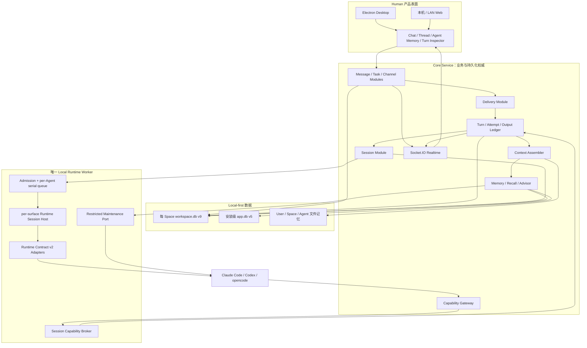

### 4.1 组件职责

| 组件 | 职责 | 主要实现 |
|---|---|---|
| Message/Task Modules | 原子写消息、任务、mention、附件和 delivery 前缀 | [`src/messages/messagePostingModule.ts`](../../src/messages/messagePostingModule.ts)、[`src/tasks/taskLifecycleModule.ts`](../../src/tasks/taskLifecycleModule.ts) |
| Delivery Module | 保存逐 Agent 投递事实、来源 cursor owner、directive 和结算状态 | [`src/deliveries/`](../../src/deliveries/) |
| Turn Module | logical turn、attempt lease、operation/output、obligation、恢复 | [`src/turns/`](../../src/turns/) |
| Session Module | per-surface session、generation、cutover、snapshot | [`src/sessions/`](../../src/sessions/) |
| Runtime Worker | runtime 进程、session host、调度、事件归一化 | [`src/runtime/worker/`](../../src/runtime/worker/)、[`src/daemon/index.ts`](../../src/daemon/index.ts) |
| Context Assembler | 组装有界、可审计的 Context Envelope | [`src/context/`](../../src/context/) |
| Memory Module | revision/evidence/relation/suppression、recall、advisor | [`src/memory/`](../../src/memory/) |
| Capability Gateway | MCP/CLI 同域工具、turn capability、幂等和 ACL | [`src/capabilities/`](../../src/capabilities/)、[`src/server/turn-gateway/`](../../src/server/turn-gateway/) |
| Human UI | 话题、Turn 详情、记忆管理、实时消息替换 | [`web/src/views/`](../../web/src/views/) |

## 5. 核心对象与数据关系

### 5.1 概念表

| 对象 | 回答的问题 | 生命周期与权威 |
|---|---|---|
| Surface | Agent 正在哪个频道、DM 或话题里工作？ | 复用 channel/private/dm/thread 身份 |
| Runtime Session | 这个 Agent 在这个 surface 的 engine 连续性是什么？ | 按 surface + generation 持久，进程可逐出 |
| Delivery Item | 某条消息是否已经被某 Agent 的 harness 正确处理？ | 与消息同事务写入，直到终态 disposition |
| Logical Turn | 一组同 surface delivery 应如何被处理？ | Core 持久，包含 Context 和 obligations |
| Turn Attempt | 这次真实 runtime 执行发生了什么？ | 每次重试追加，不覆盖旧 attempt |
| Operation / Output | 工具调用是否幂等？实际产生了哪条消息？ | 与 turn 关联，写操作可重试不重复 |
| Context Envelope | 本轮模型实际获得了哪些来源？ | 冻结 manifest；后续查询只追加 audit |
| Capability Activation | 当前 attempt 可以做什么、向哪里写？ | broker 临时激活，终态立即失效 |
| Episodic Memory | 哪些长期线索可以跨 surface 召回？ | canonical item + immutable revisions |

### 5.2 关系图

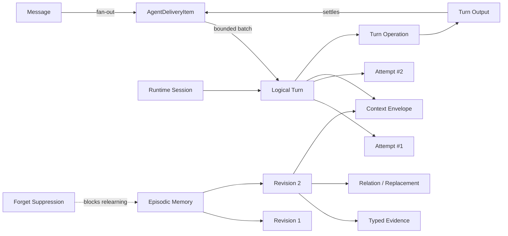

## 6. 会话机制：局部连续，而不是全局大 session

### 6.1 Session Key

每个 runtime session 由下面四元组寻址：

```text
(spaceId, agentId, surfaceKind, surfaceId)
```

当前 surface kind 为：

- `channel`：公开频道；
- `private`：私有频道；
- `dm`：Human-Agent 或 Agent-Agent 私聊；
- `thread`：由某条 root message 派生的话题。

因此，同一个 Agent 的 DM、两个频道和三个话题会形成六个不同 session；同一话题中的后续 turn 则优先恢复同一个 engine session。

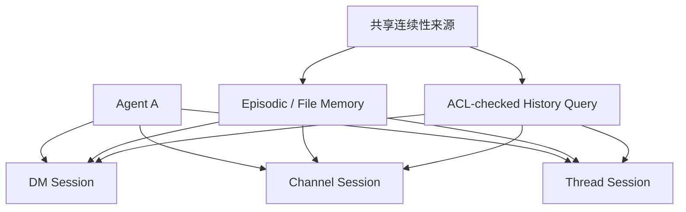

跨表面“记得”某件事的原因通常是：

1. 已 active 的 continuity memory 被自动召回；
2. query recall 根据本轮问题命中 episodic memory；
3. Agent 用 `conversation.read/search` 查询自己有权访问的历史；
4. User/Space/Agent 文件记忆提供策展后的长期背景。

它不是因为 DM 和频道共享了同一个 engine transcript。

### 6.2 Session 状态与 generation

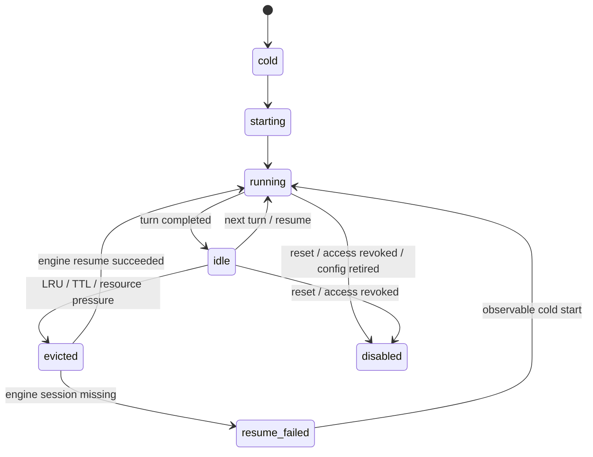

以下变化会创建新的 session generation，而不是继续污染旧 transcript：

- runtime 或 model 改变；
- 影响工具授权的 runtime config 改变；
- adapter major version 或 workspace root compatibility 改变；
- reset、撤权或旧 generation 失效。

历史 turn 仍指向原 generation，新的 turn 使用新 generation 冷启动。Chat 的 delivery cursor 不保存在 session 中，而由消息来源 membership 持有。

### 6.3 三种启动原因

| 原因 | 行为 |
|---|---|
| `create` | 新 Agent 在 Human-Agent DM 中完成一次介绍 turn |
| `manual` | 只读取各 surface 的 inbox summary，不把多频道正文拼成维护 session |
| `wake` | 处理一个或多个已持久化、同 session 的 delivery items |

### 6.4 运行资源边界

- 全局默认最多 4 个 active runtime turns；
- 最多 4 个 resident external processes；
- 同一 Agent 默认同时只有 1 个 active turn；
- Worker admission queue 默认上限 128，未 activate admission 120 秒过期；
- idle process 在队列压力下优先 LRU evict，session record 继续保留。

## 7. 响应模式与事件 admission

响应模式决定“哪些事件足以启动 runtime”，不决定 Agent 是否有读取权限。

| 事件 | 主动 `active` | 被动 `mention_only` | 静音 `silent` |
|---|---|---|---|
| Human 顶层普通消息 | optional turn | observe | observe |
| Human 顶层 direct mention | 加入话题，required | 加入话题，required | 加入话题但不唤醒 |
| 已参与话题中的 Human 跟进 | optional | optional | observe |
| Human-Agent DM | required | required | required |
| Agent-Agent DM | required，受 dispatch guard | 同左 | 同左 |
| 明确任务指派 | required | required | required |
| 未指派频道任务 | optional | observe | observe |
| Human `@all` | required | required | observe |
| Agent 普通消息 | 不环境唤醒 | 不环境唤醒 | 不环境唤醒 |
| Agent direct mention | required，受 guard | required，受 guard | observe |
| system / membership event | observe | observe | observe |

`required` 必须形成持久回复；`optional` 可以回复，也可以显式 `cede`；`observe` 由 Core 直接结算，不需要启动模型。

## 8. 顶层 @Agent 为什么会自动进入话题

Human 在顶层频道 direct mention Agent 时，root message 仍属于父频道，但 Agent 的工作目标被服务端定位到该 root 的话题。

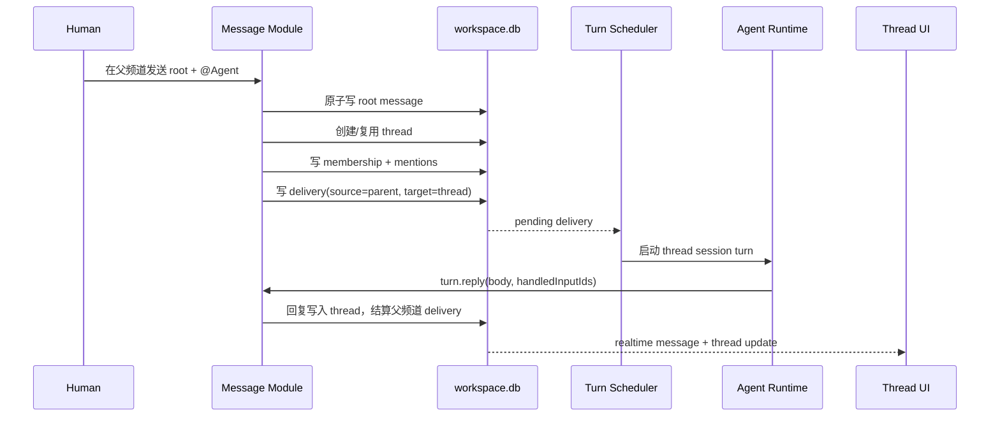

关键点：

- 模型不提供 channel/thread ID；reply target 由 turn capability 固定；
- root delivery 的 cursor owner 是父频道，成功处理后推进父频道 frontier；
- 后续真实 thread message 才推进 thread membership frontier；
- `@all` 保持频道广播，不为所有 Agent 创建高 fan-out 话题；
- `silent` Agent 可以成为话题成员，但不会因 mention 自动运行；
- 普通 thread 每次读取仍需同时满足父频道 ACL；父频道撤权会使 child membership、wake、capability 和可恢复 session 失效；
- `task_scoped` 是唯一父级 ACL 例外，只能读取明确任务对象和话题。

## 9. Durable Delivery、Turn 与 Attempt

### 9.1 为什么 Delivery 必须与 Message 同事务

如果消息先提交、wake 后创建，那么 Core 正好在两者之间崩溃时，Human 能看到消息，Agent 却永远不知道自己应该处理它。

Harness v2 在 Message/Task 事务中，为每个发送时有资格的 Agent 写入一条 `AgentDeliveryItem`。Realtime、dispatch reservation、Worker signal 都只是可恢复的 post-commit effect。

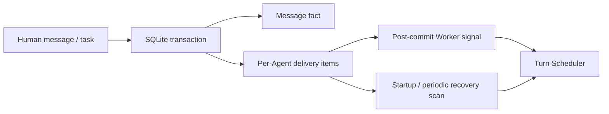

即使所有 post-commit effect 都失败，pending delivery 仍在数据库中，Core 启动和周期恢复器会重新调度，而不会重复消耗 wake budget。

### 9.2 Logical Turn 与 Attempt 分离

- Logical Turn：某 Agent 在某 surface 上处理一组已冻结 delivery 的业务工作单元；
- Attempt：一次真实 runtime 执行；失败重试会追加新 attempt；
- 同一 surface 最多一个 non-terminal logical turn；
- 新消息在 turn freeze 前可以进入同一批次，freeze 后等待下一 turn；
- attempt 通过 Worker generation、lease 和 CAS 防止两个 Worker 同时提交。

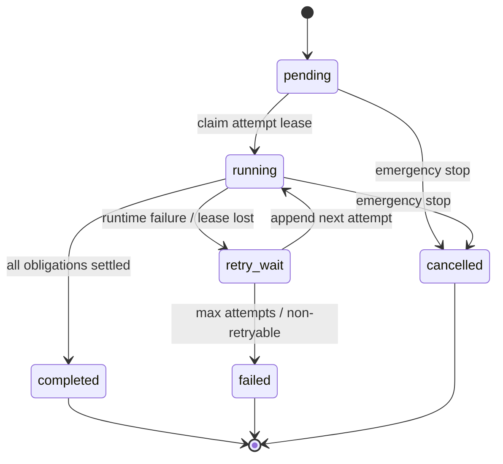

### 9.3 逐输入 obligation

| Delivery directive | 合法终态 |
|---|---|
| `required` | 必须被已提交的 `turn.reply` output 明确覆盖 |
| `optional` | 被 reply 覆盖，或显式 `turn.cede(inputIds, reason)` |
| `observe` | Core 直接标记 observed，不启动模型 |

一条综合回复可以覆盖多条 required inputs，但“本 turn 发过一条消息”不代表所有输入都已处理。Cursor frontier 只能推进到第一个 unresolved delivery 之前。

### 9.4 Operation 与 Output

所有 turn-scoped 产品写入先经过 operation ledger：

```text
UNIQUE(turnId, toolName, idempotencyKey) + requestHash
```

- 相同 key + 相同请求：返回第一次结果；
- 相同 key + 不同请求：返回 `idempotency_conflict`；
- reply 事务同时提交 Message、Output、Output→Input mapping、delivery disposition、turn terminal 和 cursor frontier；
- Worker terminal ACK 丢失时，重试只返回原 message，不会生成第二个 seq。

## 10. Context Envelope：本轮上下文的可审计清单

Context Envelope 是 manifest，不是把完整 rendered prompt 再复制一遍。

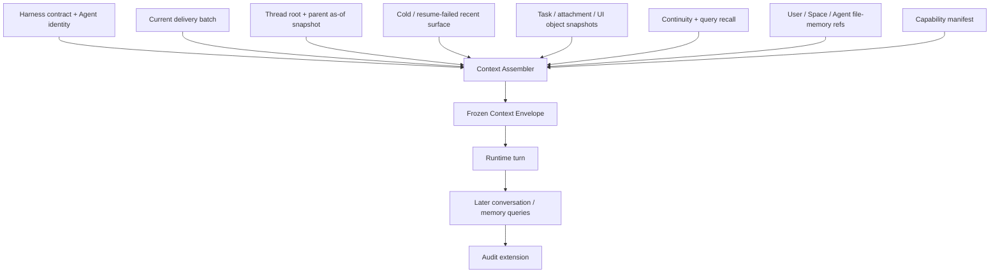

### 10.1 注入优先级

1. harness contract、Agent identity、Space 和 surface；
2. response directive、capability 和 finalize 规则；
3. 当前 delivery batch；
4. thread root 与 root 时刻的 parent snapshot；
5. cold/resume_failed/post-compaction 时所需的 recent surface；
6. task、attachment 和 focused object snapshot；
7. episodic recall；
8. User → Space → Agent 文件记忆索引；
9. 当前可用工具的最小 manifest。

正常 resumed turn 不会重复注入 engine 已持有的全部旧消息。若 adapter 无法证明 continuity，系统明确使用 cold/resume_failed profile，而不是静默假设 engine 还记得。

### 10.2 自动注入与后来查询

Turn Inspector 把来源分成四类：

- **已注入**：turn 开始前进入模型；
- **后来查询**：Agent 通过工具主动读取；
- **仅引用**：因隐私或预算只提供 ref/projection；
- **已省略**：因 ACL、删除、容量或 provider 失败未注入。

后续工具读取只追加 audit，不改写初始 Envelope。这样可以回答“Agent 当时为什么知道这件事”，也能区分自动 recall 和 Agent 自己查到的历史。

### 10.3 MessageContextSnapshot

Human 发消息时可以携带当前产品上下文：Space、模块、规范 route ID、打开对象引用、focused field 和 revision。它不会采集 DOM、截图、剪贴板、本机路径或未提交表单。

## 11. 跨频道查询与私密披露

Agent 不会自动获得其他频道近期原文，但可以调用 `conversation.read/search` 查询自己有权访问的 surface。每次查询都会进入 turn audit。

读取权限与披露权限分开：

| Projection | 适用场景 |
|---|---|
| `canonical` | 同 surface 或允许完整使用的来源 |
| `internal_summary` | 可用于内部推理，但不应直接公开引用 |
| `shareable_summary` | 可以安全表达给目标 surface 的摘要 |
| `ref_only` | 只说明存在某来源，不把正文交给模型 |

跨 DM/private 的完整引用需要一次性 disclosure grant。Grant 固定 source/revision、target surface、action digest、允许 projection、TTL，并在 reply 事务 consume-once。

系统可以对 source ID、附件、原文引用等确定对象 fail-closed，但无法保证识别模型对私密语义的所有自然语言改写；因此仍需准确标注产品边界，而不是承诺绝对语义隔离。

## 12. 记忆体系

### 12.1 记忆不是一个对象

| 层 | 权威性 | 作用 |
|---|---|---|
| Message record | 原始事实 | 可按 ACL 查询的聊天记录 |
| Turn ledger | 执行事实 | 上下文、工具、usage、输出和恢复审计 |
| Episodic memory | 派生线索 | 跨 surface 自动 continuity/query recall |
| User file memory | Human 策展 | 跨 Space 的长期偏好与背景 |
| Space file memory | Space 策展 | 当前 Space 的共享规则和知识 |
| Agent file memory | Agent 私有工作知识 | 角色方法、长期笔记、工作方式 |
| Session checklist | surface 短期状态 | 当前对话里的局部计划 |
| Engine memory/transcript | runtime 自有 | engine 原生连续性，不由 Kith 统一格式化 |

文件记忆路径继续是：

```text
User:  ~/.kith-space/memory/MEMORY.md + notes/
Space: <space>/.kith/memory/MEMORY.md + notes/
Agent: <space>/.kith/agents/<agentId>/MEMORY.md + notes/
```

结构化 episodic memory 是附加层，不替代这三层文件记忆。

### 12.2 Canonical item、Revision 与 Evidence

一个 memory item 拥有稳定 canonical ID，正文和披露字段保存在 immutable revision 中。Canonical row 只指向 current revision，并保存用于过滤的当前物化投影。

Evidence 使用 typed actor/subject/source，记录：

- 谁断言了这件事；
- 来源是 message、turn、file 还是 Human manual；
- 来源发生时和当前的可见性；
- 该 evidence 绑定哪个 memory revision；
- 是否来自 eligible source；
- 是否被撤权、删除或 suppression 阻止。

Agent 自己的输出不能成为“Human 偏好/事实”的唯一证据，避免模型幻觉通过反复 recall 自我强化。

### 12.3 Advisor pipeline

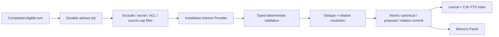

Advisor 与 user-facing Agent session 是两个物理端口。fresh install默认内置`pi_sdk@0.84.2`，Claude CLI可显式切换；既有安装先保持`legacy_runtime`：

- 不 resume 用户对话 session；
- 无 shell、文件、MCP、CLI、Vault 或消息发送能力；
- 使用每run独立进程、ephemeral HOME/cwd和allowlist env；
- Provider revision、Model Profile revision、installation/provider/consent epoch、artifact/config/capability/egress digest在job创建时固定；
- Core只把绑定run/epoch/Worker generation/执行快照的单次activation handle放入通用`advisor:complete`命令；Worker再经独立、安装级鉴权的本机兑换消息取得当次凭据，job/run、通用命令和日志都不保存secret；
- Agent删除、Space移除、来源频道撤权、Provider/model/enable切换与capability probe共用active-run取消屏障并等待Worker ACK；Worker失去Core连接时先终止旧helper与准备态，再允许新generation重连；
- 调用前DNS分类并pin地址、拒绝metadata/proxy/redirect，调用后复核egress；
- provider 返回后，在最终事务里再次验证 Agent/source 生命周期和 CAS；
- 失败、429 或预算不足会 backoff，不阻塞原 turn。

Claude、Codex、opencode聊天Agent在逐Agentconsent后共用同一系统Provider；聊天runtime只决定对话执行，不再决定Advisor支持性。没有Model Profile、凭据、probe、data policy和精确consent时不读取evidence、不外发正文。旧Claude restricted maintenance只作显式回滚路径。

### 12.4 Recall pipeline

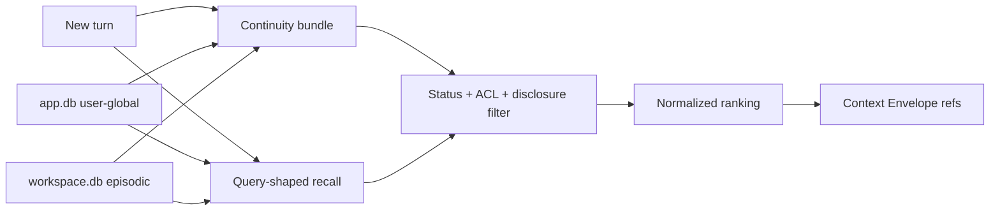

Recall 有两个互补通道：

1. **Continuity bundle**：稳定选择少量 active preference、relationship、habit 和高重要 role fact，不依赖本轮关键词；
2. **Query recall**：FTS5/BM25 + typed subject/predicate/entity + recency/importance/source diversity。

中文使用 NFKC 规范化、CJK 2-gram/3-gram 和 1/2 字 exact fallback；无词面偏好主要由 continuity bundle 保证，而不是假装 lexical FTS 拥有完整语义能力。

如果 workspace 与 user-global recall 都失败，required batch 仍会进入 Context，turn 可以继续；Envelope 会记录 recall omission。

### 12.5 纠错、删除与真正的“不要再学回”

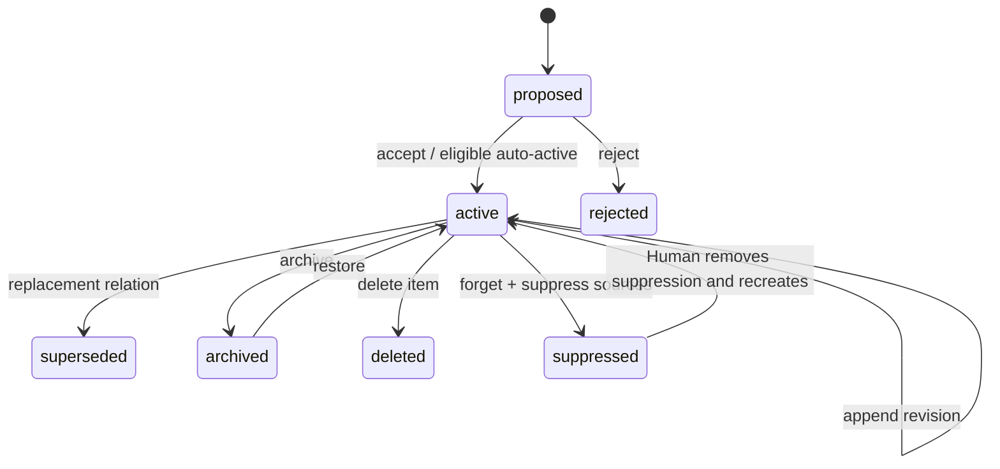

- **edit**：同一 canonical item 追加 revision；
- **correct**：文案修订使用 revision，语义替代使用 supersedes/contradicts relation；
- **archive**：从普通 recall 中排除，可恢复；
- **delete item**：删除结构化条目，但保留来源，未来可能重新学习；
- **forget + suppress**：删除条目并保存非原文 source ref + keyed claim fingerprint，阻止 advisor 从同来源重新生成；
- **retain independent**：私密 source 撤权后，由 Human 创建 manual revision，使条目独立保留，但不恢复原 source ACL。

Agent 设置中的记忆面板提供 Structured/Files 两层视图，支持 active/proposals/archived、服务端过滤、revision/evidence/relation/disclosure、accept/reject、edit/correct、archive/restore、retain independent、delete、forget+suppress 和 advisor freshness。

## 13. 工具体系与 Capability Gateway

### 13.1 为什么同时保留 MCP 和 CLI

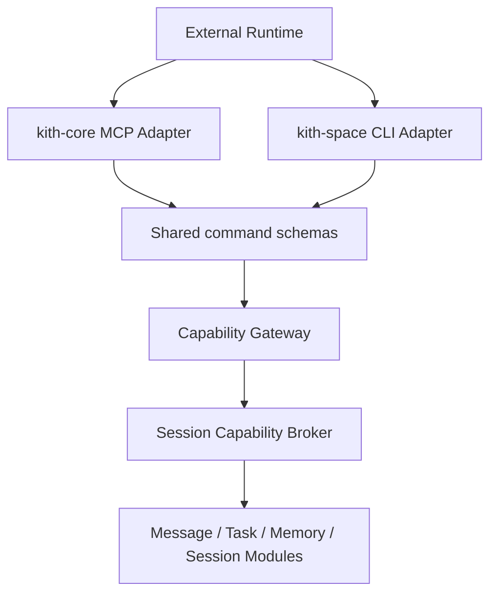

- MCP 提供强类型 schema 和原生 tool call；
- CLI 兼容 MCP 支持不完整的 runtime，也便于 help 和故障排查；
- 两者解析成同一个 command object，调用同一 Use-case Module；
- CLI 不是第二套权限或业务实现；
- MCP 不可用而受控 CLI 可用时显式 fallback；两者都不可用时 required turn fail-closed。

### 13.2 当前 24 个 `kith-core` MCP 工具

| 家族 | 工具 |
|---|---|
| Turn | `session.context_check`、`turn.reply`、`turn.cede`、`turn.progress`、`turn.get` |
| Session | `session.checklist_list`、`session.checklist_upsert`、`session.checklist_complete`、`session.checklist_clear`、`session.schedule_wakeup` |
| Conversation | `conversation.read`、`conversation.search` |
| Memory | `memory.recall`、`memory.get` |
| Task | `task.list`、`task.get`、`task.create`、`task.claim`、`task.update`、`task.assign`、`task.unclaim`、`task.report`、`task.deliver` |
| Discovery | `capability.describe` |

当前 Agent 工具面只开放结构化 memory 的 recall/get。Memory 写入由 restricted advisor 或 Human 管理 API 承担；没有把早期提案中的 `memory.propose/mutate` 误写成已上线工具。

本机代码和文件继续优先使用 runtime 原生 read/write/edit/shell，避免重复包装；但没有 adapter hook 时，这些原生文件读取只能标记为 audit gap。

### 13.3 Turn Capability 与 Broker

常驻 runtime 不能依赖 spawn 时固定的 per-turn 环境变量。Worker 只给 runtime 一个稳定 session broker descriptor，每个 attempt 再激活临时 capability：

```text
Core claim lease
  → Worker admission
  → broker.activate(session, turn, attempt, generation, expiry)
  → runtime tool call
  → Core 校验实时 lease / ACL / scope / watermark
  → broker.deactivate
```

Capability 绑定：

- Agent、Space、session、turn、attempt 和 Worker generation；
- allowed input IDs 与 output surfaces；
- seen watermarks；
- tool scopes；
- disclosure grant IDs；
- expiry。

Turn 终态、取消、lease 失效、membership 撤销、reset 或过期后，activation 立即失效。稳定 Agent identity 最多用于 health、capability discovery 和无正文 inbox summary，不能单独兑换 conversation 正文或写权限。

## 14. Agent 如何把消息发送到 Chat UI

模型生成文本、Agent 决定回复、消息持久化和 UI 收到事件是四个不同状态。

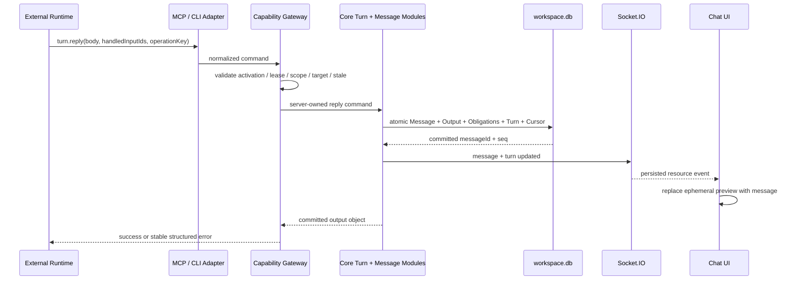

关键约束：

- wake reply 不能覆盖 channel/thread；
- `handledInputIds` 必须属于当前 turn；
- output surface 在 seen watermark 之后出现新的 Human/Agent 消息时，reply 返回 `stale_context`；
- Agent 可刷新 context，形成 later-query audit 和新 watermark；
- 附件先进入临时 upload，全部成功后才与消息原子绑定；
- text delta 只更新 ephemeral preview，不直接进入消息表；
- cede 会清除 preview但不生成气泡；
- failed/cancelled 会结束 placeholder，避免假工作状态；
- `producedByTurnId` 让消息工具栏可以打开 Context/Steps/Usage/Outcome。

## 15. Checklist、Short Wake、Snapshot 与 Compaction

### 15.1 Session Checklist

Checklist 属于一个 surface session，不是 Tasks 模块：

- 跨同 surface 多轮持久；
- 不跨话题共享；
- 使用单调 revision 和 CAS；
- restart 后恢复；
- 可由 Agent list/upsert/complete/clear。

### 15.2 Short Wake

60–3600 秒的一次性“稍后继续”使用 `session.schedule_wakeup`：

- 只保存 session/generation、due time、reason 和 idempotency key；
- 到期后创建新的 durable trigger，并重新构造 Context Envelope；
- 不复制旧 prompt，不复用旧 capability；
- reset、撤权、Agent stop/delete 或 task-scoped grant 到期时取消。

长周期或重复计划仍属于 Reminder/Automation Module。

### 15.3 Snapshot

Snapshot 是恢复控制状态，不是 transcript。它保存 engine session ref、session generation、checklist revision 和 adapter snapshot，并受 checksum、generation、单调 version 与 64 KiB 上限保护。

以下事实不依赖 snapshot：delivery、turn、attempt、operation/output、cursor 和关键 engine session ID，它们分别通过即时 Core 事务或 ACK 持久化。

### 15.4 Compaction

Runtime Contract 只归一化 `compaction_started/completed` 事件，不自研统一 summary。当前 Codex compaction telemetry 由 fixture 验证；Claude/opencode 不支持时明确返回 unsupported。持久 compaction marker 会影响下一轮 Envelope profile，并在成功冻结后消费。

## 16. 数据存储与版本

### 16.1 每 Space `workspace.db` v9

主要表族：

| 表族 | 代表表 |
|---|---|
| Harness/Session | `agent_harness_state`、`runtime_sessions` |
| Delivery/Turn | `agent_delivery_items`、`agent_turns`、`agent_turn_attempts`、`agent_turn_events` |
| Operation/Context | `turn_operations`、`turn_outputs`、`turn_output_inputs`、`turn_context_sources/snapshots` |
| Capability | `turn_capability_activations`、`disclosure_grants` |
| Session state | `session_checklist_items`、`session_wakeups` |
| Episodic memory | `episodic_memories/revisions`、`memory_evidence/relations/tags/suppressions/mutations` |
| Recall/Advisor | `memory_lexical_terms`、FTS、`memory_advisor_*`、`memory_recall_observations`、`advisor_provider_runs` |

Workspace migration 由 `drizzle/0004`–`0010` 分阶段引入session、durable turn、legacy recovery、附件生命周期、episodic memory、advisor和系统Provider consent/run审计。

### 16.2 安装级 `app.db` v5

`app.db` 保存Human、Space registry、Desktop/Web设置、user-global structured memory以及安装级Advisor Provider/Model Profile revision、epoch和Pi CLI脱敏导入快照。User-global memory与workspace memory使用同一command/schema语义，但跨数据库source只保存opaque ref，不建立跨SQLite FK。

app.db v4修复早期v3 user-global memory缺失的复合revision外键；v5保持事务runner和journal/checksum，fresh bootstrap选择`provider_v1 + pi_sdk + setup_required`，pre-existing数据库保持`legacy_runtime`。

### 16.3 Legacy cutover

- 支持 Runtime v2 的新 Agent 直接使用 v2 harness；
- 既有 Agent 可以显式从 `legacy → migrating → v2` 互斥 cutover；
- cutover 会先封锁新的 legacy 请求并等待已进入请求 drain；
- v2 与 legacy 不允许同时消费同一 Agent；
- 旧全局 `agents.session_id` 不回填到任意 per-surface session；每个 surface 第一次明确 cold start；
- rollback 必须先处理 non-terminal v2 turn，不能只翻 feature flag。

## 17. 可靠性与失败恢复

| 故障 | 系统行为 |
|---|---|
| Message commit 后 Worker signal 丢失 | pending delivery 由启动/周期 recovery 重新调度 |
| runtime 读完 batch 后崩溃 | obligation/cursor 不推进；同 logical turn追加 attempt |
| Worker terminal ACK 丢失 | operation/output 幂等返回原 message |
| 旧 Worker generation 迟到 | event/output 被拒绝或只获得幂等 ACK |
| engine session 不存在 | 记录 `resume_failed`，用可观测 cold profile继续 |
| required 未回复 | finalize retry 后 attempt失败，不能用 stdout 冒充消息 |
| recall/advisor/FTS 故障 | 普通对话继续；Envelope记录 omission/freshness |
| private source 撤权 | memory暂停 recall，session/capability失效；Human可保留或忘记 |
| snapshot 损坏或 generation 不符 | 拒绝加载，从权威表重建 |
| emergency stop | 取消 attempt、撤销 activation、结束 preview，不伪推进 cursor |
| 某个 Space 损坏/失联 | 安装级后台扫描逐 Space 隔离失败，不阻塞健康 Space ACK |

可靠性目标：

- 已提交 Message、Delivery、Turn、Output 和 cursor 结算 RPO = 0；
- message commit 后所有 post-commit effect 失败，30 秒内或下次 Worker连接恢复；
- Worker 重启后 30 秒内恢复接纳 turn；
- attempt lease 未过期时禁止双执行；
- recall/advisor fail-open，ACL/target/idempotency/commit fail-closed。

真实验收曾强制中断 Core：pending required delivery 在完整重启后只回复一次，没有丢失、重复或残留假占位。

## 18. 性能、容量与事件上限

默认产品规模：

- 每安装最多 100 个注册 Agent；
- 每 Space 常见 1–20 个频道 Agent；
- 每 Space 10 万消息；
- 每 Agent 1 万 active/archived episodic memories；
- 每 Agent 最多 200 个 surface session records。

P-A10 基线中，最小 `message + delivery rows` 单事务 20-Agent fan-out median p95 为 1.154 ms；中文 2 字和英文 lexical 查询 median p95 为 0.005–0.006 ms。它们只表示局部机制成本，不替代完整 Core/ACL/Context/runtime SLO。

事件保护：

- 单 event 最大 64 KiB；
- 每 attempt 最大 2,000 个持久 event；
- 聚合 payload 最大 8 MiB；
- terminal envelope 最大 128 KiB；
- 至少保留 16 event / 256 KiB 给 terminal/failure/truncation；
- activity/thinking/text preview 默认 250 ms 合并；
- preview 可截断，critical/terminal 不能静默丢失。

## 19. 安全边界

每次 Gateway 调用依次检查四层权限：

1. 安装/Space actor；
2. 资源 ACL，包括 thread 父级；
3. Agent 长期 scope；
4. 当前 turn capability。

其他关键规则：

- secret-shaped 内容不进入 advisor、preview、memory 或持久 tool event；
- advisor 无 Vault、外部连接、文件或消息发送 scope；
- private source 的确定性 ref/附件/原文引用按 disclosure fail-closed；
- MCP server 只接受结构化参数，不执行模型提供的任意 shell；
- capability handle、secret 和未脱敏原文不进入日志。

仍需诚实面对的边界：Claude Code、Codex、opencode 以同一 OS 用户运行，并可能通过高权限原生 shell 直接访问或修改本机路径。P-A10 提供的是产品 ACL 和受支持 API，不是完整 OS sandbox；不可信网页/邮件与高风险外部工具仍以 P-S1 为上线前置。

## 20. Runtime 能力现状

| 能力 | Claude Code | Codex | opencode |
|---|---|---|---|
| resume / session changed | observed v2 | observed v2 | observed v2 |
| usage / completion / cancel | observed v2 | observed v2 | observed v2 |
| MCP bootstrap contract | fixture v2；真实 Gateway 路径已验收 | fixture v2 | fixture v2 |
| CLI fallback | 已实现 | 已实现 | 已实现 |
| system memory advisor | 逐Agent consent后共用安装级Provider | 逐Agent consent后共用安装级Provider | 逐Agent consent后共用安装级Provider |
| compaction telemetry | unsupported | fixture v2 | unsupported |
| tool isolation capability | unsupported | unsupported | unsupported |
| cwd relocation resume | unsupported | unsupported | unsupported |

`fixture v2` 表示 adapter contract fixture 已通过，但不能当作对应 provider/live 行为已全部实证；`unsupported` 不会用 prompt 伪装成支持。

表中的`tool isolation capability`指user-facing runtime adapter的通用能力；系统Memory Advisor使用另一个无工具、无MCP/session、ephemeral HOME/cwd的Provider Port，因此聊天adapter的通用tool isolation仍可诚实为unsupported。

## 21. 用户可见的三个典型场景

### 21.1 私聊偏好延续到频道

1. Human 在 Agent DM 中说明“周报要简洁、分已完成/进行中/阻塞”；
2. eligible turn 完成后，restricted advisor生成带 Human evidence 的 memory；
3. memory 成为 active，进入 continuity bundle；
4. Human 在公开频道只问“这周怎么汇报比较合适？”；
5. 频道使用独立 engine session，但 Context Envelope召回 internal/shareable projection；
6. Agent按偏好回答，不公开复述私聊原文。

### 21.2 顶层 mention 自动开话题

1. Human 在频道发送 root并 `@Agent`；
2. root/thread/membership/delivery 同事务提交；
3. Agent turn直接定位 thread session；
4. Agent只提交 body和 handled inputs；
5. Core把持久消息写入 thread，并推进父频道 delivery frontier。

### 21.3 静音 Agent 仍像成员，但不会插话

1. `silent` 只影响 wake admission，不删除 membership；
2. Human direct mention可把静音 Agent加入话题，但不启动 runtime；
3. 恢复 active/mention_only 时，wake watermark防止追溯回复静音期间旧消息；
4. Human-Agent DM与明确任务仍是显式寻址，继续 required。

## 22. 关键架构选择与权衡

| 选择 | 为什么 | 代价 |
|---|---|---|
| per-surface session | 避免私聊、频道、话题互相污染 | session records与恢复逻辑增加 |
| durable delivery | 消息提交后不会静默丢 Agent 工作 | 消息事务增加有界 fan-out 写入 |
| logical turn + append-only attempt | 崩溃重试、lease和usage可审计 | 状态机比单一 running flag复杂 |
| server-owned reply target | 根治漏 thread/channel 参数导致错发 | 主动跨目标发言需独立能力 |
| Context Envelope manifest | 可解释、可重建、可降级 | Assembler和source版本管理增加 |
| episodic + file memory | 自动 recall与Human策展并存 | UI必须区分两类记忆 |
| continuity + local FTS | local-first且覆盖无词面稳定偏好 | 深语义事件召回弱于高质量embedding |
| MCP primary + CLI fallback | 多runtime兼容且不复制业务逻辑 | 需要双Adapter契约测试 |
| session broker | 常驻进程可安全轮换turn权限 | 增加activation、generation和恢复协议 |
| explicit disclosure projection | 跨私密来源可控、可审计 | 无法完全消除模型语义改写风险 |

## 23. 已验证事实

截至 2026-07-23：

- workspace schema v9、app.db v5真实迁移通过；
- `quick_check=ok`，外键违规为 0；
- 当期完整unit为894通过、11个平台条件skip、0失败；当前回归基线为937通过、11 skip、0失败；
- 完整 integration、typecheck、production desktop bundle通过；
- 三 runtime contract targeted suite 22/22；
- 三轮 Desktop/Web真实验收覆盖全新Space、Claude Agents、公开/私有频道、DM、话题、三响应模式、@all、任务、MCP/CLI、turn详情、记忆生命周期、wake和restart；
- 最后一轮干净浏览器标签 console warning/error为0，验收时段Core/Worker/runtime日志无warning/error。

## 24. 明确不属于 P-A10 的后续能力

- **P-A11 Memory Consolidation**：空闲期复盘turn和记忆，只生成proposal；
- **P-A12 Skill Projection/Reconciliation**：skill desired/staging/active/conflict生命周期；
- **P-S1 Runtime Security / Approval / Vault**：OS/runtime sandbox、高风险审批、secret handle；
- **H5 跨 Space 编排**：Home Agent的跨Space委派；
- Agent文件记忆、来源消息和外部engine transcript的物理清理仍需分别操作，structured forget不会谎称抹除所有副本。

## 25. 代码阅读路线

想理解一条消息如何走完整链路，建议按以下顺序阅读：

1. [`src/messages/messagePostingModule.ts`](../../src/messages/messagePostingModule.ts)
2. [`src/deliveries/deliveryJournal.ts`](../../src/deliveries/deliveryJournal.ts)
3. [`src/turns/turnScheduler.ts`](../../src/turns/turnScheduler.ts)
4. [`src/sessions/sessionModule.ts`](../../src/sessions/sessionModule.ts)
5. [`src/context/contextAssembler.ts`](../../src/context/contextAssembler.ts)
6. [`src/runtime/worker/sessions/runtimeTurnController.ts`](../../src/runtime/worker/sessions/runtimeTurnController.ts)
7. [`src/capabilities/capabilityGateway.ts`](../../src/capabilities/capabilityGateway.ts)
8. [`src/turns/turnOutputService.ts`](../../src/turns/turnOutputService.ts)
9. [`web/src/views/chat-message/TurnDetailsButton.tsx`](../../web/src/views/chat-message/TurnDetailsButton.tsx)

想理解记忆：

1. [`src/memory/episodicMemoryService.ts`](../../src/memory/episodicMemoryService.ts)
2. [`src/memory/memoryAdvisorService.ts`](../../src/memory/memoryAdvisorService.ts)
3. [`src/memory/disclosurePolicy.ts`](../../src/memory/disclosurePolicy.ts)
4. [`src/memory/memoryLifecycle.ts`](../../src/memory/memoryLifecycle.ts)
5. [`web/src/views/agent-memory/AgentMemoryPanel.tsx`](../../web/src/views/agent-memory/AgentMemoryPanel.tsx)

## 26. 相关文档

- [Agent Harness v2 完整规格、ADR、失败模式与43场景](../archive/specs/2026-07-19-agent-harness-session-context-memory-tools-design.md)
- [Helio 会话、上下文、记忆与工具实测研究](../archive/historical/notes/helio-agent-context-memory-tools-research.md)
- [Kith-space 目标架构](architecture-proposal.md)
- [Agent 频道响应模式](../archive/specs/2026-07-14-agent-channel-response-mode-design.md)
- [P-A10 性能基线](../archive/performance/p-a10-baseline.md)
- [术语表](../glossary.md)
