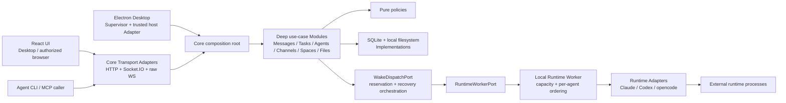

# Kith-space 桌面模块化单体架构收敛设计

- 日期：2026-07-18
- 阶段：P-A9
- 状态：P-A9.0 基线、护栏、实测与完整验证已完成；下一步只进入 P-A9.1a
- 方案锁定基线：`codex/feat-ui-updates` @ `0b539d8`
- P-A9.0 实施起始基线：`codex/feat-ui-updates` @ `ec2ef82`
- 前置条件：用户已于 2026-07-18 确认本轮 UI 手动验收结束
- 独立审查：2026-07-18 已完成两轮审查与最终窄核对（Go）；原 No-go 项及复审发现的 P-A9.0/P-A9.4 阶段冲突均已纳入本文修正
- 关联文档：`docs/progress.md`、`docs/roadmap.md`、`docs/decisions.md` 决策 29、`docs/kith-space/architecture-proposal.md`、`docs/performance/p-a9-baseline.md`、`docs/architecture/p-a9-contract-matrices.md`

> 本文确定 P-A9 的架构收敛方案、切片顺序和验收标准。P-A9.0 已按本文完成基线与护栏，后续仍必须逐切片迁移、逐切片验证；不得借“架构优化”之名重写产品、改变既有交互，或把尚未测量的性能问题归因给 TypeScript。

## 1. 结论摘要

1. **保留现有进程拓扑。** Electron Desktop 继续监督 Core Service、唯一 Local Runtime Worker 和 React UI；外部 Claude Code、Codex、opencode 仍由 Worker 启动。Core 是 Desktop 与可选本机/LAN 浏览器、Agent CLI 共用的本机权威核心，不是遗留的服务器部署路线。
2. **保留 TypeScript / Node / Electron / React / SQLite 主技术栈。** 它符合 Desktop-first、local-first、I/O 与外部进程编排为主的产品负载。当前没有证据支持全量改写为 Rust。
3. **采用“Desktop 监督的模块化单体”渐进收敛。** 先把消息、Agent 数据面、任务、频道、文件和 Runtime 控制拆成高内聚的深 Module；`src/server/` 收窄为组合根与 HTTP/Socket Adapter，不再承载业务规则。
4. **性能先建立基线，再做可归因优化。** 优先消除消息 fan-out 中的重复查询、补安装级 Runtime 容量与背压、减少 Chat 的重复数据/渲染工作；只有性能剖析证明某个稳定热点确实受 JavaScript CPU 限制时，才评估用 Rust 实现该窄 Adapter。
5. **不做大爆炸式目录搬迁。** 每个切片先建立小 Interface 和特征测试，再迁移调用方，最后删除兼容外壳。源码目录改名必须跟随职责迁移，不能单独作为“架构成果”。

## 2. 真实基线与问题定义

### 2.1 当前技术栈

| 层 | 当前实现 | 与产品定位的关系 |
|---|---|---|
| Desktop 宿主 | Electron 43.1.0、electron-builder 26.15.3 | 提供跨平台窗口、托盘、文件选择、进程监督和正式安装包，符合 Desktop-first |
| 本机核心 | Node.js + TypeScript 5.6、HTTP、Socket.IO 4.8、`ws` 8.21 | 为 Desktop、授权浏览器和 Agent CLI 提供同一份本机行为与信任边界 |
| UI | React 18 + Vite 5 | Desktop renderer 与可选浏览器入口共享，避免维护两套客户端 |
| 数据 | SQLite、`better-sqlite3` 12.11、Drizzle ORM 0.45 | 每 Space 单文件、自包含、可移植；同步原生驱动适合单机写入模型 |
| Agent 执行 | 唯一 Local Runtime Worker + Runtime Adapter + 外部 CLI | 遵守“不自研 runtime”，把模型调用和工具循环交给现有 runtime |
| 包管理 | pnpm 11.13.1 | 单仓库、根目录与 `web/` workspace，当前无需引入多语言构建系统 |

实际依赖版本见 `package.json:7`、`:112`-`:134` 与 `web/package.json:16`-`:32`。当前跨平台基础存在，但发行仍只完成 Windows x64：`scripts/package-desktop.mjs:13`-`:15` 固定 `--win --x64`，所以“架构可跨平台”不能表述成“macOS/Linux 已支持发行”。

### 2.2 已经具备的深 Module

以下实现已有较小 Interface、较大内部行为，优先保持并作为后续风格基线：

- `src/desktop/processSupervisor.ts:34` 的 `DesktopProcessSupervisor` 隐藏整组子进程启动、ready、重启和清理细节；
- `src/daemon/runtime.ts:36` 的 `Runtime` Interface 让多个外部 runtime 通过同一生命周期接入；
- `src/spaces/spaceRootService.ts`、`src/spaces/spaceService.ts` 集中 Space root 与 registry 规则；
- `src/browser-access/` 将 Token、Session 和访问策略拆成独立 Module；
- `src/agents/agentResponsePolicy.ts` 把响应决策保持为无 I/O 的领域策略。

这些 Module 的 Leverage 较高：调用方只需要少量操作，不需要了解内部的进程、路径、哈希、数据库或策略细节。

### 2.3 当前主要结构债

| 热点 | 代码事实 | 结构问题 |
|---|---|---|
| 消息主流程 | `src/server/core.ts` 1412 行；`createMessage` 位于 `:481`-`:738` | 一个函数同时负责写权限、mention/`@all`、任务、介绍 token、附件、成员、实时事件、响应策略与 Worker 投递，事务与副作用难单独验证 |
| Agent HTTP | `src/server/routes-agent.ts` 659 行；`handleAgentApi` 从 `:105` 开始，并在 `:5`、`:112` 直接依赖数据库 | Transport Adapter 同时做认证、路由、查询、领域判断和响应序列化，修改一个端点容易影响其他端点 |
| Chat 容器 | `web/src/views/Chat.tsx` 1137 行；主组件从 `:256` 开始 | 分页、实时订阅、滚动定位、话题、任务、收藏、卡片与直接请求集中，状态 Locality 下降，表现层已拆但控制层仍拥挤 |
| Runtime 命名与所有权 | 行为分散在 `src/daemon/`、`src/local-runtime/`、`src/server/` 与 CLI | 产品已经是 Local Runtime Worker，但源码边界仍携带旧 server/daemon 语义，控制面与运行时实现不易导航 |
| 依赖方向 | `src/agents/agentDeletion.ts:3` 反向导入 `src/server/storage.ts` | 领域 Module 依赖 Transport 层，违反依赖倒置和分层约束 |

`createMessage` 在消息 fan-out 循环内逐 Agent 调用响应模式解析（`src/server/core.ts:655`-`:681`）并执行投递（`:692`-`:730`）。Worker 已对单 Agent 投递做 3 秒合并（`src/daemon/agentManager.ts:357`-`:386`），但当前仍缺少明确的安装级 active-runtime 容量与公平背压策略。Agent 群聊的主要耗时首先来自外部 runtime 启动、模型响应和工具执行；在测量前把语言本身当作瓶颈会误判因果。

当前消息持久化也不是一个统一事务：普通 message insert 位于 `src/server/core.ts:580`，随后 dispatch chain、话题 follow、附件绑定、mention auto-join、mention 行与频道时间分别在 `:581`-`:628` 写入；任务的 message/编号/owning thread 由 `createTaskRecord` 原子提交，但 system 审计消息和 assignee wake 在 `:630`-`:637` 之后执行。因此第 6 节描述的是目标提交边界，不是对现状的误述；P-A9.1 必须用两个独立子切片先等价提取、再收拢事务。

## 3. 目标、非目标与阶段边界

### 3.1 目标

- 让每个业务变化尽量只触及一个高内聚 Module 和它的直接 Adapter；
- 让 HTTP、Socket、Desktop、Agent CLI 都复用同一业务 Interface，不再复制规则；
- 让消息写入的事务内状态与提交后副作用边界明确、可测、可失败恢复；
- 让新增 Runtime 主要只增加一个 Adapter 与注册项，不修改消息或 HTTP 核心；
- 让 Chat 数据控制、视口控制和表现组件各有单一职责，同时保持相关状态就近；
- 建立可重复的 Agent 群聊性能基线、容量策略和回归门；
- 保持 Windows 现有行为，并为 macOS/Linux 留下不依赖 Windows 专属实现的 Interface。

### 3.2 非目标

- 不把 Core 合并进 Electron main，也不取消 Local Runtime Worker；
- 不恢复公网 server、Docker、远程 daemon、云同步或独立 Web 产品；
- 不做 Rust 全量重写，不引入微服务、消息队列、远程数据库或通用 DI 框架；
- 默认不在 P-A9 改数据库 schema、公开 URL、现有 Agent CLI 命令或 `/daemon/connect` 路径；Core/Worker 内部消息允许为 admission ack 增加向后兼容字段。若现有表无法证明重放幂等，必须暂停相关切片并单独补 schema/迁移/恢复设计，不得夹带修改；
- 不提前实现 Runtime 契约 v2、H5 跨 Space 编排、Message Context Snapshot 或新产品模块；
- 不借架构切片重做 UI 视觉、交互和文案；
- 不为了缩短文件行数机械拆文件，也不为只有一个实现且无需替换的内部函数创建空洞 Interface。

## 4. 设计原则如何落到代码

本文使用以下术语：**Module** 是隐藏设计决策的单元；**Interface** 是其他代码能看到的窄表面；**Implementation** 是 Module 内部行为；**Depth** 是小 Interface 背后承载的能力；**Seam** 是允许替换 Implementation 的位置；**Adapter** 把外部协议变成内部 Interface；**Leverage** 是一次改动可复用的范围；**Locality** 是理解一个行为所需上下文是否集中。

| 原则 | P-A9 的具体约束 | 验收方式 |
|---|---|---|
| 高内聚、低耦合 | 按消息、任务、Agent、频道、文件、Runtime 能力分 Module；跨 Module 只传命令、结果和稳定错误 | 禁止领域目录导入 `src/server/`、`src/desktop/`；调用链不泄漏 Drizzle 查询对象 |
| 单一职责 | Transport 只做认证/解析/序列化；Module 负责一个完整用例；Adapter 负责一种外部协议 | 迁移后的 route 文件不直接查询数据库，不决定响应/任务策略 |
| 开放封闭 | 新 Runtime 通过既有 Runtime Interface 接入；新客户端通过相同业务 Interface 接入 | 新增测试 Adapter 时不改消息领域 Implementation；适配器契约测试复用 |
| KISS | 保留模块化单体、SQLite 和当前进程数；不引入仓储层大全、事件总线框架或微服务 | 每个新抽象必须至少隐藏一个真实变化点或形成测试 Seam，否则不合入 |
| DRY | 业务规则只有一个权威 Implementation；不强行合并只是形似但变化原因不同的逻辑 | Human HTTP、Agent HTTP、任务路径共用消息/任务 Interface；Transport 序列化可分别保留 |
| 迪米特法则 | 调用方只认识直接 Module，不穿透 Module 获取 DB、Socket、Worker 或子对象 | 禁止 `route -> db -> schema` 和 `domain -> server -> storage` 这类跨层链 |
| 依赖倒置 | 高层用例依赖稳定 Interface；Socket、外部 CLI、OS 与实时发布由 Adapter 实现 | Core→Worker、Runtime CLI、实时事件都有 production 与测试 Implementation |
| 关注点分离/分层 | 依赖方向固定为 `Transport/Bootstrap -> Use-case Module -> Policy`，基础设施从外向内实现必要 Seam | 增加静态依赖契约测试；组合根是唯一允许同时认识 Module 与 Adapter 的位置 |

Depth 与 Locality 高于“文件越多越好”。例如“发送一条消息”虽然包含校验、持久化、mention 和提交后通知，但这些步骤共同服务一个原子用例，应由一个深 `MessagePostingModule` 封装；不能把每一步拆成互相暴露内部状态的浅 helper 网络。

## 5. 目标架构



### 5.1 为什么 Core Service 仍然存在

Core 同时解决四个真实问题：

1. Electron renderer 保持 sandbox/contextIsolation，不直接持有数据库与进程权限；
2. Desktop 与授权本机/LAN 浏览器复用相同行为和实时事件；
3. Agent CLI/MCP 通过稳定的本机协议操作同一份领域状态；
4. 唯一写入权威、Space 隔离、权限 guard 和 Worker 控制可以统一审计。

因此目标是把 Core 从“服务器式大文件”收敛为**本机组合根 + Transport Adapter**，不是删除本机核心。把所有逻辑塞进 Electron main 会重新耦合 UI、数据库、Worker 和宿主生命周期，也会破坏浏览器入口。

### 5.2 为什么 Worker 仍然独立

外部 runtime 会长时间运行、崩溃、取消、写 stdout/stderr 并产生进程树。独立 Worker 提供故障隔离、每 Agent 串行、统一停止和未来容量控制。它不是远程 daemon，不拥有产品数据库，也不形成第二业务核心。

### 5.3 目录目标

目标是按职责逐步形成以下结构；它不是一次提交的搬迁清单：

```text
src/
  server/                 # 组合根、HTTP/Socket Adapter、兼容入口
  messages/               # MessagePostingModule、查询与纯策略
  tasks/                  # 任务生命周期与分派语义
  agents/                 # Agent 身份、收件箱、生命周期与响应策略
  channels/               # 频道生命周期、membership、话题查询
  files/                  # 本地附件/文件 Implementation；不依赖 server
  spaces/                 # 已有 Space root 与 registry Module
  runtime/
    contract/             # Runtime、RuntimeWorkerPort、事件类型
    control/              # Core 侧 Worker Adapter
    worker/               # Agent manager、容量、队列、prompt
    adapters/             # Claude/Codex/opencode 等外部 Runtime Adapter
  desktop/                # Electron 宿主和 OS Adapter
  db/                     # SQLite 连接、schema、迁移；由 Module 内部使用

web/src/
  app/                    # 路由、Store 组合与 shell
  features/chat/
    data/                 # conversationApi、订阅与 DTO 适配
    model/                # 分页、实时合并、话题与视口控制 hooks
    ui/                   # Chat/Thread 组合与已有 chat-message 表现层
  shared/                 # 通用 API client、UI primitive、类型
```

`src/server/`、`src/daemon/` 的旧入口和脚本可以在迁移期保留兼容转发；只有所有调用方与构建脚本迁移、完整验证通过后才删除。目录改名不得与业务行为修改放在同一切片。

## 6. Module Interface 与 Seam

### 6.1 消息写入

对外 Interface 只表达完整用例，不暴露 seq、Drizzle transaction、Socket 或 Worker 连接：

```ts
type PostMessageCommand =
  | { kind: "chat"; context: MessageContext; content: string; attachmentIds?: string[] }
  | { kind: "agent-introduction"; context: MessageContext; content: string; proof: AgentIntroductionProof }
  | { kind: "action-proposal"; context: MessageContext; action: PreparedAction }
  | { kind: "reminder"; context: MessageContext; content: string };

type MessagePostingModule = {
  post(command: PostMessageCommand): Promise<PostMessageResult>;
};

type TaskModule = {
  create(command: CreateTaskCommand): Promise<CreateTaskResult>;
};
```

这里使用受控判别联合，不把任意 `messageType/actionMetadata` 暴露给 Transport。普通 Human/Agent 消息、话题回复、Agent 首轮介绍、action proposal 与 reminder 进入 `MessagePostingModule`；Human/Agent 的“创建任务”进入 `TaskModule.create`。两者可共享 Module 内部的 `ConversationJournal` SQLite Implementation：目标状态下，`TaskModule.create` 在一个事务中提交任务、编号、owning thread 和所需 system 审计消息，Transport 看不到该 Implementation，Message 与 Task 公开 Module 也不得相互循环导入。任务后续状态流转仍由 `TaskModule` 负责，并通过窄内部 system-event writer 原子记录状态与审计消息。

每个消息或任务写入用例都分成三个明确阶段：

1. **Preflight（零副作用）**：按命令校验可写权限、目标、mention/`@all`、任务 assignee、action/reminder payload 或 introduction proof；
2. **Durable commit**：`MessagePostingModule` 分配 seq 并提交消息、必要的 follow/membership、mention、附件绑定、dispatch chain 与 introduction 状态；`TaskModule.create` 提交任务、assignee、编号、owning thread 与所需 system 审计消息。P-A9.1a 先保持当前已验证的事务单元，不在“提取 Module”的同一改动里扩大事务；P-A9.1b 再以失败注入测试为前提收拢这些数据库写入；
3. **Post-commit effects**：发布实时事件、计算 response decision，并通过 `WakeDispatchPort` 为任务 assignee 或消息目标执行 reservation、Worker admission 与 commit/release。任务本体、assignee 和审计消息不属于可丢失的提交后副作用。

`PostMessageResult` 与 `CreateTaskResult` 的成功提交点都是各自的 Durable commit。提交后副作用失败只能返回/记录可恢复的 warning，不能在数据已经持久化后向客户端抛出会诱发整条用例重试的普通失败；若未来确实需要“提交后失败也返回错误”，必须先引入请求幂等键。P-A9 不引入 outbox 表，现有事件顺序与失败语义先由 P-A9.0 特征测试冻结。

### 6.2 Agent 数据面

Agent data plane 不是一个新的大 `AgentInboxModule`。`routes-agent` 按真实协议表面拆为小 Transport Adapter，并分别调用现有或新增 Module：

- messages/context：check、read、send、resolve、search、reaction，以及 freshness hold、短期 draft、`--send-draft` 与 `lastReadSeq` 推进；
- channels/threads：join/leave/members、reply/read/unfollow、目标解析与 ACL；
- tasks：list/get/new/claim/unclaim/update/assign/report/delivery 与 `expectedRevision` CAS；
- actions：proposal normalization 与受控 action union；
- files：upload/view、失败对象清理、short-id 解析与附件 ACL；
- profile/space：profile show/update 与 space info；
- reminders：schedule/list/cancel/snooze 与 anchor ACL。

每个 Adapter 只保留：

- Worker/Agent token 与 scope 校验；
- URL、query、body 解析；
- 调用 Module Interface；
- 稳定错误到 HTTP 的映射和 DTO 序列化。

迁移完成后，Agent route 不得导入 `dbForSpace`、Drizzle `schema` 或响应策略 Implementation。

### 6.3 Core 与 Worker

Message/Task Module 不直接认识 raw WebSocket 或 Worker 队列，而是调用 Core 控制层的 `WakeDispatchPort`。Production Implementation 负责 `ensureChain -> getOrReserveWake -> RuntimeWorkerPort -> commit/release`，测试 Implementation 记录 effect 与失败顺序。Core 控制层再依赖 `RuntimeWorkerPort`；其 Production Adapter 使用当前受信 raw WebSocket，协议测试使用进程内记录器。start/deliver 是会排队、会断线的异步接纳操作，不得再以 `ws.send()` 未抛错代表成功：

- `start(command: WakeStartCommand | ManualStartCommand): Promise<AdmissionResult>`；
- `deliver(command: WakeDeliveryCommand): Promise<AdmissionResult>`；
- `stop(command: LifecycleCommand)` / `reset(command: LifecycleCommand)`，并等待幂等 control ack；
- `availability()` 与窄事件订阅。

`WakeStartCommand/WakeDeliveryCommand` 携带 `source: "wake"` 与稳定 `deliveryId = reservationId`；`ManualStartCommand/LifecycleCommand` 携带 `source: "manual" | "lifecycle"` 与调用方生成的稳定 `commandId`，不得伪造 wake reservation，也不消耗 wake budget。`AdmissionResult` 固定为 `admitted | queued | rejected` 并回显对应 id。Worker 只有在当前 generation 的容量队列或 AgentManager 已接纳项目后才 ack；同一 generation 内的重复 command/ack 必须幂等，Worker 重启后的同 deliveryId 则允许重新接纳，以恢复尚未 read 的工作。

Core 侧 `getOrReserveWake` 必须以 `(spaceId, chainId, messageId, targetAgentId)` 为持久逻辑键：已有 reservation/success 行时复用原 reservationId，不再次增加 wake count。Core 只在 `admitted/queued` ack 后 `commitWake`，明确 `rejected` 时只释放本次仍为 reserved 的记录；超时或断线保持同一 reservation 为待确认，并在新 lease 上用相同 deliveryId 重放。Agent check/read 成功推进 `lastReadSeq` 才关闭该消息的未读重放窗口。若当前 `dispatch_wakes` 无法在不迁移 schema 的前提下证明这个 get-or-reserve 与并发唯一性，P-A9.4 必须先补独立 schema、迁移和恢复设计。

这只提供“接纳确认 + 未读重放”语义，不等于外部 runtime 的端到端 exactly-once。Agent 已 check/read、推进 `lastReadSeq` 后若 runtime 在回复前崩溃，P-A9 仍无法仅靠现有契约判断是否重做；该窗口必须在性能/可靠性报告中保留为已知限制，等待 Runtime 契约 v2 的 turn completion/usage 语义解决，不能在 P-A9 验收中宣称端到端不丢工作。

这是真实 remote-owned Seam：即使两个进程都在本机，连接断开、超时和重连仍是产品行为。测试不能通过监听随机端口来验证业务 Module，而应使用进程内 Implementation；协议本身另做少量 integration test。

### 6.4 外部 Runtime

保留现有 `Runtime.start(opts, callbacks): RuntimeSession` Interface。Claude/Codex/opencode 是真实 Adapter；测试使用确定性的 fake Runtime。Runtime 契约 v2 会在 P-A9 之后扩展 usage、完成、取消和 MCP bootstrap，不把这些字段提前塞进当前切片。

### 6.5 SQLite、文件系统与实时事件

- SQLite 是进程内、可本地替代的依赖。Module 测试使用临时目录中的真实 SQLite，不为每张表创建通用 Repository Interface；
- 文件系统同样优先用临时目录测试。`src/server/storage.ts` 的 Implementation 迁到 `src/files/` 后即可被 Agent 删除流程直接依赖，不因只有一个实现而强建 Port；
- 实时发布是可失败副作用，使用窄 `ConversationEventSink` Seam：Production Adapter 写 Socket.IO，测试 Implementation 记录事件与顺序；
- 纯策略不依赖任何 Adapter，直接以值输入/输出测试。

Interface 是主要测试表面。旧内部 helper 测试只有在等价行为已经通过新 Interface 覆盖后才可删除。

## 7. 实施切片

每个切片必须单独完成“特征测试 -> 最小迁移 -> 删除本切片遗留 -> 文档同步 -> 验证”，不得并行改同一热点文件。

### P-A9.0 基线、护栏与性能测量

范围：不改产品行为，只建立安全网。

状态：已完成。当前行为矩阵与 P-A9.4 删除条件见 `docs/architecture/p-a9-contract-matrices.md`，机器与浏览器实测、绝对 Core/UI SLO 及复跑入口见 `docs/performance/p-a9-baseline.md`。

- 建立全部生产写入调用方矩阵：Human message/asTask、Agent send/thread/task、action prepare、reminder、introduction 与内部 task audit；为每类指定 Message/Task/Action/Reminder 的唯一所有者；
- 补 `createMessage` 特征矩阵：归档拒写、mention auto-join、`@all` 快照、任务单 assignee/无副作用拒绝、介绍 token、action proposal、reminder、附件绑定、话题 follow、dispatch reservation 失败释放、当前分段写入的提交点、任务已创建但 audit/assignment 失败、事件顺序与提交后失败返回；
- 补 Agent HTTP 逐端点矩阵：认证/scope/Space、freshness hold/draft、message check/read watermark、action normalization、上传回滚、reaction、thread ACL、search、task CAS、attachment ACL、reminder anchor 与稳定错误；
- 用绿色 characterization tests 冻结当前 Worker transport 事实：Core 目前只以 socket send 返回值判断发送，Worker 会发出但 Core 不消费 `agent:deliver:ack`，未启动 Agent 的内存队列当前最多 10 条且 15 秒过期，reconnect 会按 `lastReadSeq` 重新 reserve。测试只描述现状，不把这些缺陷命名为 admission 成功；
- 当前 transport characterization 必须标注由 P-A9.4 目标契约替换的删除条件；P-A9.4 行为改变后更新/删除这些旧事实测试，不把已知缺陷永久固化成产品规则；
- 同时产出 **P-A9.4 目标契约清单**：断线前未 ack、ack 后未 check、同逻辑 wake 的 get-or-reserve、重复 command/ack、Worker generation、手动命令不占 wake budget、队列过期/满、排队中的 stop/reset/退出，以及重放不重复增加 wake budget。P-A9.0 不要求这些尚未实现的目标测试变绿；
- 建立依赖方向测试：禁止新增 `src/{messages,tasks,agents,channels,files}/** -> src/{server,desktop}/**` 边；当前唯一 `src/agents/agentDeletion.ts -> src/server/storage.ts` 以精确文件+import 临时 allowlist 记录，P-A9.3 必须删除该 allowlist；
- 建立确定性群聊基线：1/5/10/20 个候选 Agent，使用真实临时 SQLite 与 in-memory Worker/Event Adapter，记录 post p50/p95、SQL 次数、event-loop delay、堆内存与 fan-out 数；
- 建立可复用的 fake Runtime harness，记录当前突发启动下的存活 session 数、启动/停止与退出事实；容量上限、公平、取消与排空的目标断言留到 P-A9.4。安装了受支持 CLI 时另做启动时间/RSS smoke，缺少 CLI 不阻塞 CI，也不把模型网络耗时混入 Core 回归阈值；
- 建立 Chat 100/500/1000 条消息的浏览器性能样本，记录首次渲染、实时追加与滚动长任务。

产物：`docs/performance/p-a9-baseline.md`、P-A9.4 admission/replay 契约清单与可重复脚本。每个可重复性能场景在预热后至少执行 5 个独立 round、每 round 至少 100 次操作，报告各 round p95、median p95、离散度与机器配置；样本仍不稳定时先修测量方法。P-A9.0 冻结 Core durable commit 与 UI 的绝对产品 SLO，并把当前 `socket send enqueue` 单独记录为诊断基线，明确它不是 Worker admission SLO。Worker admission 的首个绝对 SLO 与基线必须在 P-A9.4 真正消费 ack 后建立；容量默认值不得由 Core post 或 socket-send 基线推导。

### P-A9.1 提取 MessagePostingModule

- **P-A9.1a 等价提取**：在 `src/messages/` 建立窄判别联合 Interface、纯解析/决策与 SQLite Implementation；为 `TaskModule.create` 建立独立公开 Interface，并让二者只共享内部 ConversationJournal，不形成公开 Module 循环。保持 P-A9.0 冻结的现有事务/失败语义；
- 用 `WakeDispatchPort` 与 `ConversationEventSink` 隔离提交后副作用；P-A9.4 前的 Production Implementation 只封装当前 dispatch 行为，不在消息提取切片提前引入队列或声称已经具备 admission ack；
- `src/server/core.ts` 暂时保留同名兼容函数，内部只转发到 Module；依照 P-A9.0 调用方矩阵迁移 Human message/asTask、Agent send/thread/task、action proposal、reminder、introduction 与 task audit；
- 所有调用方迁移后删除旧 Implementation，不保留两份业务规则；
- **P-A9.1b 事务收拢**：在独立提交中为 message insert、必要 membership/follow、mention、附件绑定、dispatch chain、任务本体与 system audit 增加中途失败注入测试，再把同一 workspace.db 内必须共同成功的写入收进 ConversationJournal 事务。实时发布、response decision、reservation/admission 和 assignee wake 继续留在提交后；不得把文件对象 I/O 或 WebSocket 放进 SQLite 事务。

验收：P-A9.1a 后行为与失败矩阵不变；P-A9.1b 后同一写入用例不会留下 message 有而 mention/附件绑定/任务审计缺失的数据库半成品。`core.ts` 不再实现消息写入、mention、任务创建和 Worker fan-out；所有入口通过指定的 Message/Task Interface，action metadata 不再由 Transport 任意拼装；提交后失败不会诱发重复消息或任务。

### P-A9.2 收窄 Agent Transport

- 按 messages/context、channels/threads、tasks、actions、files、profile/space、reminders 拆路由 Adapter；
- 公共认证与错误映射集中一次，业务规则下沉到现有或新 Module；
- Agent message check/reconnect 与实时消息共用同一响应策略和投递 Module；
- 保留现有 URL、CLI 输出和 scope 名称。

验收：`routes-agent` 只负责分发或被小型 route index 取代；所有现有端点都在所有权矩阵中且无“暂留大文件”例外；迁移后的 route 不直接访问数据库；Agent CLI integration 全绿。

### P-A9.3 修正领域依赖与职责归属

- 把本地附件 Implementation 从 `src/server/storage.ts` 迁到 `src/files/`，消除 `agents -> server` 反向依赖；
- 把仍留在 `core.ts` 的任务生命周期、频道 membership/话题查询分别迁入对应 Module；
- 合并真正重复的权限/错误映射，但保留变化原因不同的 Human 与 Agent DTO；
- 在审查中执行 Module 删除检验：若移除某 Module，其余 Module 不应需要理解它的数据库细节；这是边界评审准则，不伪装成机械删除源码的自动测试。

验收：领域目录不导入 Transport/Desktop；任务与频道规则各有一个权威 Implementation；不存在仅为转发旧业务逻辑而永久保留的兼容层。

### P-A9.4 Runtime 边界与容量控制

- 先把 P-A9.0 的 admission/replay 契约清单变成可执行测试，再以持久逻辑键实现幂等 get-or-reserve，并用带 deliveryId/admission ack 的 `RuntimeWorkerPort` 替换 P-A9.1 的临时 WakeDispatch Production Implementation；若需要 schema，先完成独立迁移设计。P-A9.4 不做批量目录搬迁，纯 move 留到 P-A9.7；
- 首版容量只定义为 Worker 中**存活的 RuntimeSession 数**，slot 在 stop/sleep/exit 时释放；统一 turn-complete 属于 Runtime 契约 v2，P-A9 不做 turn 级限流；
- 保留每 Agent 顺序和现有投递合并；增加安装级 session 容量、等待队列、取消、停机排空与 Space 间公平。优先级为用户手动控制/启动 > required 的 DM/任务/mention > optional ambient，并通过 aging 防止低优先级永久饥饿；
- 用 P-A9.0 建立的 fake Runtime harness 验证 session 上限、公平、取消与排空；容量默认值综合该压测、真实 CLI 可用时的进程 RSS/启动 smoke 与本切片冻结的 Worker admission 绝对 SLO 决定，首轮只作为内部策略，不增加用户设置；
- 明确 admission、超时、断线、重复 ack、Worker generation、重放、队列满/过期及 stop/reset 的状态机；wake 命令复用 reservationId，手动/生命周期命令使用独立 commandId；接纳后未 read 的消息以 `lastReadSeq` 为持久重放依据，重放不重复消耗 wake budget；
- 保留 `daemon` 开发命令和 `/daemon/connect` 兼容路径，直到构建/调试文档与协议测试能在独立清理切片中迁移；
- 不在此切片实现 Runtime 契约 v2。

验收：P-A9.0 目标契约矩阵全部变绿并建立 Worker admission 的绝对 SLO/基线；突发群聊不会无界启动外部进程；同 Agent 投递顺序不变；Core 只有在 admission ack 后 commit wake；Worker 重启/重复 ack/未读重放复用同一 wake budget；队列中的 stop/reset/退出有确定语义；报告明确区分“未读可重放”与“已读后、回复前崩溃”的 Runtime v2 已知限制；新增 Runtime 只触及 Adapter 与注册。

### P-A9.5 收窄 Chat 控制层

- 把消息分页、实时合并和历史补页移入 `useConversationMessages`；
- 把底部吸附、定位、高亮和视口恢复移入 `useConversationViewport`；
- 把话题数据与交互移入独立 feature model，继续复用现有表现组件；
- 把请求集中到 `conversationApi` / `taskApi` 等 data Adapter，UI 组件不直接调用通用 `api()`；
- 保持需要共同变化的状态就近，禁止为了“每个 hook 更小”把一个交互拆成跨目录跳转链。

验收：`Chat.tsx` 成为组合层，不再直接发网络请求或拥有 Socket 生命周期；消息、话题和视口可分别通过公开 hook/组件 Interface 测试；视觉与 URL 行为不变。

### P-A9.6 有证据的性能优化

只处理 P-A9.0 或 P-A9.4 能复现且能归因的问题：

- 批量解析候选 Agent 的响应模式、scope、可用性与必要父任务信息，消除可合并的 per-recipient SQL；
- 在事务外进行 Worker 投递，保持 reservation/commit/release 的幂等边界；
- 对 Runtime 队列记录等待时间、active 数、取消和失败，不记录 prompt/Token/用户内容；
- 只有 React profiler 证明需要时才引入列表虚拟化或进一步 memoization，不预装新框架；
- 同硬件、同数据、同测试 Adapter 下，后续切片必须满足 P-A9.0 冻结的 Core/UI SLO 与 P-A9.4 冻结的 Worker admission SLO，且对应 median p95 不得比各自冻结基线恶化超过 10%；若有合理的安全/正确性换时延，必须在文档中显式说明并由用户确认。

验收：20-Agent 合成 fan-out 中，响应模式/scope 查询不再随接收者数量线性增加；active runtime 不超过策略上限；性能报告能区分 Core、Worker 排队、外部 runtime 和 UI 四段耗时。

### P-A9.7 兼容清理与阶段收口

- 删除已无调用方的 facade、旧目录转发和失效测试；
- 只在这一切片纯移动 `daemon/local-runtime` 源码、处理命名或调试命令迁移，并同步 `docs/dev-commands.md`、`docs/dev-debugging.md`；不得与容量状态机改动混在同一提交；
- 更新架构文件的最终路径/行号、性能报告与 CodeGraph；
- 运行完整验证和 Desktop packaged smoke。

验收：文档只描述一个当前架构；旧名若因外部兼容继续保留，必须明确到期条件，不能含糊称为已删除。

## 8. Rust 决策门

### 8.1 为什么现在不换

- 当前主要工作是本机 I/O、SQLite、WebSocket、子进程和外部模型编排，不是高密度 CPU 计算；
- `better-sqlite3` 已把数据库热点放在原生实现；
- 全量重写不会自动解决 `core.ts`、route 与 Chat 的职责耦合，反而会引入 Node/Electron/Rust IPC、跨平台编译、签名、崩溃符号和双语言维护成本；
- Runtime/模型调用通常远慢于 Core 内部处理，语言微优化不会改善用户感知的主要等待；
- 当前 macOS/Linux 发行链尚未完成，先引入 Rust 会扩大三端原生产物矩阵。

### 8.2 何时允许评估

只有同时满足以下条件，才新建 ADR 评估一个窄 Rust Adapter：

1. P-A9 基线能稳定复现产品 SLO 未达标；
2. 已消除重复查询、无界并发、序列化和 React 重渲染等结构问题；
3. profiler 证明大部分**可控 CPU 时间**集中在一个稳定、可独立输入输出的 Module；
4. Rust Implementation 可在不改变 Module Interface 的情况下替换，并有 TypeScript fallback 或可验证回滚；
5. Windows/macOS/Linux 的构建、签名、ABI、崩溃诊断和 CI 成本低于可量化收益。

优先形态是 sidecar、N-API 或独立二进制 Adapter，只替换单一热点；“把 Core 或整个项目重写为 Rust”不进入当前路线。

## 9. 验证矩阵

| 表面 | 每切片最低验证 | 触发额外验证的条件 |
|---|---|---|
| 纯策略/Module | 针对性 unit + Interface contract | 事务、并发或失败恢复变化时补集成 |
| Core HTTP/Socket | `pnpm test --integration` 相关集 | 协议/鉴权变化时跑完整 integration |
| Agent Worker/Runtime | fake Runtime contract + Worker integration | 进程、信号、打包路径变化时跑真实 runtime smoke 与 Desktop build |
| React Chat | Web unit/contract、`pnpm --dir web run build` | 交互/布局变化时执行 Desktop 与授权浏览器双表面手动验收 |
| 全仓 | `pnpm run typecheck`、`pnpm test --unit`、`git diff --check` | 阶段末跑完整 integration、Web build、Desktop build/packaged smoke |

跨客户端必须同时考虑：

- Electron Desktop renderer；
- 仅本机与受信 LAN 授权浏览器；
- Agent CLI/MCP 数据面；
- Local Runtime Worker 断线、重连、stop/reset；
- Windows 当前发行；macOS/Linux 只验证不引入专属阻塞，发行仍属于后续平台阶段。

## 10. 阶段完成标准

P-A9 只有同时满足以下条件才算完成：

- `src/server/core.ts` 不再拥有消息、任务、频道和 Runtime 投递的业务 Implementation；
- Agent Transport 不直接导入数据库或领域策略 Implementation；
- `src/agents/agentDeletion.ts` 不再依赖 `src/server/`；
- Human、Agent CLI 和未来 MCP 调用通过同一消息/任务 Interface；
- Core→Worker 与外部 Runtime 都有窄 Seam、production Adapter 和测试 Implementation；
- Chat 组合组件不直接持有网络/Socket 生命周期，表现与 URL 契约无回归；
- 安装级 Runtime 容量、每 Agent 顺序、失败释放和退出排空都有测试；
- 性能基线、优化前后数据与未解决瓶颈如实记录，Core p95 无未解释的 >10% 回退；
- typecheck、当前全量 unit、完整 integration、Web build、Desktop build 与阶段相关 packaged smoke 通过；
- `README.md`、`AGENTS.md`、`docs/progress.md`、`docs/roadmap.md`、`docs/decisions.md`、架构与命令文档同步为最终事实。

文件行数只作风险信号，不作单独 KPI。即使 `core.ts` 或 `Chat.tsx` 变短，如果规则只是被搬进一组互相穿透的浅 helper，仍不算完成。

## 11. 风险与回滚

| 风险 | 控制与回滚 |
|---|---|
| 消息事务与事件时序改变 | 先补特征测试；保留 facade；一次只迁一个调用方；失败时回退到上一切片，不保留双写 |
| mention/`@all`/任务语义回归 | 用发送前无副作用、发送时快照、单 assignee 和话题继承矩阵验收 |
| Worker 断线导致 reservation 泄漏、丢队列或重复计费 | deliveryId/admission ack；同 reservation 重放；覆盖未 ack、已 ack 未 read、重复 ack、Worker 重启和 lastReadSeq 关闭窗口 |
| 过度抽象 | 新 Interface 必须对应真实外部 Seam、第二 Implementation 或隐藏显著复杂度；否则直接使用模块内函数 |
| 目录搬迁造成巨大 diff | 业务迁移与纯 move 分开；兼容入口有删除条件；每切片检查 `git diff --stat` |
| 性能测试不稳定 | 固定数据、fake Adapter、预热，并至少执行 5 个独立 round × 每 round 100 次操作；Core 与外部模型耗时分开 |
| 三端原生构建复杂化 | P-A9 不引入 Rust；OS 能力继续通过 Electron/Node Adapter；发行扩展另立阶段 |

本阶段默认不改 schema，因此回滚以 Git 切片回退为主。若 admission/重放幂等无法由现有 `dispatch_wakes` 证明，必须停止 P-A9.4，单独补 schema、迁移、兼容与恢复方案；在该方案验收前不得用“内存去重”替代持久正确性。

## 12. 与后续路线的关系

- **Runtime 契约 v2** 在 P-A9.4 的 contract/control/adapter 边界稳定后实施，避免继续向旧 `daemon` 大目录叠加；
- **H5 跨 Space 编排** 在消息、任务、Agent Module Interface 稳定后实施，通过受审计领域 Interface 调用，不能直接跨库写；
- **生产力模块** 复用同一模块化单体原则，以 MCP Adapter 暴露深 Module；
- **macOS/Linux** 在当前 Windows 发行稳定后补打包与真实系统验收，不需要重写 Core；
- **Rust** 只可能作为性能证据驱动的窄 Implementation，不改变产品架构结论。

## 13. 当前检查点与下一步

### 当前状态

- 用户已确认本轮 UI 手动验收结束；既有 UI/行为成为 P-A9 回归基线；
- 当前工作分支为 `codex/feat-ui-updates`，P-A9.0 实施起始 HEAD 为 `ec2ef82`；
- P-A9.0 已增加绿色 characterization、精确依赖护栏、in-memory Event/Worker Adapter、fake Runtime harness、可重复 Core/UI 测量与 Runtime current-fact smoke 脚本，以及 P-A9.4 目标契约清单；
- 独立方案审查提出的 admission/重放幂等、依赖护栏与阶段冲突均已落实：P-A9.0 只冻结现状并产出 P-A9.4 目标清单，没有实现 ack、get-or-reserve 或容量队列；
- 当前权威单测基线为 667/667；typecheck、完整 integration、Web build（2636 modules）和 Desktop build 均通过。1/5/10/20 Agent Core、fake Runtime current-fact smoke、安装 CLI 离线观测 smoke 与 100/500/1000 消息真实 Chat 浏览器样本已记录。

### 下一阶段

只进入 **P-A9.1a Message/Task 等价提取**：保持 P-A9.0 冻结的当前事务、错误与副作用语义，用窄 Interface 和临时 facade 迁移矩阵中的调用方。该切片不进入 P-A9.1b 事务收拢，不实现目标 ack/get-or-reserve/队列，也不进入 Runtime 契约 v2、H5、Rust 试验或 UI 重做。

### 工作区与提交边界

- P-A9.0 代码、测试、脚本和文档保持同一切片；
- 未获得用户明确要求，不创建提交、不推送、不合并；
- 后续每个代码切片独立中文提交、独立验证，避免多个 Agent 同时修改 `core.ts`、`routes-agent.ts` 或 `Chat.tsx`。
