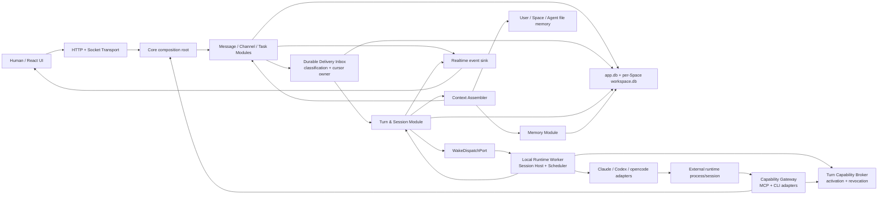
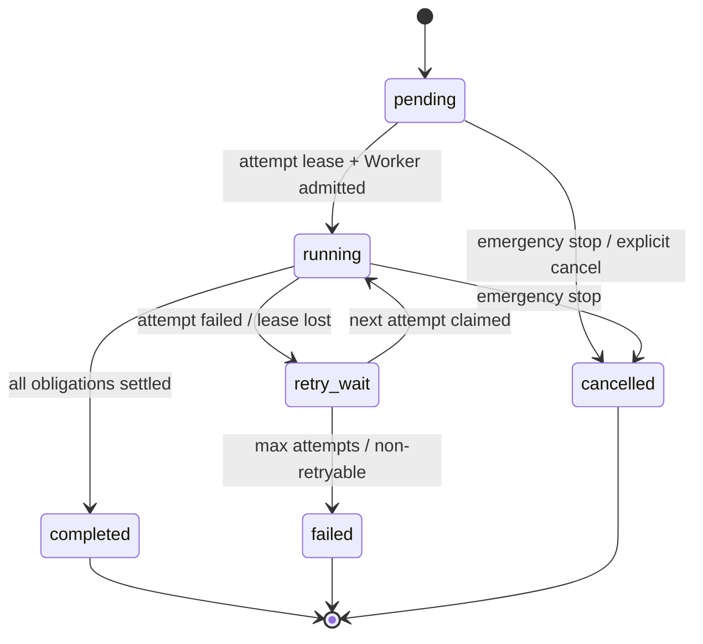
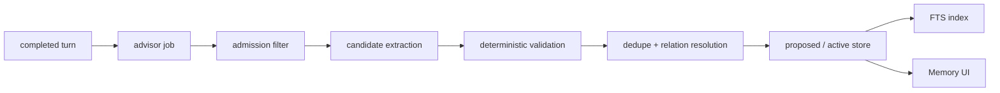
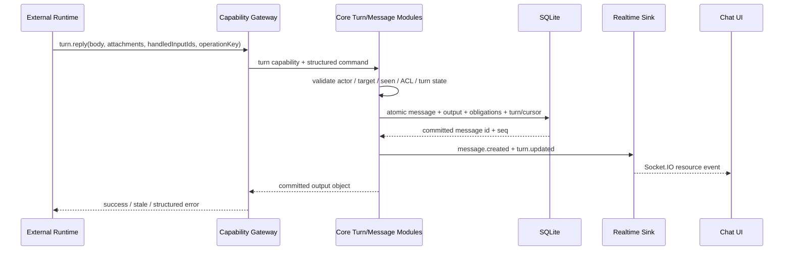

# Agent Harness v2：会话、上下文、记忆与工具机制设计

> 状态：已接受并实施中；P-A10.0–P-A10.2 已完成，P-A10.3–P-A10.7 尚待逐门实现。
> 日期：2026-07-19。
> 依据：`docs/kith-space/notes/helio-agent-context-memory-tools-research.md` 的本机实测，以及 Kith-space 已完成的 P-A7、P-A8、P-A9 架构边界。
> 目的：获得与 Helio 相同的“同一个 Agent 像长期同事一样跨私聊、频道和话题延续关系”的体验，同时修正其不可解释记忆、模型重建 thread target、跨私密边界仅靠自律和 cursor replay 等缺陷。

## 1. 决策摘要

Kith-space 不把所有交流表面塞进同一个无限上下文，也不自研模型运行时。目标机制固定为：

```text
per-surface resumable session generation
+ durable delivery + logical turn/attempt ledger
+ auditable Context Envelope
+ authoritative message/history tools
+ agent-scoped episodic recall
+ User / Space / Agent file memory
+ server-owned reply target and source watermarks
+ reply / cede / fail finalize gate
+ runtime-native tools + scoped MCP/CLI gateway
= 跨频道、私聊和话题连续但边界清楚的长期 Agent
```

核心决策如下：

1. **每个 Agent、每个已启用交流表面拥有独立 runtime session。** 第一版频道、Human-Agent DM和话题不共用 engine session；同一表面恢复原 engine session。automation仅保留未来类型，不在P-A10启用。
2. **消息是权威事实源，记忆是带来源的派生线索。** Agent 可以查询自己有权读取的消息、话题、任务和 turn，不要求自动 recall 永不漏召回。
3. **每个 turn 持久保存 Context Envelope。** UI 和 Agent 都能知道本轮注入了哪些 root、父频道快照、近期消息、结构化记忆、文件记忆索引和界面对象。
4. **Human 在顶层频道明确 `@Agent` 时，服务端创建/复用 root 话题并把 Agent turn 定位到该话题。** 模型不再自行拼 `--thread`；Agent 只能向 turn capability 允许的目标回复。
5. **保留既有三层文件记忆，并新增结构化 episodic memory。** 新层用于自动跨表面召回、纠错和可视化管理，不替代 `MEMORY.md + notes/`。
6. **同一个 canonical memory 对 Human、Agent recall 和诊断视图使用显式 view。** 三种视图共享 ID、来源与状态，不制造 Helio 式“同一路径但列表不一致”的黑盒。
7. **Runtime Contract v2 只统一外层生命周期。** Claude Code、Codex、opencode 保留各自 session、compaction、hook 和 transcript 语义；Kith-space 统一 address、turn、usage、tool event、completion 和 MCP bootstrap。
8. **MCP 是模块能力的首选结构化入口，现有 `kith-space` CLI 是兼容与渐进发现入口。** 两者必须调用同一领域 Module，不形成两套业务逻辑。
9. **公开/私有频道的差异是发现与 membership ACL。** 当前 surface 不扩大 Agent 权限；跨频道查询按目标频道权限，并记录来源与披露边界。
10. **recall 与 memory advisor 失败时 fail-open，授权、目标路由和消息提交失败时 fail-closed。** 记忆故障不能阻塞回复，权限和错发风险不能静默降级。
11. **消息提交时必须同时提交 durable delivery item。** turn 是随后对 delivery items 的有界编组；Worker 通知、实时事件和进程启动都不是事实源。
12. **logical turn、execution attempt 与 product output 分层持久。** 重试追加 attempt，不回写历史 attempt；所有 turn-scoped 写入由 Core 保存稳定 operation/output slot 并在同一事务完成 output、obligation 和 cursor 结算。
13. **Chat cursor 归属于消息来源 membership，不归属于 engine session。** 父频道 root 可以由 thread session 处理，但成功后推进的是父频道 delivery frontier；纯 observe/self/system 输入由 Core 分类后推进，不启动模型。
14. **常驻 runtime 通过 session-bound capability broker 激活当前 turn。** 不把每 turn bearer token固定在子进程环境中，也不把同一 OS 用户下的产品 ACL描述成强进程隔离。
15. **结构化记忆使用不可变 revision、typed subject/evidence、披露投影和 forget suppression。** “删除条目”与“禁止从保留来源重新学习”是两个不同操作。
16. **第一版跨表面连续性不只依赖 query-shaped FTS。** 稳定偏好、关系与习惯使用有界 continuity bundle；FTS 负责事件事实并补齐中文短词策略，embedding 仍是后置可选 Port。

本文描述的是目标态。当前 `agents.session_id`、`agent_activity_log`、单 Agent `RuntimeSession` 和三层文件记忆继续是已实现事实，必须按第 22 节分阶段迁移，不能把目标类型提前写成现有行为。

## 2. 与现有规格的关系

本文补充而不推翻以下已实现规格：

- `2026-07-12-home-space-and-space-root-design.md`：保留 `workspaceRoot / agentMemoryDir / runtimeStateDir` 三路径，Space root 仍是同 Space Agent 的共享 cwd。
- `2026-07-14-agent-channel-response-mode-design.md`：保留 `active / mention_only / silent`、Agent 默认 + 顶层频道覆盖、DM/明确任务绕过和非追溯 wake watermark。
- `2026-07-18-desktop-modular-monolith-architecture-design.md`：保留 Electron Desktop / Core / 唯一 Worker / Runtime Adapter 拓扑、SQLite 和 TypeScript 主栈。
- `docs/decisions.md` 决策 2/8/9/23/26/29：不自研 runtime、模块经 MCP、三层文件记忆、共享 Space cwd、响应模式和模块化单体继续成立。

本文新增的目标边界是：

- Runtime Contract v2、per-surface session generation 与 capability broker；
- durable delivery inbox、logical turn/attempt/operation/output ledger；
- auditable Context Envelope 与多 source watermarks；
- server-owned thread/reply target；
- revisioned episodic memory、disclosure/suppression、continuity/中文 recall 与设置面板；
- session checklist、snapshot、compaction telemetry；
- Capability Gateway、MCP bootstrap 与工具授权；
- 受限离线 memory consolidation 作为独立 P-A11 后续，不是 P-A10 上线前置。

## 3. 目标、非目标与约束

### 3.1 功能目标

- Agent 在 DM、频道和话题中保持各自局部上下文，不互相污染。
- Agent 能通过自动 recall 和权威历史查询自然延续跨表面偏好、关系、决定与未完成事项。
- Human 能看到、搜索、纠正、归档和追溯 Agent 的结构化记忆。
- 每次 Agent 唤醒都有稳定 turn ID、触发来源、上下文清单、工具轨迹、usage 和明确终态。
- Agent 的 stdout、thinking 或 text delta 不直接成为持久消息；只有消息 Module 成功提交后才进入 Chat。
- Human 的顶层 `@Agent` 自动把后续协作收进话题，且服务端保证回复不会错落到父频道。
- Runtime 休眠、Worker 重启和 Desktop 重启后，surface session 能用 engine session ID 恢复；恢复失败可观测地冷启动。
- Claude Code、Codex、opencode 都能得到等价的 Kith-space MCP/CLI 能力、工具审计和最终化语义。
- 记忆、历史查询、跨频道读取和工具调用遵守 Space、频道、Agent 与当前 turn capability 的边界。

### 3.2 非功能目标

- **Local-first**：除用户选择的外部模型/runtime 服务外，会话、turn、记忆索引、文件和审计均在本机。
- **可解释**：任何自动注入项都能映射到 canonical ID、来源、可见范围和注入原因。
- **可恢复**：已持久化消息和 turn 不因 Worker/runtime 崩溃丢失；失败 turn 可重放且不会重复提交同一 turn output。
- **可降级**：FTS、可选 embedding、memory advisor 或 consolidation 不可用时，权威消息查询和普通对话仍工作。
- **有界成本**：动态上下文、批次、轨迹、session cache、advisor 队列和离线巩固都有明确上限。
- **运行时中立**：通用契约不引用 Claude/Codex 专属事件名或 summary schema。
- **安全诚实**：在 OS 沙箱落地前，只声明产品 ACL，不把同一系统用户下的文件路径称为强隔离。

### 3.3 产品与技术约束

- 一个安装实例只有一个 Human、一个 Home、一个 Local Runtime Worker。
- 每个 Agent 只属于一个 Space；普通 Agent 默认不能跨 Space。
- 不引入云控制面、远程数据库、Redis、Kafka、微服务或自研 agent loop。
- Core 仍是 SQLite 的唯一业务写入权威；Worker 不直接打开 `workspace.db`。
- runtime cwd 仍是 Space root；Agent Memory 仍位于 `<space>/.kith/agents/<agentId>`。
- 当前外接 runtime 的高权限是既有债；本文的产品 ACL 不能阻止恶意 runtime 用绝对路径越界。

### 3.4 非目标

- 不保证跨 runtime 的 token 计算、compaction payload 或 tool event 字段字节级相同。
- 不做所有消息的无界 prompt 注入，也不承诺自动记住一切。
- 不用 episodic memory 取代原始消息、任务状态或文件事实。
- 不在首个实施切片同时上线 Dream、Vault、外部 SaaS 和 OS 沙箱。
- 不把开发、研究、周报等具体角色流程硬编码到 harness。
- 不为未来假想的多 Human、多设备或云同步提前增加租户抽象。

## 4. 总体架构



### 4.1 Core 拥有的权威

Core 继续拥有：

- Space、频道、membership、消息、任务和附件事实；
- Session Address 与 turn 状态；
- durable delivery item、来源 cursor、逐输入 obligation、logical turn 与 execution attempt；
- Context Envelope manifest；
- memory canonical items、evidence、relations 与 advisor job；
- turn-scoped capability 的签发、broker 激活和实时校验；
- 消息/工具提交、ACL、cursor、幂等与实时发布；
- Worker snapshot 的持久副本。

### 4.2 Worker 拥有的运行态

Worker 只拥有可重建的运行态：

- 每个 Agent 的 surface session host；
- 当前 engine process/session handle；
- 全局与 per-Agent turn 调度；
- adapter event 到 Runtime Contract v2 的归一化；
- dirty snapshot 暂存与上报；
- runtimeStateDir 下的 adapter 临时文件。
- session-bound capability broker 的 Worker 端 handle；broker 只暴露当前已激活 turn，不持有业务授权真相。

Worker 不拥有消息、记忆或任务的业务真相。重启后以 Core 的 session/turn/snapshot 和 engine resume ID 恢复。

### 4.3 Capability Gateway

Capability Gateway 是 Agent 操作 Kith-space 的唯一**受支持产品 API**，提供两个 Adapter。它不是 OS 沙箱：在现有同一系统用户、共享 Space cwd 和 runtime-native shell 前提下，恶意 runtime 仍可能直接读取本机文件，相关边界见第 19 节。

```text
MCP Adapter  -> 结构化 schema、turn 原子能力、未来模块工具
CLI Adapter  -> 兼容不同 runtime、渐进 help、脚本组合和故障兜底
                  ↓
             同一 Use-case Module
```

CLI 不再定义独立权限或业务语义；MCP 不绕过既有 Message/Task/Channel Module。任何能力在两个 Adapter 下必须通过同一契约测试。

### 4.4 建议模块落点

目录名称可在实现时按现有风格微调，但所有权不能重新堆回 `server/core.ts`、`routes-agent.ts` 或 `daemon/agentManager.ts`：

```text
src/
  deliveries/            durable inbox、classification、cursor frontier、wake binding
  sessions/              SessionModule、surface address、generation、snapshot store
  turns/                 logical turn、attempt lease、obligation、operation/output/finalize
  context/               ContextAssembler、budget、source manifest
  memory/                canonical store、recall、advisor、consolidation
  capabilities/          broker activation、turn grant、MCP/CLI contracts、risk policy
  runtime/
    contract/v2/         runtime-neutral lifecycle/events/usage/bootstrap
    control/             Core <-> Worker v2 Adapter
    worker/sessions/     session host、per-Agent/per-surface scheduler
    adapters/            Claude/Codex/opencode v2 bridges
  server/
    agent-http/          CLI Transport Adapter；不拥有新领域规则
    mcp/                 MCP Transport Adapter；不拥有新领域规则

web/src/features/
  turn-inspector/        Context / Steps / Usage / Outcome
  agent-memory/          Structured / Files 管理面板
  session-diagnostics/   仅开发诊断视图
```

`MessagePostingModule`、`TaskLifecycleModule`、Channel Module 和现有 response policy 继续复用；P-A10 不复制它们的写入、ACL 或 wake 规则。

## 5. 交流表面与 Session Address

### 5.1 Surface Address

聊天 surface 直接复用现有 `channels` 领域身份：

```ts
type ChatSurfaceKind = "channel" | "private" | "dm" | "thread";

interface ChatSurfaceAddress {
  spaceId: string;
  kind: ChatSurfaceKind;
  channelId: string;
  parentChannelId?: string;
  rootMessageId?: string;
}

// 预留扩展点；第一版只启用 ChatSurfaceAddress。
interface AutomationSurfaceAddress {
  spaceId: string;
  kind: "automation";
  automationId: string;
}

type SurfaceAddress = ChatSurfaceAddress | AutomationSurfaceAddress;
```

任务不是另一种聊天 surface。频道任务使用其 owning thread；没有话题的内部 maintenance/manual start 不创建长期 conversation session。`AutomationSurfaceAddress` 在类型中只为兼容未来 Module 保留，P-A10 第一版不得创建这种 session；Automation Module 上线前必须另行定义事实源、delivery identity、cursor、owner、ACL 与终态。

现有 Agent 生命周期三分法继续成立：

- `create`：为尚未介绍的 Agent 创建 Human-Agent DM 上的 `required` introduction turn，沿用一次性 introduction proof；
- `manual`：只让 Core 检查 durable delivery inbox 并按 surface 分别调度，不创建 maintenance conversation session；
- `wake`：处理已持久的一个或多个同 session delivery item。

因此 P-A10 不能把新 Agent 的首次 DM 介绍退化成无 surface 的启动文本，也不能让 manual start 把多个频道正文拼进同一个 engine session。

### 5.2 Runtime Session Key

```ts
interface RuntimeSessionKey {
  spaceId: string;
  agentId: string;
  surfaceKind: SurfaceAddress["kind"];
  surfaceId: string;
}
```

对于 Chat，`surfaceId = channelId`；未来 automation 才使用 `surfaceId = automationId`。它满足：

- 同一 Agent 在同一 DM 的后续 turn resume 同一个 engine session；
- 同一 Agent 在两个频道中使用两个 session；
- 同一话题对不同 Agent 各有独立 engine session；
- 同一 Agent 的父频道和话题不共享 engine transcript；
- Space 移动不改变产品 key，但是否可 resume 取决于 adapter 的 cwd relocation capability；Agent reset 才按明确范围清理产品 session。

### 5.3 Session Record

```ts
type RuntimeSessionStatus =
  | "cold"
  | "starting"
  | "idle"
  | "running"
  | "evicted"
  | "resume_failed"
  | "disabled";

interface RuntimeSessionRecord {
  id: string;
  key: RuntimeSessionKey;
  runtime: string;
  model: string | null;
  runtimeConfigFingerprint: string;
  sessionGeneration: number;
  engineSessionId: string | null;
  engineHostFingerprint: string | null;
  workspaceRootFingerprint: string;
  adapterVersion: string;
  status: RuntimeSessionStatus;
  lastTurnId: string | null;
  lastActiveAt: number;
  lastCompactedAt: number | null;
  snapshotVersion: number;
  snapshot: RuntimeSessionSnapshot | null;
  createdAt: number;
  updatedAt: number;
}
```

`agents.session_id` 在迁移期只作旧全局 session 的兼容来源；目标态以 `runtime_sessions.engine_session_id` 为准，并最终删除旧列。Chat 的 completed delivery cursor 继续由来源 `channel_agent_members.last_read_seq` 承载，不在 `runtime_sessions` 再复制一份；session 是 engine continuity，不是消息消费权威。

`runtime/model/runtimeConfig`、adapter major version、影响工具授权的安全 profile 或 workspace relocation compatibility 发生变化时，Core 增加 `sessionGeneration`，归档旧 generation 并 cold start。历史 turn 继续指向旧 generation，禁止把 Claude session ID 交给 Codex/opencode尝试 resume。engine session ID 的首次产生或变化是关键恢复状态：Worker 必须立即上报并等待 Core 持久化 ack 后才能开始下一 turn，不能只依赖 5 秒或 60 秒 snapshot。

### 5.4 Warm、idle、evicted 与 resume

- `running`：当前有 engine turn。
- `idle`：surface session 可 resume，可能仍有常驻进程，也可能只是 adapter handle。
- `evicted`：释放 Worker 内存/子进程，但保留 engine session ID、session metadata 和 snapshot。
- 下一次 wake 优先 resume；adapter 明确返回 session missing 时记录 `resume_failed`，创建新 engine session，并把失败和冷启动原因写入 turn ledger。
- active turn slot 与 resident process slot 分开计量。idle handle 不占 active turn slot，但仍占 resident process slot；队列有压力时先 LRU evict idle handle。
- Space 在同一安装实例内移动/重连时，只有 adapter 明确声明并通过真实 smoke 的 `cwdRelocatableResume` 才继续 resume；默认保守 cold start。复制到另一安装或 adapter/runtime 版本不兼容时，`engineHostFingerprint` 校验失败并可观测地冷启动。消息、turn manifest、episodic/file memory 随 Space 保留，不能假装 engine 私有 transcript 也具有跨机器可移植性。

默认策略保持单机克制：全局最多 4 个 active turn、最多 4 个 resident external processes、同一 Agent 最多 1 个 active turn、同一 surface 最多 1 个 non-terminal logical turn。session record 可长期保留但不等于进程常驻。后续只有在共享 cwd、Agent Memory 写入、RSS/FD 和 adapter 并发经过实证后，才允许同 Agent 跨 surface 并行或提高 resident 上限。

## 6. Durable Delivery、Turn 与 Attempt 状态机

### 6.1 消息事务先保存 delivery item，turn 只是后续编组

一个 durable message 对每个发送时有资格的 Agent 形成一条稳定 delivery item。它是“这条来源是否已经被该 Agent 的 harness 终态处理”的事实，不等于已经启动模型：

```ts
type DeliveryDirective = "required" | "optional" | "observe";
type DeliveryDisposition =
  | "pending"
  | "bound"
  | "observed"
  | "replied"
  | "ceded"
  | "dispatch_blocked"
  | "dismissed";

interface AgentDeliveryItem {
  id: string;
  spaceId: string;
  agentId: string;
  messageId: string;
  sourceChannelId: string;
  sourceSeq: number;
  cursorOwnerChannelId: string;
  targetSurfaceKind: "channel" | "private" | "dm" | "thread";
  targetSurfaceId: string;
  targetSessionId: string | null;
  directive: DeliveryDirective;
  reason: string;
  policySnapshot: ResponsePolicySnapshot;
  disposition: DeliveryDisposition;
  turnId: string | null;
  dispatchWakeId: string | null;
  createdAt: number;
  settledAt: number | null;
}
```

消息、mention/thread membership、dispatch chain 和 delivery items 在同一 `ConversationJournal` SQLite 事务提交。directive/policy snapshot必须在该事务中按最终membership、mode override和wake watermark重新计算；事务外preflight只能准备候选，不能留下设置竞态。实时 publish、wake reservation/admission 和 Worker signal 都是可恢复的提交后 effect。若 Core 在提交后崩溃，启动/reconnect 扫描 `pending` delivery items，按现有 dispatch guard 幂等创建或复用 `dispatch_wakes`，不会靠 Socket 事件猜测遗漏工作。

`UNIQUE(agent_id, message_id)` 防止同一事实重复入箱。一个 message/Agent reservation 仍保留自己的 chain、depth、wake budget 和 stop scope；多个 reservation 可以绑定同一个 turn，但 `deliveryId = turnId` 只用于 Core→Worker 的逻辑执行，不覆盖 `dispatch_wakes.id`。

delivery disposition 的终态集合固定为 `observed | replied | ceded | dispatch_blocked | dismissed`；`pending | bound` 都会阻塞来源 frontier。`dispatch_blocked` 只由 Core 在 admission 前被 depth/budget/已生效 emergency-stop 等 dispatch guard 明确拒绝且不应自动重试时写入，并保存稳定原因；已经 bound/running 后才被 emergency stop取消的 delivery仍 unresolved。attempt 用尽也不会自动把 delivery 标成 blocked，而是保留 unresolved dead-letter，等待 Human retry 或显式 dismiss。

Human 顶层 mention 是明确的跨 surface delivery：root message 的 `sourceChannelId/cursorOwnerChannelId` 是父频道，`targetSessionId` 是新建 thread session。成功 reply 推进父频道 delivery frontier；root 不会伪装成 thread 内消息。后续真实 thread 消息才由 thread membership cursor 拥有。

### 6.2 Logical Turn 与 Execution Attempt 分离

一个 logical turn 对应“某 Agent 在某个 `RuntimeSessionKey` 上处理一组已冻结 delivery items”。它不是一条消息、一次进程执行或整个 engine session：

```ts
type TurnStatus = "pending" | "running" | "retry_wait" | "completed" | "failed" | "cancelled";
type TurnOutcome = "replied" | "ceded" | "mixed" | "failed" | "cancelled";

interface AgentTurn {
  id: string;
  sessionId: string;
  sessionGeneration: number;
  spaceId: string;
  agentId: string;
  status: TurnStatus;
  outcome: TurnOutcome | null;
  effectiveDirective: "required" | "optional";
  contextEnvelope: ContextEnvelope | null;
  maxAttempts: number;
  nextAttemptAt: number | null;
  createdAt: number;
  completedAt: number | null;
}

type AttemptStatus =
  | "claimed"
  | "admitted"
  | "running"
  | "finalizing"
  | "succeeded"
  | "failed"
  | "cancelled"
  | "lost";

interface AgentTurnAttempt {
  id: string;
  turnId: string;
  attemptNo: number;
  status: AttemptStatus;
  workerGeneration: number;
  leaseOwner: string;
  leaseExpiresAt: number;
  engineSessionIdBefore: string | null;
  engineSessionIdAfter: string | null;
  usage: NormalizedUsage | null;
  errorCode: string | null;
}
```

同一 surface 最多一个 non-terminal logical turn；新消息可在 `pending` turn freeze 前追加，freeze 后进入下一批。scheduler 不能仅因 completed cursor 尚未推进而再次选择已绑定 delivery item。数据库以 delivery item 的唯一绑定和 partial unique active-turn guard阻止重叠消费。

每次重试都追加新的 attempt，不把 `failed` attempt 改回 running，也不覆盖旧 engine/usage/error。attempt 使用 Worker generation + 有期限 lease + CAS claim；Core/Worker 重启只回收过期 lease，旧 generation 的迟到 event、terminal 或 output 写入被拒绝，已提交的幂等 output 仍返回原结果。达到 `maxAttempts` 后 logical turn 才进入 `failed`；Human 可 retry、dismiss 或保留 dead-letter 诊断。

### 6.3 状态转换



attempt 内部按 `claimed → admitted → running → finalizing → succeeded|failed|cancelled|lost` 追加事件。logical turn 的 `running` 表示至少有一个当前有效 attempt，不意味着 stdout 已成为产品回复。

### 6.4 Finalize gate 按逐输入 obligation 结算

turn 的 `effectiveDirective` 只控制 prompt、preview 和 admission 优先级，不能覆盖逐输入事实：

| input directive | 合法 disposition |
|---|---|
| `required` | 必须被一个已提交 `turn.reply` output 明确覆盖 |
| `optional` | 被 reply output 覆盖，或显式 `turn.cede(inputIds, reason)` |
| `observe` | Core 可直接标 `observed`；只在已有 actionable turn 时作为上下文 |

`turn.reply` 接收 body、attachments、稳定 operation key，以及本次覆盖的 `handledInputIds`；一条综合回复可以覆盖多条 required 输入，但不能用“本 turn 发过一条消息”自动证明所有 required 都已处理。`turn.cede` 只接受 optional input，required input 不可 cede。

Runtime 的 stdout、assistant text 和 thinking 只形成 preview/trajectory。模型停止时：

1. Core 检查全部 required/optional obligations；
2. 若仅剩 optional，Stop hook/result bridge 可要求一次显式 cede；
3. 若仍有 required 未覆盖，有限 finalize retry 只返回 unresolved input IDs 和允许动作；
4. retry 后仍未交付时，本 attempt `failed(output_missing)`，logical turn 按 retry policy 重试或最终失败；
5. 任何路径不得把 stdout 自动转换为消息。

### 6.5 Cursor frontier 与纯分类输入

`channel_agent_members.last_read_seq` 目标态表示**durable delivery frontier**：该 Agent 在此频道中不大于该水位的实际消息行都已有终态 disposition。它不表示每条内容都进过模型，也不要求 Space 全局 seq 整数连续。

- Core 按 `sourceChannelId` 查询 `seq > lastReadSeq` 的实际有序消息行；其他频道 seq 和事务失败造成的数字缺口不是 cursor hole；
- self message在消息事务中直接结算，system/observe/silent 不需要模型即可写 `observed`；
- frontier 只能推进到该频道第一个 unresolved delivery item 之前；后到的 observe 不能越过更早的 required/optional；
- reply/cede/output mapping 与对应 delivery disposition 在同一事务结算，然后重算来源 membership frontier；
- attempt failed、cancelled 或 emergency stop 不结算未完成 obligation，也不伪推进 cursor；Human `dismiss` 是明确、可审计的终态操作；
- 单 turn 上限为同一 `RuntimeSessionKey` 的 50 条 actionable/observed 输入或 12,000 估算 token，取先到者；不同 target session 绝不合批。

这把当前“check 已读、回复前崩溃会丢工作”的窗口收敛为 at-least-once logical turn，同时避免 silent/observe/system 永久堵住 frontier。

### 6.6 Operation、Output 与原子提交

所有 turn-scoped 产品写工具先经过 durable operation ledger：

```text
turn_operations
  UNIQUE(turn_id, tool_name, idempotency_key)
  request_hash, operation_slot, status, result_ref, error_code

turn_outputs
  id, turn_id, operation_id, output_kind, message_id, created_at

turn_output_inputs
  output_id, delivery_item_id
```

`operation_slot` 由 harness/command contract 给出，例如 `reply:primary`、`task:update:<id>`，而不是完全依赖模型随机生成 key。相同 key + 相同 request hash 返回首次结果；相同 key + 不同请求返回 `idempotency_conflict`。

Chat reply 通过 `ConversationJournal` 的内部 transaction-aware seam，在一个 SQLite 事务提交 message、`producedByTurnId`、operation/output、output→input mapping、delivery dispositions、turn terminal 和 cursor frontier。这个 seam 不是给 Transport 暴露通用 transaction，也不复制 MessagePostingModule 校验。跨 SQLite、文件或外部系统操作使用 operation 状态机与 reconcile，不虚构跨资源 ACID。

### 6.7 Turn Event

每个 normalized event 归属于 attempt 并带稳定 ordinal：

```ts
type TurnEventKind =
  | "activity"
  | "thinking_summary"
  | "text_preview"
  | "tool_started"
  | "tool_completed"
  | "tool_failed"
  | "usage"
  | "compaction_started"
  | "compaction_completed"
  | "finalization";
```

事件主键为 `(attemptId, ordinal)`。Worker 对高频 text/activity delta 做有界 coalesce；Core 按批次写入，critical tool/output/finalization 不丢，preview 可丢且不影响终态。每个 event 有 payload byte cap、每 attempt 数量 cap 和 backpressure；超限写 `events_truncated` 摘要，不能拖垮 SQLite 或 Chat realtime。

事件只保存安全摘要、结构化参数、结果状态和必要 resource ref；默认不持久化完整 shell stdout、secret 或模型 chain-of-thought。现有 `agent_activity_log` 在迁移期继续供应旧 UI，目标态由 `agent_turn_events` 的兼容投影取代。

## 7. Runtime Contract v2

### 7.1 通用外层契约

```ts
interface RuntimeV2 {
  name: string;
  capabilities: RuntimeCapabilities;
  openSession(options: OpenRuntimeSessionOptions): Promise<RuntimeSessionV2>;
}

interface OpenRuntimeSessionOptions {
  address: RuntimeSessionKey;
  cwd: string;
  runtimeStateDir: string;
  model?: string;
  runtimeConfig?: Record<string, unknown>;
  engineSessionId?: string | null;
  systemPrompt: PromptDescriptor;
  mcpBootstrap: McpBootstrapDescriptor;
  env: NodeJS.ProcessEnv; // 仅稳定 session 环境，不含 per-turn bearer
  broker: SessionBrokerDescriptor;
}

interface RuntimeTurnInput {
  turnId: string;
  attemptId: string;
  context: RenderedContextEnvelope;
  capabilityActivationId: string;
  deadlineAt: number;
}

interface RuntimeSessionV2 {
  runTurn(input: RuntimeTurnInput, sink: RuntimeEventSink): Promise<RuntimeTurnResult>;
  cancel(attemptId: string): Promise<void>;
  snapshot(): Promise<AdapterSnapshot>;
  close(reason: "idle" | "stop" | "reset" | "shutdown"): Promise<void>;
}
```

### 7.2 归一化能力

```ts
interface RuntimeCapabilities {
  resumableSession: boolean;
  persistentProcess: boolean;
  mcp: "native" | "config" | "bridge" | "none";
  hooks: {
    beforeTool: boolean;
    afterTool: boolean;
    beforeCompact: boolean;
    afterCompact: boolean;
    stopFinalize: boolean;
  };
  usage: "final" | "incremental" | "none";
  cancellation: "graceful" | "process";
  context: {
    modelWindow: "reported" | "catalog" | "unknown";
    tokenEstimator: "provider" | "local" | "approximate";
  };
  cwdRelocatableResume: boolean;
  toolIsolation: "enforced" | "advisory" | "none";
}
```

Adapter 必须把 engine 事件映射成 `turn_started / session_changed / activity / trajectory / tool / usage / compact / turn_completed / turn_failed`，但可以返回 `unsupported`。通用层不得假设：

- Claude 的 `--resume` 等于 Codex `thread/resume`；
- 所有 runtime 有常驻 stdin；
- 所有 runtime 都能给出 compaction summary；
- 所有 runtime 的 cache token 和 cost 口径相同；
- runtime 默认模型一定能给出 context window；
- `hooks.beforeTool=true` 就等于 OS 文件/进程沙箱。

### 7.3 Turn activation 与 Core/Worker event envelope

常驻进程不能靠 spawn 时固定环境变量切换当前 turn。Worker 为每个 session 只持稳定 broker handle；每次 attempt 的顺序固定为：

```text
Core CAS claim attempt lease
  -> Worker admission ack
  -> broker.activate(sessionId, turnId, attemptId, workerGeneration, expiry)
  -> adapter.runTurn(... capabilityActivationId)
  -> critical events / operation calls
  -> broker.deactivate
  -> terminal ack
```

CLI/MCP 请求通过 broker 解析当前 activation，再由 Core 校验 logical turn、attempt lease、Agent/Space/surface、operation scope 和实时终态。session handle 即使被 runtime 读到，也不能在未激活、过期、其他 surface 或其他 session 中兑换权限；安全性来自 Core 的窄 scope 和实时状态，不依赖“模型绝对看不到 token”的错误假设。

Core↔Worker 的 v2 envelope 至少含 `workerGeneration/sessionId/sessionGeneration/turnId/attemptId/eventId/ordinal`。Worker 必须先得到匹配 generation 的 admission；旧 generation 事件被拒绝。`session_changed`、tool operation 和 finalization 是 critical event，需要 Core ack；text preview 可合并/丢弃。断线后 Worker 发送 active attempt 摘要，Core 以持久 lease/operation ledger决定继续、cancel 或重领，不能用最后一条 UI activity 推断终态。

### 7.4 三条强路径

| Runtime | engine session | turn 驱动 | MCP bootstrap | finalize |
|---|---|---|---|---|
| Claude Code | Claude session ID | SDK/stream-json + resume | `--mcp-config` / SDK MCP | Stop hook +结果事件 |
| Codex | thread/rollout ID | app-server `turn/start` | session config + hookshim | `turn/completed` + hookshim |
| opencode | session ID | one-shot `run --session` | config content / server attach | step-finish + exit code |

Codex hookshim 必须 fail-closed：如果配置宣称 before-tool/finalize gate 可用但整个 turn 未联系 shim，attempt 标记 `failed(hook_bridge_missing)`，不能静默绕过安全边界。Claude/Codex/opencode 的 resume、MCP、finalize、tool isolation、context metadata 和 cancel 都必须分别通过真实 contract fixture/smoke；Helio 的静态二进制证据不能替代 Kith-space live adapter 验收。

### 7.5 Usage

统一结构只保存能可靠映射的字段：

```ts
interface NormalizedUsage {
  inputTokens?: number;
  outputTokens?: number;
  reasoningTokens?: number;
  cacheReadTokens?: number;
  cacheWriteTokens?: number;
  costUsd?: number;
  durationMs?: number;
  model?: string;
  source: "final" | "incremental" | "estimated";
}
```

预算先按 attempt 记录，再在 logical turn 终态聚合；incremental usage 只做预警，同一 engine part/result 用 adapter event ID 去重。`source=estimated` 不得作为精确财务成本或硬停止的唯一依据。

### 7.6 Maintenance invocation

Memory advisor/consolidation 不复用 user-facing `RuntimeSessionV2`。独立 `MaintenanceRuntimePort.completeJson()` 必须声明 `toolIsolation=enforced`，只接收经过 source policy 过滤的 bounded JSON 输入，不能 resume、发送消息、访问 shell/文件/Vault/外部 connection。某 adapter 无法证明工具隔离时，不得用“prompt 要求不要调用工具”降级；该 Agent 的 advisor 改用用户明确配置的纯 completion provider，或显示 unavailable 并 fail-open。

## 8. Admission、调度与批处理

### 8.1 调度层级

```text
Durable message/task
  -> response policy
  -> 同事务写 AgentDeliveryItem（durable inbox）
  -> post-commit/recovery 幂等绑定 dispatch_wakes
  -> scheduler 按 RuntimeSessionKey 冻结 logical turn
  -> attempt lease + WakeDispatchPort(turnId)
  -> Worker global admission
  -> per-Agent serial queue
  -> per-surface session queue
  -> adapter runTurn
```

现有 `activeTurnLimit=4 / queue=128 / admissionTTL=120s` 可作为第一版默认；另设 `residentProcessLimit=4`。Worker 内存 admission 过期只使本 attempt 进入 retry_wait，不能删除 Core 的 delivery item 或重复消耗 wake budget。idle surface session 不占 active turn slot，但占 resident slot并在队列压力下优先逐出。

### 8.2 事件分类

进入 response policy 前先区分：

- `human_message`：沿用 P-A8 三模式；
- `agent_message`：普通消息不环境唤醒，明确 mention 才可唤醒；
- `task_assignment`：明确受派 Agent 始终 required；
- `reminder`：只唤醒显式 owner/target；第一版不启用 automation session；
- `membership/system_audit`：默认 observe，不触发 active Agent；
- `channel_created/member_added`：不产生 Agent 欢迎 fan-out；
- `manual_start`：只做控制面检查，不制造虚假对话消息。

### 8.3 同 surface 合批

- 只合并相同 `RuntimeSessionKey` 的有序、未绑定 delivery items；Space 全局 seq 可以有合法数字缺口；
- batch 内保留每条消息自己的 `required | optional | observe` 与 reason；
- 任何 required 使 turn directive 为 required，但 Agent 仍须分别处理每条来源；
- turn 运行中到达的新消息不直接拼进任意 tool output；记录为下一 batch，或在 adapter 支持 safe boundary 时以结构化 `peer_activity` event 提示；
- 新消息不会修改本 turn 已冻结的 Context Envelope 和初始 `seenWatermarks`；刷新只追加 later-query audit并轮换 capability watermark。

### 8.4 公平与防循环

- 全局队列按 Space + Agent 轮转，不让一个 active 大频道占满四个 slot；
- 同 Agent 默认串行，避免共享 cwd 与 Agent Memory 竞态；
- Agent 普通消息不做环境 fan-out；
- system event 不参与 active ambient wake；
- dispatch chain 继续服从深度、wake budget 和急停；
- 相同 `(turnId, toolName, idempotencyKey)` 且 request hash 相同的产品写入返回第一次结果；key 相同但请求不同则 fail-closed；
- 同一条 Agent message 的多个目标分别保留 dispatch chain/depth/budget，不因合批折叠安全账本。

### 8.5 三种频道响应模式继续是 admission 的产品入口

P-A10 不新造第四种模式，也不把 session 与响应模式混在一起：

| 事件 | `active` | `mention_only` | `silent` |
|---|---|---|---|
| Human 顶层普通消息 | channel turn，`optional` | 不创建 turn | 不创建 turn |
| Human 顶层 direct mention | 加入 thread，`required` | 加入 thread，`required` | 加入 thread但不创建 turn |
| Human/Agent 在现有话题 direct mention | thread turn，`required` | thread turn，`required` | 保留/授予合法 membership但不创建 turn |
| Human 在已参与话题跟进 | thread turn，`optional` | thread turn，`optional` | 不创建 turn |
| Human-Agent DM | DM turn，`required` | DM turn，`required` | DM turn，`required` |
| Agent-Agent DM | DM turn，`required`，受 dispatch guard | 同左 | 同左 |
| 明确任务指派 | owning-thread turn，`required` | owning-thread turn，`required` | owning-thread turn，`required` |
| 未指派的频道任务 | channel turn，`optional` | 不创建 turn | 不创建 turn |
| Human 顶层 `@all` | channel turn，逐目标 `required` | channel turn，逐目标 `required` | 不创建 turn |
| Human 话题内 `@all` | thread turn，逐目标 `required` | thread turn，逐目标 `required` | 不创建 turn |
| Agent 顶层 direct mention | server-owned thread turn，`required`，受 dispatch/membership guard | 同左 | 不创建 turn |
| Agent 普通消息 | 不环境唤醒 | 不环境唤醒 | 不环境唤醒 |
| membership/频道 system event | 默认 observe | 默认 observe | 默认 observe |

“不创建 turn”不等于没有记录：消息事务仍创建 directive=`observe` 的 delivery item并由 Core 结算，以推进 frontier。Agent 默认 + 顶层频道覆盖、effective mode、`ambient/mention_wake_after_seq` 和非追溯切换继续沿用 P-A8。新增要求是：delivery item把**触发时**的 default/override/effective mode、effectiveAt、policy reason 和 response directive 固化；历史消息旁随当前设置变化的 chip 不能解释旧 turn 为什么被唤醒。

本方案明确保持“响应模式不改变 ACL”的 P-A8 原则：合法 direct mention 可以授予/保留 thread membership，`silent` 只阻止自动 wake。Human 在公开频道 mention 尚未加入的 Agent可构成明确 membership grant；Agent 自己不能借 mention 给另一 Agent授予私有频道权限。若未来要改成 Helio 式“silent 连 thread 都不加入”，必须另立产品决策并迁移既有 membership，不能把它当作实现细节。

## 9. 话题 bootstrap 与参与

### 9.1 Human 顶层 `@Agent` 自动进入话题

对于 Human 在顶层频道发送、包含一个或多个明确 Agent mention 的普通消息：

1. MessagePostingModule 在同一事务写 root message；
2. 为该 root 幂等创建 thread channel；
3. 把 Human 和所有合法 mention 目标加入 thread；`silent` 也可成为成员但不产生 actionable turn；
4. 为每个目标写来源为父频道、目标 session 为 thread 的 durable delivery item；
5. post-commit scheduler只为 required 目标创建/冻结 thread turn，而不是先在父频道 session 唤醒再让模型决定目标；
6. Agent 的 `turn.reply` 自动写入该 thread，模型不提供 thread ID；成功后按 delivery item推进父频道 cursor owner。

例外：

- `@all` 保持频道广播，不自动为全部 Agent 创建一个高 fan-out 话题；
- `silent` Agent 可被 Human 明确 mention 加入 thread，但不自动唤醒；明确任务指派仍按现有规则创建受限 thread membership 并 required；
- Human 在公开频道 direct mention 一个尚未加入但可发现的 Agent，继续视为明确 membership grant：以触发 seq - 1 加入父频道并进入 thread；私有频道只能 mention 已有成员，新增成员必须走频道设置或明确受限任务 membership；
- Agent 主动 mention 另一个已有访问权的 Agent 时可创建/复用 thread，但继续受 dispatch guard；Agent mention 不能自行扩大另一个 Agent 的私有 membership；
- 已存在 thread 时复用，不能产生同 root 多 thread。

### 9.2 Thread Context Envelope

首次 thread turn 默认包含：

```text
root message + attachments                      必选
parent snapshot as-of root                      有界
current thread delivery batch                   必选
related task/object snapshot                    若有
agent-scoped episodic recall                    有界
file memory index refs                          路径与摘要
```

parent snapshot 固定在 root 的 `asOfSeq`：默认取 root 前 8 条 Human/Agent 消息，最多 4,000 估算 token；不包含 root 之后才到达的父频道消息，不跨频道，不自动复制 DM 原文。该默认值可按模型窗口缩小，但不能悄悄扩大。

### 9.3 Thread participation

thread membership 表达可读与参与，响应模式仍继承父频道：

- 被 mention、成为作者、处理过 thread turn 或被明确指派后成为 participant；
- active/mention_only participant 收到 Human 后续回复，无需重复 mention；
- silent 保留 membership 但不自动 wake；从 silent 恢复时推进 watermark，不回放静音期间历史；
- `thread unfollow` 删除/暂停 Agent thread membership，不影响父频道；
- 明确任务可以给非父频道成员建立 `task_scoped` thread membership：只允许读取 root task、该 thread 和直接任务对象，不允许读取父频道 recent history，也不生成 parent snapshot；
- 普通 thread 的 effective ACL 每次都同时要求 thread membership 与当前父频道可读，不能因 thread 行存在而绕过父级；
- 父频道移除 Agent 的同一 Channel Module 事务撤销/失效其普通 child-thread membership、scheduled wake、active capability 和可恢复 session handle。历史 session record可留审计但必须 disabled/cold，不得 resume 私有 transcript；
- `task_scoped` 是唯一父级例外：必须保存 task ID、允许对象集合、到期时间和任务终态撤销；不得读取 parent snapshot，任务终止后 capability/session立即失效。

## 10. Context Envelope

### 10.1 Context Envelope 是 manifest，不是复制一份完整 prompt

```ts
interface ContextEnvelope {
  schemaVersion: 1;
  turnId: string;
  session: RuntimeSessionKey;
  responseDirective: "required" | "optional";
  deliveryItemIds: string[];
  seenWatermarks: Array<{ channelId: string; throughSeq: number }>;
  continuityMode: "cold" | "resumed" | "resume_failed" | "post_compaction";
  rootMessage?: ContextSourceRef;
  parentSnapshot?: {
    asOfSeq: number;
    messageRefs: ContextSourceRef[];
    omittedCount: number;
  };
  currentBatch: ContextSourceRef[];
  recentSurface: ContextSourceRef[];
  objectSnapshots: ContextSourceRef[];
  recalledMemories: RecalledMemoryRef[];
  fileMemoryRefs: FileMemoryRef[];
  uiSnapshot?: MessageContextSnapshot;
  capabilityActivationId: string;
  budget: ContextBudgetReport;
  omissions: ContextOmission[];
  assembledAt: number;
}
```

`ContextSourceRef` 至少保存 source kind、canonical ID、immutable revision 或 bounded snapshot ID、keyed content hash、visibility、disclosure projection、injection mode、estimated tokens 和 reason。默认不把整份 rendered prompt 再复制进数据库：

- immutable message 和 memory revision 可由 canonical source 重建；
- 会原地变化的 task/object/UI 数据在 turn 创建时保存有界、脱敏、不可变 snapshot；
- provider/runtime 私有 transcript 只记录 engine ref，不能声称可由 Kith-space 重建；
- 来源被删除或 Human forget 后删除可逆 payload，只留不可逆 tombstone/HMAC 与删除原因。

因此 UI 必须区分“可重建内容”“只能证明 ID/revision/hash”和“已删除 tombstone”，不能把 manifest 一律宣传成完整 prompt replay。

### 10.2 注入顺序

Context Assembler 使用稳定优先级：

1. harness contract、Agent identity、Space 和 SurfaceAddress；
2. response directive、turn capability 和 finalize 规则；
3. 当前 delivery batch；
4. thread root 与 parent as-of snapshot；
5. 仅在 cold/resume_failed/post_compaction 需要时注入当前 surface 的近期必要消息；正常 resumed turn 不重复注入 engine 已持有的旧消息；
6. task、attachment、focused object 等结构化 snapshot；
7. Agent episodic recall；
8. User → Space → Agent 文件记忆索引引用；
9. 可用工具的最小 capability manifest。

越靠前越不能被后项挤出。私信原文、跨频道消息和完整 MEMORY.md 不因“可能有用”自动拼入。Context Assembler 记录 engine-known source frontier/hash；若 adapter 无法证明 engine continuity，则选择 cold/resume_failed profile，显式接受较高输入成本，不能静默重复或遗漏。

### 10.3 Token 预算

预算必须覆盖 standing harness、engine 已有 transcript/summary、工具 schema、预留输出和本轮动态输入。`RuntimeCapabilities.context` 提供窗口与估算器来源；无法得知时使用保守 fallback，不伪造精确窗口：

```text
knownWindow
  ? available = window - fixedHarness - estimatedEngineHistory - toolReserve - outputReserve
  : available = 8,000

dynamicBudget = max(0, min(24,000, floor(available * 0.60)))
```

若已知窗口下 `dynamicBudget < 4,000`，先请求 engine compaction或cold-start profile；仍不足时以 `context_capacity_exhausted` 可观测失败，不通过裁掉required batch/root或假装还有4,000 token继续。

在上限内建议分配：

| 来源 | 预算比例 | 溢出策略 |
|---|---:|---|
| 当前 batch + root | 30% | root 不裁；batch 分下一 turn |
| thread/parent/recent surface | 25% | 从最旧、低相关项裁剪 |
| task/object/UI snapshot | 15% | 保留 ID、状态和 focused fields |
| episodic recall | 15% | 降低 top-k，保留 correction link |
| file memory refs/摘要 | 10% | 只留 index path 与命中 topic |
| capability manifest | 5% | 只留当前 scope，详细说明按需加载 |

Prompt Descriptor 的固定 harness 目标控制在约 8,000 token 内；详细领域手册通过 skill/help 按需加载，避免 Helio 式约 56 KB standing prompt。manifest 保存 model/window/estimator/source/confidence、各层实际估算和 omission。root 正文若超过产品消息上限，保存原消息事实但只注入明确标识的 bounded excerpt + resource ref；附件默认注入 metadata/安全摘要，全文按需读取。

### 10.4 Message Context Snapshot

`MessageContextSnapshot` 是 Human 发送消息时的 UI 业务上下文，不等于整份 turn Context Envelope：

```ts
interface MessageContextSnapshot {
  spaceId: string;
  module: "chat" | "tasks" | "agents" | "settings" | "spaces" | string;
  routeId: string;
  openObjectRefs: Array<{ type: string; id: string; revision?: number }>;
  focusedRef?: { type: string; id: string; field?: string };
  capturedAt: number;
}
```

它只保存规范化 route ID、产品对象引用和必要 revision；必须剥离 URL query、fragment、搜索词、本机路径和临时参数，不采集 DOM、窗口截图、任意剪贴板或未提交表单。Agent turn 中若对象仍有权访问，Context Assembler再解析为 bounded object snapshot。

### 10.5 自动注入与主动查询必须区分

UI 的 turn 详情显示：

- **已注入**：turn 开始前进入模型的来源；
- **后来查询**：Agent 通过 message/task/memory/file 工具主动取得的来源；
- **仅引用**：因隐私或预算只提供 source ref，未给原文；
- **已省略**：预算、ACL、删除或 provider 失败造成的 omission。

Agent 的后续产品工具读取追加到 Context Envelope audit extension，但不能改写“turn 开始时已注入”的历史事实。runtime-native Read/shell 在 adapter hook 不可用时只能标为 `native_tool_audit_unavailable`，不能声称所有文件读取都已审计。

## 11. 权威历史查询与跨频道上下文

### 11.1 查询能力

Agent 必须能从记忆线索回到事实：

```text
conversation.list/get
conversation.before/after/around
conversation.search
thread.list/get
task.get/list
turn.list/get
message.resolve
```

返回项包含 canonical ID、surface、seq、sender、createdAt、附件/任务引用和 source visibility。搜索第一版使用 SQLite FTS5，并允许按当前 surface、全部已加入 surface、时间和 sender 过滤；不能用 `LIKE '%query%'` 作为长期语义和性能契约。

### 11.2 跨频道规则

- 当前 turn 只自动获得当前 surface 的原文；不同频道没有自动 recent-history 继承。
- Agent 可以显式查询自己有权读取的其他频道；查询进入 turn audit。
- 公开频道只公开元数据和可发现性。Agent 显式 join 后才读取消息、接收投递和发言；Human 继续拥有隐式完整访问。
- 私有频道对非成员不可发现、不可查询、不可通过 message ID 旁路。
- 普通 thread 读取要求父频道可读且已参与 thread；`task_scoped` 例外只授予 root task + thread，不授予父频道原文。
- 当前在公开频道运行不会扩大 Agent 对私有频道的权限；能否查询只取决于目标频道 membership 和 turn capability scope。

这会收紧当前“未加入公开频道也可读正文”的 Agent CLI 语义。迁移时必须同时更新 prompt、`resolveTarget/canAgentReadChannel`、搜索、附件和 thread metadata guard。

### 11.3 私密来源的披露

读取权限与披露权限分开：

```ts
type DisclosureMode = "same_surface" | "internal_use" | "shareable_summary" | "explicit_only";
```

- 从 DM/私有频道在另一个 surface 查询时，默认返回 source ref、分类标签和预先独立保存的 `internalSummary`；不能现场把完整原文交给模型后再要求它“只总结”。
- canonical memory 可保存 `canonicalText / internalSummary / shareableSummary` 三种投影。item 的默认 disclosure 取所有当前有效 evidence 中最严格值，只有 Human 可显式放宽；混合 public+DM evidence 不因含一条公开来源而降低等级。
- Human 在当前 turn 明确要求引用该私密来源时，可签发一次性 disclosure grant。grant 固定 source IDs/revisions、target surface、action digest、允许投影、TTL 和 consume-once；不能兑换为通用频道读取权。
- Agent 可用 Human 的非敏感偏好调整回答风格，但不得在公开回复中说明该偏好来自哪段私聊。
- `turn.reply` 记录目标 visibility、显式引用/附件/source ref 的 visibility 和 disclosure grant；确定性的 ID、原文引用、附件与 source-link 越界必须 fail-closed。
- 系统无法可靠判断模型是否用自然语言改写了私密含义，因此不能承诺对语义泄漏 fail-closed。它仍是 prompt/model/OS sandbox 之外的剩余风险，UI 与威胁模型必须如实说明。

最小 disclosure policy engine 是 P-A10.5 recall 上线前置，不得推迟到 consolidation/Vault 阶段。在该引擎完成前：same-surface 或纯公开 evidence可注入允许正文；跨 DM/private 的 `explicit_only` 只给 ref；`internal_use` 只给独立安全摘要；不得向公开 turn 注入完整 canonical text。

membership 撤销后的派生记忆采用保守默认：来自被撤销 private/DM source 的 agent-private item立即从自动 recall 暂停并标 `source_access_revoked`，Human 可在记忆面板确认保留为独立知识或执行forget+suppress。engine transcript 已经看过的内容无法由产品 ACL 反向擦除，因此同一 surface session在撤权时必须禁用/冷启动，并在 UI 显示这一剩余边界。

## 12. 记忆分层

### 12.1 八类持久上下文对象

| 层 | 权威性 | 所有者 | 写入 | 使用方式 |
|---|---|---|---|---|
| Message record | 原始事实 | Space/surface | 消息事务 | Agent 按需查询 |
| Turn ledger | 执行事实 | Agent + Space | runtime/Core 自动 | Agent/Human 审计 |
| Episodic memory | 派生线索 | Agent | advisor/Human/Agent | turn 前 top-k recall |
| User file memory | 策展知识 | Human | Human 明确编辑 | 跨 Space index/topic 读取 |
| Space file memory | 共享知识 | Space | Agent/Human 明确编辑 | 当前 Space 定向读取 |
| Agent file memory | 私有工作知识 | Agent | Agent/Human 编辑 | 角色、方法、active context |
| Session checklist | 短期状态 | surface session | Agent/MCP | 同 session 恢复 |
| Engine memory/summary | runtime 特有 | Runtime/Agent | engine 自有 | adapter 原生加载 |

“记忆”不能再泛指这八类对象。UI、API 和日志必须使用精确术语。

### 12.2 三层文件记忆继续保留

现有路径不变：

```text
User:  ~/.kith-space/memory/MEMORY.md + notes/
Space: <space>/.kith/memory/MEMORY.md + notes/
Agent: <space>/.kith/agents/<agentId>/MEMORY.md + notes/
```

规则继续是“一事一文件 + 自足索引”。结构化 memory advisor **不会直接改写这些文件**：

- Agent-private episodic memory 可自动 active；
- 需要沉淀到 Agent 文件记忆时，由 Agent 显式 `memory.promote_to_file` 或正常文件编辑；
- Space Memory 的建议先成为 proposal/diff，Human 或有权 Agent确认后写入；
- User Memory 只有 Human 明确授权才能修改；
- consolidation 只能生成建议，不能悄悄改角色、soul、skill 或 User Memory。

这样既保留可移植、可手工编辑的文件知识，也避免异步 advisor 把命令、message ID 和错误归因写进长期文档。

## 13. 结构化 Episodic Memory

以下 canonical/revision/evidence schema 是 Kith-space 为可解释性与生命周期自主设计的目标契约；Helio 本机实验只证明了可见的 recall/advisor/view 行为，并未证明其云端或本地存在同构 canonical 数据库。实现与验收以本方案自己的 schema/fixture为准，不能把推测的 Helio 内部字段当迁移来源。

### 13.1 Canonical item

```ts
type MemoryScope = "agent_private" | "space_shared" | "user_global";
type MemoryStatus = "proposed" | "active" | "superseded" | "archived" | "rejected";
interface ActorRef { type: "human" | "agent" | "system" | "tool"; id: string; }
type MemoryKind =
  | "preference"
  | "fact"
  | "decision"
  | "relationship"
  | "habit"
  | "open_loop"
  | "procedure";

interface EpisodicMemory {
  id: string;
  spaceId: string | null;
  ownerAgentId: string | null;
  scope: MemoryScope;
  kind: MemoryKind;
  subjectRef: { kind: "human" | "agent" | "space" | "project" | "entity"; id: string };
  subjectKey: string; // 搜索/去重投影，不是权威身份
  predicateKey: string;
  currentRevision: number;
  status: MemoryStatus;
  confidence: number;
  importance: number;
  sensitivity: "normal" | "private" | "secret";
  disclosure: "internal_use" | "shareable_summary" | "explicit_only";
  validFrom: number | null;
  validTo: number | null;
  tags: string[];
  sourceAccess: "available" | "revoked" | "unavailable" | "deleted";
  deletionState: "none" | "pending";
  rowVersion: number;
  createdBy: ActorRef;
  updatedBy: ActorRef;
  createdAt: number;
  updatedAt: number;
}

interface EpisodicMemoryRevision {
  memoryId: string;
  revision: number;
  canonicalText: string;
  internalSummary: string | null;
  shareableSummary: string | null;
  contentHmac: string;
  sensitivity: EpisodicMemory["sensitivity"];
  disclosure: EpisodicMemory["disclosure"];
  validFrom: number | null;
  validTo: number | null;
  createdBy: ActorRef;
  createdAt: number;
}
```

`secret` candidate 一律拒绝进入 episodic memory；凭据只能进入未来 Vault。`user_global` 只由 Human 明确创建/提升，advisor 不自动把某个 Space 对话升级为跨 Space 事实。数据库 CHECK 固定合法 ownership：`agent_private` 必有 `spaceId+ownerAgentId`，`space_shared` 必有 `spaceId` 且无 owner，`user_global` 位于 app.db 且两者为空。

revision append-only；canonical row 只指向 current revision。所有 Human/Agent/advisor 写命令带 `expectedRevision + idempotencyKey`，冲突返回 current revision，不做 last-write-wins。relation/evidence必须明确绑定 item 还是具体 revision。

canonical row 上的 sensitivity、disclosure、有效期和搜索键只是 current revision 的物化过滤投影，不是第二份可独立修改的事实；切换 `currentRevision` 时必须在同一事务更新这些投影、索引与 `rowVersion`。历史值只从对应 immutable revision 读取。

### 13.2 Evidence 与 relation

```ts
interface MemoryEvidence {
  id: string;
  memoryId: string;
  memoryRevision: number;
  sourceSpaceId: string | null;
  sourceKind: "message" | "turn" | "file" | "manual";
  sourceId: string;
  sourceSurfaceId?: string;
  visibilityAtOccurrence: "public" | "private" | "dm" | "local_file";
  assertedBy: ActorRef;
  quotedFrom?: ActorRef;
  claimType: "human_assertion" | "agent_derived" | "tool_fact" | "manual";
  memoryPolicy: "eligible" | "exclude";
  excerptHmac: string;
  occurredAt: number;
}

type MemoryRelationType = "supersedes" | "contradicts" | "confirms" | "derived_from";
```

纠错不是覆盖字符串：同一 claim 的文案修订使用新 revision；语义上被另一事实替代时使用 `supersedes/contradicts` relation，旧项变为 `superseded` 并保留来源。查询旧词时返回 replacement pointer，避免模型继续使用过期值。`SourceRefResolver` 每次按当前频道/文件生命周期解析 evidence；`visibilityAtOccurrence` 只用于审计，不能代替当前 ACL。

### 13.3 Advisor pipeline



1. 只有已结算 delivery 所属 `completed` turn 的 eligible Human assertion、明确工具事实和经允许的 Agent-derived claim进入队列；failed/cancelled attempt 与无信息 observe 默认不提炼。cede 动作本身不是 evidence，但被 cede 的输入若包含 eligible Human assertion，仍可按该 Human source进入 advisor。
2. admission filter 在调用任何外部模型**之前物理移除**：`memoryPolicy=exclude` 及其引用/摘要/Agent 回声 lineage、一次性 canary、ack、CLI 命令、message/seq ID、tool stdout、secret-shaped text、纯 system audit 和低信息短句。
3. Agent/system/tool output 默认 `exclude/derived`。Agent 自己的回复不能作为 Human preference/fact/decision 的唯一 evidence；auto-active 至少需要 Human 明确断言、权威 tool fact 或多个独立来源。
4. extraction 通过第 7.6 节 `MaintenanceRuntimePort` 产生 JSON candidates。调用创建 job 时固定 provider/model/config digest；只有 `toolIsolation=enforced` 才可运行，usage 单独计为 advisor 成本。
5. deterministic validation 解析 typed actor/subject/source、scope、secret、长度、evidence、disclosure 和 schema；模型生成的 `subjectKey` 只用于检索，不能覆盖真实 actor ID，也不能自行写数据库。
6. dedupe 以 `scope + owner + typed subjectRef + predicateKey`、文本相似、claim fingerprint 和 evidence 处理重复/冲突。
7. 非敏感 `agent_private` 且 evidence 满足上面门槛的 preference/fact/decision 可按用户默认自动 active；`space_shared` 默认 proposed；`user_global` 必须 Human 接受。
8. provider 失败按指数 backoff 重试，不阻塞原 turn，也不无限刷 error；同 Agent 在短窗口内合并多个 eligible source，设置并发、每日 token/cost 上限和暂停开关，避免一个 20-Agent 频道为同一消息无界产生 advisor 调用。

每条 Human 消息允许结构化 `memoryPolicy: eligible | exclude`。Composer 提供“不要形成长期记忆”的轻量入口；该标志形成永久 source policy，必须传播到 advisor、consolidation、embedding、导出诊断和所有派生 lineage，而不是只写在自然语言里。job 在 turn 完成时立即可见为 queued；典型完成目标 `<60s`，但 UI 必须显示实际 freshness，不能承诺 provider 不可控的硬实时。

### 13.4 Recall

第一版 recall 完全本机，但拆成两个互补通道：

1. **Continuity bundle**：对当前 Agent/Human 的 active `preference/relationship/habit` 和少量高重要 role fact按稳定规则查询，不依赖本轮词面；默认最多 12 条/2,000 token。它保证“周报格式偏好”即使本轮没有重复关键词也能延续，但只包含已经 active 的记忆，不假装异步 advisor 已即时完成。
2. **Query recall**：SQLite FTS5/BM25 + typed subject/predicate/entity + recency/importance/source diversity/current surface continuity；默认 top 8、最多 4,000 token。

中文不能直接依赖默认 `unicode61` 或只用 FTS5 trigram：前者常把连续汉字当长 token，后者对 1-2 个汉字查询不命中。v7 baseline 保存规范化 lexical text、空格分隔 CJK 2-gram/3-gram 辅助字段和短实体精确索引；英文/数字继续使用 unicode61。P-A10.0 必须用中文、英文、混合文本、2 字短词、无词面改写和 1 万条数据建立 precision/recall/latency fixture。

两个通道都先按 status、scope、Agent、Space、当前 source access、sensitivity 和 disclosure 过滤，再合并 correction chain。app.db User Memory 与 workspace.db 的 BM25 分数不能直接比较；Memory Module 分库取候选后用统一特征归一化重排并记录 score breakdown。FTS 不可用时 continuity bundle和 exact lookup仍可工作，普通聊天继续 fail-open。

```ts
interface RecalledMemoryRef {
  memoryId: string;
  memoryRevision: number;
  contentHash: string;
  score: number;
  reasons: string[];
  evidenceRefs: Array<{ sourceKind: string; sourceId: string }>;
  relation?: { type: MemoryRelationType; replacementId?: string };
  disclosure: EpisodicMemory["disclosure"];
  projection: "canonical" | "internal_summary" | "shareable_summary" | "ref_only";
}
```

Recall service 按 disclosure policy 解析该 revision 的允许 projection；不再无条件读取完整 canonical text。持久 Context Envelope 保存 ID/revision/HMAC/score/reason/projection，不复制第二份正文。revision store 保证仍存在时可重建；Human forget 后删除 revision payload，历史 turn只剩不可逆 tombstone，不保留隐藏正文。

Embedding 是可替换的 `SemanticRecallPort`，不是第一版硬依赖。以后可接本机模型或用户配置 provider，但不得因为 provider 不可用让聊天失败，也不得把消息静默上传到未说明的第三方。验收必须分别覆盖“memory 已 active 后自动连续”和“advisor 尚未完成时由权威消息查询兜底”，不能把 eventual advisor写成即时强一致。

### 13.5 三个显式 view

同一 canonical store 提供：

| view | 调用者 | 范围 |
|---|---|---|
| `manage` | Human | proposed/active/superseded/archived、来源、关系、编辑与生命周期 |
| `recall` | 当前 Agent turn | 仅 ACL/状态/披露允许的 ranked top-k |
| `debug` | Human 开发视图 | provider candidate、validation、score、job/error 与索引状态 |

三个 view 必须回传相同 memory ID。UI 不通过“先 list 全部、再浏览器 substring”冒充全量搜索；搜索、分页、状态和标签过滤均由 Memory Module/FTS 执行。

### 13.6 生命周期

- **edit**：同一 canonical item 追加新 revision；命令必须带 expected revision、actor 与 idempotency key。
- **correct**：同 claim 的文案/范围修正用 revision；被另一事实替代用 replacement item + `supersedes/contradicts` relation，不静默篡改历史 evidence。
- **archive**：从普通 recall 中排除，可恢复，来源消息不受影响。
- **restore**：重新 active，并重新检查是否已被更新事实 supersede。
- **reject**：拒绝 advisor proposal，不进入 recall；同 evidence/dedupe key 可降低重复提议。
- **delete item**：Hard-delete canonical revisions、relations、FTS/vector 和非审计 provider payload；来源仍保留，未来允许从新 evidence重新学习。
- **forget and suppress**：除 delete item 外，持久保存不含原文的 `source ID + keyed claim fingerprint` suppression，取消相关 queued job，阻止 advisor/consolidation/dedupe 从同来源复活；Human 可单独解除 suppression。
- **delete source**：属于消息/文件生命周期，删除后 evidence 变 tombstone；不与 memory forget 混为一个按钮。

Agent delete/reset、Space unregister/delete/import 与频道撤权必须进入显式生命周期矩阵：

- Agent 普通 session reset 不删除 structured/file memory，也不改变 delivery cursor；
- “清 Agent memory”删除 agent-private canonical/revision/index/suppression，并按现有约定重置 introduction；Space shared不受影响；
- Agent 删除取消 attempt/job/wake/capability，删除 agent-private memory与 DM 派生 payload，保留共享消息中的历史 attribution；
- Space unregister 只使 source ref unavailable，不自动删除可移植 workspace memory；Space真正删除才按确认范围清理；
- User-global evidence 使用 `SourceRefResolver` 处理失联/删除 Space，不建立跨 SQLite FK，也不把 orphan伪装成仍可打开。

## 14. Agent 设置中的记忆面板

Agents 详情的“记忆”页收敛为两个一级视图：

```text
结构化记忆：Active / Proposals / Archived
文件记忆：现有 agentMemoryDir 文件浏览器
```

### 14.1 列表

- 服务端搜索；支持文本、标签、kind、scope、status、source surface、`source_access_revoked`、suppressed 和时间过滤；
- 每项显示 canonical text、scope、kind、状态、更新时间和 evidence 数；
- `superseded` 显示 replacement；冲突项成组展示；
- 显示该条目是否进入当前 continuity bundle、最近 recall projection；advisor/recall 不可用时显示最后成功时间和降级状态，不假装数据新鲜。

### 14.2 详情

- canonical ID、全文、scope、kind、置信度、有效期和 disclosure；
- evidence source，可点击回到有权访问的消息/turn/file；
- `confirms / contradicts / supersedes` 关系图；
- 创建者/最后修改者、revision 历史、advisor job、最后 recall 时间、命中原因和 disclosure projection；
- 编辑、更正、接受、拒绝、归档、恢复、删除条目，以及“忘记并 suppress 来源”；
- Human 可以把条目提升为 User/Space 文件记忆 proposal，但不会自动改文件。

### 14.3 删除文案

禁止把 archive 按钮只写成含糊的“删除”：

- `归档`：不再用于普通召回，可恢复；
- `删除这条结构化记忆`：删除 item/revisions 与索引，但保留来源且以后可能重新学习；
- `忘记并不再从这些来源学习`：同时写 suppression，可单独解除；
- `删除来源消息`：跳转到消息生命周期，按频道规则处理。

确认弹窗必须明确：上述操作不会自动擦除仍保留的来源消息、文件记忆、其他 scope 的副本或外部 runtime 已经形成的 engine transcript。需要更强清理时，引导用户分别执行来源删除、file memory 编辑和 surface session reset，不能用一个笼统“彻底忘记一切”制造无法兑现的承诺。

## 15. 文件记忆、Engine Memory 与 Compaction

### 15.1 文件记忆读取

Context Envelope 默认只注入三个索引的路径、keyed hash、更新时间和本轮命中 topic ref，不自动复制全部文件。非琐碎 turn 的 harness 指示 Agent按 User → Space → Agent 顺序定向读取。经 Kith MCP/CLI 或可验证 runtime hook 的读取进入 turn audit；native Read/shell 不可观测时明确记录 audit gap，不能声称“每次读取”都被捕获。

### 15.2 Engine Memory

Claude/Codex/opencode 的原生 memory 由 adapter 声明 capability：

- Kith-space 不假设文件名或目录结构相同；
- engine memory 只能作为 Agent/private layer，不自动成为 Space Memory；
- reset UI 明确区分 session、runtime state、Agent file memory、structured episodic memory 和 engine memory；
- adapter 不能把用户全局 engine memory 误认成当前 Agent 的 Kith-space memory；
- “private”只表示产品归属。若 runtime 将 transcript/memory 保存到自己的全局目录，Kith-space 未必能物理擦除；adapter 必须声明 delete/reset 能力和残留边界，UI 不作超出能力的承诺。

### 15.3 Compaction

Kith-space 不规定通用 token 阈值，也不生成跨 engine 统一 summary。Runtime Contract 只记录：

```text
compaction_started(turnId, engineSessionId, beforeUsage?)
compaction_completed(turnId, afterUsage?, summaryRef?, adapterMetadata?)
```

compaction 后：

- engine 负责其 session 连续性；
- 下一 turn Context Assembler仍按权威消息/cursor 构造当前 batch；
- Agent 重新读取需要的文件记忆索引；
- summary 只是 engine reference，不成为消息或 canonical memory，除非 advisor 另有证据提炼。

### 15.4 离线 Consolidation（Helio Dream 的 Kith-space 版本）

Consolidation 是低优先级记忆整理任务，不是正常 turn 的隐形续轮：

Helio 实验未捕获一轮完整 Dream 的真实输入窗口、并发与写回 payload；这里借鉴的只是“空闲时受限整理”产品意图，不复刻未知 wire schema、固定周期或 transcript window。

- 输入以 Kith-space 的 normalized turn ledger、canonical memory、文件 memory index 和自上次 cursor 后的 source refs 为主，不依赖某个 engine 的私有 transcript schema；
- 触发由“未处理 completed turn 数/估算字节达到阈值 + 当前 Agent 无 active turn + backoff 允许”共同决定，不写死“每天一次”；
- 每 Agent 使用持久 cursor、run record 和互斥 lease；Desktop/Worker 重启后可继续，stale lease 可回收；
- 只通过第 7.6 节 `MaintenanceRuntimePort` 获得 memory read/propose 数据，不进入 user-facing runtime；默认不能发送消息、调用外部 SaaS、读取 Vault、执行 shell 或修改用户文件；
- 输出只能是 episodic memory proposal、文件记忆 diff proposal、过期项建议和 skill proposal；不能直接修改 User Memory、Agent 角色或 active skill；
- Human 可以查看每次 run 的输入范围、proposal、接受/拒绝和 diff；
- 失败使用指数 backoff，不阻塞普通 turn，不重复处理已提交 cursor；`memoryPolicy=exclude` lineage 和 forget suppression 在 consolidation 中同样强制生效。

第一版只实现 advisor，不实现 consolidation。后者在 turn ledger、memory lifecycle 和权限 profile 稳定后进入独立 P-A11。

## 16. Session Checklist、短时唤醒与 Snapshot

### 16.1 Session checklist

checklist 是 `RuntimeSessionKey` 作用域的短期工作状态，不是 Tasks 模块：

```ts
interface SessionChecklistItem {
  id: string;
  sessionId: string;
  text: string;
  status: "pending" | "in_progress" | "done" | "cancelled";
  order: number;
  sourceTurnId: string;
  updatedAt: number;
}
```

- 同 surface 多轮持久；不同话题不共享；
- idle/eviction/restart 后恢复；
- 任务结束或 Human 明确清理后归档；
- 不进入全局 Tasks、Inbox 或跨 Space 聚合；
- MCP 提供 list/upsert/complete/clear，CLI 提供兼容命令。

### 16.2 短时 wake

- 60 秒到 1 小时的“稍后继续检查”使用 `session.schedule_wakeup`，重新唤醒同一 session address；
- 长周期、重复计划或跨对象流程使用 Reminder/Automation Module；
- wake 只保存时间、session ID、reason 和 idempotency key，不把整份 prompt 定时复制；
- 到期时仍重新构造 Context Envelope，并遵守当前 ACL/模式/急停。

短时 wake 持久化在 `session_wakeups`，至少包含 session/generation、owner Agent、dueAt、reason、status、idempotency key、createdByTurnId 与 lease。`UNIQUE(session_id,idempotency_key)` 防重复；父频道撤权、session reset、Agent stop/delete、任务 scoped grant 到期时取消。到期只创建一个新的 delivery/turn trigger，不直接复用旧 capability或复制旧 prompt。

### 16.3 Snapshot

snapshot 是恢复控制状态，不是 transcript：

该 payload 是 Kith-space 自己的最小恢复契约，不假设等于 Helio 每 60 秒保存的未知 wire JSON。

```ts
interface RuntimeSessionSnapshot {
  schemaVersion: 1;
  sessionGeneration: number;
  engineSessionId: string | null;
  checklistRevision: number;
  adapterSnapshot?: Record<string, unknown>;
  savedAt: number;
}
```

- engine session ID、attempt terminal、operation/output 和 delivery cursor 不以 snapshot 为权威，分别走即时 Core 事务/ack；
- adapter/checklist 等可重建控制状态在变化时标 dirty，Worker 在 5 秒内上报，60 秒周期作为兜底 flush；
- Core 写入 `runtime_sessions.snapshot_json`；Worker 不直接写 workspace.db；
- snapshot 带 schema version、session generation、monotonic version、checksum 和 lastSuccessfulSave；只允许合并同 generation 的更新，旧 snapshot 不得覆盖新 session row；损坏时从 turn/session/attempt/delivery/checklist 表重建，不加载不可信 JSON；
- raw transcript、tool stdout、secret 和完整 Context Envelope 不进入 snapshot。

## 17. 消息发送到 Chat 的机制

### 17.1 四个状态必须分离

```text
模型生成 text/思考
  ≠ Agent 已决定交付
  ≠ Message 已持久化
  ≠ UI 已收到 realtime event
```

目标链路：



### 17.2 Server-owned reply target

每个 turn capability 固定：

- allowed output surface；
- root/thread；
- 每个相关 source/output surface 的 seen watermark 与有效窗口；
- Agent/Space/turn identity；
- response directive；
- expiry 和 tool scopes。

对于 wake reply，模型只提交 body、attachment IDs、要结算的 `handledInputIds` 和 operation key；不能覆盖 channel/thread。Core 校验 input 确属当前 turn且未结算。对于明确的主动发言，另用 `message.send_proactive(target, expectedSeq, ...)`，要求更窄 scope、完整目标、dispatch guard 和 freshness CAS，不能复用 wake reply slot。

### 17.3 Freshness

- `turn.reply` 使用 Context Envelope 的 output-surface seen watermark。第一版确定性规则是：任何 `seq > seen` 的非 self、非纯 system audit Human/Agent 消息都使草稿 stale；不能用模型语义判断“是否影响回答”；
- Agent 可以通过 `session.context_check(refresh=true)` 获取新 refs并轮换 activation watermark；它追加 later-query audit，不修改初始 Envelope。`send_anyway` 只在 Human 当前 turn 显式授权时可用；
- 相同 turn/tool/operation key + request hash 重试返回第一次提交对象；同 key 不同 body/inputs返回 conflict；
- 附件先进入临时 upload，消息事务成功后绑定；任一附件失败则不提交消息。

### 17.4 Preview 与 trajectory

- required turn 开始后 UI 可显示 ephemeral reply placeholder；optional turn 默认不显示，避免每个 active Agent 都制造“正在输入”；
- adapter text delta 只更新 preview，不持久化消息；
- turn reply 成功后用持久消息替换；
- cede 删除 preview；failed/cancelled 显示可解释错误后结束 placeholder；
- Message 与 turn 通过 `producedByTurnId` 关联，展开消息可查看 Context/Steps/Usage/Outcome。

## 18. 工具体系与 Capability Gateway

### 18.1 工具分层

| 层 | 典型能力 | 首选入口 | 原因 |
|---|---|---|---|
| turn/session 原子能力 | context check、reply、cede、checklist、short wake | MCP | 强类型、强绑定当前 turn |
| 权威记录查询 | message/thread/search/turn/memory recall | MCP + CLI | 结构化返回；CLI 便于渐进 help/兜底 |
| 领域模块 | task、calendar、canvas、email | 独立模块 MCP | 按 scope 启用，UI bridge 明确 |
| 本机文件/代码 | read/write/edit/shell | runtime native | 不重复包装已有能力 |
| 外部 SaaS | Gmail/Browser/GitHub 等 | connection MCP | 独立授权、审批和审计 |
| 能力说明 | harness、领域操作规范 | versioned skill | 按需加载，不膨胀 standing prompt |

### 18.2 `kith-core` MCP 的最小工具面

第一版不要暴露数百个平铺工具。核心 MCP 建议保持以下家族：

```text
session.context_check
turn.reply
turn.cede
turn.progress
session.checklist_list
session.checklist_upsert
session.schedule_wakeup
conversation.read
conversation.search
turn.get
memory.recall
memory.get
memory.propose
memory.mutate  # correct/archive/restore/delete/forget+suppress，带 expectedRevision
```

Task 等生产力能力继续由各自 MCP server 提供。`capability.list/describe` 返回当前 Agent/turn 已启用模块和按需 skill，不把所有 schema 常驻 prompt。

`session.context_check` 只返回当前 `turnId + RuntimeSessionKey` 已冻结的 delivery batch、directive 和 source refs，不扫描其他频道，也不因读取立即推进 completed cursor。其他 surface 的待处理工作由 scheduler 分别创建 turn；`inbox.summary` 只给控制面/手动启动返回待处理 surface 摘要，不把多频道正文送进一个 engine session。跨 surface 原文只能通过显式 `conversation.read/search` 查询并进入审计。

### 18.3 CLI 等价入口

现有 `kith-space` CLI 保留并逐步对齐：

```text
kith-space context check
kith-space turn reply
kith-space turn cede
kith-space conversation read/search
kith-space turn get
kith-space memory recall/get/propose/mutate
kith-space session checklist ...
```

兼容期保留 `message check/send/read` alias；新 prompt 和 adapter 优先使用 turn-aware 命令。CLI 从稳定 session broker descriptor解析当前 activation，不从 spawn 时环境读取每轮 `KITH_SPACE_TURN_ID` 或 bearer token；wake reply 不要求模型重新给 target/thread/Agent ID。

broker 存在 active turn 时，旧 `message check` alias 必须收窄为当前 turn 的 `session.context_check`；不得继续调用当前一次遍历全部 membership 的旧 endpoint。没有 active turn 的 manual control path 只能用 Agent session identity取得 inbox summary，并由 Core/Worker 为每个 surface 分别调度，不能创建一份包含多频道正文的 maintenance session。

正文继续从 UTF-8 stdin 或 `--args-file` 读取，不允许把任意自然语言拼进 shell argv。MCP/CLI Adapter 都先把请求解析成相同 command object，再调用领域 Module。

### 18.4 Turn Capability

```ts
interface TurnCapabilityClaims {
  activationId: string;
  turnId: string;
  attemptId: string;
  sessionId: string;
  sessionGeneration: number;
  workerGeneration: number;
  spaceId: string;
  agentId: string;
  allowedOutputSurfaceIds: string[];
  allowedInputIds: string[];
  seenWatermarks: Array<{ channelId: string; throughSeq: number }>;
  scopes: string[];
  disclosureGrantIds: string[];
  expiresAt: number;
}
```

- 由 Core 保存并签发给 broker；Worker只激活 opaque ID，runtime不持有可离线验证或跨 turn复用的通用 bearer。
- 每个 MCP/CLI 调用同时校验 Agent session identity、broker activation、attempt lease 和 Core 中的实时 turn state。
- capability 不能兑换 Desktop/Human/Worker 凭据。
- attempt/turn 终态、取消、lease 失效、过期、membership 撤销或 reset 后立即失效。
- proactive 工具使用单独 capability，不复用 wake reply 权限。

稳定 Agent session identity被视为 runtime可见，只证明“这是哪个Agent进程”，本身最多允许health、capability discovery和无正文inbox summary；conversation正文读取、reply、task/memory写入仍要求active turn或独立proactive grant。迁移后不能继续让当前长效Agent token单独调用全部`/agent-api/*`，否则broker只是表面包装。

### 18.5 Skill / plugin projection

Kith-space 的 harness skill 与模块 skill 采用显式状态机：

```text
desired -> staging -> active
                 -> conflict
                 -> failed
active -> retiring -> retired
```

每项保存 source、owner、version、digest、目标 runtime、projection path 和 last error：

- 写入临时目录并校验后 atomic rename；
- 不覆盖 runtime 外部已有的同名用户 skill；
- 冲突显示原路径和解决动作；
- 永久冲突指数 backoff，不每 45 秒刷同一 ERROR；
- prompt 只声明 `active` capability，不能把 pending/conflict skill 当作可调用；
- 基础 turn/reply/query 契约永远有 MCP/CLI 兜底，不依赖 skill 是否投影成功。

## 19. 权限、安全与隐私

### 19.1 四层授权

每次工具调用依次通过：

1. **安装/Space actor**：Agent 属于哪个 Space，是否已删除/停用；
2. **资源 ACL**：目标频道 membership、thread 父级、任务/附件归属；
3. **Agent scope**：`messages:read`、`tasks:write`、`memory:recall` 等长期能力；
4. **Turn capability**：当前 attempt 能处理哪些 input/output surface、seen watermarks、operation scope、有效期与一次性 disclosure。

任一层拒绝都返回稳定错误码并写 turn audit。prompt 只能解释规则，不能代替服务端校验。

### 19.2 工具风险分级

| 风险 | 示例 | 默认策略 |
|---|---|---|
| R0 只读 | 当前频道读取、memory recall、task get | scope + ACL 后自动 |
| R1 可逆本地写 | reply、reaction、checklist、task status | turn capability + 幂等自动 |
| R2 跨边界/敏感 | 私密来源披露、跨 Space dispatch、共享记忆发布 | 明确 grant 或 Human 审批 |
| R3 外部/不可逆 | 发邮件、删除外部对象、Vault secret、破坏性 shell | approval + 最小 delegation |

R3 能力在 OS/runtime 权限升级前不得通过“模型会谨慎”上线。

### 19.3 Prompt injection 与来源标记

- 外部网页、邮件、附件、私信和工具结果都带 source/sensitivity/untrusted 标记；
- untrusted 内容不能修改 harness、tool scopes 或 capability；
- secret-shaped tool output 在持久 turn event、memory advisor 和 Chat preview 前统一脱敏；
- advisor 和 consolidation 无 Vault、外部连接或消息发送 scope；
- MCP server 只接受结构化参数，不执行模型提供的任意 shell command；
- runtime native shell 仍是既有高权限债，不能被以上措施描述成完整沙箱。

当前 workspace.db、`.kith/agents/*` 和其他本机路径对同一 OS 用户下的高权限 runtime 可能被直接读取、修改或破坏，Gateway因此只是受支持产品 API，不是物理强制入口。产品文案统一使用“产品内私有/受 ACL 管理”，不得写成“其他 Agent 在进程层无法访问”。不可信邮件/网页等外部内容、R2 自动披露和 R3 能力上线前，必须完成 adapter-specific sandbox/approval gate；在此之前只能在已记录的单 Human/可信本机内容边界内使用。

### 19.4 Vault 与 approval 的阶段边界

本文只锁定接口位置，不要求 P-A10 首波实现完整 Vault：

- Vault list/search 返回安全 metadata，不返回 secret；
- secret fetch 需要 active delegation，支持 one-time/trust 两种消费语义；
- approval 保存 asker、approver、action digest、scope、过期与 consume；
- Vault 解析出的 secret 不进入持久 Context Envelope、turn event、memory、snapshot 或 file memory，只通过短时 handle交给获批 connector。Human 自己在当前消息中输入的 secret-shaped 文本仍可能为了完成请求进入 runtime 当前 batch；系统应告警、最小化并阻止其进入 advisor/preview/长期审计，不能承诺模型从未看到；
- connection MCP 只拿短时 handle，不拿可长期复制的明文配置。

## 20. 数据模型与迁移

### 20.1 复用现有表

- `channels`：继续承载 channel/private/dm/thread 和 root parent；
- `channel_agent_members`：继续承载 membership、completed read cursor、响应模式覆盖和 wake watermark；
- `messages`：继续是原始消息/任务事实源；
- `message_mentions`：继续承载明确接收者快照；
- `dispatch_*`：继续承载 Agent-to-Agent 深度、预算、急停和 wake reservation；
- `human_channel_states`：继续承载 Human read/follow 状态。

### 20.2 workspace schema v6：delivery、session、turn、context 与 capability

新增表按职责分组：

```text
agent_harness_state
  agent_id, mode(legacy|migrating|v2), cutover_at
  rollback_until, migration_audit_json

runtime_sessions
  id, space_id, agent_id, surface_kind, surface_id, session_generation
  runtime, model, runtime_config_fingerprint, adapter_version
  engine_session_id, engine_host_fingerprint, workspace_root_fingerprint
  status, last_turn_id, last_active_at, last_compacted_at, retired_at
  snapshot_version, snapshot_json, snapshot_checksum, snapshot_saved_at
  UNIQUE(space_id, agent_id, surface_kind, surface_id, session_generation)
  UNIQUE current generation per logical RuntimeSessionKey WHERE retired_at IS NULL (partial index)

agent_delivery_items
  id, space_id, agent_id, message_id
  source_channel_id, source_seq, cursor_owner_channel_id
  target_surface_kind, target_surface_id, target_runtime_session_id
  directive, reason, policy_snapshot_json
  disposition, turn_id, dispatch_wake_id, created_at, settled_at
  UNIQUE(agent_id, message_id)

agent_turns
  id, runtime_session_id, session_generation, space_id, agent_id
  status, outcome, effective_directive
  context_envelope_json, max_attempts, next_attempt_at
  created_at, completed_at
  UNIQUE runtime_session_id WHERE status IN (pending,running,retry_wait) (partial index)

agent_turn_attempts
  id, turn_id, attempt_no, status
  worker_generation, lease_owner, lease_expires_at, heartbeat_at
  engine_session_id_before, engine_session_id_after
  usage_json, error_code, error_detail_redacted
  claimed_at, admitted_at, started_at, completed_at
  UNIQUE(turn_id, attempt_no)

agent_turn_events
  attempt_id, ordinal, kind, payload_json, created_at
  PRIMARY KEY(attempt_id, ordinal)

turn_operations
  id, turn_id, tool_name, idempotency_key, request_hash
  operation_slot, status, result_ref_json, error_code, created_at, updated_at
  UNIQUE(turn_id, tool_name, idempotency_key)

turn_outputs
  id, turn_id, operation_id, output_kind, message_id, created_at
turn_output_inputs
  output_id, delivery_item_id
  PRIMARY KEY(output_id, delivery_item_id)

turn_context_sources
  id, turn_id, phase(initial|later_query), ordinal
  source_kind, source_id, source_revision, snapshot_id
  visibility, disclosure_projection, injection_mode, reason
  token_estimate, content_hmac, created_at
  UNIQUE(turn_id, phase, ordinal)

turn_context_snapshots
  id, payload_json_redacted, payload_hmac, retention_class, created_at, expires_at

turn_capability_activations
  id, turn_id, attempt_id, session_generation, worker_generation
  claims_digest, status, expires_at, activated_at, revoked_at

disclosure_grants
  id, turn_id, source_refs_json, target_surface_id, action_digest
  allowed_projection, status, expires_at, consumed_at, created_by

session_checklist_items
  id, runtime_session_id, text, status, sort_order
  source_turn_id, row_version, created_at, updated_at

session_wakeups
  id, runtime_session_id, session_generation, owner_agent_id
  due_at, reason, status, idempotency_key, source_turn_id
  lease_owner, lease_expires_at, created_at, fired_at
  UNIQUE(runtime_session_id, idempotency_key)
```

关键索引至少覆盖：delivery `(agent_id, disposition, source_seq)` 与 `(cursor_owner_channel_id, agent_id, source_seq)`；turn `(status,next_attempt_at)` 与 session/status；attempt `(status,lease_expires_at)`；events `(created_at,kind)`；operation status；wake due/status。FK/cascade 必须与第 13.6 节删除矩阵一致，不能只依赖 Agent 删除函数逐表猜测。

现有表增量：

```text
messages.memory_policy          eligible | exclude | NULL(legacy unresolved)
messages.context_snapshot_json nullable
messages.produced_by_turn_id    nullable
channel_agent_members.access_kind member | task_scoped, default member
channel_agent_members.task_scope_json nullable
channel_agent_members.access_expires_at nullable
```

新消息由应用显式写 policy：Human 默认 `eligible`，Agent/system/tool-derived 默认 `exclude`；迁移存量为 `NULL`，advisor 默认跳过，除非 Human 明确选择导入历史。不能用数据库 `DEFAULT eligible` 把旧私聊静默送给新 advisor。

### 20.3 v5→v6 cutover 与兼容 gate

当前 `spaceDatabaseCompatibility` 在 Drizzle migrate 前根据最新 `schema.ts` 检查全部表。v6 的第一个工程切片必须先把它改为按 `PRAGMA user_version` 选择 required table/column set，再加入新 schema；否则合法 v5 会因缺少 v6 表而在 migration 前被拒绝。fixture 至少覆盖 fresh、v2/v3/v4/v5→v6、损坏 DB、未来版本拒绝与 rollback-window。

cutover 以 Agent 为单位且互斥：

1. `legacy → migrating` 后停止该 Agent旧 runtime，等待旧 message check/send 退出；
2. 以每个 membership 当前 `last_read_seq` 为起点，为其后实际未处理消息生成 delivery items；响应模式 watermark仍决定 required/optional/observe；
3. `mode=v2` 后旧 endpoint/WS `agent:session` 不得再写 `agents.session_id` 或提前推进 cursor；
4. v2 和 legacy data plane不得同时消费同一 Agent；CLI alias由 broker/harness mode强制路由；
5. rollback 必须先 drain/cancel v2 non-terminal turn并结算或显式保留 delivery items，再切回 legacy；不能只翻 feature flag。

`agents.session_id` 可能混合多个 surface，**不得 backfill 到任何 per-surface session**。每个 v2 surface 第一次明确 cold start，只写 `runtime_sessions`；旧值在一版 rollback window 内原样保留并写 migration audit，稳定后停止读取/清理。

### 20.4 workspace schema v7：episodic memory

新增：

```text
episodic_memories
episodic_memory_revisions
memory_evidence
memory_relations
memory_tags
memory_suppressions
memory_advisor_jobs
memory_mutations
memory_fts (FTS5 virtual table: lexical_text, cjk_bigrams, cjk_trigrams, subject, predicate, tags)
```

键、CHECK 与索引至少覆盖：

- 三种 scope 的合法 `space_id/owner_agent_id` 组合；
- `(space_id, owner_agent_id, status, updated_at)`；
- `(scope, owner_agent_id, subject_kind, subject_id, predicate_key)`；
- revision `PRIMARY KEY(memory_id, revision)` 与 current revision FK；
- evidence source `(source_space_id, source_kind, source_id)`、revision 和 asserted actor；
- relation from/to memory ID/revision；
- suppression `(owner/scope, source ref, claim fingerprint)`；
- advisor `(status, next_attempt_at)` 与 source/Agent dedupe；
- mutation `(actor, idempotency_key)` 与 expected revision；
- FTS external-content row ID、同步 trigger/transaction 和可重建状态。

`memory_consolidation_runs` 不在首版 v7 预建；真正进入独立 consolidation 切片时再迁移，避免为未实现功能增加空表。当前未被产品使用的 `knowledge` 表也不直接改名复用。先证明没有外部/旧数据依赖，再以独立迁移导出或退役；不能让同一张表在不同版本突然改变含义。

### 20.5 app.db 的 User structured memory 与版本化

app.db 先增加明确 `user_version`、migration journal 和兼容检查，不能继续只靠 `CREATE TABLE IF NOT EXISTS` 演进复杂 relation/FTS 数据。`user_global` 使用与 workspace 相同 command/schema contract 的镜像表：

```text
user_episodic_memories
user_memory_revisions
user_memory_evidence
user_memory_relations
user_memory_tags
user_memory_suppressions
user_memory_mutations
user_memory_fts
```

source 使用 `{sourceSpaceId?, sourceKind, sourceId}` opaque ref，不建立跨 SQLite FK。manual user-global evidence 允许 `sourceSpaceId=null`。`MemoryStore` Interface 隐藏 app.db/workspace.db Implementation；普通 Space turn 只查询明确 user-global scope，不遍历其他 Space 数据库。`SourceRefResolver` 返回 `available | access_revoked | space_unavailable | deleted`，UI 不把 orphan evidence 当作仍可打开。

### 20.6 数据生命周期

- 消息、任务、canonical memory 和 file memory 默认随 Space 保留，直到 Human 删除/归档；
- logical turn header、outcome、聚合 usage、Context source manifest 与 output links默认长期保留；
- 可重建 source revision随 source生命周期；mutable object snapshot、`text_preview`、thinking summary 和详细 tool events默认保留 90 天，可选 7/30/90/forever，过期后仅留 HMAC/tombstone；
- raw tool stdout默认不落库，高频 preview/event受第 6.7 节 cap；
- advisor 原始 provider payload在 deterministic validation后删除或只保留脱敏诊断摘要；
- Space 导出包含 workspace.db、`.kith` memory、附件和用户文件；User Memory/app settings有单独安装级导出；engine transcript和安装级 capability key不伪装成可移植内容；
- active content hash用于完整性，不宣传为保密。删除后 tombstone使用安装级 keyed HMAC防短文本直接枚举；key rotation 后旧 tombstone可标 `key_retired/unverifiable`，不保留原文用于重算；
- delete/forget事务同步删除 revision payload、FTS/vector和相关未提交 job；异步清理失败显示 pending，不假装完成；suppression按 Human选择保留；
- Agent/channel/Space/session reset 和 source revoke 全部执行第 13.6 节生命周期矩阵，并有失败注入测试。

## 21. UI 与产品表面

### 21.1 消息与话题

- Human 顶层 `@Agent` 后，root 下立即显示话题摘要/参与者和 Agent reply placeholder；
- Agent 的持久回复只出现在 thread；父频道不显示引用式伪回复；
- optional cede 不产生气泡，可在 turn/轨迹中看到“已判断无需回复”；
- 多 Agent 同 root 使用同一个 thread，各自有独立 session/turn；
- 当前模式 chip 仍是配置投影，turn 详情显示触发时 effective mode 和 response reason 作为历史事实。

### 21.2 Turn 详情

消息“展开步骤”建议分四栏：

1. **上下文**：自动注入、后来查询、仅引用、已省略；
2. **步骤**：thinking summary、tool start/result、progress；
3. **用量**：model、token、cache、cost、duration；
4. **结果**：逐 delivery obligation、replied/ceded/failed/cancelled、output message、attempt/lease、重试/恢复。

Human 可以从 Context source 跳回原消息/任务/记忆；无权或已删除来源只显示 tombstone。

### 21.3 Session 诊断

Agents 设置的开发诊断区显示：

- surface、runtime/model、engine session ID 脱敏摘要；
- cold/idle/running/evicted/resume_failed；
- 来源 membership delivery frontier、当前 logical turn/attempt lease、last snapshot；
- session generation、runtime/config fingerprint、resident/evicted 原因；
- 最近 compaction/recall/advisor 状态；
- “清当前 surface session”“清全部 runtime sessions”“清 Agent structured/file memory”分开操作；session reset不倒退 delivery frontier，且明确 external engine transcript可能残留。

普通用户界面不展示内部 JSON；开发模式才显示 manifest/download。

### 21.4 频道可见性

- 公开频道：所有当前 Space Agent 可发现，Human 始终访问；Agent join 后读取与参与；
- 私有频道：只对选中 Agent 可发现/读取，Human 始终访问；
- 频道设置解释“可发现”与“已加入”不同；
- 从私有切公开或反向切换要求确认现有 Agent membership，不自动把所有 Agent 加入/移出；
- 跨私密来源被用于公开回答时，turn 详情显示 disclosure 来源但普通消息不暴露私聊内容。
- 在 OS sandbox 前统一标注“产品内私有，不代表同一系统用户下的进程隔离”；普通用户不需要看到安全术语，但不能得到错误承诺。

## 22. 实施切片

整体命名为 **P-A10 Agent Harness v2**。每个切片独立迁移、验证、开关和回滚；禁止一次改完全部系统。

### P-A10.0 契约冻结与基线

实施状态（2026-07-19）：已完成。workspace migration gate 已使用不可变版本 manifest 并校验 Drizzle journal；app.db 已建立事务化 v1 runner/checksum journal；Runtime/Harness codec、稳定错误码、Codex persistent 与 opencode one-shot fixture、10 万 message/1 万 memory/中文 2/3-gram 基线已落地。三家 v1 adapter 的 usage/completion/cancel/Kith MCP/tool isolation/relocation 仍按真实能力标 `missing`/`unsupported`，不冒充 v2 suite 通过。该切片未改变 workspace schema v5、legacy data plane 或 UI。

- 冻结现有 Runtime/Worker/CLI/trajectory/session 行为特征测试；
- 增加三 runtime 的 resume/session-changed/usage/completion/cancel/MCP/tool-isolation fixtures与 live smoke矩阵；
- 先修 workspace version-aware compatibility gate，并为 app.db 建立版本/migration runner；此步仍不加 v6/v7业务表；
- 固化 delivery/turn/attempt/operation/output、capability broker、Context Envelope 和 memory revision/disclosure JSON schema与稳定错误码；
- 建立 1/5/20 Agent、10 万消息与 1 万 memory 的本机基线，并加入中文 2 字/3 字、无词面偏好 recall fixture；
- 冻结 `create | manual | wake`、P-A8完整矩阵、legacy cursor和 Agent删除/reset 行为；
- 不改变产品行为。

验收门：v5真实副本可迁移预检、app.db migration可回滚；两条独立 adapter fixture至少证明一个 persistent 和一个 one-shot runtime；未通过的能力只能标 unsupported，不能用 prompt伪装。

### P-A10.1 Runtime Contract v2、per-surface registry 与 capability broker

实施状态（2026-07-19）：已完成。workspace schema v6 新增 `agent_harness_state/runtime_sessions`，v5迁移保留旧全局session但不回填；Core SessionModule实现互斥cutover与generation，stable broker只在attempt activation中有权；三家v2 bridge归一化session/completion/usage/cancel，Worker host实现同Agent串行、active/resident分离与LRU。MCP/tool isolation/cwd relocation/compaction telemetry仍明确unsupported。该切片完成时产品尚未切到v2；实际cutover与turn执行现已由随后完成的P-A10.2 durable纵切接管。

- 新建 `runtime_sessions/agent_harness_state`、session generation、adapter v2 bridge 和 Core session Module；
- 建立 stable session broker + per-attempt activate/deactivate协议，但尚不开放产品写工具；
- 先让 Claude/Codex/opencode 使用 v2，其他 adapter 继续 legacy/experimental；
- 同 Agent per-surface session串行，session/config generation、resume/cold fallback和关键 session ID ack可观测；
- 分开 `activeTurnLimit=4` 与 `residentProcessLimit=4`，验证 LRU/TTL、RSS/FD和队列压力；
- feature flag按 Agent互斥切换；旧路径继续用 `agents.session_id`，v2路径不映射旧 session，每个 surface cold start；
- Space move默认 cold，只有实测通过的 adapter启用 relocation resume。

验收门：同 Agent两个 surface产生不同 session；runtime/model/config变化新建 generation；persistent进程连续两 turn成功切换 broker activation；旧 generation迟到事件被拒绝；legacy/v2不会同时消费。

### P-A10.2 Durable delivery + logical turn/attempt + 最小 reply/cede 纵切

实施状态（2026-07-19）：已完成。workspace schema v6 以第二个同版本、不可变 journal 前缀增加delivery/turn/attempt/event/operation/output/input mapping/capability activation等结构，P-A10.1 v6前缀仍可原地续迁。Message/Task/Agent output同事务写逐Agent delivery；task非assignee拥有observe事实，observe/self/system与dispatch-blocked直接终态并由`seq > watermark`分页join推进连续来源frontier。每条actionable delivery幂等复用现有dispatch reservation/wake budget；Core scheduler按surface绑定logical turn、claim Worker generation lease并同步续租broker claims，安装级Space FIFO队列配合每Space每批最多8个不同Agent。Worker只有admit后收到activate才执行，admitted+activated总量128、未activate TTL 120秒、同Agent排队可取消；event按64KiB单条、2000条/8MiB聚合上限与terminal预留截断并写摘要，terminal保留重传直到Core幂等ACK，Core generation推进会清理旧admission/preparing/running/terminal。不确定admission等lease到期回收，明确失败才release reservation；stop/reset写cancel并requeue未结input，不进入inactive热重试，配置漂移会退休旧turn并由新session generation重新绑定。同operation重试复用已提交message/output，reply解析当前成员mention并继承唯一dispatch chain/depth，多链mention失败关闭，实时事件携带已持久mention。loopback Gateway与受控CLI已提供`turn context/reply/cede`，server拥有唯一reply target并逐input finalization。支持runtime的新Agent直接建立Human-Agent DM required introduction turn；既有Agent先封锁legacy HTTP admission、等待在途drain，再按membership cursor backfill并互斥cutover，rollback窗口在任何Worker/Core副作用前预检。Context Envelope、顶层mention自动话题、Gateway逐调用实时ACL、完整MCP工具与turn inspector仍属于后续切片。

- 新建 delivery、turn、attempt、event、operation、output/input mapping和 capability activation表；
- Message/Task事务原子写 delivery items；post-commit/recovery幂等绑定现有 dispatch reservation；
- 先提供最小 turn-aware CLI/broker `context_check + reply + cede`，MCP完整工具面后置；
- ConversationJournal内部 seam原子提交 message/output/obligation/turn/cursor；
- Worker只用 turnId执行，Core保留每条 dispatch wake/chain/budget绑定；
- attempt lease/generation/retry/dead-letter与逐输入 obligation闭合；
- read cursor按来源 delivery frontier推进，observe/self/system由 Core分类，失败重放；
- reply preview 绑定 turn；
- activity log兼容投影，不立即删除旧表。

验收门：在 message commit后任一点 kill Core/Worker都不会丢 required delivery；同 operation重试只生成一个 message/seq；同 batch两条 required只处理一条不能 finalize；父/子 surface cursor不混淆；纯 observe不启动模型也不堵 cursor。

### P-A10.3 Server-owned thread 与 Context Envelope

- Human 顶层 direct mention原子创建 root/thread/membership/delivery items；
- wake直接定位 thread session，root delivery cursor owner仍是父频道；
- root + as-of parent snapshot + current batch；
- cold/resumed/resume_failed/post-compaction注入 profile和多 source seen watermarks；
- UI MessageContextSnapshot；
- turn Context/Attempt/Obligation/Outcome 面板；
- 先不接自动 memory recall。

验收门：漏 target/thread参数无法错发父频道；silent只加入不 wake；父频道撤权同步失效普通 thread session/capability；mutable object snapshot与删除 tombstone可解释。

### P-A10.4 Capability Gateway 与 MCP bootstrap

- Runtime v2 注入 `kith-core` MCP；
- 扩展 broker-backed turn capability、authoritative conversation/turn query、checklist/short wake；
- CLI alias 调用同一 Module；
- structured stale context/idempotency；
- MCP 不可用但有受控 CLI/shell的 adapter使用 CLI fallback，并显式报告 capability mode；两者都不可用时 required turn fail-closed而不是假装可回复；
- task等模块逐个复用 operation ledger，不开放通用任意写工具。

验收门：MCP/CLI contract fixtures返回相同领域结果；常驻进程不能复用过期 activation；manual start只能看 inbox summary；H5只可在此门后接 Gateway。

### P-A10.5 Episodic Memory core

- v7 canonical/revision/evidence/relation/tag/suppression/mutation/FTS；
- Human手工创建、CAS编辑/纠正、archive/restore、delete、forget+suppress；
- continuity bundle + normalized FTS/query recall + 中文 2/3-gram/exact fallback；
- 最小 disclosure policy/grant必须在 recall注入前完成；
- Agent `memory.recall/get`；
- Context Envelope接 continuity + query recall，并记录 projection/score breakdown；
- 先不上自动 advisor，验证 source ACL/revoke、revision、纠错链、forget suppression和 recall解释。

验收门：无词面周报偏好可由 active continuity bundle召回；2字中文可检索；DM/private跨公开 turn只得到允许 projection；旧 revision可审计，forget后正文不可恢复且不会被手工 reindex复活。

### P-A10.6 Advisor 与记忆面板

- `MaintenanceRuntimePort` tool-isolation contract、restricted advisor queue、typed actor validation、dedupe/correction；
- `memoryPolicy=exclude` lineage、Human/Agent/system不同默认、provider/config pin；
- Agent窗口合批、并发/每日 token cost上限、暂停与 backoff；
- Structured / Files 双视图；
- manage/recall/debug三 view、revision/disclosure/suppression/source-revoked状态；
- provider fail-open、状态与 freshness 可见。

验收门：Agent输出不能单独制造 Human偏好；exclude内容及其摘要/引用不进入 advisor；同事实 fan-out不产生无界 provider调用；advisor未完成时UI明确 pending，聊天仍可查消息。

### P-A10.7 Checklist、snapshot 与 compaction telemetry

- session checklist MCP/CLI；
- engine ID/turn/output/cursor即时 Core ack；adapter/checklist状态 5 秒内 + 60 秒兜底 snapshot；
- Worker/Desktop restart 恢复；
- Claude/Codex/opencode compact event adapter；
- 不自研统一 compaction summary。

验收门：损坏/旧 generation snapshot不能覆盖权威状态；session wake不重复触发；compaction unsupported不阻塞聊天；event backpressure不拖慢 Chat。

### P-A10 之后的独立切片

不再把四个风险域塞进一个 P-A10.8 feature flag：

- **P-A11 Memory Consolidation**：独立 run/cursor/lease/schema迁移，复用 MaintenanceRuntimePort、suppression和proposal-only边界；
- **P-A12 Skill Projection/Reconciliation**：desired/staging/active/conflict、atomic rename和backoff；
- **P-S1 Runtime Security / Approval / Vault**：adapter sandbox、approval/delegation、secret handle和不可信外部内容门禁；R2/R3或邮箱/浏览器上线的硬前置；
- 完整 disclosure grant已在 P-A10.5前实现最小版本；P-S1只扩展到外部 connector/Vault，不反向阻塞基础 recall。

H5 跨 Space 编排可在 P-A10.4 之后接入同一 Capability Gateway 和 turn ledger；普通 Space 不因 P-A10 自动获得跨 Space scope。

## 23. 非功能需求与量化门禁

### 23.1 规模边界

第一版只为本机单 Human 优化：

- 每安装最多 100 个注册 Agent、每 Space 常见 1-20 个频道 Agent；
- 默认 4 个 active runtime turn、4 个 resident external process，同 Agent active turn 1 个；
- 每 Space 10 万消息、每 Agent 1 万 active/archived episodic memory；
- 每 Agent 200 个 surface session record，idle/evicted record不占 active slot；只有 resident handle占 process slot；
- 超出不是禁止，但必须有分页、清理和明确性能告警。

容量估算只作为 P-A10.0 的压测假设，不冒充现有实测：10 万消息 × 20 个 eligible Agent 的最坏 fan-out 是 200 万 delivery rows；若连同索引和 policy snapshot 每项约 0.5–1.5 KiB，量级约 1–3 GiB。20 个 Agent × 每 Agent 1 万 memory 是 20 万 canonical items，CJK 2/3-gram FTS 预计还会产生正文数倍的索引体积。实现必须以真实 SQLite page/index 数据校准这些估算，所有 frontier、queue、memory 和 UI 查询使用覆盖索引与分页，禁止按 Space 全表扫描；达到实测容量告警阈值时提示归档/清理，不静默丢审计事实。

Turn event 默认按 attempt 限制为 2,000 个持久 event、8 MiB 聚合 payload 和 64 KiB 单 event；其中预留至少 16 个 event/256 KiB 给 terminal、failure 和 truncation 证据，text/activity preview 最多每 250 ms 合并一次且不得消费该保留。超限先丢可重建 preview并写 `events_truncated`；critical tool/output/finalization 若仍会越界则明确失败 attempt，不能为满足容量上限悄悄丢掉终态证据。上述数值同样须在 P-A10.0 用三 runtime 的长工具链 fixture校准。

### 23.2 性能

- 20 Agent 消息 + delivery item durable commit继续满足 P-A9 的 `<120 ms p95` Core SLO；若正确性所需最小 outbox写入造成可测退化，必须单独报告并由用户确认，不能移回可丢 post-commit；
- Context Envelope 本机组装（不含外部 advisor/模型）`<150 ms p95`；
- 1 万 memory 的 continuity + normalized FTS recall `<75 ms p95`，并分别报告中文 2/3-gram index大小与质量；
- Memory 面板搜索/分页 `<150 ms p95`；
- event批写不应让 Chat realtime append相对 P-A9基线退化超过 10%，超限 preview可截断但 critical event不可丢；
- snapshot正常写入不阻塞消息事务；engine ID/turn/output/cursor RPO=0，adapter/checklist dirty state 5 秒内持久、60 秒兜底；
- resident process基线必须报告 RSS、child count、FD/handle count、idle eviction和重新冷启时延。

### 23.3 可靠性

- 已提交消息/任务 RPO = 0；
- 已提交 delivery item、logical turn、operation/output link和cursor结算 RPO = 0；
- message commit后即使所有 post-commit effects失败，30 秒内或下次 Worker连接时可从 durable inbox恢复；
- Worker 重启后 30 秒内恢复接纳新 turn；
- resume missing 自动冷启动但必须记录；
- recall/advisor/FTS 故障不阻塞 reply；
- ACL、turn target、message commit、idempotency 冲突不允许 fail-open；
- attempt lease过期前不允许双执行；旧 Worker generation不能提交新 event/output；
- memory source撤权、forget suppression和disclosure projection的确定性检查不允许 fail-open。

### 23.4 可维护性

- Transport 不直接查询新 session/memory 表；
- Runtime adapter 不导入 Message/Task/Memory Implementation；
- Context Assembler 只依赖 query ports，不写消息；
- Memory advisor 不直接写 canonical store；
- logical turn、attempt、delivery和output职责分离，禁止用一个可变 attempt字段表达重试历史；
- MCP/CLI 使用同一 command contracts；
- 每个 JSON schema 有版本、fixture 和向后兼容策略。

### 23.5 可观测性

必须有：

- admission queue depth、wait、expiry；
- session cold/resume/evict/resume_failed；
- delivery inbox age/disposition/frontier、turn duration/outcome、attempt lease/retry/output_missing；
- context source counts、token、omissions；
- recall latency/hit/fail/freshness；
- advisor queue/accept/reject/dedupe/conflict/backoff；
- broker activation/revocation、MCP bootstrap mode、skill conflict、tool denial；
- private disclosure grant/deny。

日志统一带 `spaceId/agentId/sessionId/sessionGeneration/turnId/attemptId/surfaceId`，但不记录 capability handle、secret 或未脱敏原文。

### 23.6 成本

- 空消息/manual start 尽量不启动模型；
- system event 不触发 ambient fan-out；
- 相同 surface 有界合批，不跨 surface 合批；
- advisor异步、可暂停、按 source/Agent合并去重，并有每日 token/cost上限；
- consolidation 只在无 active turn、达到未处理阈值和 backoff 允许时运行；
- usage 进入现有每任务预算，不能继续只用 wake 次数代理。

## 24. 失败模式与恢复

| 失败 | 预期行为 | 恢复/观测 |
|---|---|---|
| message/delivery commit 后所有 post-commit effect失败 | durable item仍 pending | 启动/reconnect scanner幂等 reserve并调度，不重复 wake budget |
| turn freeze/binding 中途崩溃 | delivery unique binding保持原子 | 回滚或恢复同 logical turn，不产生重叠 batch |
| Core commit 后 Worker断线 | attempt lease保持 claimed/admitted | lease到期后追加新 attempt，旧 generation不能提交 |
| runtime已读 batch后崩溃 | obligation/cursor不结算 | 同 logical turn新 attempt；已提交 operation返回旧结果 |
| runtime/provider超时、限额或不可重试错误 | 当前attempt失败，delivery保持bound/unresolved | 按错误分类backoff重试；用尽后进入dead-letter，Human retry/dismiss |
| reply message已提交、terminal ack丢失 | output/obligation/turn已在同事务完成 | 重试按 operation key返回同 message，不重复 seq |
| SQLite磁盘满/IO错误发生在message+delivery事务 | 整个事务回滚，不发布成功事件 | Composer/工具收到明确错误；释放空间后以同operation重试，不产生半条消息 |
| 两个 Worker/旧 generation并发 | 只有有效 lease/generation可写 | stale event/output拒绝并审计 |
| engine resume ID 失效 | 标记 resume_failed，冷启动 | Context Envelope 重建，UI 显示连续性降级 |
| context window不足且compact/cold仍无法容纳required batch/root | 不裁掉权威输入后假装执行 | `context_capacity_exhausted`失败；拆下一batch或Human更换模型/配置 |
| required input未被 output覆盖 | finalize retry返回 unresolved IDs | attempt失败并按策略重试；不可用一条无关回复蒙混完成 |
| optional Agent不想回复 | 对 optional input显式 cede | obligations完成，不产生气泡 |
| 只有 observe/self/system | Core直接结算 observed | 不启动模型，推进来源 frontier |
| stale context | 拒绝提交当前 draft | 返回新 refs，刷新后重推理或显式 send-anyway |
| capability broker不可用 | 不开放 turn工具 | attempt retry/fail；不得退回旧常驻 bearer |
| MCP bootstrap失败 | 仅在受控 CLI可用时fallback | capability mode明示；两者都不可用则 required fail-closed |
| recall/FTS不可用 | continuity/exact可用则降级，否则不注入 | turn继续，manifest标具体 degraded channel |
| advisor 429/崩溃 | 原 turn 不受影响 | job backoff，UI freshness/error |
| advisor误归因/Agent自证 | deterministic actor/evidence门拒绝或 proposal | revision/relation/debug可追溯 |
| forget清理部分失败 | item标 deletion_pending，不参与 recall | 重试清理；suppression先提交避免复活 |
| private source撤权 | item暂停 recall、session/capability失效 | Human确认保留或忘记；engine残留边界可见 |
| snapshot损坏/旧 generation | 拒绝加载或覆盖 | 从 session/turn/attempt/delivery/checklist重建并告警 |
| event/payload超过attempt cap | preview合并/截断且保留terminal reserve | 写truncation证据；critical仍超限则attempt明确失败 |
| skill 名冲突 | 不覆盖用户文件 | conflict + backoff + 修复入口 |
| 私有频道 IDOR | 返回不存在/无权 | 工具 denial 写 audit，不泄露 metadata |
| 确定性 disclosure越界 | `turn.reply/query` fail-closed | Human显式 grant后重试；语义泄漏列为剩余风险 |
| emergency stop | cancel queued/running turn | capability 失效，preview 结束，cursor 不伪推进 |
| FTS/vector 索引漂移 | canonical store 仍权威 | 可重建索引，显示 indexing 状态 |
| v5兼容 gate先于迁移拒绝 | P-A10.0版本感知修复阻止此状态上线 | migration fixture失败即停止v6发布 |

## 25. 架构决策记录（ADR）

### ADR-AH-001：采用 per-surface runtime session

**状态**：Proposed。

**背景**：单 Agent 全局 session 会让 DM、频道和话题互相污染，且无法独立逐出、压缩、恢复和审计。

**决策**：以 `(spaceId, agentId, surfaceKind, surfaceId)` 为 session key；任务使用 owning thread，不另造 session。

**后果**：

- 正面：局部聚焦、独立 resume、可控上下文、与 Helio 连续体验一致；
- 负面：session 数量增加，Worker/DB/adapter 需要 registry、eviction 和迁移；
- 备选：每 Agent 一个 session 被否决；每消息一个 session 因连续性和成本被否决。

### ADR-AH-002：消息事实源 + Context Envelope，而非全历史注入

**状态**：Proposed。

**背景**：自动 memory 会漏、会延迟、会误归因；无界历史又不可扩展且泄漏边界模糊。

**决策**：消息/任务/文件为事实源，Context Envelope记录有界自动注入；Agent 通过 ACL 工具主动查询其余记录。

**后果**：

- 正面：可解释、可测试、可降级、来源可追；
- 负面：Agent 需要学会查询，错误工具选择仍可能漏事实；
- 备选：全局大 prompt 和纯向量记忆均被否决。

### ADR-AH-003：结构化 episodic memory 叠加文件记忆

**状态**：Proposed；扩展决策 9，不替代它。

**背景**：文件记忆可移植、可编辑，但不适合低延迟跨表面自动 top-k、纠错链和面板管理。

**决策**：保留 User/Space/Agent 文件层；新增 canonical item + immutable revision + typed evidence/relation/suppression + continuity/FTS recall 的 Agent episodic layer。

**后果**：

- 正面：兼得自然 recall 与可策展文件；
- 负面：两类记忆需要清楚 UI 和 promotion 规则；
- 备选：替换文件记忆会损失可移植性；只用文件会继续依赖模型手工维护。

### ADR-AH-004：server-owned reply target 与 finalize gate

**状态**：Proposed。

**背景**：让模型重建 channel/thread/seen 参数会错发；stdout 自动入 Chat 又无法区分生成、提交和交付。

**决策**：broker-backed turn capability固定 output surface和 source watermarks；reply/cede经领域 Module；逐 delivery obligation、operation/output与 cursor在同一事务结算，模型停止前必须形成合法终态。

**后果**：

- 正面：避免错频道、伪回复和永不结束占位；
- 负面：adapter 需要 stop/result hook，主动跨目标发送另走能力；
- 备选：继续只靠 prompt/CLI 参数被 Helio R12 证实不可靠。

### ADR-AH-005：MCP primary、CLI fallback、共享领域实现

**状态**：Proposed；落实决策 2。

**背景**：MCP 强类型但 runtime 支持不一；CLI 兼容和渐进发现好，但 shell/文本解析更脆弱。

**决策**：turn 原子与模块能力优先 MCP；受控 CLI/shell可用时，CLI作为同 command contract的 Adapter和兜底。二者都不可用时 required turn fail-closed。

**后果**：

- 正面：多 runtime 可用、无双业务逻辑、逐步迁移；
- 负面：需要双 Adapter 契约测试；
- 备选：全 CLI 放弃结构化能力；全 MCP 会阻断不完整 runtime。

### ADR-AH-006：本机 SQLite FTS 为 recall 基线，embedding 可选

**状态**：Proposed。

**背景**：产品 local-first，不能把跨频道原文默认上传到新的远程向量服务。

**决策**：canonical store + stable continuity bundle + normalized FTS5/entity/recency先达到可用 recall；中文增加2/3-gram与短实体精确路径，embedding通过可替换 Port后置。

**后果**：

- 正面：离线、可重建、成本稳定、provider fail-open；
- 负面：第一版深层语义召回弱于高质量 embedding；
- 备选：远程向量服务违反默认本机边界；自研 embedding runtime 超出范围。

### ADR-AH-007：公开/私有按发现 + membership ACL，跨频道不自动注入原文

**状态**：Proposed。

**背景**：同 Agent 在多个频道需保持人格连续，但当前公开 turn 不应自动携带私聊/私有频道原文。

**决策**：公开可发现、加入后读写；私有仅成员可见；跨频道靠 recall和显式查询，按 canonical/internal/shareable/ref projection披露并审计。父频道撤权使普通 thread/session/capability失效。

**后果**：

- 正面：边界清楚、与 Helio 成员 ACL 一致、减少隐式泄漏；
- 负面：收紧当前未加入公开频道可读正文的行为，需要迁移；
- 备选：当前 surface 继承 Agent 全部频道内容会导致上下文污染和隐私风险。

### ADR-AH-008：Core 持久 session/turn/snapshot，Worker 只持可重建运行态

**状态**：Proposed；遵守决策 29。

**背景**：Worker 会崩溃/重启，且不应成为第二业务数据库写入者。

**决策**：Core写 workspace.db并持久化 delivery/logical turn/attempt lease/operation/output/capability状态；Worker上报 normalized events和非权威 snapshot，重启从 Core记录与 engine resume ID恢复。

**后果**：

- 正面：单一写入权威、恢复清楚、进程边界不变；
- 负面：Core/Worker 协议增加 turn/event/snapshot 消息；
- 备选：Worker 直接写 SQLite 会破坏模块边界和故障语义。

### ADR-AH-009：消息事务写 durable delivery，logical turn 与 attempt 分离

**状态**：Proposed。

**背景**：当前消息事实先提交、wake再作为 post-commit effect；若目标态仍在提交后才创建 pending turn，Core崩溃会静默丢 required work。一个合批 turn又可能绑定多条不同 dispatch reservation，父频道 root还可能由 thread session处理。

**决策**：消息事务逐 Agent写 `agent_delivery_items`；scheduler随后按 target session冻结 logical turn并保留 N 个 wake binding。重试追加 `agent_turn_attempts`，来源 cursor按 delivery item真实 owner结算。

**后果**：

- 正面：消息 commit即拥有可扫描工作事实；跨 surface cursor、逐输入 directive和wake budget可审计；
- 负面：20 Agent消息事务增加最小 fan-out写入，需要继续满足 P-A9 SLO；
- 备选：仅靠 reconnect扫描原消息无法稳定保存触发时 policy snapshot；每消息一个 turn会失去有界合批。

### ADR-AH-010：使用 session-bound capability broker，不向常驻进程固定注入 per-turn bearer

**状态**：Proposed。

**背景**：Claude/Codex常驻进程的环境只在 spawn时确定，不能为每个 turn轮换 token；runtime-native shell又能读取自身环境。

**决策**：runtime持稳定 session broker handle；Worker按 attempt激活 opaque ID，Core每次调用校验实时 lease/turn/ACL并在终态撤销。Gateway是唯一受支持产品 API，但在OS sandbox前不是物理隔离边界。

**后果**：

- 正面：per-turn scope、撤销、surface绑定可用于常驻与one-shot runtime；
- 负面：增加本机 socket/命名管道、generation和broker恢复测试；
- 备选：普通 env bearer无法安全轮换；只靠MCP配置文件同样可被runtime复制。

### ADR-AH-011：Memory 采用 immutable revision、披露投影与 suppression

**状态**：Proposed；细化 ADR-AH-003。

**背景**：只存 current text无法审计历史 recall；完整 canonical text不适合跨私密表面直接注入；删除条目但保留来源会被advisor重新学习。

**决策**：canonical item指向 append-only revision；revision保存 canonical/internal/shareable projection；evidence使用typed actor/source；forget可选择持久 suppression。Continuity bundle独立于query-shaped FTS。

**后果**：

- 正面：历史可解释、私密投影清楚、用户可真正阻止来源复活、无词面偏好可连续；
- 负面：schema/UI/迁移和生命周期明显复杂于单表文本；
- 备选：只存current text破坏审计；只做hard delete无法兑现“忘记”；首版强依赖远程embedding违反local-first。

## 26. 验收场景

### 26.1 会话与上下文

1. 在同一 Agent DM把偏好保存为 active memory，转到频道提出无词面重叠的问题；频道 engine session ID与DM不同，continuity bundle注入允许 projection并显示来源。
2. advisor仍 pending时立即切频道；系统不谎称已自动记住，Agent仍可按ACL查询DM事实，UI显示memory freshness。
3. 在频道写临时 canary，切到另一频道且禁用查询/recall；Agent看不到原文。允许显式查询后按membership找回并追加later-query audit。
4. Human顶层`@Agent`；消息事务原子创建root/thread/membership/delivery item，Agent reply只能进入thread，无法因漏参数落回父频道。
5. `silent` Agent被Human direct mention后成为thread member但不创建turn；恢复被动/主动时watermark防止追溯回复。
6. thread首轮Envelope固定root、root前8条以内as-of snapshot和recall；root后父频道新消息不改变历史Envelope。该parent window是Kith-space选择，不宣称Helio已实现。
7. root delivery由thread session处理，但成功后推进父频道cursor owner；后续thread消息推进thread frontier，reconnect不重复root。
8. 同一thread第二轮resume原engine session；idle eviction后可resume，resume missing可见冷启动；Space root移动在adapter未实证时cold start。
9. 两个频道同时给同Agent发消息；产生两个surface turn，默认按Agent串行且不跨surface合批。
10. 修改Agent runtime/model/security config；旧session generation归档，新generation cold start，历史turn仍指向旧配置。
11. `create`形成Human DM introduction turn；`manual`只检查inbox summary；`wake`只处理对应surface delivery，三路径不混淆。

### 26.2 Turn 与消息发送

12. message+delivery commit成功后强制让全部post-commit effect失败；scanner恢复同一delivery，不丢required work、不重复wake budget。
13. required turn只输出stdout、不调用reply；finalize retry后attempt失败，Chat不出现伪消息。
14. 同turn有两条required输入，只覆盖一条的reply不能finalize；一条综合reply显式覆盖两条后成功。
15. optional turn判断无需回复并对对应input cede；无消息气泡，turn详情显示reason。
16. 只有observe/self/system输入；Core不启动模型即可结算并推进frontier。
17. reply提交前output surface出现新Human/Agent消息；确定性返回stale_context，刷新后activation watermarks轮换，原始Envelope不改写。
18. 同turn/tool/operation key和request hash重试只生成一个message/seq；同key不同body返回idempotency conflict。
19. runtime读batch后崩溃；cursor不推进，logical turn追加新attempt；events按attempt隔离且已提交operation不重复。
20. lease未过期时第二Worker不能claim；旧generation迟到event/output被拒绝并审计。
21. reply事务成功但Worker terminal ack丢失；turn已completed，重试返回原output。
22. message commit成功而realtime短暂断开；UI catch-up后出现消息，turn output/obligation link不丢。

### 26.3 记忆

23. 重复陈述相同事实；advisor不简单append两条active item。
24. edit同一item生成新revision；历史Envelope仍能解析旧revision。语义纠正生成replacement relation，查询旧词得到replacement。
25. 消息带`memoryPolicy=exclude`；原文、Agent回声、摘要、consolidation和embedding均不生成candidate。
26. Agent自己声称“Human偏好X”但无Human/tool evidence；不能auto-active。typed subject防止把两个Agent或Human身份对调。
27. CLI命令、seq、ack、tool stdout和secret-shaped内容不会进入active memory。
28. 中文“用户喜欢简洁周报格式”可由“周报”“简洁”和无词面改写场景按设计通道命中；中英混合与2字短词fixture通过。
29. Human面板、Agent `memory.get`和debug view使用同一canonical ID/revision，状态或projection差异有明确原因。
30. archive后普通recall不返回，restore后恢复；delete item后允许未来重学；forget+suppress后同来源advisor重跑也不能复活。
31. private source membership撤销后memory暂停自动recall并显示source_access_revoked；Human可确认保留或忘记。
32. FTS故障时continuity/exact可降级，全部recall不可用时turn继续并可查询消息。
33. advisor provider 429/超额；job backoff、cost/freshness可见，不阻塞原turn或无限重试。

### 26.4 ACL、工具与恢复

34. 非成员Agent无法发现私有频道，message/thread/attachment/resolve均不能用IDOR旁路。
35. 普通thread member被移出私有父频道；child membership、wake、activation和resume全部失效，直接thread ID仍拒绝。`task_scoped`只可读明确对象并在任务终态撤销。
36. Agent从公开surface查询已加入私有频道；只获得disclosure policy允许的projection，完整引用需绑定source/target/action/TTL的一次性grant。
37. 模型尝试复用上一turn activation或把它用于另一surface；broker/Core拒绝。产品同时明确native shell/直接DB是OS sandbox前的剩余风险。
38. MCP bootstrap失败但受控CLI fallback可用；turn能reply且诊断显示cli。MCP/CLI都不可用时required turn明确失败，不把stdout当消息。
39. snapshot损坏或来自旧session generation；拒绝加载并从session/turn/attempt/delivery/checklist重建，不丢已提交消息。
40. Claude、Codex、opencode contract suite分别报告resume、session changed、turn terminal、usage、cancel、MCP、tool isolation和relocation；不支持字段明确为absent。
41. emergency stop取消queued/running attempt、撤销activation、结束preview，且不推进未完成obligation/cursor。
42. 真实v5 workspace副本和旧app.db升级；compatibility gate不会在migration前误拒绝，失败可回滚且legacy/v2不会双消费。
43. Agent删除/reset、Space失联/删除、source delete按生命周期矩阵执行，shared attribution与agent-private payload边界正确。

## 27. 产品默认值与可推翻点

为使方案可直接实施，本文把此前待选项收敛为以下默认值；用户仍可在编码前推翻，推翻后应更新对应 ADR/验收而不是留两套含混行为：

1. Human顶层 direct mention**总是**自动开话题，`@all`例外；第一版不增加频道关闭开关。
2. 公开频道收紧为“所有Space Agent可发现，join后读取/投递/发言”；私有频道仅成员可发现。迁移必须显式处理既有非成员读取/session。
3. 严格通过typed actor/evidence/secret/disclosure门槛的非敏感agent-private preference/fact/decision可自动active；Space shared默认proposal，User global必须Human接受。用户可关闭该Agent的自动active。
4. detailed text preview/thinking/tool events默认保留90天；logical turn header、聚合usage、Context manifest、operation/output link长期保留，已删除source只留tombstone/HMAC。
5. 第一版同一Agent固定一个active turn、同一surface一个non-terminal logical turn；只有真实性能、文件锁、RSS/FD和adapter并发证据通过后才开放。
6. `silent`只控制自动wake，不控制合法membership；Human direct mention仍可把它加入thread，但不产生turn。Agent mention不能授予他人私有访问权。
7. 记忆面板把archive作为常用可逆动作；破坏性操作明确拆成“删除item”和“忘记并suppress来源”，不再使用含混“删除”。
8. 在OS sandbox前统一使用“产品内私有/受ACL管理”文案，不声称同一系统用户下的runtime进程无法访问或修改本机路径。

P-A10.0可以在不改变产品行为的前提下立即实施。P-A10.1及以后必须以这些默认值和本方案新增的契约门为准；任何未通过的能力保持legacy/unsupported，不以prompt约束冒充已实现。

## 28. 两路对抗性审查闭环

本提案曾分别接受 Runtime/可靠性与 Memory/安全两路只读审查。两路均未发现需要停止设计工作的 P0；其 P1 阻塞项和影响实现顺序的 P2/P3 已进入正文契约，不再只作为评语留在聊天记录：

| 审查主题 | 方案闭环 | 实现门 |
|---|---|---|
| message commit 后丢 required work | 第6.1节同事务 durable delivery + post-commit recovery scanner | P-A10.2 kill-point fixture |
| batching、dispatch reservation 与父/子 cursor混淆 | 第6.1/6.5节逐 delivery source/target/cursor owner、N wake binding | P-A10.2 多输入/跨surface fixture |
| retry覆盖历史、双Worker与重复output | 第6.2/6.6节 logical turn + append-only attempt lease + operation/output原子事务 | P-A10.2 crash/lease/idempotency fixture |
| 常驻runtime无法轮换per-turn env token | 第7.3/18.4节 session broker activation | P-A10.1 broker lifecycle suite |
| v5在migration前被新schema误拒绝、legacy/v2双消费 | 第20.3节version-aware gate与per-Agent互斥cutover | P-A10.0真实DB/rollback fixture |
| runtime/model/cwd/context window/进程容量假设 | 第5.3/5.4、7.2、10.3、23节generation、capability与保守fallback | P-A10.0/10.1三adapter live smoke与容量基线 |
| 私密memory先recall后补disclosure | 第11.3节最小disclosure成为P-A10.5前置 | P-A10.5跨DM/private projection fixture |
| current-only memory无法审计、删除后重学 | 第13.1/13.6、20.4节immutable revision + delete/forget+suppress | P-A10.5 revision/forget/reindex fixture |
| Agent自证、身份错配、exclude派生传播 | 第13.2/13.3节typed actor/evidence与永久lineage | P-A10.6 adversarial candidate fixture |
| advisor高权限、provider漂移与异步不透明 | 第7.6/13.3节MaintenanceRuntimePort、config pin、freshness/backoff | P-A10.6 tool-isolation/cost fixture |
| FTS-only无法保证无词面偏好、中文短词缺口 | 第13.4节continuity bundle + CJK 2/3-gram/exact | P-A10.0基线、P-A10.5 recall fixture |
| thread父级撤权与silent membership冲突 | 第8.5/9.3节沿用P-A8 membership正交、父级ACL和task-scoped唯一例外 | P-A10.3 revoke/mode fixture |
| User-global跨库生命周期、CAS与短文本hash枚举 | 第13.1/13.6、20.5/20.6节scope CHECK、SourceRefResolver、CAS、keyed HMAC | P-A10.5 lifecycle/concurrency fixture |
| disclosure、consolidation、skill、Vault被捆成单一尾部切片 | 第22节拆为P-A10.5、P-A11、P-A12、P-S1 | 各自独立migration/feature gate |

仍待实测的事项不是未决架构语义，而是明确的发布门：Claude/Codex/opencode live contract能力、Space root relocation、真实context metadata、SQLite/CJK索引体积、event cap和resident RSS/FD。对应 fixture 未通过时，能力必须保持 `unsupported/legacy`，不得删掉兼容路径或把实验假设写成产品事实。
