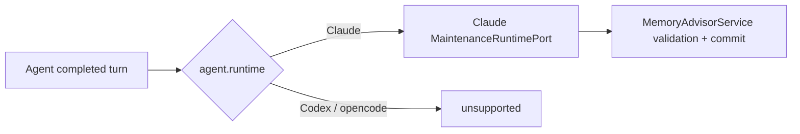
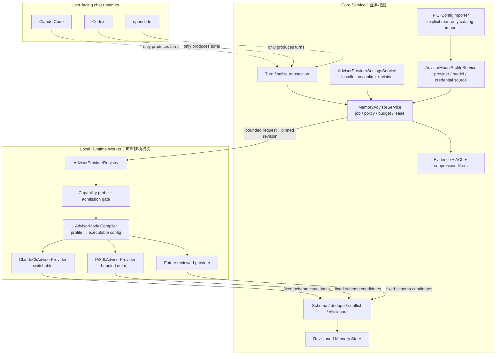
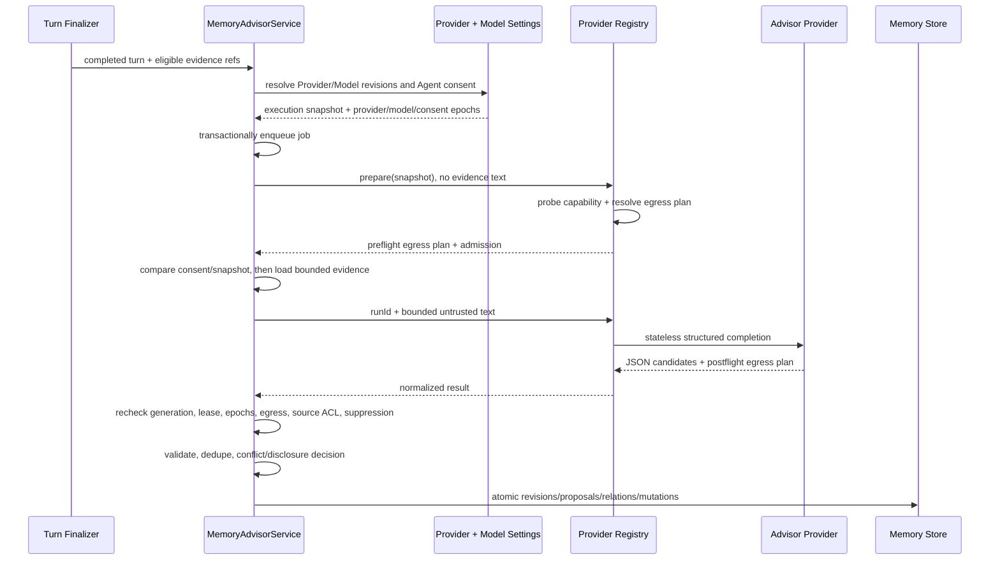
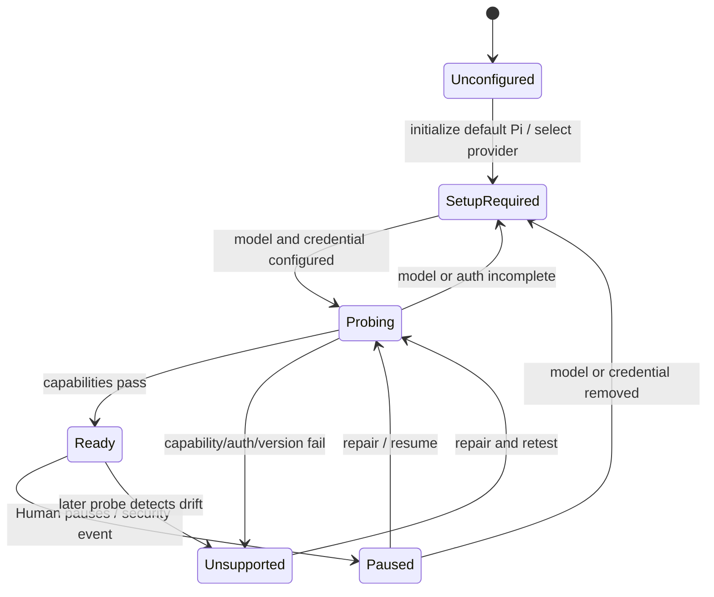
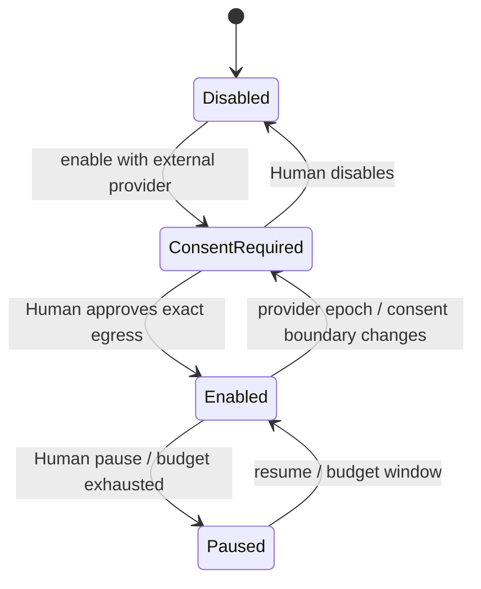
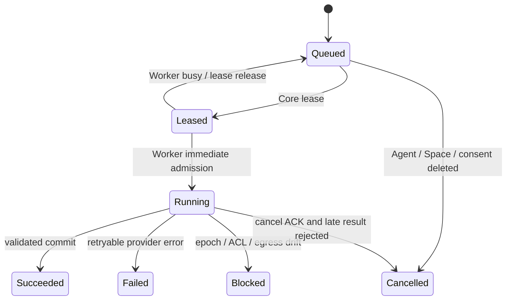

# Kith-space 系统级可替换 Memory Advisor Provider 方案设计

> 状态：Accepted / Implemented。2026-07-23按产品决策修订并完成切片0–4的代码、迁移、设置UI、自动化门禁与实现级验证；真实Desktop/Web验收记录在`docs/progress.md`。
> 日期：2026-07-22，2026-07-23修订。
> 适用范围：P-A10.6 已实现的结构化记忆 Advisor 执行层；不改变结构化记忆、文件记忆或聊天 Runtime Contract v2 的既有语义。
> 前置事实：P-A10原有Claude restricted maintenance保留为`legacy_runtime`回滚路径；`provider_v1`已使Claude Code、Codex、opencode聊天Agent在逐Agent授权后共用安装级Provider。普通对话、结构化记忆recall与Human管理不受Provider状态影响。
> 目标：把“由哪个受限执行器、模型供应商和模型提炼结构化记忆”从聊天Agent runtime中解耦；产品内置并默认选择Pi SDK Provider，Claude Code作为可切换Provider，同时提供独立的结构化记忆模型设置和安全的本地Pi CLI模型配置导入。

## 1. 决策摘要

Kith-space 采用以下目标结构：

```text
聊天 Agent runtime（Claude Code / Codex / opencode）
                    ≠
系统 Memory Advisor Provider（内置 Pi SDK，默认 / Claude CLI，可切换）
                    ≠
Advisor Model Profile（供应商 / 模型 / 凭据来源 / 数据目的地）
```

核心决策如下：

1. **Memory Advisor 是安装级系统能力，不是可见的普通 Agent。** 它没有头像、身份、频道 membership、DM、长期会话、消息发送权或自主任务循环。
2. **聊天 runtime 不再决定 Advisor 能否工作。** 同一个系统 Advisor Provider 可以处理来自 Claude Code、Codex、opencode Agent 的 eligible turn；聊天 Agent 的 session、工具和模型配置不被复用。
3. **Provider 只负责一次受限结构化 completion。** `MemoryAdvisorService` 继续拥有队列、ACL、证据、去重、冲突、suppression、revision、预算与事务；Provider 不拥有任何记忆业务规则。
4. **隔离必须由能力探测和真实测试证明。** 无工具、无 MCP、无持久 session、临时 cwd、项目自定义文件隔离、环境变量收敛均是硬门槛，不能仅靠 prompt 要求模型“不要调用工具”。
5. **内置Pi SDK并作为新安装默认Provider。** Kith-space精确锁定、打包并审计Pi SDK依赖；默认执行路径使用`@earendil-works/pi-ai`的统一completion能力，不启动完整Pi Coding Agent、agent loop、工具、session或资源加载器。Claude Code保留为可切换Provider。
6. **Provider和Model Profile正交。** Provider决定“由哪种本机执行器完成受限调用”，Model Profile决定“调用哪个模型供应商、模型、endpoint、凭据来源和数据政策”。切换聊天runtime不改变这两项；切换Provider也不应默默改模型。
7. **支持独立模型设置和Pi CLI配置导入。** Human可在系统设置中选择结构化记忆的模型供应商/模型；Kith可显式读取本机Pi CLI全局`settings.json`、`models.json`与`auth.json`来源，但配置发现、凭据兑换和模型执行分层，绝不加载项目`.pi`资源或执行`models.json`中的命令表达式。
8. **Provider、模型和完整出站计划分别可见并随 job 固定。** “使用Pi SDK”不等于“数据留在本机”；Pi可以继续调用云端或本地模型。设置、授权和审计必须显示实际执行器、模型、canonical endpoint、账号/租户、数据政策和全部允许出站目的地。
9. **外发前预检，Provider或Model Profile边界变化重新授权。** Adapter必须在读取evidence和发送正文前解析不可为unknown的`ResolvedEgressPlan`；Provider、模型、目的地、凭据身份、数据政策或关键隔离配置变更后，Agent进入`consent_required`。
10. **默认选择不等于默认外发。** 新安装在设置层默认选择`pi_sdk`，但没有兼容模型、凭据和consent时状态为`setup_required/consent_required`，不会读取或发送evidence。旧`enabled=1`不能转换为云端外发consent；现有记忆结果和recall不变。
11. **Advisor 故障继续 fail-open。** Provider 缺失、超时、返回非法 JSON 或授权过期不能阻塞聊天、消息持久化、结构化 recall 与文件记忆；只影响新的自动提炼。
12. **本提案不是 P-A10.8。** P-A10.0–P-A10.7 已收口；本方案作为独立的 Provider 解耦切片实施，也不吞并 P-A11 consolidation、P-A12 skill reconciliation 或 P-S1 sandbox/approval/Vault。

## 2. 为什么需要解耦

### 2.1 当前事实

P-A10.6 已把 Advisor 与用户可见的 runtime session 物理分开：

- `MemoryAdvisorService` 在 eligible completed turn 后持久创建 job；
- `MaintenanceRuntimePort` 提供受限结构化 completion；
- Claude maintenance 使用临时 cwd，并关闭工具、MCP、CLI 与 session 恢复；
- Provider 输出仍需经过 typed schema、source cap、ACL、secret/noise、suppression、dedupe、lease 与最终事务复核；
- Codex/opencode maintenance 因无法证明同等级隔离而返回 `unsupported`；
- recall、Human 管理和文件记忆本身是 runtime-neutral 的。

现有实现对工具/MCP/session采取了保守边界，但尚未证明最小env、临时HOME、可执行物完整性和完整进程树终止，不能直接宣称达到本提案的Provider能力门。其 admission 仍由 `agent.runtime` 决定，job 也固定聊天 Agent 的 runtime/model/config digest。这把两件本应独立的事耦合了：



### 2.2 直接为每个聊天 runtime 适配的成本

如果继续按聊天 runtime 扩展，需要分别维护：

- 无工具模式和工具事件拒绝；
- MCP、CLI、session、cwd、环境与项目配置隔离；
- JSON/schema 输出约束；
- timeout、取消、usage 与错误归一化；
- runtime 版本漂移与回归矩阵；
- 每个 Agent 对各自供应商的数据授权。

这些工作与“Agent 在频道里如何回复”没有直接关系。复制三份不仅维护成本高，还会让不同聊天 runtime 获得不一致的记忆质量和安全保证。

### 2.3 为什么不做成一个普通内置 Agent

普通 Agent 天然拥有身份、工作目录、runtime session、工具发现、频道/私聊和自主回复能力；Advisor 则只需要“读取 Core 提供的有界文本，返回固定 schema”。把它做成普通 Agent 会扩大权限面，并引入无关的会话污染、工具调用、消息错发和项目提示注入风险。

因此复用的是模型调用能力，不复用产品 Agent 实体。

## 3. 目标、非目标与约束

### 3.1 功能目标

- Human 在安装级设置中选择、探测和切换一个 Advisor Provider。
- 新安装默认选择内置`pi_sdk`，可切换为`claude_cli`；升级安装不会在未授权时静默切换实际数据处理方。
- Human独立选择结构化记忆的模型供应商、模型、thinking level和凭据来源；设置不复用聊天Agent的model字段。
- Human可显式导入本地Pi CLI全局模型目录与默认模型，并选择是否引用Pi CLI凭据。
- Claude Code、Codex、opencode 聊天 Agent 可在明确授权后共用该 Provider。
- Agent 记忆面板继续控制该 Agent 的 enabled/paused、预算、待处理和最近执行状态。
- UI 能区分“聊天 runtime”“Advisor 执行器”“实际模型/数据目的地”。
- 每个 job 固定 Provider 配置修订版，执行与写回时检测漂移。
- Provider 不可用时给出稳定、可诊断的原因，不阻塞对话和 recall。
- 后续增加 Provider 只实现窄接口与契约测试，不复制记忆领域逻辑。

### 3.2 非功能目标

- **最小权限**：Provider 只得到经过筛选的有界文本与不可反查的业务元数据。
- **可解释**：设置页、Agent 面板、job 审计均显示本次使用的执行器、模型和目的地。
- **可恢复**：Core/Worker 重启后 job 仍由固定执行快照、安装身份和授权epoch继续或明确等待授权，不静默换 Provider。
- **可移植**：Space 搬到新机器后保留结构化记忆和 recall；本机未配置 Provider 时只暂停自动提炼。
- **有界成本**：沿用现有批次、输入、输出、并发、超时、重试与日预算上限。
- **可替换**：Memory业务层不导入Claude、Pi、Codex或opencode SDK/事件类型；Pi依赖只存在于Provider/模型目录Adapter与打包边界。
- **供应链可复现**：Pi包使用精确版本和pnpm lock完整性固定，依赖lifecycle script默认禁用或逐项allowlist，审计npm tarball integrity与完整transitive graph；打包产物包含许可证/NOTICE与SBOM证据，不以`latest`作为运行时依赖。未签名构建只能证明“与本次build manifest一致”，不能宣称强防篡改。
- **安全诚实**：Provider 进程隔离、模型供应商数据边界与 OS 沙箱分别陈述，不把“无工具参数”夸大成完整操作系统沙箱。

### 3.3 非目标

- 不自研 LLM、agent loop 或统一聊天 runtime。
- 不让 Advisor 直接写 `MEMORY.md`、发送消息、修改 Agent 资料或执行任务。
- 不把文件记忆迁入结构化记忆；两层继续相辅相成。
- 不把完整Pi Coding Agent、TUI、扩展、skill、工具或session机制引入Advisor；只内置满足模型目录与受限completion所需的SDK包。
- 不把P-A11 Dream/consolidation、P-A12 skill reconciliation或P-S1 Vault捆入本切片。
- 不允许 Provider 自行查询完整消息历史；需要的 evidence 由 Core 在当前 ACL 下组装。
- 不承诺不同 Provider 对同一文本生成完全相同的候选。
- 不自动下载模型；Pi SDK作为应用依赖随Desktop打包，但模型服务、模型权重和外部凭据仍由Human选择与提供。

## 4. 术语与边界

| 术语 | 含义 | 不拥有的职责 |
| --- | --- | --- |
| Memory Advisor | eligible turn → candidate → validated mutation 的完整后台能力 | 不等同于模型调用器 |
| Advisor Provider | 执行一次受限结构化 completion 的可替换适配器 | 不做 ACL、去重、写库或调度 |
| Execution Adapter | Provider 的具体本机实现；首发为默认`pi_sdk`和可切换`claude_cli` | 不代表实际模型供应商 |
| Advisor Model Profile | 安装级结构化记忆模型配置：provider/model/API/endpoint/credential source/thinking/data policy | 不等于聊天Agent模型配置 |
| Pi CLI Config Import | 对本机Pi CLI全局配置的显式、只读、无命令执行导入 | 不把Pi项目资源或完整配置加载进执行进程 |
| Model Backend | 最终完成推理的模型服务或本地模型 | 不代表本机执行器 |
| Data Destination | 文本实际会离开本机到达的供应商/endpoint 分类 | 不能由“Pi/Claude”名称隐含推断 |
| Provider Revision | 一次安装级 Provider 配置与安全能力快照 | 不随普通聊天 runtime 配置变化 |
| Agent Consent | 某 Agent 获准把 eligible evidence 交给某个 Provider Revision | 不扩大该 Agent 的聊天/频道 ACL |

## 5. 目标架构



### 5.1 Core 的权威职责

Core 继续且唯一负责：

- eligible turn 判断与同事务 job enqueue；
- evidence 选择、source ref、typed actor、ACL 与 private projection；
- exclude lineage、secret/noise、source cap 与 suppression；
- Agent enabled/paused、每日预算、全局并发、lease、重试与 backoff；
- candidate schema 二次校验、canonical dedupe、conflict/replacement relation；
- active/proposed 决策、immutable revision 与原子事务；
- Agent/Space 删除、来源撤权、Provider 变更和 consent 的状态收敛；
- Provider设置、Model Profile、Pi CLI导入快照和凭据来源引用；
- 审计与 UI 查询。

Provider 返回的永远只是“不可信候选”，不能直接成为 active memory。

### 5.2 Worker 的职责

Worker 负责：

- 注册安装中可用的 Provider adapter；
- 通过`AdvisorModelCompiler`把Model Profile确定性编译为可执行配置；只允许枚举API kind、公开provider factory和allowlisted compat/header字段，未知或动态provider保持不可执行；
- 加载Desktop bundle内精确固定版本的Pi helper；不依赖系统是否安装`pi`CLI；
- 探测二进制/SDK/版本、认证和强制隔离能力；
- 在固定 revision 下执行 completion；
- 归一化 timeout、cancel、usage、stderr 与稳定错误码；
- 对 Provider 输出执行字节数和 JSON decode 门禁；
- 执行有界容量检查并立即admit或busy/reject，不持久排队、不打开业务数据库。

### 5.3 UI 职责

建议增加“设置 → Memory Advisor”安装级页面：

- 开关与当前 Provider；
- Provider选择：`Pi SDK（内置，默认）` / `Claude Code`；
- 独立的模型供应商、模型、thinking level和凭据来源设置；
- 模型来源：Pi内置目录、手工配置、本地Pi CLI导入；
- “从本机Pi CLI读取”操作、来源文件mtime/digest、最近导入时间、导入警告与刷新；
- 执行器版本、模型、数据目的地；
- 能力探测结果与最近探测时间；
- 需要重新授权的 Agent 数；
- “测试 Provider”仅发送内置无敏感样例；
- 切换 Provider 前明确列出数据边界变化。

模型编辑器不复用聊天Agent表单，首版字段固定为：

| 字段 | 交互与约束 |
| --- | --- |
| 配置来源 | `Pi内置目录` / `Pi CLI导入` / `手工配置`；来源切换只生成草稿，不改当前revision |
| 模型供应商 | 从来源目录筛选或手工填写稳定provider ID |
| 模型 | 可搜索下拉；手工endpoint允许填写model ID，不猜测或自动纠正 |
| API类型 | 从Provider兼容矩阵选择，如Anthropic Messages/OpenAI Responses；不兼容时阻止保存 |
| Endpoint | 展示规范化origin和网络分类；移除userinfo/query/fragment后再进入审计 |
| Thinking level | 复用锁定Pi版本支持的`off/minimal/low/medium/high/xhigh/max`语义，再按模型兼容矩阵裁剪；不支持时显示incompatible，不静默降级 |
| 凭据来源 | Kith secret、Pi CLI auth、获准env ref或keyless local；不在UI回显secret |
| 数据政策 | 展示供应商/endpoint对应的retention/training policy revision，unknown不能授权外发 |

Pi CLI导入完成后只把其中的`defaultProvider/defaultModel/defaultThinkingLevel`作为“建议选择”预填草稿；Human确认保存后才创建新的Model Profile revision。刷新Pi CLI目录只显示差异，不自动替换当前模型、endpoint或凭据来源。

“默认Pi”只表示新安装的Provider选择器初始值。若没有可用Model Profile或外部目的地未授权，页面显示`需要设置模型/需要授权`，Advisor不进入running。模型选择是安装级默认，不在首版增加每Agent模型覆盖，避免同一Provider产生大量不可解释的成本和授权组合。

Agent → 记忆页面继续显示：

- 该 Agent 的 enabled/paused、预算、pending、最近结果；
- 只读的当前系统 Provider 摘要；
- `consent_required` 时的确认入口；
- Structured / Files 两类记忆原有管理能力。

## 6. Provider 契约

### 6.1 建议接口

类型名称可按现有风格微调，但边界应保持窄而无业务语义：

```ts
export interface AdvisorProvider {
  descriptor(): AdvisorProviderDescriptor;
  probe(signal?: AbortSignal): Promise<AdvisorProviderProbe>;
  prepare(
    snapshot: ProviderExecutionSnapshot,
    credentialActivationHandle: string,
    signal: AbortSignal,
  ): Promise<PreparedProviderRun>;
  complete(
    request: ProviderExecutionRequest,
    signal: AbortSignal,
  ): Promise<AdvisorCompletionResult>;
}

// Generated from the exact-pinned provider compatibility matrix.
// Unknown/custom strings never become executable dispatch targets.
export type AdvisorApiKind =
  | "anthropic-messages"
  | "azure-openai-responses"
  | "bedrock-converse-stream"
  | "google-vertex"
  | "openai-responses"
  | "openai-completions"
  | "openai-codex-responses"
  | "google-generative-ai"
  | "mistral-conversations"
  | "pi-messages";

// Pi CLI custom/manual profiles are a narrower allowlist than bundled models;
// a value being in this union does not by itself make a descriptor executable.

export interface ProviderExecutionSnapshot {
  installationIdDigest: string;
  providerRevision: number;
  modelProfileRevision: number;
  providerEpoch: number;
  adapterId: string;
  adapterVersion: string;
  executableOrPackageDigest: string;
  sdkLockDigest?: string;
  executionSnapshotDigest: string;
  backendId: string;
  modelId: string;
  modelSource: "bundled_catalog" | "pi_cli_import" | "manual";
  modelSourceDigest: string;
  descriptorTrust: "bundled_verified" | "pi_cli_imported" | "manual";
  apiKind: AdvisorApiKind; // exact-version allowlist, never arbitrary runtime dispatch
  thinkingLevel: "off" | "minimal" | "low" | "medium" | "high" | "xhigh" | "max";
  canonicalOrigin: string;
  region?: string;
  tenantOrProjectDigest?: string;
  credentialIdentityDigest: string;
  dataPolicyRevision: string;
  dataPolicyProvenance: "vendor_verified" | "human_asserted" | "unknown";
  networkClass: "loopback" | "lan" | "public_cloud" | "custom";
  providerSchemaVersion: number;
  allowedEgress: string[];
  sanitizedConfig: Record<string, unknown>;
  configDigest: string;
  capabilityDigest: string;
}

export interface ResolvedEgressPlan {
  adapterId: string;
  adapterVersion: string;
  executableOrPackageDigest: string;
  backendId: string;
  modelId: string;
  canonicalOrigin: string;
  region?: string;
  tenantOrProjectDigest?: string;
  credentialIdentityDigest: string;
  dataPolicyRevision: string;
  proxy: "none" | "declared";
  networkClass: "loopback" | "lan" | "public_cloud" | "custom";
  resolvedAddressDigest: string;
  redirectPolicy: "reject" | "same_origin_only";
  allEgress: string[];
  configDigest: string;
}

export interface PreparedProviderRun {
  localHandle: string;
  preflight: ResolvedEgressPlan;
}

export interface ProviderExecutionRequest {
  runId: string;
  snapshot: ProviderExecutionSnapshot;
  preparedRun: PreparedProviderRun;
  contractId: "memory_advisor_v1";
  schemaVersion: number;
  policyVersion: number;
  untrustedTranscript: string;
  maxOutputBytes: number;
}

export interface AdvisorCompletionResult {
  rawJson: unknown;
  usage?: { inputTokens?: number; outputTokens?: number };
  postflight: ResolvedEgressPlan;
}
```

Core从app.db解析revision后，经Core→Worker控制面传递不可变`ProviderExecutionSnapshot`；Worker不打开app.db，也不能只凭一个revision整数查内存中的“当前配置”。Durable revision/job只保存`credentialIdentityDigest`，不保存实际凭据或可兑换引用。每次run由Core通过窄`ProviderCredentialPort`向Desktop本机secret来源申请短时、单次、绑定`runId + providerEpoch + Worker generation + executionSnapshotDigest + expiry`的`credentialActivationHandle`；该handle只作为独立本机控制字段交给Worker，不进入job、日志或远端payload。Worker兑换后只注入本次Provider helper的allowlisted credential环境，身份摘要不一致即fail-closed，并在run结束/取消/过期时销毁`localHandle`与凭据副本。

`prepare()`不得读取evidence或发起携带正文的网络请求，它先把显式参数、allowlisted env、凭据身份、代理和endpoint解析为`ResolvedEgressPlan`，返回的`PreparedProviderRun.localHandle`只在本机Worker当前generation内有效。Core逐项比较consent/job快照后才允许组装并传递正文；任何unknown、额外egress或漂移都在外发前fail-closed。`postflight`只是防执行中漂移的二次审计，不能被描述成首次泄露防线。

`ProviderExecutionRequest`是本机调度契约，不等于远端payload。Adapter发送给模型的`ModelCompletionPayload`只允许versioned system instruction、bounded transcript和固定output schema；`runId`、Agent/Space/source ID、revision/digest、ACL与consent元数据全部留在本机。请求也不携带Space路径、Agent token、Gateway credential、频道membership或数据库连接，Provider无权请求更多上下文。

### 6.2 必须证明的能力

```ts
export interface AdvisorProviderCapabilities {
  structuredOutput: "json_schema" | "validated_json" | "none";
  toolIsolation: "enforced" | "unsupported";
  mcpIsolation: "enforced" | "unsupported";
  sessionPersistence: "disabled" | "unsupported";
  ephemeralCwd: "enforced" | "unsupported";
  projectCustomization: "disabled" | "unsupported";
  environmentIsolation: "allowlist" | "unsupported";
  cancellation: "supported" | "unsupported";
  usage: "exact" | "estimated" | "unavailable";
}
```

可选中 Provider 的最低门槛：

- `structuredOutput !== none`；
- tool、MCP、ephemeral cwd 与 environment isolation 全部为强制状态；
- session persistence 和 project customization 明确关闭；
- cancellation必须supported，且可等待完整进程树或SDK task终止；
- timeout/kill 后不存在可继续调用工具或写回文件的后台子进程；
- 实际版本通过对应 adapter 的 contract fixture。

任何 `unknown`、只靠 prompt、只在文档声称而未被 adapter 测试证明的能力都按 `unsupported` 处理。没有P-S1网络沙箱时，`ResolvedEgressPlan`仍只是adapter声明、显式配置与凭据校验，不是网络层强制；UI必须如实提示这一点。

### 6.3 稳定错误码

| 错误码 | 含义 | 行为 |
| --- | --- | --- |
| `provider_unconfigured` | 未选择 Provider | Advisor 暂停，聊天继续 |
| `provider_unavailable` | 二进制/SDK/endpoint 不可用 | 可重试并显示诊断 |
| `provider_capability_failed` | 隔离能力未达标 | fail-closed 禁止执行 |
| `provider_auth_required` | 缺少模型认证 | 暂停并引导设置 |
| `provider_model_setup_required` | 默认Pi已选中但没有兼容Model Profile | 不创建run，提示选择/导入模型 |
| `provider_model_incompatible` | Provider不支持当前Model Profile/API | fail-closed，保留原revision |
| `provider_model_config_changed` | Pi CLI配置快照与固定digest不符 | 不外发，提示刷新并确认新revision |
| `provider_credential_command_unsupported` | Pi配置依赖`!command`解析secret/header | 不执行命令，提示改用受支持凭据来源 |
| `provider_consent_required` | Agent 未同意当前 revision | 不读取 evidence、不外发 |
| `provider_revision_changed` | 排队/执行时配置漂移 | 当前 job 不静默改道 |
| `provider_timeout` | Provider超时 | 依既有 backoff重试 |
| `provider_cancelled` | Human撤权/切换、Agent/Space删除或shutdown导致取消 | 不自动重试；等待新状态明确重新入队 |
| `provider_invalid_output` | 输出超限或 schema 非法 | 丢弃结果并记录 |
| `provider_preflight_destination_mismatch` | 外发前backend/endpoint/egress与授权快照不一致 | 不读取/发送evidence，暂停Provider |
| `provider_postflight_destination_mismatch` | 调用中解析值发生漂移 | 丢弃结果、暂停Provider并记录安全事件 |

## 7. 设置、数据模型与授权

### 7.1 安装级设置

建议在下一次 app.db migration 中增加单例设置与 append-only revision，而不是把配置复制进每个 Space：

```text
advisor_provider_settings
  singleton_id
  installation_identity_digest
  execution_mode            # legacy_runtime | migrating | provider_v1
  enabled
  current_provider_revision
  current_model_profile_revision
  provider_epoch
  revocation_epoch
  updated_at

advisor_provider_revisions
  revision
  adapter_id
  adapter_version
  executable_or_package_realpath
  executable_or_package_digest
  sdk_lock_digest
  sanitized_config_json
  config_digest
  capability_digest
  created_at

advisor_model_profile_revisions
  revision
  source_kind              # bundled_catalog | pi_cli_import | manual
  source_snapshot_digest
  descriptor_trust         # bundled_verified | pi_cli_imported | manual
  backend_id
  model_id
  api_kind
  thinking_level
  canonical_origin
  region
  tenant_or_project_digest
  credential_source_kind   # pi_cli_auth | kith_secret | env_ref | keyless_local
  credential_identity_digest
  provider_schema_version  # typed env/auth/config allowlist revision
  data_policy_revision
  data_policy_provenance   # vendor_verified | human_asserted | unknown
  network_class            # loopback | lan | public_cloud | custom
  allowed_egress_json
  model_metadata_json      # context/max output/cost/compat，无secret
  created_at

pi_cli_config_imports
  id
  config_root_digest
  catalog_digest           # canonical redacted descriptor hash
  secret_source_identity   # installation-keyed HMAC, not raw file hash
  imported_catalog_json    # 已脱敏的provider/model descriptor
  warnings_json            # enum code + JSON pointer only, no source value/snippet
  imported_at
```

Provider revision只描述本机执行器，Model Profile revision只描述模型与数据边界；两者共同组成`ProviderExecutionSnapshot`。Pi SDK是新安装的默认Provider revision，Model Profile必须从可用模型目录中独立建立，不能回退到聊天Agent模型。

凭据不进入这些表的JSON、日志、job或Space数据库；`credential_identity_digest`使用安装级keyed HMAC，只表明账号/租户边界是否变化。凭据本身只保存对Desktop secret来源或Pi CLI credential source的opaque handle。若P-S1 Vault尚未实现，沿用受限本机来源但明确其技术债。可执行物、SDK依赖或Model Profile变化必须创建新revision并重新probe；是否需要重新consent可另行判断，但不能免除job pinning和能力验证。

切换或撤权先在app.db单事务提升`provider_epoch/revocation_epoch`，立即禁止旧epoch的新租赁，再异步逐Space收敛。app.db与多个workspace.db之间不存在跨库原子事务，文档和实现都不得声称该过程原子；任一镜像epoch不确定或落后时，默认不执行、不写回。

Core增加安装级`ProviderEpochGate`读写屏障：Provider设置变更持写锁提升app.db epoch并关闭旧epoch；run admission、evidence外发和最终workspace提交持读锁。最终提交在同一读锁内复核app.db当前epoch、workspace镜像epoch与consent epoch后完成workspace事务，设置变更不得插入“最终复核→提交”间隙。Core重启后，在app/workspace epoch收敛完成前gate默认关闭。该屏障只保证本机单Core进程的时序，不把多个SQLite数据库描述成原子事务。

### 7.2 Pi SDK依赖与模型目录

Desktop bundle精确固定经审查的`@earendil-works/pi-ai`版本与完整依赖lock，使用其公开的Models/provider factory一轮completion API、统一多Provider模型类型、`models-store`和credential-store完成调用与目录适配；Advisor不需要agent loop，因此不引入`@earendil-works/pi-agent-core`或`@earendil-works/pi-coding-agent`，也不调用`createAgentSession()`。Pi CLI的`settings.json`只按Kith allowlist schema解析，模型与凭据兼容优先使用`pi-ai`公开导出，不复制Pi私有实现。

锁定0.81.1时不得从根入口调用旧的顶层`completeSimple()`或依赖`/compat`。实现契约固定为`createModels({ credentials })`，按明确兼容矩阵注册`@earendil-works/pi-ai/providers/*`公开factory，通过`models.getModel(...)`取得模型，再调用`models.completeSimple(model, context, options)`。若实施时选定的精确版本API不同，必须在切片0更新本段和contract fixture，不能以私有deep import或compat层凑合。

截至2026-07-23，Pi主仓库package manifest显示`@earendil-works/pi-ai`为0.81.1且MIT许可，其公开入口导出模型、models-store与credential-store；正式实施不直接写“latest”，而是在实现时选择已发布、通过依赖审计和packaged smoke的精确版本，锁入`package.json`与`pnpm-lock.yaml`，并同步`NOTICE`、第三方许可证清单和打包SBOM。[Pi官方仓库](https://github.com/earendil-works/pi)、[pi-ai公开入口](https://github.com/earendil-works/pi/blob/main/packages/ai/src/index.ts)、[pi-ai package manifest](https://github.com/earendil-works/pi/blob/main/packages/ai/package.json)

Pi SDK内建模型目录、Claude可用目录、Kith手工Model Profile和Pi CLI导入目录统一投影成只读`AdvisorModelDescriptor`，再由Human保存为revision。`catalogVisible`与`advisorExecutable`分开标识：只有能被`AdvisorModelCompiler`编译为公开provider factory、枚举API kind和allowlisted config的descriptor才能保存为可执行Profile；extension/dynamic provider、未知compat或命令式配置显示为不可兼容。每个provider-specific typed env/auth/config schema有单调版本，并进入Model Profile与`capabilityDigest`；规则变宽不能让旧Profile自动获得更多字段。目录变化不自动改当前revision；刷新只提示“有更新”，由Human确认后切换。

`AdvisorModelCompiler`是纯函数边界：输入不可变Model Profile，输出`CompiledAdvisorModelConfig`（公开provider factory ID、normalized model、base origin、allowlisted compat/options/headers和credential slot）或稳定`provider_model_incompatible`。首版API kind使用显式枚举，不接受任意字符串；编译结果不含secret、不访问文件/环境/网络，也不执行Pi CLI resolver。Provider probe和真实run必须使用同一compiler/version/digest，避免“设置页可保存、helper却用另一套解释”。

### 7.3 本地Pi CLI配置导入

默认探测Pi全局配置根`~/.pi/agent`，也识别Human显式选择的目录和受控`PI_CODING_AGENT_DIR`覆盖。探测只报告“存在可导入配置”，Human确认前不解析文件。确认后只读取以下全局文件：

- `settings.json`：只导入`defaultProvider`、`defaultModel`、`defaultThinkingLevel`和`enabledModels`提示；
- `models.json`：由Kith有界JSON/schema解析器导入provider/model/API/baseUrl/compat/context/maxTokens/cost等模型描述；不调用会解析credential command/env的Pi运行时加载路径；
- `auth.json`：只在Human选择“使用Pi CLI凭据”后，由Kith纯数据解析器读取所选provider，再复制当前未过期凭据到本次run的in-memory credential activation；绝不调用Pi credential resolver、OAuth refresh/login hook，不把file-backed store指向原文件，也不复制原文到app.db；
- Pi内建/动态catalog可通过当前精确版本`pi-ai`公开的models/models-store接口以offline、无刷新模式读取；不直接依赖磁盘中的私有`models-store.json`schema。

导入器不读取项目`<space>/.pi/settings.json`、trust、extensions、packages、skills、prompts、themes、sessions或context files，也不合并当前Space cwd。Pi官方说明全局与项目settings可叠加，而`DefaultResourceLoader`会发现扩展/skill/context；这些行为适合Pi CLI，不属于Advisor导入语义。[Pi Settings](https://pi.dev/docs/latest/settings)、[Pi SDK](https://pi.dev/docs/latest/sdk)

`models.json`和`auth.json`的credential/header字段可能是literal、`$ENV`插值或`!command`，`auth.json`还可能包含provider-scoped env；Pi CLI会在请求时解析部分命令/环境语义。Kith在加载任何Pi模块前先用自有JSON/schema解析器递归检查所有credential、header、OAuth/custom-provider嵌套字段，只记录安全的credential source类型，禁止命令、复合插值、OAuth刷新、provider hook、shell、扩展或网络副作用：[Pi Providers](https://pi.dev/docs/latest/providers)、[Pi Custom Models](https://pi.dev/docs/latest/models)

| Pi配置值 | Kith导入行为 |
| --- | --- |
| 无secret的provider/model字段 | 脱敏导入目录，可保存为Model Profile |
| `$ENV_VAR` / `${ENV_VAR}` | 只接受完整值严格匹配单一引用；仅保存通过provider-specific allowlist且不在Kith denylist中的变量名 |
| `!command` | 标记`credential_command_unsupported`，不得执行；Human需改用Pi auth、Kith secret或env ref |
| literal API key/header | 目录中只显示“literal secret present”；不写入导入快照，运行时经单次凭据activation从原文件读取 |
| `auth.json` API/OAuth | Human显式选择provider后只读引用；首版只接受当前未过期、可纯读取的token，过期时提示回Pi CLI `/login`，不刷新、不登录、不写回 |
| `auth.json.env` | 不透传；只按provider-specific typed schema提取必要字段，拒绝`NODE_OPTIONS`、PATH/HOME/USERPROFILE/XDG、shell/npm/Electron与Kith内部变量；proxy单独进入egress plan |
| keyless local endpoint | 允许`keyless_local`，但仍需preflight canonical origin和loopback/网络边界 |

env引用只支持完整值正则`^\$[A-Z_][A-Z0-9_]*$`或`^\$\{[A-Z_][A-Z0-9_]*\}$`；复合插值、转义、literal+env混合全部unsupported，不能复用Pi resolver做“先解析后检查”。

导入不是持续共享可变配置：每次刷新生成新`pi_cli_config_imports`快照，Model Profile固定该快照digest。`catalog_digest`只哈希canonical redacted descriptor；含secret文件或字段只生成安装级keyed HMAC的`secret_source_identity`，不得持久化原文件裸哈希。warnings/schema error只保存枚举码和JSON pointer，不含值、原始行、parser snippet、URL userinfo/query。原文件变化会使preflight进入`model_config_changed`，不会静默采用新endpoint、headers、credential或模型。

导入的provider ID、display name与真实origin分开保存。`pi_cli_imported`或`manual`描述符始终显示“导入/自定义”，不能继承内置供应商品牌徽标；`dataPolicyProvenance`必须明确为vendor verified、Human asserted或unknown。unknown不生成伪造policy revision，外部目的地首版保持不可授权，直到Human选择有可审计政策的配置。

### 7.4 每 Agent 设置与 consent

workspace 中现有 `memory_advisor_settings` 保留 enabled/paused、预算与新鲜度语义，并增加或配套保存：

```text
approved_provider_revision
approved_model_profile_revision
approved_provider_epoch
approved_egress_digest
consent_epoch
consent_purpose
consent_source_scope_json
consent_at
consent_actor_id
```

`consent_epoch`是Agent内单调CAS值，每次授权、撤回或改变授权边界都递增；job必须固定该值，防止“撤回后又授权同一Provider revision”让旧迟到结果重新合法。`enabled`只表示用户希望启用Advisor，不构成外发授权。

对任何`vendor_cloud`或`custom_endpoint`，新建Agent与迁移Agent都默认`consent_required`。确认界面至少显示并固定：`purpose=memory_advisor_v1`、允许的公开频道/私有频道/DM来源范围、vendor、canonical endpoint、region、tenant/project/account fingerprint、模型、proxy/allowed egress和data retention/training policy revision；同时说明撤回只阻止未来处理，不能保证删除供应商已经保留的数据。旧`enabled=1`不得自动转换为consent，除非未来能证明存在覆盖完全相同目的地、用途与数据政策的历史授权记录。

`consent_source_scope_json`是独立于Agent surface ACL的强制授权谓词，不是展示字段。enqueue、evidence load、batch compatibility与最终提交都逐条解析source的surface kind/visibility，并要求属于固定consent scope；Agent ACL可见但consent未授权的DM、私有频道或其thread正文不得进入transcript。job/run固定source-scope digest，scope改变必须递增consent epoch。

授权粒度选择“Provider revision + Model Profile revision + provider epoch + egress digest + consent epoch”，而不是只存`providerId`。以下变化需要重新授权：

- adapter 从 Claude CLI 切到 Pi；
- Model Profile、Pi CLI配置快照或credential source变化；
- backend/vendor/endpoint 变化；
- 模型变化导致数据目的地或保留政策变化；
- 隔离策略、项目配置发现或环境变量策略变化；
- 从本地模型切到云模型。

仅升级经过兼容列表验证、且backend/model/egress/credential identity/data policy/能力摘要均未变化的adapter patch，可由实现阶段另立精确规则免除重复确认；所有可执行物变化仍必须重新probe并固定新revision，默认仍以重新授权为准。

### 7.5 job 固定快照

现有 job 已保存 provider/model/config digest。目标态将其解释为 Advisor Provider 快照，并补足：

- `provider_revision`；
- `model_profile_revision` / `pi_cli_import_digest`；
- `provider_epoch` / `installation_id_digest`；
- 完整`ProviderExecutionSnapshot`及摘要；
- `capability_digest` / `policy_version`；
- `agent_consent_epoch`。

跨job batching由独立的`advisor_provider_runs`表示一次真实模型调用：run固定execution snapshot、provider/consent epoch、policy、`batch_job_ids`、实际usage/latency/error；job只引用run。batch兼容键必须包含完整provider/backend/model/egress/capability/policy/consent epoch，同一个run不能混合不同Agent或授权边界。日预算按distinct run的真实usage结算，不能把同一份usage复制给每个job后重复计费。

Core是唯一durable scheduler和lease/retry权威；Worker Provider runner不再维护第二个排队队列，只能立即`admitted`或以`busy/rejected`返回。Core只在admitted后启动/续租run，固定Worker generation；cancel必须得到进程树/task结束ACK，旧generation或过期run的结果一律拒绝。这样避免Worker排队时间消耗Core lease并导致重复执行。

读取evidence前、外发前和Provider返回后的最终写事务中都比较固定epoch/snapshot。任一不一致时不把旧job静默交给新Provider；它进入`blocked_provider_changed`或`blocked_consent_changed`，待Human授权后由新job重新读取当前ACL下的evidence。

### 7.6 可移植 Space

Space 数据库跟随文件夹移动，但安装级 Provider 不跟随：

- canonical memory、revision、evidence、suppression 与 recall 正常可用；
- 旧 job 的历史审计保留；
- consent/job同时固定不可移植的installation identity digest；Space被另一安装实例attach/relocate时，事务性清空本地授权并把未完成job标为`blocked_installation_changed`，不因revision数字或配置摘要碰巧相同而自动外发；
- 本机配置 Provider 且 Human 为各 Agent 授权后，才从当前仍可见 evidence 生成新 job。

## 8. 生命周期与时序

### 8.1 正常提炼



Provider 调用不在聊天 turn 的关键路径上。消息、reply、usage 和 turn terminal 先完成；Advisor 延迟或失败不会延迟 UI 回复。

### 8.2 三个正交状态机

Provider是安装级状态，Agent Advisor是每Agent状态，run/job是执行状态。三者不能合并：Provider可以ready，同时Agent A已授权、Agent B等待授权、Agent C暂停。

#### Provider 状态



#### Agent Advisor 状态



#### Job / Provider run 状态



### 8.3 撤权、删除与并发

- 来源 membership 在执行中被撤销：Provider 返回后 ACL 复核失败，相关 candidate 不提交。
- Human 删除或 forget+suppress：仍沿用现有 suppression，后续 job 不能从保留来源重新学习同一 claim。
- Agent 被删除：取消 queued/running job，迟到返回不可写入。
- Space 失联/删除：单 Space 失败不阻断其他 Space 的 Provider 队列。
- Provider切换先提升全局epoch并禁止旧epoch新租赁；已有running run收到cancel，无法在外发前取消的调用其迟到结果仍不写入并记录外部处理可能已经发生。
- 同一 turn 重试：沿用稳定 source/job 幂等键，不因 Provider transient retry 重复创建 revision。

## 9. 内置Pi SDK默认Provider

Pi官方把`@earendil-works/pi-ai`定义为统一多Provider LLM API，把agent loop和Coding Agent CLI放在独立包中；仓库采用MIT许可，但Pi本身不提供文件、进程、网络或凭据sandbox。[Pi官方仓库](https://github.com/earendil-works/pi)、[Pi Security](https://pi.dev/docs/latest/security)、[pi-ai README](https://github.com/earendil-works/pi/blob/main/packages/ai/README.md)

Kith-space因此内置Pi的模型SDK能力，而不是内置一个拥有工具的普通Agent：

```text
PiSdkAdvisorProvider（新安装默认）
  ├─ Kith-owned helper process
  ├─ exact-pinned @earendil-works/pi-ai
  ├─ models.completeSimple() one-shot completion
  ├─ no AgentSession / no agent loop / no tools
  ├─ immutable AdvisorModelDescriptor
  ├─ one-run credential activation
  ├─ fixed system instruction + validated JSON result
  ├─ no ResourceLoader / extension / skill / context discovery
  ├─ temporary HOME/cwd + allowlisted environment
  └─ explicit preflight backend/model/egress resolver
```

`pi_sdk`在Provider registry中是内置且始终可发现的Adapter；“可用”仍要求bundle完整性、Node/Electron helper兼容、Model Profile、凭据和egress preflight全部通过。若任一硬门失败，它显示`setup_required/unsupported`而不是回退到聊天Agent模型或静默切Claude。Claude Code由Human显式切换，切换产生新Provider revision和consent检查。

### 9.1 为什么直接使用pi-ai而不是完整Pi Agent

Advisor只需要一次completion。锁定版本使用`createModels()`、显式provider factory、`models.getModel()`与`models.completeSimple()`，没有必要创建`AgentSession`。这从实体上消除了Coding Agent默认read/write/edit/bash工具、session恢复、ResourceLoader、项目trust和扩展发现，而不是用`noTools`参数关闭一套本来就不需要的agent loop。Pi SDK官方提供统一model API和AbortSignal语义，Provider仍把输出当不可信JSON并走Kith validation。[pi-ai统一接口](https://github.com/earendil-works/pi/blob/main/packages/ai/README.md)

模型目录与凭据读取只使用精确锁版的`pi-ai`公开exports或Kith自有的有界JSON解析器。首版不引入`pi-coding-agent`；如果未来某项兼容只能由该包提供，必须单独立项、证明无法用更小依赖完成，并继续禁止AgentSession、ResourceLoader、工具与项目发现进入helper。

### 9.2 helper隔离

“内置SDK”不等于把Provider直接嵌进共享Worker进程。Node进程的`process.env`和cwd是共享状态，不能按job安全切换；首版每个run启动一个Kith-owned helper，传入allowlisted env、专用临时HOME/USERPROFILE/XDG与临时cwd，完成或取消后退出，不做进程复用。不得在共享Worker中使用`process.chdir()`或改写全局`process.env`。

Helper只接收固定Model Profile、一次credential activation和bounded transcript，不拥有app/workspace DB、Kith Gateway token或Pi CLI配置路径。Pi CLI文件读取发生在Desktop目录/凭据Adapter，结果经过脱敏快照或in-memory credential activation后再进入helper。

Desktop读取Pi CLI配置时先对获准root和目标文件做no-follow打开、regular-file/owner/permission/1MiB校验，再从同一个file descriptor读取并计算digest；不得“先stat路径、再按路径重开”。literal secret或auth只在run activation阶段从已验证descriptor读取所需字段，读取后再次核对文件identity/digest，任何变化都销毁activation并返回`provider_model_config_changed`。

`VerifiedConfigFileReader`固定canonical root identity，逐路径组件拒绝symlink（Windows拒绝reparse point），只接受当前用户拥有且非group/world-writable的regular file；从同一打开句柄完成fstat-before/read/fstat-after，解析、摘要和secret提取来自同一buffer。运行时重读在`ProviderEpochGate`内重做完整验证，同时比较source snapshot、secret source identity、credential identity和Model Profile revision，签发activation后不得再按路径取secret。

Helper只接受Kith注入的in-memory credential store或显式request auth，禁止provider回退到ambient env、共享profile、AWS credential chain、Google ADC、IMDS或隐式OAuth refresh。每种provider/API必须有认证能力矩阵；无法关闭ambient auth或无法枚举认证egress时标记unsupported。首版OAuth只接受未过期access token；刷新交给Human回Pi CLI完成，不进入helper。

helper作为独立`pi-advisor-helper.mjs` esbuild entry输出到`desktop/dist/runtime`并随Desktop extraResources打包。开发态用当前Node启动；打包态使用`process.execPath`与`ELECTRON_RUN_AS_NODE=1`，通过`import.meta.url`或Desktop传入的绝对资源路径定位，不依赖cwd/PATH或系统Node。完整性摘要针对实际打包artifact；unpacked与NSIS smoke覆盖启动、取消、缺失、替换和版本不兼容。Pi锁定版本要求的Node最低版本（0.81.1为`>=22.19.0`）进入`package.json engines`、CI/开发前置检查和packaged probe；esbuild的`node22` target不替代运行时版本门禁。

网络预检把origin与`loopback/LAN/public_cloud/custom`分类一并固定。外部模型只允许HTTPS，或Human明确选择的HTTP loopback；禁止URL userinfo，query/fragment不得承载credential。HTTP client禁止自动跨origin redirect；任何redirect默认拒绝并需重新preflight。连接时绑定解析IP与授权分类：public cloud拒绝loopback/private/link-local/metadata地址，loopback配置必须最终连接loopback；DNS rebinding、proxy、Unix socket和custom dispatcher均进入能力/egress矩阵，无法约束时unsupported。

### 9.3 Pi adapter验收门

- Desktop在没有系统`pi`命令时仍可使用内置Pi Provider；删除/升级本机Pi CLI不影响bundle内SDK；
- 依赖使用精确版本、tarball/lock/transitive integrity和lifecycle-script allowlist，packaged产物能显示Pi版本/许可证/SBOM/build manifest；未签名包不声称防篡改；
- fixture目录中的`AGENTS.md`、`.pi/settings.json`、skill、extension和secret均不被读取；
- Provider依赖图不包含AgentSession、ResourceLoader、工具注册或session persistence；第二个job不继承第一个job文本；
- 首版源码和esbuild metafile/打包产物依赖图均不包含`pi-coding-agent`或`pi-ai/compat`；只使用锁定版本公开exports/provider factory；
- Provider只收到Core传入的文本，不能主动查询消息、文件或Gateway；
- timeout/cancel后helper进程树或SDK task全部结束；
- 环境仅含显式allowlist，Kith internal credential不可见；
- 假IMDS、AWS profile、Google ADC、ambient provider env和OAuth refresh端点均不会被helper探测；`auth.json.env.NODE_OPTIONS/PATH/HOME/proxy`不能作为普通环境透传；
- 共享Worker的`process.env`/cwd不因job被修改；
- backend/model/egress与Model Profile一致，proxy/endpoint变化触发preflight mismatch；
- redirect、DNS rebinding、loopback/LAN/link-local/metadata分类和custom dispatcher夹具不能绕过egress；
- invalid JSON、tool-call stop reason、超限输出和异常对象均被拒绝且日志脱敏；
- Windows、macOS、Linux的bundle、helper启动、缺失凭据和版本漂移可诊断；
- 本地Pi CLI导入夹具覆盖literal/env/command/OAuth/keyless配置，`models.json`和`auth.json`所有嵌套位置的`!command`执行次数必须为0，过期OAuth不刷新/不写回。

只有以上门禁通过，Pi才能作为发行版默认Provider；门禁失败时保持选中但不可运行，并向Human解释修复动作，不自动切换到Claude或其他模型。

## 10. 兼容迁移

### 10.1 迁移原则

- 先抽象，后扩范围；
- 新安装把`pi_sdk`写为默认Provider选择；若没有Model Profile/凭据/consent则停在setup，不自动选择聊天模型；
- 既有安装不把正在使用的Claude数据处理方静默切成Pi：升级后保留legacy Claude直到Human完成Provider/Model Profile cutover，设置页把Pi标为新的推荐默认；
- 所有pre-existing app.db迁移时显式写`execution_mode=legacy_runtime`；不能用“Provider表/行不存在”判断fresh install；
- 只有Desktop fresh bootstrap在Human/Home初始化后写`execution_mode=provider_v1 + current_provider=pi_sdk + setup_required`；
- 既有安装显式cutover走持久`legacy_runtime → migrating → provider_v1`：事务先提升epoch、停止新的legacy enqueue/lease，取消queued/running legacy job并等待本机cancel ACK（已发生的外部调用只丢弃迟到结果并审计），完成后才允许Pi新job；崩溃恢复继续收敛`migrating`，不靠内存flag；
- Human激活Pi后，所有新job使用Pi；旧failed job不跨Provider重放，当前recall不退化；
- 不因升级而自动把 Codex/opencode Agent 的历史消息发送给 Claude；
- 不重写已完成 job 的审计事实；
- 不把旧 `unsupported` job 批量跨 Provider 重放。

### 10.2 现有数据映射

| 现有状态 | 迁移行为 |
| --- | --- |
| 全新安装 | `current_provider=pi_sdk`；没有Model Profile时`setup_required`，不外发 |
| 已安装Claude Agent + Advisor enabled | legacy Claude继续到显式cutover；Pi显示推荐默认；旧`enabled`不转换为Pi或新云端consent |
| Codex/opencode Agent + unsupported | 保留历史状态；提示可授权系统 Provider，不自动开启 |
| cutover前queued/running Claude job | 进入`migrating`后停止新lease并取消；已外发但无法撤回的run结果不写入并留下审计，不交给Pi/新Model Profile |
| completed/failed job | 原样保留 provider/model/config 审计，不重写 |
| active/proposed memory | 完全不变；其真实性仍由 evidence/revision 决定 |
| 发现本机Pi CLI目录 | 只提示可导入；Human确认前不读取auth、不执行配置值、不改变模型 |
| Pi bundle损坏/模型或认证缺失 | Advisor setup/暂停；可切Claude，聊天、recall、文件记忆继续 |

### 10.3 回滚

每个切片保留清晰回滚：

- 切片0/1可回退到当前`MaintenanceRuntimePort`路径，不改业务结果；
- 引入 app/workspace migration 后只回滚执行开关，不回滚已迁移数据库版本；
- 跨 runtime 覆盖可按 Agent consent 独立关闭；
- `execution_mode=migrating`崩溃后必须先完成旧job cancel/epoch收敛；回滚只能显式回`legacy_runtime`并重新启用legacy admission，不能同时开放两条路径；
- Pi Provider可从registry禁用或显式切回Claude，不影响结构化记忆本身；已固定Pi job不得在回滚后由Claude执行。

## 11. 实施切片

### 切片 0：契约、依赖与供应链基线

交付：

- 冻结当前 Claude maintenance 输入、输出、timeout、错误与安全夹具；
- 建立 `AdvisorProvider`、descriptor/capability/probe 类型和 registry；
- 建立 provider-neutral contract suite与`AdvisorModelCompiler`契约；
- 选择并冻结经审计的Pi SDK精确版本、公开export/import path、Node/Electron ESM/打包兼容、license/NOTICE、依赖lock与bundle体积基线；禁止依赖未导出的私有源码路径；
- 记录当前 Claude/Codex/opencode 行为基线。

验收：无 schema、UI、数据或运行行为变化。

### 切片 1：Provider/Model Profile控制面与Pi CLI导入

交付：

- app.db Provider/Model Profile/import revision migration；
- workspace Agent consent/job snapshot/provider run migration；
- fresh bootstrap与pre-existing app.db分别初始化`provider_v1 + pi_sdk`、`legacy_runtime`，并实现可恢复cutover三态；
- ProviderEpochGate、CredentialPort、Core单一durable scheduler；
- `PiCliConfigImporter`纯数据安全解析器与设置UI，command/复合env/OAuth refresh/provider hook零执行；
- 新安装默认`pi_sdk`但setup fail-closed，既有安装保持legacy处理方。

验收：迁移不外发任何evidence；Pi CLI导入只生成脱敏目录/新revision；literal/env/command/OAuth/keyless夹具通过，shell执行计数为0。

### 切片 2：内置Pi SDK默认Provider

交付：

- 精确固定并bundle`@earendil-works/pi-ai`及独立`pi-advisor-helper.mjs` artifact；
- `PiSdkAdvisorProvider`使用`createModels`、显式provider factory和`models.completeSimple()`，固定Model Profile、无compat/AgentSession/工具/资源发现；
- preflight egress、credential activation、cancel/process-tree和invalid output收敛；
- fresh install默认选择Pi，Model Profile/consent完整后运行。

验收：系统无Pi CLI/Node也能通过Electron Node运行bundle内Provider；所有job能回答“哪个Pi SDK版本、哪个模型、哪个配置来源、发往哪里、基于哪次授权”；unpacked/NSIS helper smoke和第9.3节全部通过。

### 切片 3：Claude Code可切换Provider

交付：

- `ClaudeCliAdvisorProvider`以现有实现为行为基线，补最小env、临时HOME/USERPROFILE/XDG、受控凭据、绝对路径/完整性和跨平台进程树终止；
- Provider选择器、compatibility gate与独立Claude model catalog；
- legacy Claude到新Provider control plane的显式cutover。

验收：Pi↔Claude切换不改变聊天runtime，不静默换Model Profile，不跨Provider执行旧job；现有Claude提炼结果fixture等价。

### 切片 4：跨聊天runtime共享与真实验收

交付：

- Claude/Codex/opencode聊天Agent统一eligible admission；
- 新建与迁移Agent对所有外部目的地默认`consent_required`；
- Pi默认、Claude切换、手工模型、Pi CLI导入模型的真实Desktop/Web矩阵；
- Provider/模型/凭据/配置文件变化与重启恢复。

验收：三种聊天runtime产生的turn均可由默认Pi或切换后的Claude提炼，各自聊天session、工具、模型配置不进入Provider；未达到硬能力时保持setup/unsupported。

## 12. 验收矩阵

| 场景 | 预期结果 |
| --- | --- |
| fresh install，无本机Pi CLI | 默认选中内置Pi；无Model Profile时setup_required，0 evidence外发 |
| fresh install，Pi + 已授权模型 | Claude/Codex/opencode聊天turn均由Pi提炼 |
| Pi Provider + 手工Model Profile | 使用固定provider/model/endpoint，不读取聊天Agent model |
| Pi Provider + 显式Pi CLI导入 | 显示全局default/catalog，Human确认后生成不可变Model Profile revision |
| Pi CLI `models.json`含`!command` | 目录标记unsupported，命令执行0次，不能运行该profile |
| Pi CLI `auth.json`含`!command`/危险env | 导入器加载Pi模块前拒绝；命令执行0次，`NODE_OPTIONS`等不进入helper |
| Pi CLI配置使用env/literal/auth/keyless | 分别走allowlist/单次activation/只读auth/loopback preflight，不持久secret |
| Pi CLI OAuth已过期 | `provider_auth_required`，不刷新、不登录、不写回，提示回Pi CLI处理 |
| Pi CLI配置文件在run前变化 | source digest失配，0 evidence外发，提示刷新确认 |
| 系统未安装或删除Pi CLI | 内置Pi Provider不受影响；仅CLI导入刷新不可用 |
| Pi bundle完整性或Node兼容失败 | Provider unsupported，可手工切Claude，不自动改道 |
| Pi导入自定义provider/unknown API | 可在目录展示但`advisorExecutable=false`，不能保存为运行Profile |
| Pi导入provider仿冒内置品牌 | UI固定显示“导入/自定义”及真实origin，不继承内置徽标/数据政策 |
| thinking=`xhigh/max` | 兼容模型保真传递；不兼容时阻止，不静默降为`high` |
| Claude chat + Claude Provider | 与当前真实行为等价 |
| Codex chat + Claude Provider，已授权 | eligible turn 可产生 candidate/active/proposed |
| opencode chat + Claude Provider，已授权 | 同上，且不读取 opencode session/config |
| Codex/opencode 未授权 | `consent_required`，不组装/外发 evidence |
| 旧Claude Agent只有`enabled=1` | 外部Provider仍为`consent_required`，不把旧开关推断为外发授权 |
| consent仅允许公开频道 | DM、私有频道及其thread正文0外发，即使Agent ACL可见 |
| Provider 二进制缺失或认证失效 | Advisor 暂停，聊天与 recall 正常 |
| Provider capability probe 不达标 | fail-closed，不能靠 prompt 降级运行 |
| queued 时切换 Provider | 旧 job 不静默改道，等待新授权/重建 |
| 只切Provider、不切模型 | 兼容则保持Model Profile revision；不兼容则阻止切换并要求选择，不自动回退 |
| 只切模型/供应商 | Provider保持不变，产生新Model Profile与consent revision |
| running时撤回后又授权同一revision | 旧run的consent epoch失效，迟到结果不写入 |
| 执行中撤销来源 ACL | 相关 candidate 不写入，审计原因可见 |
| forget+suppress 后重放同源 turn | 同一 claim 不复活 |
| Agent/Space 删除 | job 取消，迟到结果幂等丢弃 |
| 一个 Space 损坏/失联 | 不阻断其他 Space 队列 |
| app/Worker 重启 | lease 可恢复，job 不重复提交 revision |
| credential activation重放/跨generation | handle兑换失败，无凭据或evidence外发 |
| Provider 返回非法/超限 JSON | 无部分写入，错误可诊断 |
| preflight endpoint/egress 与设置不符 | 正文外发前fail-closed，Provider暂停 |
| redirect/DNS rebinding/IMDS/ambient auth | 未授权origin或网络分类不能连接，0 evidence外发 |
| postflight目的地漂移 | 结果丢弃并记录安全事件，不虚称能撤回已外发文本 |
| Space 移到新机器 | installation identity失配；recall可用，未完成job阻塞并等待本机授权 |
| 既有app.db升级/全新bootstrap | 前者持久`legacy_runtime`，后者`provider_v1 + pi_sdk + setup_required`，不靠表存在性猜测 |
| cutover在`migrating`时崩溃 | 重启继续停止legacy lease并收敛cancel，永不同时开放legacy/Pi执行 |
| Pi隔离夹具 | 0 AgentSession、0工具、0项目配置读取、0session继承 |
| 记忆投毒夹具 | 命令/越权/角色或安全策略文本不能自动成为后续指令 |
| 设置与job审计 | 显示adapter SDK版本、Model Profile来源、backend/model/egress/account/data policy/revision/consent epoch |

### 12.1 性能与可靠性门

- Advisor 调用不增加聊天 turn terminal p95；只允许 enqueue 的既有有界开销。
- 初期沿用现有全局并发1、每run最多8个完全兼容job、12 messages/12,000 chars、90秒transport/75秒Provider timeout、256KiB输出、5次重试及日预算；一次真实completion只形成一条provider run和一份usage，预算按distinct run结算。
- Provider registry/probe 不在每条消息路径重复启动进程；结果有短期缓存，但执行前仍校验 revision。
- Pi CLI catalog导入每文件上限1MiB、Provider/模型数量有界；刷新不在turn路径，不执行dynamic catalog网络refresh或command value。
- Core是唯一durable queue；Worker busy只拒绝/退回，不隐藏排队。run固定Worker generation，Core lease从immediate admission后计时并由明确heartbeat/terminal/cancel ACK收敛。
- job enqueue 继续与 turn finalize 同事务；调度通知丢失由既有恢复器补偿。
- 所有候选、proposal、relation 和 mutation 继续原子提交。

## 13. 安全与隐私威胁模型

| 威胁 | 主要控制 |
| --- | --- |
| prompt injection 要求调用工具/读文件 | Provider空工具面 + 项目配置隔离 + 输出仅作不可信候选 |
| 记忆投毒把命令变成后续Context指令 | 禁止命令/越权/身份覆盖/工具调用/安全策略修改自动激活；高风险procedure/role/security-policy一律proposal-only；recall以确定性边界标为不可信事实数据 |
| runtime 环境泄露 Kith credential | 专用进程/helper + 最小env + 临时HOME/cwd；Provider进程仍可读被显式注入的模型凭据 |
| Pi CLI导入触发`!command`、复合env或provider hook | 加载Pi模块前由Kith有界JSON/schema解析；command/refresh/hook永不执行，单一env ref只保存获准变量名，危险env拒绝 |
| Pi CLI配置含literal secret或敏感header | 字段allowlist后构造脱敏目录，不做“完整保存后再脱敏”；secret只经单次activation进入helper，不进DB/log；摘要使用redacted hash或安装级HMAC |
| 配置文件symlink/超限/读取中变化 | VerifiedConfigFileReader固定root identity、逐组件no-follow/reparse拒绝、owner/permission/1MiB和同fd前后fstat；activation在gate内重验 |
| OAuth/云SDK隐式刷新或ambient credential discovery | 只注入in-memory credential，关闭env/profile/ADC/IMDS；首版不刷新，无法关闭的provider unsupported |
| redirect、DNS rebinding或metadata SSRF | origin+网络分类固定、跨origin redirect禁用、连接IP复核、public/loopback/LAN/custom分开授权 |
| 导入配置仿冒供应商品牌/政策 | descriptor trust和data-policy provenance显式；import/manual不继承品牌徽标，unknown policy不授权外部发送 |
| Pi SDK依赖被替换或打包漂移 | 精确版本+tarball/lock/transitive integrity+lifecycle allowlist+bundle digest+SBOM/license+packaged smoke；代码签名才是发布防篡改信任根 |
| 切换到新 vendor 后静默外发历史 | 明确purpose/source/egress/data-policy consent + epoch pinning + 默认不重放 |
| Provider 隐式改用不同 endpoint/model | 无正文preflight对比完整egress plan；无法关闭隐式配置发现则unsupported |
| private source 撤权后迟到写入 | Provider 返回后的实时 source ACL 复核 |
| Provider 输出注入 SQL/HTML/工具命令 | schema/长度/类型与memory-poisoning policy；仅通过领域API写canonical fields |
| 日志/异常/crash dump记录正文或凭据 | Adapter边界只允许枚举错误码、低基数字段和数值指标；禁用/隔离含prompt/env的dump |
| Provider 长期 session 串联不同 Agent | session persistence disabled；每 job 独立/in-memory |
| Provider 进程逃逸产品权限 | 当前只声明应用级隔离；完整 OS sandbox 属 P-S1 |

## 14. 可观测性

建议记录不含原文的指标与审计：

- provider probe result、adapter/backend/model/egress、revision；
- job与provider run的queued/leased/running/succeeded/failed/blocked/cancelled；
- consent required、epoch/revision drift、preflight/postflight destination mismatch；
- input message/character count、输出 bytes、usage 与 latency；
- candidate accepted/proposed/rejected/suppressed/deduped 数量；
- ACL recheck、Agent/Space lifecycle discard；
- retry reason 和稳定错误码。

raw stdout、stderr、HTTP request/response、SDK exception object和Provider原始payload不得跨adapter边界。Adapter只返回枚举错误码、受控低基数字段和数值指标；endpoint入日志前移除userinfo/query/fragment，credential fingerprint使用安装级keyed HMAC。不得记录完整transcript、模型凭据、环境变量或原始Provider配置，并关闭或隔离包含prompt/env的crash dump。

## 15. 备选方案与取舍

### 15.1 每种聊天 runtime 各做 Advisor adapter

不采用。它复制隔离、schema、错误和版本兼容逻辑，使记忆能力与聊天 runtime 人为绑定。只有当某 runtime 能提供独有且必要的本地能力时，才把它作为系统 Provider 候选，而不是跟随每个 Agent 配置。

### 15.2 一个普通内置 Agent

不采用。普通 Agent 的身份、session、工具和消息能力都超出需要，扩大泄露和误操作面。后台 Provider 使用相同模型并不要求复用 Agent 实体。

### 15.3 内置一个轻量本地模型

暂缓。它会引入模型分发、硬件兼容、量化、质量、许可证、升级和磁盘成本。Provider 接口允许未来增加本地 backend，但本提案不自带模型。

### 15.4 仅使用确定性规则

不作为唯一方案。规则继续承担 admission、secret/noise、schema、ACL、dedupe 与 suppression，但不足以稳定提取语义偏好、关系、决策和事件。它应包围模型，而不是替代全部语义提炼。

### 15.5 直接绑定某个云 API

不绑定单一云供应商。默认Pi SDK通过统一接口连接Human选择的云端或本地模型；每个Model Profile仍走相同preflight、credential、consent与审计契约。

### 15.6 内置完整Pi Coding Agent

不采用。Advisor只需completion，完整Coding Agent会引入默认工具、agent loop、session和资源发现。首版只采用更小的`pi-ai`执行依赖与Kith有界配置解析器，不引入`pi-coding-agent`；未来若确有不可替代的兼容需求，必须另立决策和供应链审查。

### 15.7 只复用系统已安装的Pi CLI

不采用。它让默认功能依赖用户安装版本、PATH和可变全局配置，也无法提供可复现供应链。系统Pi CLI只作为可选配置/凭据来源，Provider执行始终使用Desktop内置精确版本SDK。

## 16. ADR

### ADR-MAP-001：安装级 Provider 独立于聊天 runtime

- **状态**：Accepted / Implemented。
- **上下文**：当前 Advisor admission 与 `agent.runtime` 耦合，导致 Codex/opencode unsupported。
- **决定**：一个安装级 Provider 可为多个聊天 runtime 的 Agent 服务。
- **后果**：减少适配重复；必须新增安装级设置、Provider revision 和 per-Agent consent。

### ADR-MAP-002：Provider 是无状态受限 completion executor

- **状态**：Accepted / Implemented。
- **决定**：Provider 不建产品 Agent、不持久 session、不拥有工具、MCP、消息或数据库权限。
- **后果**：最小权限且容易替换；复杂业务仍由 Core 负责。

### ADR-MAP-003：以能力门禁而非品牌名准入

- **状态**：Accepted / Implemented。
- **决定**：每个 adapter 必须通过统一 capability probe 与真实 isolation fixture；未知能力即 unsupported。
- **后果**：新增 Provider 成本集中在窄 adapter 和测试，不污染业务层。

### ADR-MAP-004：job/run 固定执行快照、egress 与 consent epoch

- **状态**：Accepted / Implemented。
- **决定**：外发前解析完整egress plan；Provider边界变化不静默重路由，必须重新授权并从当前ACL重建job。run固定installation/provider/consent epoch与Worker generation。
- **后果**：迁移更保守，但数据流向可解释且可审计。

### ADR-MAP-005：内置pi-ai并作为新安装默认Provider

- **状态**：Accepted / Implemented。
- **决定**：Desktop精确锁定并打包`@earendil-works/pi-ai`，由Kith helper执行one-shot completion；新安装Provider默认选中`pi_sdk`，Claude Code为可切换Provider。完整Pi Coding Agent不进入执行路径。
- **后果**：无需系统安装Pi即可获得轻量多模型能力，并减少工具/session攻击面；项目承担SDK升级、供应链、跨平台bundle和provider兼容测试成本。

### ADR-MAP-006：Provider与Advisor Model Profile独立版本化

- **状态**：Accepted / Implemented。
- **决定**：Provider revision描述本机执行器，Model Profile revision描述模型供应商、模型、API、thinking、凭据来源、endpoint和数据政策；job/run同时固定两者。
- **后果**：Human可以切模型而不换执行器，也可切Pi/Claude而不默默换模型；需要compatibility gate与额外设置UI。

### ADR-MAP-007：Pi CLI配置只做显式、只读、无命令执行导入

- **状态**：Accepted / Implemented。
- **决定**：只导入全局settings/models和Human显式选择的auth来源；不读项目`.pi`资源，不执行`!command`或插值，不自动采用文件变化。每次刷新生成脱敏不可变快照。
- **后果**：复用用户已有模型目录和登录，避免任意命令/项目资源进入Advisor；某些Pi CLI高级credential命令配置会显示unsupported，需要用户改用安全来源。

## 17. 与 P-A11、P-A12、P-S1 的关系

- **P-A11 consolidation** 使用独立`ConsolidationProviderPort`及其固定contract/schema，只复用受限进程launcher、egress preflight与capability probe；不复用硬编码`memory_advisor_v1`的领域接口，也不能扩大turn advisor权限。
- **P-A12 skill reconciliation** 不得向 Advisor Provider 注入 Agent skill；Provider 的“无项目自定义”边界恰好避免 skill 污染。
- **P-S1 sandbox/approval/Vault** 负责更强 OS 进程隔离、密钥存放和外部工具审批。本提案先执行 env/cwd/tool 产品级收敛，但不宣称替代 P-S1。

## 18. 完成定义

只有同时满足以下条件，方案才算真实落地：

1. `MemoryAdvisorService` 不再依据聊天 `agent.runtime` 选择执行路径；
2. 新安装默认Pi SDK，在无系统Pi CLI时用选定Model Profile完成真实提炼；Claude提炼结果在切换Provider后完整回归；
3. 系统设置能独立选择Provider和Model Profile，并在外发前显示SDK版本、配置来源、backend/model/canonical endpoint/account/data policy/allowed egress；
4. installation identity、provider/revocation epoch与per-Agent consent epoch能阻止跨机器、撤回后重授和静默边界变化；
5. Claude、Codex、opencode 聊天 Agent 在同一 fresh Space 中共用同一系统 Provider 完成真实提炼；
6. Provider缺失、切换、preflight/postflight漂移、撤权、删除、重启、Worker generation和非法输出失败路径通过；
7. UI、job/run审计和日志能解释每次提炼的完整egress与授权，且异常对象、URL、dump不泄露正文/凭据；
8. Pi helper通过无AgentSession/工具/资源发现/session继承、依赖完整性和跨平台bundle门禁；Pi CLI导入对`!command`保持0执行；
9. 完整 unit、integration、typecheck、production bundle 与 Desktop/Web 真实场景通过；
10. P-A10既有记忆lifecycle、recall、文件记忆和聊天p95无回归，memory-poisoning夹具证明Advisor输出不会成为后续高优先级指令；Pi/Claude切换和模型切换不跨revision执行旧job。

---

## 19. 实施记录（2026-07-23）

- app.db v5保存安装身份、`legacy_runtime | migrating | provider_v1`、不可变Provider/Model Profile revision、provider/revocation epoch和Pi CLI脱敏导入快照；workspace schema v9保存逐Agent精确consent、job执行快照和独立`advisor_provider_runs`审计。
- 内置Provider精确锁定`@earendil-works/pi-ai@0.81.1`和lockfile integrity，仅使用公开`createModels → 显式provider factory → models.getModel → models.completeSimple`；构建门禁拒绝`pi-agent-core`、`pi-coding-agent`和`pi-ai/compat`。
- `pi-advisor-helper.mjs`为每run独立进程，开发态使用当前Node，packaged态使用Electron `process.execPath + ELECTRON_RUN_AS_NODE=1`；临时HOME/cwd、最小env、无AgentSession/工具/MCP/ResourceLoader/项目发现/session继承。
- `VerifiedConfigFileReader`、纯数据Pi CLI importer、AES-GCM本机CredentialPort、ProviderEpochGate、模型Compiler、认证能力矩阵和DNS-pinned/redirect-reject egress guard均已接入真实执行路径；literal secret、危险env、命令表达式、隐式OAuth刷新、ambient profile/ADC/IMDS与动态provider保持拒绝。
- Settings新增Memory Advisor控制面，展示Provider/模型revision、SDK版本、endpoint、凭据来源、data policy、allowed egress、能力探测、诊断和最近Provider Run；Agent Memory面板逐Agent授权/撤权，Files Memory与既有recall/Human lifecycle不变。
- fresh app.db默认`provider_v1 + pi_sdk + setup_required`，既有app.db保持`legacy_runtime`；显式切换经过`migrating`，边界变化取消旧job、提升epoch并使consent失效，启动按持久目标恢复，Human可显式回滚legacy。
- 生产helper的ESM bundle注入`createRequire`兼容Undici的Node builtin加载，并在每次`desktop:build`/`desktop:bundle`执行无网络启动烟测；Pi system instruction携带完整`memory_advisor_v1` JSON schema，非法JSON或schema输出稳定归类为`provider_invalid_output`。
- egress预检继续拒绝literal/private/loopback/link-local/metadata目的地；HTTPS主机名经本机透明代理解析到RFC 2544 `198.18/15`时允许保留为TLS仍验证原主机名的固定transport地址，literal RFC 2544 endpoint仍拒绝。Pi CLI明确请求不存在或过期的auth provider时在导入阶段拒绝，不创建虚假CredentialRef。
- Desktop/Web真实验收已覆盖既有安装`legacy_runtime`显式cutover、全新Space/两个Claude Agent、公开/私密频道/DM/话题、active/proposed/evidence/revision、跨surface recall、Files Memory、模型revision切换、consent失效/重授权/撤权、Run审计和重启恢复；本机无显式Anthropic凭据时Claude Provider切换按兼容矩阵在0 evidence阶段拒绝。终审补充关闭了通用WS明文凭据、Core重连遗留helper、probe未纳管、Agent/Space/来源频道撤权迟停、Pi auth虚假可用、helper输入预算冲突、Worker并发prepare与artifact泄漏、pre-release v5约束指纹不足。完整自动化为894通过、11 skip、0失败的unit、完整integration、typecheck、production bundle与desktop build。

---

本方案遵循“深 Module + 窄 Interface”：Provider 的可替换性来自职责收窄和可验证契约，而不是在业务层增加任意插件系统。实施时应优先复用现有 `MemoryAdvisorService`、job/revision/suppression 与 Worker maintenance 安全夹具，只替换执行选择边界。
