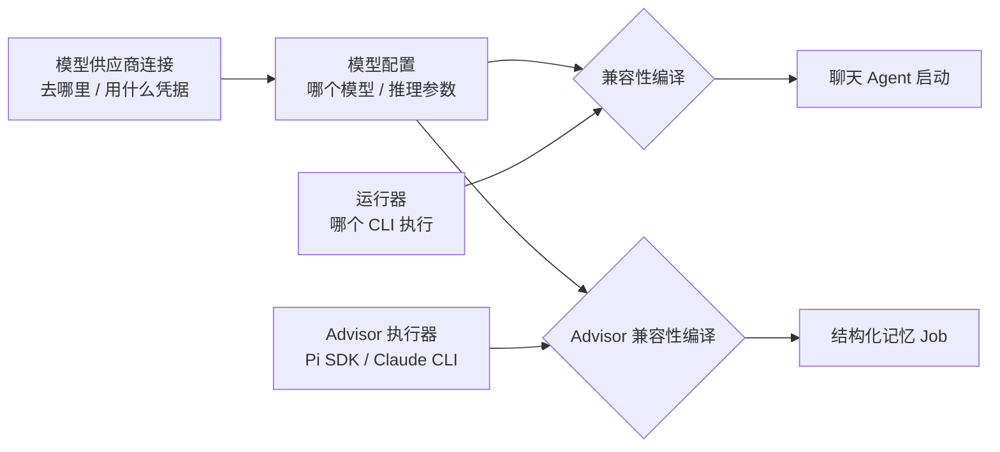
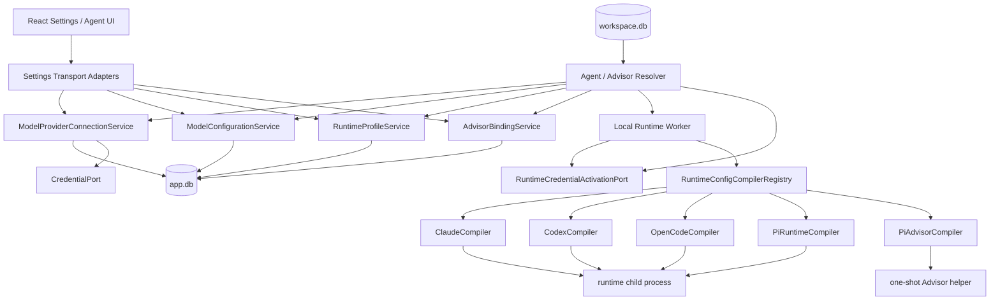
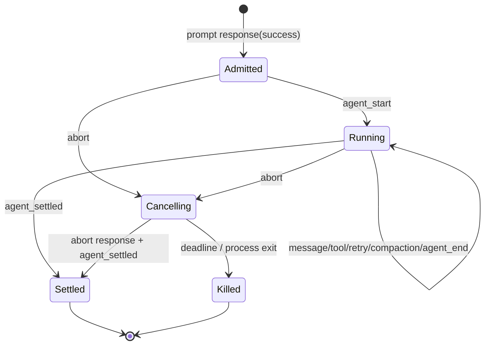
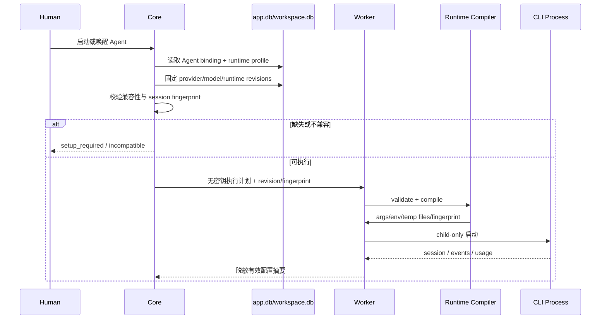
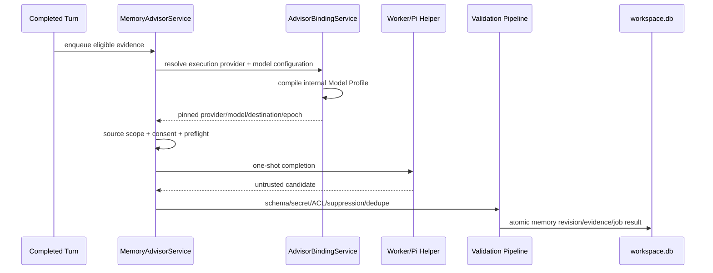

# Kith-space 模型供应商、运行器与记忆设置重构方案

> 状态：Accepted / Pending implementation
>
> 日期：2026-07-23
>
> 适用范围：安装级模型与运行器控制面、Memory Advisor 设置、Agent 模型绑定、Agent 记忆面板
>
> 前置规格：`2026-07-22-system-memory-advisor-provider-design.md`
>
> 证据来源：当前实现、2026-07-23 真实界面审计、`reference/codeg` 的 Apache-2.0 设置交互，以及 Claude Code / Codex / OpenCode / Pi 官方配置文档

## 1. 决策摘要

本方案锁定以下决策：

1. **Kith-space 自有配置是唯一产品事实源。**模型供应商、模型配置、运行器默认值和 Advisor 绑定由安装级 `app.db` 管理；显式 `unmanaged_cli_native` 只是受限的外部委托状态，不伪装成 Kith-managed 配置。
2. **默认不修改 Claude Code、Codex、OpenCode、Pi 的用户全局配置。**Kith 可以显式、只读导入受支持的本机 CLI 配置，但不会自动写回。
3. **Agent 启动时按进程注入配置。**Core 解析有效绑定，Local Runtime Worker 通过 runtime 专属 compiler 生成参数、子进程环境和临时配置；这些内容只作用于该次 Kith runtime 启动。Claude Code、Codex、OpenCode 与 Pi 都进入这条统一路径。
4. **未来可以增加“同步到 CLI”高级动作，但它不是本阶段范围。**若以后实现，必须显式触发、展示 diff、先备份、原子写入、可回滚，且不得成为 Kith 正常运行的依赖。
5. **模型供应商与 runtime 解耦。**一个供应商连接可以被多个兼容 runtime 和 Memory Advisor 复用；是否兼容由 adapter/compiler 能力矩阵判断，不由供应商品牌或 UI 硬编码。
6. **Pi 提升为正式 Agent runtime。**现有 experimental one-shot adapter 升级为 P-A10 v2 runtime，优先使用外部 Pi CLI 的 RPC 模式，支持 per-surface session、取消、usage、compaction 事件和 Kith CLI Gateway；它与内置 Pi SDK Advisor 是两个独立 adapter。
7. **用户面对“模型配置”，内部保留不可变执行快照。**现有 `Advisor Model Profile` 不再是普通用户需要手填和理解的产品对象；它继续作为 Advisor job 固定边界所需的内部编译产物。
8. **Memory Advisor 设置页只负责“是否启用、由谁执行、用哪个模型配置”。**模型目录、API 地址、凭据和 CLI 导入迁移到“模型与供应商”；运行器安装与默认值迁移到“运行器”。
9. **Agent 记忆页以记忆内容为主。**Advisor 状态压缩为摘要条，授权与诊断进入抽屉/弹窗；搜索与类型/范围筛选收敛为紧凑工具栏。
10. **配置 revision 与运行 session generation 对齐。**配置变化不热改正在运行或可恢复的 session；相关 Agent 标记“需要重启”，新 generation 才使用新配置。
11. **Space 可移植性优先。**Space 只保存对安装级配置的稳定绑定意图和非敏感快照信息；目标机器缺少对应配置时进入 `setup_required`，绝不静默换成其他供应商或模型。
12. **运行器默认值是三态，不用 `null` 猜语义。**`kith_model_configuration` 表示 Kith 固定配置，`unmanaged_cli_native` 表示明确委托本机 CLI 决定，`unset` 表示尚未配置；`unmanaged_cli_native` 不得用于 Advisor，且 UI 必须说明 Kith 无法保证其实际供应商与目的地。

一句话心智模型：

> **供应商连接决定“请求发到哪里、凭据来自哪里”；模型配置决定“使用哪个模型和推理参数”；运行器决定“哪个 CLI 执行 Agent”；Memory Advisor 只选择执行器与一个兼容模型配置。**

## 2. 背景与问题证据

### 2.1 当前产品问题

当前功能已经可用，但设置职责和信息层级没有跟上能力复杂度：

- `web/src/views/advisor-provider/AdvisorProviderSettings.tsx:18` 在一个页面同时加载 Provider 切换、模型目录、Pi 导入、模型 Profile 编辑、能力诊断和 Run 审计。普通设置与开发诊断混在同一滚动面。
- `web/src/views/agent-memory/AdvisorStatusCard.tsx:52` 把 Provider revision、真实 endpoint、凭据摘要、data policy、allowed egress、授权范围、pending job、错误和 suppression 全部平铺在记忆内容上方。
- `web/src/views/agent-memory/AgentMemoryPanel.tsx:127` 先渲染完整 Advisor 卡片，再渲染结构化记忆列表；因此控制面会稳定挤占主任务“查阅和管理记忆”的空间。
- `web/src/views/agent-memory/StructuredMemoryView.tsx:20` 把状态 Tab、搜索、类型、范围和撤权来源筛选铺成多行全宽控件，窄窗口尤其浪费垂直空间。
- `web/src/views/Members.tsx:399` 的 Agent 创建弹窗直接面向 runtime 动态发现模型，没有可复用的安装级模型配置、供应商连接或运行器默认值。

真实界面审计进一步确认：

- “诊断与最近 Provider Run”存在长文本相互挤压和重叠，revision、epoch、digest 等字段没有用户决策价值。
- “导入 Pi CLI 配置”下方把大量目录条目直接展开，挤占页面且缺少“导入后会发生什么”的清晰反馈。
- Agent 记忆页顶部 Advisor 卡片占据接近半屏，实际记忆列表和详情只剩狭小区域。
- 用户无法从当前页面稳定理解 Provider、Model Profile、聊天 runtime、Advisor Provider 和 Agent 模型之间的关系。

### 2.2 当前技术基础

本方案不是重做现有系统，而是重新划分已有能力：

- Core 已拥有 `AdvisorProviderSettingsService`、Provider/Model revision、Pi CLI 脱敏导入、credential reference、Provider epoch 和逐 Agent consent。
- `MemoryAdvisorService` 在 eligible turn 完成后建立 job，并固定 provider/model/config/consent 快照（`src/memory/memoryAdvisorService.ts:163`）。
- Worker 已有 Advisor prepare/complete 窄契约和 generation lease（`src/runtime/contract/advisorProviderRuntimePort.ts:19`、`src/runtime/control/advisorProviderRuntimeAdapter.ts:22`）。
- Agent runtime 启动前已有集中准备层 `prepareRuntimeSession`（`src/runtime/worker/sessions/runtimeSessionPreparation.ts:139`）。
- Claude Code 已通过启动参数选择模型（`src/daemon/claudeRuntime.ts:24`）；OpenCode 已有 runtime-only inline config；Codex 已有独立 app-server adapter。
- Pi 已有 experimental `piRuntime`、真实 JSONL fixture 和 `pi --list-models` 探测（`src/daemon/piRuntime.ts:154`、`src/daemon/listModels.ts:282`），但当前是每 turn 启动 `pi -p --mode json` 的 legacy one-shot adapter。
- P-A10 v2 调度与 capability baseline 当前只承认 Claude Code、Codex、OpenCode（`src/turns/turnScheduler.ts:457`、`src/runtime/adapters/runtimeV2CapabilityMatrix.ts:30`）；因此“列表里能选 Pi”不等于 Pi 已具有当前会话、上下文、工具和记忆机制。
- `useRuntimeDiscovery` 与创建 Agent 流程已有真实 runtime/model 探测，不需要退回静态模型清单（`web/src/useRuntimeDiscovery.ts:15`、`web/src/views/Members.tsx:407`）。

因此正确做法是增加一个窄的安装级模型控制面和 runtime compiler seam，而不是把另一套设置继续堆进 Advisor 页面或四个 runtime adapter。

### 2.3 `reference/codeg` 可借鉴与不可照搬的部分

`reference/codeg` 使用 Apache-2.0，可作为实现参考：

- 可借鉴：
  - `model-provider-settings.tsx` 的列表—详情信息架构；
  - `add-model-provider-dialog.tsx` 的集中添加流程；
  - `acp-agent-settings.tsx` 的运行器列表、安装状态、预检结果和高级配置折叠方式。
- 不照搬：
  - 供应商记录直接绑定某一种 agent/runtime；
  - 自动级联修改各 CLI 的全局配置文件；
  - 同一密钥在多份运行器配置中复制；
  - 将供应商、运行器、预检、环境变量和编辑器继续堆在巨型组件。

## 3. 目标、非目标与约束

### 3.1 功能目标

1. 在 Settings 中独立管理模型供应商连接和可复用模型配置。
2. 在 Settings 中独立管理 Claude Code、Codex、OpenCode、Pi 等运行器的安装状态、版本、默认模型配置和高级参数。
3. Agent 创建/编辑时可以继承运行器默认模型，也可以固定到一个兼容模型配置。
4. Memory Advisor 可以选择 Pi SDK 或 Claude Code 执行器，并选择一个兼容的模型配置。
5. 支持显式、只读导入 Pi、Claude Code、Codex、OpenCode 的安全配置元数据；不执行配置中的命令或 hook。
6. 运行时配置通过子进程参数、环境和临时配置注入，不修改用户全局 CLI 配置。
7. 重构 Memory Advisor 设置页和 Agent 记忆页，使普通任务优先、诊断按需展开。
8. 在配置变化、凭据失效、runtime 不兼容或 Space 移机时提供明确状态和修复路径。
9. 把 Pi 从 experimental legacy adapter 提升为正式 v2 runtime，接入 per-surface session、durable turn、Context Envelope、Gateway、snapshot、usage 和诚实 capability telemetry。

### 3.2 非功能目标

- **安全**：密钥不进入 workspace.db、URL、日志、前端状态持久化或诊断导出；普通 LAN HTTP 浏览器不能提交新密钥或读取 CLI 配置。
- **可维护性**：供应商、模型配置、运行器探测、runtime 编译、Advisor 绑定和 UI presenter 各有单一职责。
- **可恢复性**：app.db 迁移事务化；配置 revision 不覆盖历史；失败编译不影响旧 revision 和当前 session。
- **可移植性**：Space 可复制；缺失安装级配置时明确停在 `setup_required`。
- **性能**：本地缓存设置首屏不等待网络；不在页面初次渲染时展开数百个模型 DOM 节点。
- **可解释性**：默认界面只显示用户能采取行动的信息；revision、digest、epoch、canonical egress 等进入高级诊断。
- **兼容性**：Claude Code、Codex、OpenCode、Pi 的差异由 compiler 隔离，业务层只消费统一的有效绑定。

### 3.3 非目标

- 不自研新的聊天 agent runtime。
- 不把 Memory Advisor 变成有频道身份、工具或持久 session 的普通 Agent。
- 不把 `@earendil-works/pi-coding-agent` SDK 内嵌成 Kith 自研聊天 runtime；Pi Agent runtime 继续适配用户本机安装的外部 Pi CLI。
- 不把 Pi SDK Advisor 的 helper、授权或 job session 复用于 Pi Agent runtime。
- 不在本阶段实现全局 CLI 配置写回。
- 不支持任意命令型 credential helper、OAuth 自动刷新脚本或动态 provider hook。
- 不保证一个模型配置能在所有 runtime 中使用。
- 不把运行器安装器、包管理器或自动升级器一起纳入本阶段。
- 不改变结构化记忆的 candidate/validation/revision/evidence/suppression 业务规则。
- 不让每个 Agent 单独复制 Provider、endpoint 或 API Key。

## 4. 术语与用户心智模型

| 用户术语 | 内部建议名 | 作用域 | 说明 |
|---|---|---|---|
| 模型供应商 | `ModelProviderConnection` | installation | endpoint、API 协议、凭据来源、数据目的地和健康状态 |
| 模型配置 | `ModelConfiguration` | installation | 一个可复用的 provider + model + reasoning/能力快照 |
| 运行器 | `RuntimeProfile` | installation / runtime id | 本机 CLI 的可执行物、版本、默认模型配置和 runtime 专属选项 |
| 运行器默认绑定 | `RuntimeDefaultBinding` | installation / runtime id | `kith_model_configuration | unmanaged_cli_native | unset`，三态显式存储 |
| Agent 模型绑定 | `AgentModelBinding` | Space / Agent | 跟随运行器默认，或固定某个模型配置 revision |
| Advisor 执行器 | `AdvisorExecutionProvider` | installation | `pi_sdk` 或 `claude_cli`，只执行一次受限 completion |
| Advisor 模型绑定 | `AdvisorModelBinding` | installation | Advisor 使用的模型配置及其内部编译快照 |
| CLI 配置导入 | `CliConfigImport` | installation | 显式、只读、脱敏的外部配置快照 |
| 有效运行配置 | `EffectiveRuntimeConfiguration` | one launch/session generation | compiler 生成的参数、子进程环境、临时文件和 fingerprint |

### 4.1 三个概念必须保持正交



选择 Pi SDK 只表示 Advisor 的本机执行适配器，不代表模型在本机；真实数据目的地由模型供应商连接决定。

## 5. 目标信息架构

Settings 导航调整为：

1. Human 资料
2. 空间资料
3. **模型与供应商**
4. **运行器**
5. **记忆 Advisor**
6. Desktop 设置（仅 Desktop）

### 5.1 模型与供应商

该页面包含两个局部视图：

- **供应商连接**：管理 endpoint、协议、凭据来源、数据目的地与连接测试。
- **模型配置**：从某个供应商选择/输入模型，设置推理级别、上下文能力和显示名称。

页面不按 Claude/Codex/OpenCode/Pi 分四套 Provider；兼容 runtime 以标签或矩阵显示。

宽屏使用列表—详情布局，窄屏使用列表进入详情页：

```text
┌ 模型与供应商 ────────────────────────────────────────┐
│ [供应商连接] [模型配置]           [导入配置] [新建] │
├──────────────────┬──────────────────────────────────┤
│ Anthropic   正常 │ Anthropic                         │
│ DeepSeek    正常 │ API 协议  OpenAI Completions      │
│ Local       离线 │ 地址      https://…               │
│                  │ 凭据      已安全保存               │
│                  │ 可用于    Pi SDK / Pi Agent / OpenCode │
│                  │ [测试连接] [编辑] [停用]           │
└──────────────────┴──────────────────────────────────┘
```

模型目录必须使用可搜索、分组且可虚拟化的选择器；不得把数百个模型渲染成连续按钮。自定义模型 ID 是同一选择器中的“手动输入”分支，不单独堆一组高级表单。

模型目录必须区分 `加载中 / 无目录能力 / 加载失败 / 缓存过期 / 手工模型 ID / 重名模型`，并显示目录来源与刷新时间。手工模型 ID 保存前仍需经过 runtime/Advisor 兼容性验证。

全新安装的首条正式引导路径是：

1. 连接供应商；
2. 创建模型配置；
3. 设为一个运行器的默认配置；
4. 返回并完成 Agent 创建。

每个空状态只提供一个主 CTA，并保留尚未完成的 Agent 创建草稿和返回位置。用户也可以显式选择“使用 CLI 自有配置”（内部 `unmanaged_cli_native`），但必须先看到其不可完整审计实际目的地、不可供 Advisor 使用的说明；`unset` 只表示尚未完成设置，不能被当成 CLI 默认。

### 5.2 运行器

运行器页面采用主从布局：

- 左侧：Claude Code、Codex、OpenCode、Pi 及其余 experimental runtime；显示 `可用 / 需设置 / 未安装 / 版本过旧 / 能力不支持 / 错误`。Pi 完成本方案后不再标 experimental。
- 右侧：
  - 检测到的命令与版本；
  - 默认模型配置；
  - 当前兼容能力；
  - “重新检测”；
  - 高级设置折叠区；
  - 诊断抽屉。

普通用户不编辑一整块环境变量文本。高级设置使用有类型字段，只有无法结构化的少数 runtime 选项才允许键值对，并执行 allowlist。

用户可见名称固定为：

- **Pi Agent（本机 CLI）**：正式聊天 runtime，需要单独安装并通过 RPC 能力探测；
- **Pi SDK（内置记忆执行器）**：随 Kith 提供的一次性 Advisor 执行器。

“内置 Pi SDK 可用”不得让 Pi Agent 显示为已安装。Pi Agent 必须分别呈现 `未安装 / 版本过旧 / 不支持 RPC / 可用`，创建 Agent 时保留不可用选项、解释原因并提供“重新检测”，不能静默隐藏。

### 5.3 Memory Advisor

主页面只保留四个决策：

1. 是否启用系统 Advisor；
2. 执行器：内置 Pi SDK / Claude Code；
3. 模型配置；
4. 查看实际数据目的地并测试。

```text
┌ 记忆 Advisor ────────────────────────────────────────┐
│ 自动从完成的对话中提炼结构化记忆                    │
│                                                     │
│ 状态          ● 可用                  [已启用]       │
│ 执行器        Pi SDK（内置记忆执行器）[更改]         │
│ 模型配置      DeepSeek · V4 Pro       [选择]         │
│ 数据目的地    api.deepseek.com · 云端                │
│                                                     │
│ 2 个 Agent 已授权 · 0 个需要重新授权                │
│ [测试配置] [管理 Agent 授权]                        │
│                                                     │
│ ▸ 运行记录与诊断                                    │
└─────────────────────────────────────────────────────┘
```

以下内容移入“运行记录与诊断”：

- adapter/package revision；
- model snapshot revision；
- provider epoch；
- helper/artifact digest；
- DNS/preflight/postflight；
- 最近 Provider Run 的耗时、错误码和脱敏目的地；
- legacy 回滚与恢复动作。

诊断默认用人类可读摘要；“复制技术详情”才输出脱敏 JSON。长字段必须可换行或截断展开，不得参与主布局宽度计算。

“管理 Agent 授权”打开明确的授权任务列表，至少显示 Agent、当前状态、已授权来源范围、当前与新目的地差异、失效原因。支持逐个授权；批量授权必须逐项展开来源范围与目的地并再次显式确认。切换模型配置前先展示受影响 Agent 数量和授权变化，不能保存后才告知。

### 5.4 Agent 记忆页

“结构化记忆 / 文件记忆”继续是一级 Tab。结构化记忆视图调整为：

1. 一行 Advisor 摘要；
2. 状态 Tab + 搜索；
3. 单个“筛选”按钮和已选条件 chips；
4. 记忆列表/详情主体。

```text
┌ 结构化记忆 | 文件记忆 ──────────────────────────────┐
│ ● Advisor 已启用 · Pi SDK / DeepSeek V4 Pro · 无待处理 │
│                                      [管理] [暂停]  │
├─────────────────────────────────────────────────────┤
│ [生效中] [待确认] [已归档]  [搜索……] [筛选 2]      │
│ #事实  #Agent私有  [清除类型] [清除范围]            │
├──────────────────┬──────────────────────────────────┤
│ 记忆列表         │ 记忆详情 / 证据 / 历史           │
│                  │                                  │
└──────────────────┴──────────────────────────────────┘
```

“管理”打开侧边抽屉或弹窗，承载：

- enabled / paused；
- 公开频道、私密频道/话题、DM source scope；
- 授权、续期、撤销；
- 当前数据目的地的完整说明；
- suppression 管理；
- 最近失败与修复入口。

Agent 页面不选择模型，不复制系统 Advisor 设置，也不展示 raw credential digest。

### 5.5 Agent 创建与编辑

创建 Agent 时：

1. 选择运行器；
2. 默认选择“跟随该运行器默认模型”；
3. 用户可以展开并选择其他兼容模型配置；
4. reasoning 只显示该模型与 runtime 共同支持的级别；
5. 不兼容或缺失配置在提交前明确拒绝。

编辑已有 Agent 的运行器或模型配置时，UI 必须说明：

- 当前工作是否会中断；
- 保存后需要重启；
- 旧 session 不会带着新模型继续 resume；
- Space 移机后若目标配置缺失，需要在新机器重新绑定。

legacy Agent 额外显示 `沿用旧配置` 或 `需要转换`，并提供只读旧绑定摘要、转换预览、兼容性检查与“保持原样”。转换成功前不得覆盖旧字段、改变 binding fingerprint 或触发新 session generation。

## 6. 高层架构



### 6.1 Core 的权威职责

Core：

- 持久化安装级配置与不可变 revision；
- 验证 provider/model/runtime 兼容性；
- 解析 Agent/Advisor 有效绑定；
- 生成不含明文密钥的执行计划；
- 固定 revision、fingerprint、consent 和 destination；
- 决定 session 是否 stale、是否必须换 generation；
- 提供面向 UI 的人类可读 presenter；
- 记录脱敏诊断和审计。

Core 不：

- 直接启动第三方 CLI；
- 把 API Key 放入 Worker 控制消息；
- 自动修改 CLI 全局配置；
- 让 UI 自行拼 runtime 参数。

### 6.2 Worker 的职责

Worker：

- 探测 runtime 命令、版本和受支持能力；
- 按 Core 固定 revision 调用对应 compiler；
- 在启动前兑换短时 credential activation；
- 生成 child-only env、args、临时配置根；
- 校验编译 fingerprint 与 Worker generation；
- 启动、终止和清理 runtime/helper 进程；
- 只回传脱敏后的有效配置摘要与诊断。

### 6.3 聊天 Runtime 凭据兑换与失效屏障

聊天 runtime 不得复用 Advisor 专属兑换协议，也不能把 secret 放进 `open-session` 等普通控制消息。新增窄接口 `RuntimeCredentialActivationPort`：

```ts
interface RuntimeCredentialActivationDescriptor {
  activationId: string;
  runtimeSessionId: string;
  sessionGeneration: number;
  workerGeneration: number;
  runtimeId: RuntimeId;
  providerRevision: number;
  modelConfigurationRevision: number;
  runtimeProfileRevision: number;
  runtimeConfigurationEpoch: number;
  effectiveConfigDigest: string;
  expiresAt: string;
}
```

Core 只向 Worker 发送 descriptor 和无密钥执行计划。Worker 通过独立的本机 Worker-only `runtime:credential:redeem` 控制命令单次兑换，明文仅短暂存在于 Worker 内存和目标 child env；不会进入 DB、普通 session 命令、日志或诊断。descriptor 必须绑定 session/generation/revisions/digest/expiry，任一不符即拒绝。Worker lease 变化、启动失败、cancel、close、超时和 Core/Worker 断线都撤销 activation。

安装级 `runtime_configuration_epoch` 是配置安全边界。provider endpoint、credential identity、model wire API、egress policy 或 compiler policy 改变时：

1. app.db 事务内提升 epoch，并关闭旧 epoch 的新 admission；
2. 撤销旧 activation 和 active attempt capability；
3. 请求关闭相关 hosted sessions；
4. 异步把各 workspace binding 标记 `restart_required`；
5. 新 generation 用新 epoch 启动。

每次 turn admission、session lookup 和 credential redeem 都比较 pinned epoch/fingerprint；旧 session 即使尚未成功关闭，也不得接收新 delivery。UI 的“需要重启”只是解释状态，不是安全门。

### 6.4 Runtime compiler seam

建议契约：

```ts
interface RuntimeConfigCompiler {
  readonly runtimeId: RuntimeId;

  describeCapabilities(
    runtimeVersion: string | null,
  ): RuntimeConfigurationCapabilities;

  validate(
    input: RuntimeConfigurationInput,
  ): RuntimeConfigurationValidation;

  compile(
    input: RuntimeConfigurationInput,
    activation: ActivatedCredential | null,
  ): Promise<EffectiveRuntimeConfiguration>;
}

interface EffectiveRuntimeConfiguration {
  args: readonly string[];
  env: Readonly<Record<string, string>>;
  ephemeralFiles: readonly EphemeralConfigFile[];
  effectiveModelId: string;
  effectiveReasoning: string | null;
  destination: RedactedDestination;
  fingerprint: string;
  cleanup(): Promise<void>;
}
```

compiler 只做配置翻译，不拥有 Agent、session、频道、记忆或授权业务。`cleanup()` 必须在启动失败、正常退出、取消和 Core/Worker 断线时调用。

### 6.5 兼容性矩阵

矩阵由 compiler 能力动态生成，UI 不复制规则：

| 配置类型 | Pi SDK（Advisor） | Pi Agent（CLI） | Claude Code | Codex | OpenCode |
|---|---:|---:|---:|---:|---:|
| 使用 CLI 自有账户/默认供应商（unmanaged） | 不适用 | 支持 | 支持 | 支持 | 支持 |
| Anthropic Messages / gateway | 支持 | 支持 | 支持 | 不支持 | 依 provider 支持 |
| OpenAI Responses | 支持 | 支持 | 不直接支持 | 支持 | 依 provider 支持 |
| OpenAI Completions compatible | 支持 | 支持 | 仅受验证 gateway | 不支持 | 支持 |
| Google / Vertex | 支持 | 支持 | 受 Claude 官方模式约束 | 不支持 | 依 provider 支持 |
| Bedrock | 支持 | 依 Pi 版本能力 | 受 Claude 官方模式约束 | 受 Codex 官方模式约束 | 依 provider 支持 |

矩阵中的“支持”仍需要本机版本探测、凭据与 endpoint 预检。`unmanaged_cli_native` 不是 Kith 模型配置：只记录可探测的 executable/config/account identity digest，来源变化使 session stale；无法确认 endpoint/model 时必须显示“由 CLI 管理，Kith 无法完整审计”。UI 必须显示具体不兼容原因，例如“Codex 自定义供应商当前只支持 Responses API”，而不是统一显示“不可用”。

## 7. Runtime 专属编译策略

### 7.1 Claude Code

官方优先级允许通过启动参数和环境为单次 session 选择模型；自定义 gateway 可使用 `ANTHROPIC_BASE_URL` 等变量。compiler 应：

- 用 `--model` 固定模型；
- 用 child-only env 注入允许的 endpoint、认证和官方 provider 开关；
- 不写 `~/.claude/settings.json`；
- 不读取或修改项目 `.claude/settings*.json`；
- 默认继承用户原生 Claude 登录仅限“CLI 自有账户”配置；
- 对 Kith-managed provider 使用显式凭据 activation；
- 配置 fingerprint 改变时禁止 resume 旧 engine session，创建新 generation。

Claude 官方说明 resumed session 会保留原 transcript 中的模型，因此“保存新配置后继续 resume”不是可靠切换方式。

### 7.2 Codex

Codex 的 provider/auth 是 machine-local 配置，项目 `.codex/config.toml` 不能覆盖 `model_provider` 和 `model_providers`。compiler 不得因此写用户 `~/.codex/config.toml`，而应：

- 优先使用 Codex 支持的启动期配置 override；
- 若当前版本不能完整覆盖，创建 Kith-owned 临时 `CODEX_HOME` 或临时 profile；
- 只在临时根写 provider/model 配置；
- 用环境变量名引用单次激活的密钥，不把明文写入 TOML；
- 保留 Kith 的 MCP/bootstrap 与 sandbox 设置；
- 只准入 compiler 声明支持的 wire API；
- 进程结束后删除临时配置和凭据环境。

实现前必须以 Kith 支持的 Codex 最低版本做一次真实 probe；不能仅凭生成 TOML 的单元测试宣布支持。

### 7.3 OpenCode

OpenCode 官方支持 `OPENCODE_CONFIG_CONTENT` 作为运行时最高优先级之一，现有 adapter 已使用该边界。compiler 应：

- 继续生成 child-only inline config；
- 合并 Kith execution agent、MCP bootstrap 和 provider/model 配置；
- 用环境变量占位引用凭据；
- 不写 `~/.config/opencode/opencode.json`；
- 不写 Space root 的 `opencode.json`；
- 对远程组织/managed 配置覆盖给出明确诊断；
- 保持显式 `provider/model` 验证。

### 7.4 Pi Agent Runtime

Pi Agent runtime 使用用户本机安装的外部 Pi CLI，不复用 Advisor 的 `pi-ai` one-shot helper。

当前 `src/daemon/piRuntime.ts` 已验证 Pi JSON 事件、session id、工具事件和模型错误，但它仍有四个缺口：

1. 只走 legacy one-shot bridge，不在 P-A10 v2 支持矩阵中；
2. 使用 `Buffer.toString()` 分块解析，尚未统一有状态 UTF-8；
3. system prompt 写入 cwd 下 `.pi-system-prompt.md`，会污染 Space root；
4. 没有 normalized usage、turn terminal ACK、snapshot、compaction 和 Gateway capability 证明。

目标 adapter：

- 优先使用 `pi --mode rpc` 的常驻进程，每个 Kith per-surface session 一个 Pi RPC session；
- JSONL 严格按 LF framing 解析，不能用会把 Unicode separator 当换行的通用 reader；
- 每个 hosted session 独占 `<runtimeRoot>/<space>/<agent>/<runtimeSessionId>/g<generation>/`；`PI_CODING_AGENT_DIR`、session dir、system prompt、临时 provider config 和 adapter log 全部位于该目录；
- 安全启动基线固定为 `--no-approve --no-context-files --no-extensions --no-skills --no-prompt-templates --no-themes`，不从 Space root、项目 `.pi`、父目录或用户全局目录加载可执行/提示资源；未来允许用户资源必须作为独立授权功能；
- 默认禁用 Pi 自身更新检查和安装 telemetry，避免一次 Agent wake 产生未声明网络目的地；
- provider/model/thinking 来自 Kith 模型配置；密钥只在 child env 激活，不使用会出现在进程列表的 `--api-key`；
- 映射 `message_update/end`、tool execution、usage、session、abort、retry 和 compaction 事件；
- RPC prompt response 只表示 admission ACK；`agent_start` 表示开始，`agent_end` 仍是中间事件，只有 `agent_settled` 才映射 Kith terminal completion；
- RPC abort 对应 attempt cancel；必须等待 correlated abort response 以及 `agent_settled` 或进程退出，超过 deadline 才强制终止整个子进程树；
- snapshot 只保存 Kith-owned 不透明 session id 或相对文件名、Pi adapter schema 和 resumable 标记，不保存可直接使用的绝对路径，也不复制 transcript 正文；
- 恢复时在固定 hosted-session generation 根下重新解析 session 文件，校验 descendant、owner、mode、regular-file、schema 和 size；snapshot 同时固定 runtime/config/system-prompt/cwd fingerprint，任一不符即创建新 generation；
- Pi 当前没有内置 MCP，首版必须诚实报告 `mcpBootstrap=unsupported`，但通过现有 `kith-space` CLI Gateway 获得完整 Kith 工具；不得把 CLI fallback 伪报成 MCP；
- 后续若提供 Kith-owned Pi extension，只能作为 MCP Transport Adapter，不得在 extension 内复制任务、消息或记忆业务。

Pi v2 capability baseline 必须单独冻结，不能机械复制 OpenCode：

| 能力 | 目标 |
|---|---|
| process model | RPC persistent |
| per-surface resume | observed |
| session changed | observed |
| usage | observed |
| completion / cancel | observed |
| CLI Gateway | observed |
| MCP bootstrap | unsupported，除非真实 extension probe 通过 |
| compaction telemetry | observed（RPC 事件） |
| cwd relocation | 只对 Kith-owned session dir 证明 |
| tool isolation | unsupported，等待 P-S1 |

定义带版本的 `PiRpcProtocolBaseline`，启动 probe 必须实测 strict LF JSONL、correlated response、`get_state`、session、abort、`agent_settled`、usage 与 compaction 事件，不能只比较版本字符串。缺少任一 required capability 时保持 `unsupported`，不得进入 v2 ready；实现切片开始时再根据真实 probe 冻结最低支持版本。



response ID、turn/attempt ownership、retry、compaction、queued message、abort deadline 和 process exit 均需独立 fixture。完成后，`turnScheduler`、reconnect/catch-up、runtime baseline/matrix、session preparation、model discovery、创建 Agent UI 和真实验收都必须把 Pi 纳入正式集合。

### 7.5 Pi SDK Advisor

Pi SDK 不通过 CLI 全局配置执行：

- 直接消费 Kith 的模型配置 revision；
- 继续使用 one-shot helper、临时 HOME/cwd、最小环境和短时 credential activation；
- 不启动 Pi coding agent、session、工具、extension 或资源发现；
- 不因导入 Pi CLI 配置而改变当前 Advisor 绑定；
- 保持当前 endpoint、data policy、egress 和 consent 固定语义。

## 8. 数据模型

### 8.1 设计原则

- 稳定对象与不可变 revision 分离；
- 明文密钥只存在于 CredentialPort；
- provider/model/runtime 配置只进 app.db；
- Agent 的选择意图随 Space 走，但不复制安装级 secret；
- 跨 app.db/workspace.db 不使用 SQLite 外键，改由领域服务验证；
- 不为模型目录建立复杂主数据系统；目录条目是可刷新缓存，真正被使用的模型信息固定在 `ModelConfigurationRevision`。

### 8.2 app.db 建议升级

建议 app.db 从 v5 升级到 v6，新增：

#### `model_provider_connections`

- `id`
- `display_name`
- `status`：`active | disabled`
- `current_revision`
- `created_at / updated_at`

#### `model_provider_connection_revisions`

- `(connection_id, revision)`
- `backend_id`
- `api_kind`
- `canonical_origin`
- `network_class`
- `credential_source_kind`
- `credential_ref`
- `credential_identity_digest`
- `data_policy_provenance / revision`
- `allowed_egress`
- `capability_snapshot`
- `source_kind`：`manual | pi_import | claude_import | codex_import | opencode_import`
- `source_snapshot_digest`
- `created_at`

#### `model_configurations`

- `id`
- `display_name`
- `status`：`active | disabled`
- `current_revision`
- `created_at / updated_at`

#### `model_configuration_revisions`

- `(configuration_id, revision)`
- `provider_connection_id / provider_revision`
- `model_id`
- `reasoning`
- `context_window`
- `max_output_tokens`
- `input_capabilities`
- `runtime_compatibility_snapshot`
- `options`
- `created_at`

#### `runtime_profiles`

一个受支持 runtime 一条稳定记录：

- `runtime_id`
- `enabled`
- `default_binding_mode`：非空枚举 `kith_model_configuration | unmanaged_cli_native | unset`
- `default_model_configuration_id / revision`
- `current_revision`

当且仅当 `default_binding_mode=kith_model_configuration` 时，模型配置 id/revision 必填；其余两态必须为空。领域约束和迁移测试必须阻止含糊的 `null` 组合。

#### `runtime_profile_revisions`

- `(runtime_id, revision)`
- `executable_preference`
- `runtime_options`
- `created_at`

环境 allowlist 是 compiler 代码拥有的安全策略，不能由数据库、UI 或 API 扩权；其 `compiler_policy_version/digest` 进入有效配置 fingerprint。

#### `runtime_probe_cache`

probe 是短寿命观测，不属于不可变配置 revision：

- `runtime_id`
- `executable_digest`
- `compiler_policy_version`
- `observed_version`
- `status / capability_digest / diagnostics`
- `probed_at / expires_at`

设置页可使用缓存展示，但每次 launch 仍执行最低必要 preflight，旧 probe 不能作为 admission 证据。

#### 安装级控制状态

在 app.db 安装级控制记录中加入单调递增 `runtime_configuration_epoch`。安全相关配置 revision 或 compiler policy 变化按第 6.3 节先提升 epoch，再失效旧 session。

#### `cli_config_import_snapshots`

泛化现有 Pi 导入快照：

- `id`
- `runtime_id`
- `source_paths_digest`
- `source_mtime_digest`
- `sanitized_payload`
- `warnings`
- `created_at`

只保存脱敏数据。现有 Pi import 表若已满足需求，可迁移后复用，不为命名整齐机械复制。

### 8.3 workspace.db Agent 绑定

workspace schema 从 v9 升级时，为 `agents` 增加：

- `model_binding_mode`：`runtime_default | pinned`
- `model_configuration_id`：nullable
- `model_configuration_revision`：nullable
- `model_binding_label_snapshot`
- `model_binding_fingerprint`
- `confirmed_effective_provider_snapshot`
- `confirmed_installation_identity_digest`

既有 `runtime`、`model`、`reasoning` 和 `runtime_config` 暂不删除：

- 它们继续作为迁移输入和旧 adapter 回滚字段；
- 新路径把 `model` 写为最后一次成功解析的非敏感 effective model id；
- 不能把旧字段当成跨机器可执行保证；
- 待所有 v2 runtime 和真实迁移完成后，再单独决定是否收缩。

即使 Agent 选择 `runtime_default`，workspace 也保存最近一次由 Human 确认的非敏感 provider/model/fingerprint 与安装实例摘要。Space 移机或默认 fingerprint 不一致时进入 `confirmation_required/setup_required`，Human 显式确认后才更新快照；不能仅因目标机器存在另一个 runtime default 就静默发送。

### 8.4 Advisor 映射

现有 Advisor Provider revision/epoch/consent/job snapshot 保留。调整点：

- Advisor 设置新增 `model_configuration_id / revision`；
- Core 从该 revision 编译现有 `AdvisorModelProfile`；
- `AdvisorModelProfile` 增加 source model configuration id/revision；
- job 继续固定 Provider revision、内部 Model Profile revision、provider epoch、egress 与 consent；
- UI 只展示模型配置名称和实际目的地，技术诊断才展示内部 revision。

这样不会破坏已经实现的安全不变量，也避免普通用户维护两份相同模型参数。

### 8.5 revision 与删除

- 编辑连接、模型配置或运行器配置一律创建新 revision。
- 被 Agent/Advisor 使用过的 revision 不物理覆盖。
- “删除”默认是停用稳定对象；仍被绑定时拒绝停用或要求先迁移绑定。
- credential 轮换创建新 provider revision，并使相关 Advisor consent 按现有策略失效。
- 仅修改显示名称不提升安全 revision；只更新稳定对象元数据。
- 导入快照删除不删除从它创建出的显式 Kith 配置。

## 9. 配置解析与启动流程

### 9.1 Agent 启动



### 9.2 配置变化

1. Human 保存新 revision。
2. Core 计算受影响的 runtime 默认、Agent pinned binding 和 Advisor binding。
3. 未运行 Agent 下次启动直接使用新 revision。
4. 正在运行或具有可恢复 session 的 Agent 标记 `restart_required`。
5. UI 显示影响数量，由 Human 选择“稍后”或“保存并重启受影响 Agent”。
6. Core 不向旧 attempt 热注入密钥、endpoint 或模型。
7. 新 generation 启动成功后更新 binding fingerprint；失败则保留旧 revision 供人工回退，但不继续假装已应用新配置。

### 9.3 Advisor 执行



## 10. CLI 配置导入

### 10.1 通用规则

导入必须：

- 由 Human 显式点击；
- 先显示将读取的路径和数据类型；
- 只读已知文件；
- 不执行命令、hook、extension、provider function、OAuth refresh 或环境插值脚本；
- 对密钥只生成安全凭据引用或要求重新输入，不把明文放进预览；
- 先生成脱敏快照和 warning，再由 Human 选择创建哪些 Kith 配置；
- 不自动替换当前 Agent/Advisor 绑定；
- 后续源文件变化只提示“可刷新”，不静默同步。

预览与结果使用统一的逐项状态模型：`新建 / 更新为新 revision / 不变 / 冲突 / 已跳过`。默认不覆盖、不自动绑定 Agent/Advisor；每项显示来源、目标 Kith 对象和缺失凭据处理。重复导入以源摘要和目标 revision 判定幂等；出现同名异义、部分不可解析或凭据缺失时允许选择安全子集，取消必须零写入。完成页显示创建、更新、跳过与冲突汇总，并提供对应设置入口。

### 10.2 各 CLI 范围

| 来源 | 可导入 | 必须拒绝/忽略 |
|---|---|---|
| Pi | 全局 settings、models、明确选择的 auth 来源；可分别创建 Pi Agent 与 Pi SDK Advisor 的显式 Kith 绑定 | 项目 `.pi`、extension、skill、session、`!command`、动态 provider |
| Claude Code | user settings 中静态 model/env 名称与已知 gateway 元数据 | managed 设置写入、hook、命令 helper、项目指令、session transcript |
| Codex | user config 中静态 provider/model/profile 元数据 | command-backed auth、项目 AGENTS、history、动态通知/hook |
| OpenCode | 全局静态 provider/model 配置 | plugin、tool、agent、command、远程动态 config 和项目资源 |

如果导入内容超出安全解析器能力，UI 显示“该部分未导入”，不得猜测或执行。

### 10.3 为什么默认不写回

默认不写回可避免：

- 影响用户在 Kith 之外的所有终端；
- Kith 与 CLI 自己同时编辑造成覆盖；
- JSON/TOML/schema/version 差异；
- Windows/macOS/Linux 路径和权限差异；
- 企业 managed policy 冲突；
- 把密钥复制进更多文件；
- 卸载 Kith 后遗留隐性配置；
- 某个 runtime 写回失败拖累其他 runtime。

代价是 Kith 内配置不会自动成为用户终端默认值，但这是清晰的产品边界：Kith 管理 Kith 启动的 Agent，CLI 自己管理用户独立启动的会话。

## 11. API 与领域模块边界

建议路由：

```text
GET/POST           /api/settings/model-providers
GET/PATCH/DELETE   /api/settings/model-providers/:id
POST               /api/settings/model-providers/:id/test

GET/POST           /api/settings/model-configurations
GET/PATCH/DELETE   /api/settings/model-configurations/:id
GET                /api/settings/model-compatibility

GET/PATCH           /api/settings/runtimes/:runtimeId
POST                /api/settings/runtimes/:runtimeId/probe

POST                /api/settings/cli-imports/preview
POST                /api/settings/cli-imports/apply

GET/PATCH            /api/settings/memory-advisor
POST                 /api/settings/memory-advisor/test
GET                  /api/settings/memory-advisor/diagnostics
```

具体路径可以匹配现有 route 组织，但职责必须保持：

- Transport 只做 Human authority、schema、CSRF/desktop gate 和错误映射。
- `ModelProviderConnectionService` 管连接与 revision。
- `ModelConfigurationService` 管模型配置与兼容性。
- `RuntimeProfileService` 管探测结果、默认绑定与 revision。
- `CliConfigImportService` 管只读解析、预览和应用。
- `AdvisorBindingService` 把模型配置编译成现有 Advisor snapshot。
- `SettingsPresentationService` 把内部状态转换为用户摘要，避免前端理解 epoch/digest。

### 11.1 Desktop 与浏览器权限

- 普通授权浏览器可以查看脱敏设置、选择已有模型配置、切换 Agent/Advisor 绑定和查看运行状态。
- **新增/更换 API Key、读取本机 CLI 配置、选择本机配置路径、显示一次性 secret 和导出诊断包必须要求 Desktop 私有信任。**
- LAN HTTP 模式不传输新的长期密钥。浏览器遇到这些动作显示“请在桌面端完成”。
- 服务端 gate 是权威；隐藏按钮不是安全措施。

Web 只读态仍展示现有脱敏配置；敏感按钮保持可见但禁用，解释原因并给出精确路径“桌面端 → 设置 → 模型与供应商”。页面提供“重新检查”并订阅设置变化；Human 在 Desktop 完成配置后，Web 无需整页刷新即可继续原流程。fresh Web 若尚无配置，必须给出可复制待办和返回创建草稿的路径，不能形成无出口空状态。

## 12. UI 组件与模块划分

避免继续扩大现有组件，建议：

```text
web/src/views/model-settings/
  ModelSettingsPage.tsx
  ProviderConnectionList.tsx
  ProviderConnectionDetail.tsx
  ProviderConnectionDialog.tsx
  ModelConfigurationList.tsx
  ModelConfigurationDialog.tsx
  ModelCatalogPicker.tsx
  CliImportDialog.tsx
  modelSettingsApi.ts
  modelSettingsModel.ts

web/src/views/runtime-settings/
  RuntimeSettingsPage.tsx
  RuntimeList.tsx
  RuntimeDetail.tsx
  RuntimeHealthSummary.tsx
  RuntimeAdvancedSettings.tsx
  runtimeSettingsApi.ts

web/src/views/advisor-provider/
  MemoryAdvisorSettingsPage.tsx
  AdvisorOverviewCard.tsx
  AdvisorBindingEditor.tsx
  AdvisorDiagnosticsDrawer.tsx
  AdvisorRunsTable.tsx

web/src/views/agent-memory/
  AdvisorSummaryBar.tsx
  AdvisorManagementDrawer.tsx
  MemoryFilterMenu.tsx
  StructuredMemoryView.tsx
```

`AdvisorProviderSettings.tsx` 不继续作为所有设置的长期容器；可以先变成路由兼容壳，再逐步删除。`Members.tsx` 已接近 500 行，新绑定 UI 应抽成 Agent 配置子组件，不继续堆入创建弹窗。

## 13. 状态、错误与文案

### 13.1 用户状态

#### 供应商连接

- `需要设置`
- `正在测试`
- `可用`
- `认证失败`
- `地址不可达`
- `协议不兼容`
- `已停用`

#### 运行器

- `未安装`
- `已安装，使用 CLI 自有配置`
- `已配置`
- `需要重新检测`
- `配置不兼容`
- `错误`

#### Agent 绑定

- `跟随运行器默认`
- `已固定`
- `需要重启`
- `缺少本机配置`
- `不兼容`
- `沿用旧配置`
- `需要转换`

#### Advisor

- `已启用`
- `已暂停`
- `需要设置`
- `需要 Agent 授权`
- `需要重新授权`
- `最近运行失败`

### 13.2 错误展示

主页面显示：

- 发生了什么；
- 影响什么；
- 用户下一步可以做什么。

例如：

> Codex 不能使用“DeepSeek V4 Pro”：该连接使用 OpenAI Completions，当前 Codex compiler 只支持 Responses API。请选择其他模型配置。

技术错误码、revision 和脱敏 JSON 留在诊断抽屉。错误不得直接把 child env、Authorization header、完整本机路径或 credential ref 返回前端。

## 14. 可访问性与响应式要求

- 所有状态不能只靠颜色；必须有文字或图标的可访问名称。
- 分段控件使用正确 tab/radio 语义；筛选按钮暴露已选数量。
- 弹窗和抽屉进入后移动焦点，关闭后恢复触发按钮。
- destructive/restart/consent 动作不能只依赖 hover。
- 长 endpoint、model id 和错误文本必须 `overflow-wrap:anywhere`，但列表默认显示友好名称。
- 列表—详情断点基于 `.content-col` / 模块工作面的 **container query**，不基于浏览器 viewport；内容容器不足 760px 时改为单栏钻取，Agent 记忆详情用抽屉。
- 底部 Dock 不能覆盖列表分页、空状态或最后一条记忆。
- 模型目录使用虚拟化或有界分页，搜索时不冻结主线程。
- reduced-motion 下关闭滑块和抽屉位移动画。
- probe/import/test 等异步状态通过 `aria-live` 汇报；字段错误使用 `aria-describedby` 关联。
- 模型虚拟列表支持方向键、Home/End 和可见 active descendant；200% zoom 下不得产生双轴滚动。
- 记忆状态 Tab 切换保留搜索与兼容筛选；若筛选导致空结果，提供一键清除。关闭窄屏详情或管理抽屉后恢复触发焦点、列表选中项与分页位置。

## 15. 安全与隐私

### 15.1 不变量

1. secret material 不进 workspace.db。
2. secret material 不进入 Core→Worker 普通控制消息；沿用短时 activation。
3. child env 仅包含当前 run 必需凭据，继续剥离宿主 `KITH_SPACE_*` 与无关 provider credentials。
4. runtime 临时配置放入 app data 的受控目录，不写 Space root。
5. UI/API/日志只返回脱敏 destination、credential source label 和 digest 前缀。
6. CLI 导入只读，不执行。
7. Provider/model/runtime revision 改变时，旧 Advisor consent 和 session 使用现有严格规则失效或 stale。
8. 供应商测试请求同样执行 endpoint、DNS、redirect、network class 和 egress guard。
9. “本地 Pi SDK”不得被描述成“数据留在本地”；必须展示真实 destination。
10. managed/enterprise CLI 配置优先级高于 Kith 时，compiler 必须检测并报告，不能声称已应用。

### 15.2 威胁与缓解

| 威胁 | 后果 | 缓解 |
|---|---|---|
| 恶意 CLI 配置包含命令 | 任意代码执行 | 纯数据解析、命令字段拒绝 |
| 多 runtime 共享密钥泄漏 | 权限扩大 | CredentialPort + per-run activation + child env 最小化 |
| 配置热切换污染旧 session | 模型/目的地与审计不一致 | revision pin + generation restart |
| Space 移机后静默使用本机默认 | 数据发送到错误供应商 | `setup_required`，禁止 fallback |
| LAN HTTP 输入 API Key | 明文网络暴露 | secret 写操作 Desktop-only |
| UI 展示 raw 诊断 | 泄漏路径/标识 | presenter 脱敏 + 技术详情显式复制 |
| 临时配置未清理 | 凭据或 endpoint 残留 | try/finally cleanup + 启动 GC |
| CLI managed policy 覆盖 | 实际模型与显示不一致 | 启动后 effective config probe，失败即不进入 ready |

## 16. 可靠性、性能与可观测性

### 16.1 可靠性

- app.db v6 迁移必须可回滚并通过 `foreign_key_check`、`quick_check` 和 immutable journal 校验。
- compile 是纯输入决定的幂等操作；相同 revisions 必须得到相同 fingerprint。
- runtime 启动失败不得把 Agent 标成使用了新配置。
- Worker 重连后必须清理旧 generation 的临时配置和 activation。
- 删除/停用配置前计算受影响绑定；不得留下无提示悬挂引用。

### 16.2 性能预算

- 设置首页只读 app.db 缓存，首屏不发外部网络请求。
- 本地配置解析和 compatibility 计算目标 p95 < 50ms。
- runtime compile（不含 CLI 启动与网络 probe）目标 p95 < 50ms。
- 模型目录默认最多渲染 50 个可见项；更大目录使用虚拟化或服务端分页。
- Provider 测试和 runtime probe 是显式异步动作，不阻塞页面可操作状态。

### 16.3 可观测性

记录：

- 配置对象/revision、actor、时间和变更类型；
- 受影响 Agent/Advisor 数量；
- compile result、runtime version、capability digest 和 fingerprint；
- probe/run 的脱敏 destination、耗时、稳定错误码；
- session 因配置变化而退休的原因；
- 临时配置 cleanup/GC 结果。

不记录：

- API Key、bearer token、完整 Authorization header；
- child env 全量；
- CLI auth 文件原文；
- Advisor evidence 正文到安装级日志。

## 17. 迁移与兼容

### 17.1 现有 Advisor 数据

1. 在同一 app.db 事务中为当前 active Advisor Model Profile 创建展示层 `ModelProviderConnection` 与 `ModelConfiguration` 映射。
2. 历史 active Provider/Profile 的 security revision 原值保持不变，继续作为既有 job/run 的执行证据。
3. Advisor binding 指向新模型配置，但通过严格 equivalence 函数决定是否沿用 consent。
4. 只有 adapter、model、wire API、canonical origin、credential identity、egress 和 data-policy 全部相同时才等价；任何字段未知或不同都必须重新授权。
5. 等价迁移不提升 provider epoch；非等价迁移按现有 epoch/consent 规则失效。
6. 等价与非等价迁移分别写 fixture，不能以“显示名称相同”判断。

### 17.2 现有 Agent

- `runtime/model/reasoning/runtime_config` 继续有效。
- migration 为每种 runtime 建立默认 `RuntimeProfile`。
- 可安全识别为 CLI 自有配置的 Agent 显式迁为 `runtime_default + unmanaged_cli_native`；无法判断时保持 legacy 状态，不能用 `null` 冒充。
- 自定义模型只在能确定 provider/API/endpoint 时自动生成 Kith 模型配置；不能确定则保留 legacy binding 并提示人工转换。
- migration 不读取 CLI 全局文件，也不创建密钥。
- legacy 自定义 endpoint、未知 provider、缺失 CLI 和转换失败都必须保留原字段并可回滚；只有转换预检和新配置启动成功后才退休旧 binding。

### 17.3 旧 URL

- `settings=advisor` 继续指向重构后的 Memory Advisor 页面。
- 新增建议：
  - `settings=models`
  - `settings=runtimes`
- 未知旧资源继续按现有规则回落 Human Settings。

### 17.4 回滚

- UI/新绑定路径可以 feature gate 回退，但 app.db revision 数据不降级删除。
- Agent 可回退到 migration 前的 legacy runtime fields，前提是没有跨安全边界自动选择其他凭据。
- Advisor 保留现有 `legacy_runtime` 回滚能力；新模型控制面不能删除该恢复通道。

## 18. 实施切片

### 切片 0：契约、presenter 与迁移测试

- 建立统一类型、状态机、compatibility schema 和错误码。
- 给 app.db v6 / workspace schema migration 写先失败测试。
- 建立脱敏 presenter，先把 UI 与 raw service DTO 解耦。
- 建立聊天 runtime credential activation/redeem/revoke 契约和 `runtime_configuration_epoch` admission gate。
- 冻结 Claude Code、Codex、OpenCode、Pi 四家 runtime 的真实版本/配置 probe fixture。

验收：迁移 round-trip、revision/epoch pin、activation 单次兑换与撤销、secret redaction、悬挂引用和 legacy 数据测试通过。

### 切片 1：模型与供应商控制面

- 实现 connection/configuration service 与 revision。
- 泛化 CredentialPort 使用，不复制 Advisor secret storage。
- 实现手工创建、连接测试、兼容性计算和安全停用。
- 实现 Pi 导入迁移；其他 CLI 导入可以按安全解析器逐个接入。

验收：可以建立一个 DeepSeek/OpenAI-compatible 与一个 CLI-native 配置；无全局文件写入。

### 切片 2：Runtime Profile 与四家 compiler

- 建立 compiler registry。
- 先接入现有 OpenCode inline config。
- 接入 Claude child args/env。
- 通过真实 probe 后接入 Codex 临时 config root/profile。
- 接入 Pi Kith-owned config root、provider/model/thinking 编译和 CLI 配置只读导入。
- 建立 fingerprint、restart_required 和 cleanup/GC。

验收：四家 runtime 在同一机器使用各自兼容配置启动；不修改用户全局文件。

### 切片 3：Pi v2 runtime 提升

- 用 Pi RPC adapter 替代正式路径中的 legacy print-mode one-shot。
- 冻结 Pi runtime v1/v2 capability baseline 与真实 fixture。
- 接入 per-surface session、turn terminal ACK、usage、abort、snapshot 与 compaction telemetry。
- 接入 Kith CLI Gateway并诚实标记 MCP unsupported。
- 固定 Pi 安全启动参数与 hosted-session 独占 generation 目录，证明项目/用户 Pi 资源未被加载。
- 以 `PiRpcProtocolBaseline` 实测 correlated response、`agent_settled`、abort 和恢复边界。
- 把 Pi 加入 `getRuntimeV2`、turn scheduler、runtime capability matrix、reconnect 和真实模型探测。
- 旧 `piRuntime` 只保留为迁移期 fallback，完成真实验收后删除或明确封存。

验收：Pi 在频道、私密频道、DM 和话题分别建立/恢复 session；能调用 Kith CLI 工具、正确回复、取消、记录 usage 并在重启后恢复。

### 切片 4：模型与运行器设置 UI

- 新增 Settings 导航。
- 实现供应商/模型配置列表—详情。
- 实现运行器主从页面、状态与高级区。
- 模型目录改成可搜索/虚拟化选择器。
- secret/import 动作加 Desktop gate。
- 完成空安装四步引导、Web 只读恢复路径和 Pi Agent / Pi SDK 双身份文案。

验收：全新 app.db 不读文档可创建首个 Agent；1060px 视口含侧栏/Dock、200% zoom 与长中英文文案无重叠、无双轴滚动，键盘流程可用。

### 切片 5：Advisor 绑定与设置 UI

- Advisor 从模型配置生成内部 Profile。
- 重做 Memory Advisor 概览。
- 诊断和 Provider Run 移入抽屉。
- 实现逐 Agent 授权任务列表、变更前影响预览和受限批量确认，保留 epoch/consent 安全语义。

验收：普通页面不出现 raw revision/digest；切换模型配置仍正确使授权失效并可恢复。

### 切片 6：Agent 绑定与记忆 UI

- Agent 创建/编辑接入 runtime default / pinned binding。
- 配置变化触发 restart_required 和新 session generation。
- Advisor 卡片改为摘要条 + 管理抽屉。
- 结构化记忆筛选改为按钮菜单和 chips。
- 实现 legacy binding 转换/保持原样流程，以及筛选、分页、选中与焦点恢复。
- 完成宽窄布局与底部 Dock 避让。

验收：记忆列表在常见桌面高度中占主要区域；管理动作不丢失列表搜索和选中项。

### 切片 7：真实运行验收

- 使用 `pnpm run desktop:dev` 启动正式进程组。
- 在 7777 Web 入口创建全新 Space 和至少两个 Agent。
- **Pi 是强制 live gate**：安装受支持版本并实际完成创建 Agent、RPC session resume、CLI Gateway、usage、cancel、compaction event 与 Desktop 重启；未完成不得宣称方案落地。
- Claude Code、Codex、OpenCode 按本机环境执行 live smoke；确实未安装时可明确 skip，但 compiler fixture 和未安装状态仍必须通过。
- 覆盖公开频道、私密频道、DM、话题、结构化记忆提炼和跨 surface recall。
- 切换模型配置，确认 session 重启、Advisor 重新授权和历史审计。
- 前后 hash 比较各 CLI 全局配置文件，证明零写入。
- 测试 Desktop-only secret/import gate。
- 覆盖 fresh Web、已有配置 Web，以及 Desktop 补齐凭据后 Web 无整页刷新恢复。

验收：真实消息、session、记忆与设置状态一致，控制台和 Core/Worker 日志无 secret、无未处理错误。

## 19. 验收矩阵

### 19.1 功能

- [ ] 新建/编辑/停用供应商连接。
- [ ] 新建/编辑/停用模型配置。
- [ ] 模型配置显示准确 runtime/Advisor 兼容性。
- [ ] 运行器显示真实安装、版本、三态默认绑定和 probe。
- [ ] Agent 可以跟随默认或固定配置。
- [ ] 空安装可以沿唯一引导链完成首个 Agent，创建草稿跨页保留。
- [ ] `unmanaged_cli_native` 与 `unset` 不混淆，前者的不可审计边界可见且不可用于 Advisor。
- [ ] 配置改变后 Agent 明确需要重启，旧 session 不热切换。
- [ ] 配置 epoch 提升后旧 session 即使关闭失败也不能接收新 delivery 或兑换凭据。
- [ ] Advisor 可以选择执行器和模型配置。
- [ ] Advisor consent 在真实边界变化时失效。
- [ ] CLI 导入只读、先预览、后显式应用。
- [ ] CLI 重复/冲突/部分失败导入有逐项结果，取消零写入且不自动改绑定。
- [ ] Space 移机缺少安装配置时进入 `setup_required`。
- [ ] runtime default 在目标安装 fingerprint 不同进入确认，不静默换目的地。
- [ ] Pi 不再走 experimental legacy 调度，正式进入 P-A10 v2 runtime 集合。
- [ ] Pi Agent 与 Pi SDK 状态、安装和文案完全独立。
- [ ] Pi 的频道/DM/话题 session 隔离、`agent_settled` 终态、Gateway、usage、cancel、snapshot 和 compaction telemetry 通过强制 live smoke。

### 19.2 UI

- [ ] Settings 页面无文本重叠或大段 raw 参数。
- [ ] 数百模型不会一次渲染为按钮墙。
- [ ] Memory Advisor 主页面不显示 revision/epoch/digest。
- [ ] Agent Advisor 控制面不挤占记忆列表主体。
- [ ] 类型/范围筛选通过单一入口展开，并显示 active chips。
- [ ] 列表—详情按内容容器宽度切换；1060px 视口含侧栏/Dock、200% zoom 均可用。
- [ ] 筛选后管理授权、返回、分页和窄屏详情保持搜索、选中项与焦点。
- [ ] 异步状态 `aria-live`、字段 `aria-describedby`、虚拟列表键盘、焦点恢复和 reduced-motion 通过检查。

### 19.3 安全与失败路径

- [ ] 浏览器不能提交 API Key 或触发本机 CLI 配置读取。
- [ ] Web 敏感动作有明确 Desktop 路径，Desktop 完成后 Web 自动恢复。
- [ ] 全局 CLI 配置在完整测试前后 hash 不变。
- [ ] command-backed credential/helper 被拒绝。
- [ ] endpoint redirect/DNS/network class 漂移 fail-closed。
- [ ] Worker 断线、compiler 失败和启动取消都会清理临时配置。
- [ ] runtime activation 绑定 session/generation/revisions/digest/expiry，单次兑换且所有终态撤销。
- [ ] 无 secret 出现在数据库、日志、Socket、UI 或诊断复制中。
- [ ] managed policy 覆盖时 UI 不宣称新配置已生效。
- [ ] 删除被引用配置被拒绝或提供显式迁移。
- [ ] Pi 项目/用户 extension、skill、prompt、theme 和 context resource 在默认基线下未加载。
- [ ] Pi snapshot 拒绝绝对路径、越界路径、owner/mode/schema/size 不符和 fingerprint 漂移。

## 20. 风险与缓解

| 风险 | 说明 | 缓解 |
|---|---|---|
| 概念过多 | Provider、模型、runtime、Advisor 容易再次混淆 | UI 固定三句解释；普通页面隐藏内部 Profile |
| Codex 注入能力受版本影响 | machine-local provider 配置限制较强 | 真实版本 probe；临时 CODEX_HOME/profile；不支持则明确阻断 |
| 配置与 CLI 实际行为偏离 | managed/project 配置可能覆盖 | effective config probe + runtime capability digest |
| 跨库绑定悬挂 | Space 可移动而 app.db 不随行 | stable id + label snapshot + `setup_required` |
| revision 表增加复杂度 | 安装级对象更多 | 只给安全/执行边界做 revision；目录缓存不做主数据 |
| UI 再次变成诊断控制台 | 后端 DTO 直接透传 | 独立 presenter；普通/高级两个层级 |
| 用户期望终端同步 | Kith 设置不改变独立 CLI | 文案明确；未来可选显式同步，不作为依赖 |
| Pi 全局资源自动加载 | 用户 extension/context 改变 Kith 行为 | Kith-owned generation root + 全部 `--no-*` 安全基线；资源另行授权 |
| Pi 无内置 MCP | 工具能力被误报或缺失 | 首版使用完整 CLI Gateway 并标记 MCP unsupported；可选窄 extension 后续验证 |
| 聊天 runtime 凭据进入普通控制消息 | secret 扩散到日志/重试/持久化 | Worker-only 单次 activation redeem + 全终态撤销 |
| 配置切换与跨库状态收敛竞态 | 旧 session 继续向旧目的地发送 | 安装级 runtime epoch 先阻断 admission，再异步关闭/标记 |
| Pi RPC 过早判定完成 | durable turn 重复或丢事件 | `agent_settled` 唯一 terminal；abort 等待 settled 或 deadline kill |
| Pi 多 surface 目录互相覆盖 | session/config 被串用或误删 | hosted-session 独占 generation 目录 + owner marker GC |

## 21. ADR

### ADR-MRM-001：Kith 配置是产品事实源

**状态**：Accepted。

**决策**：安装级模型供应商、模型配置、运行器默认和 Advisor 绑定由 Kith app.db 管理。

**后果**：Kith 启动的 Agent 可重复、可审计；用户独立启动的 CLI 不自动继承 Kith 设置。

### ADR-MRM-002：默认只读导入，不写 CLI 全局配置

**状态**：Accepted。

**决策**：导入是显式、只读、脱敏快照；运行通过 child-only 注入。

**后果**：减少冲突和副作用，但需要为每个 runtime 维护窄 compiler。

### ADR-MRM-003：供应商连接与 runtime 解耦

**状态**：Accepted。

**决策**：供应商不带 `runtime_type`；runtime compiler 按协议和能力判断兼容。

**后果**：同一连接可复用，但兼容矩阵必须诚实而细粒度。

### ADR-MRM-004：模型配置是用户对象，执行 Profile 是内部快照

**状态**：Accepted。

**决策**：用户选择可复用模型配置；Advisor/Agent 启动时生成不可变执行快照。

**后果**：界面更清晰，同时保留审计、consent 和 job pinning。

### ADR-MRM-005：配置变化通过 session generation 生效

**状态**：Accepted。

**决策**：不热改运行 session；安全相关配置先提升安装级 runtime epoch，阻断旧 admission，新配置只进入新 generation。

**后果**：需要 restart_required UX，但避免模型、目的地和历史 session 不一致。

### ADR-MRM-006：敏感配置动作 Desktop-only

**状态**：Accepted。

**决策**：写入新 secret、读取 CLI 文件和一次性 secret 展示只接受 Desktop 私有信任。

**后果**：LAN Web 不能完成全部首次配置，但不会通过明文 HTTP 传输长期密钥；必须提供通往 Desktop 的明确恢复路径。

### ADR-MRM-007：Pi Agent runtime 使用外部 CLI RPC，与 Pi SDK Advisor 分离

**状态**：Accepted。

**决策**：Pi 作为正式聊天 Agent runtime 时适配本机 Pi CLI 的 RPC 模式，进入 P-A10 v2 per-surface session；Memory Advisor 继续使用内置 `pi-ai` one-shot helper，两者不共享 session、工具权限或执行配置。

**后果**：可以复用 Pi 的轻量 Agent/session/event 能力而不自研 runtime；需要新增 Pi v2 adapter、独立 capability baseline，并因 Pi 没有内置 MCP 而先使用 Kith CLI Gateway。

### ADR-MRM-008：聊天 Runtime 使用独立短时凭据兑换

**状态**：Accepted。

**决策**：Core 生成无密钥执行计划和强绑定 activation descriptor；Worker 通过 Worker-only 本机控制通道单次兑换，明文只进入当前进程内存和 child env。

**后果**：需要新增 `RuntimeCredentialActivationPort`、撤销与过期状态机；不得复用 Advisor job activation，也不得让普通 runtime 控制消息携带 secret。

## 22. 官方配置依据

- Claude Code 的模型设置优先级、`--model`、环境变量和 resumed session 模型保持：[Model configuration](https://code.claude.com/docs/en/model-config)。
- Claude Code 的 user/project/managed 设置和环境配置：[Claude Code settings](https://code.claude.com/docs/en/settings)、[Environment variables](https://code.claude.com/docs/en/env-vars)。
- Codex 的 machine-local `model_provider` / `model_providers`、`CODEX_HOME` profile 和 provider 字段：[Configuration Reference](https://developers.openai.com/codex/config-reference/)。
- OpenCode 的全局、项目、自定义与 `OPENCODE_CONFIG_CONTENT` 优先级：[Config](https://opencode.ai/docs/config/)；Provider 连接方式见 [Providers](https://opencode.ai/docs/providers)。
- Pi 的全局模型与 provider 配置、thinking 设置：[Custom Models](https://github.com/badlogic/pi-mono/blob/main/packages/coding-agent/docs/models.md)、[Settings](https://github.com/badlogic/pi-mono/blob/main/packages/coding-agent/docs/settings.md)。
- Pi Agent runtime 的 RPC framing、session、事件、abort 和 compaction 依据：[RPC Mode](https://github.com/badlogic/pi-mono/blob/main/packages/coding-agent/docs/rpc.md)、[Usage](https://github.com/badlogic/pi-mono/blob/main/packages/coding-agent/docs/usage.md)。

这些外部契约可能随版本变化。实现以本项目锁定/支持的最低 runtime 版本和真实 probe 为准，文档链接只提供当前设计依据。

## 23. 完成定义

本方案完成不等于“页面换皮”。只有同时满足以下条件才算落地：

1. 用户能清楚区分供应商、模型配置、运行器和 Advisor。
2. Agent 与 Advisor 共用安装级模型配置，但仍有各自明确的兼容和安全边界。
3. 四家 runtime 的差异被 compiler 隔离，Pi 正式进入 v2 per-surface session 与 Gateway 路径，业务层没有 `if runtime === ...` 配置拼装扩散。
4. Kith 正常运行不依赖修改任何 CLI 全局配置。
5. Advisor 原有 revision/epoch/egress/consent/job 安全语义全部保留；聊天 runtime 的 credential activation 与配置 epoch 同样可审计、fail-closed。
6. Memory Advisor 设置页和 Agent 记忆页在真实桌面尺寸下以主任务为中心，无重叠、无参数墙。
7. 自动化、Desktop/Web 真实场景、失败路径和全局配置零写入证据全部通过；Pi live gate 不允许用“未安装”跳过。

本方案覆盖前一份 Advisor Provider 规格中“模型编辑器放在 Memory Advisor 页”和“Agent 记忆页平铺完整 Advisor 控制面”的 UI/配置归属；前一规格的 Provider 隔离、Pi SDK 执行、job snapshot、egress、consent、validation、revision 和审计安全契约继续有效。
