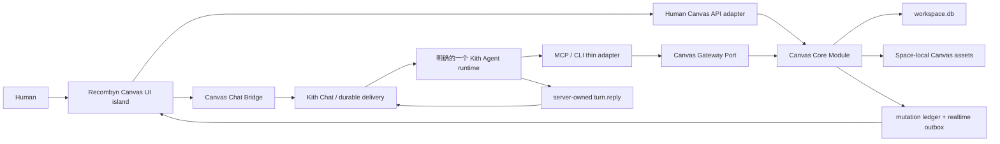
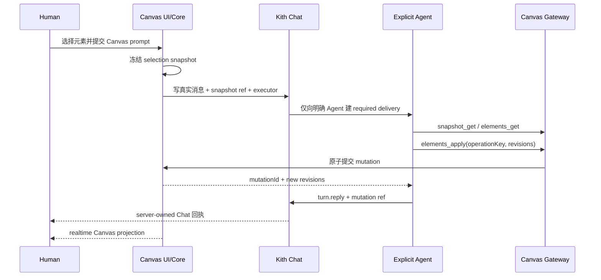

# Recombyn Canvas Workspace 移植与 Agent 联动设计

> 日期：2026-08-15
> 状态：Accepted / 阶段 1、阶段 2 均已通过主任务最终复核
> Kith 基线：`codex/development@4937690`
> Recombyn 基线：`follow-upstream@abd8198`
> 决策：`1A / 2A / 3A / 4A / 5A`
> 关联 ADR：[ADR-0038](../../adr/0038-adopt-recombyn-canvas-module.md)
> 探索证据：[移植探索](../../research/recombyn-canvas-integration-discovery.md) · [Canvas × Agent 协议研究](../../research/canvas-mcp-protocol-research.md)

## 1. 结论

Kith-space 将 Recombyn 的 RCB 无限画布编辑器作为原生 Canvas feature island 移植进现有 Workspace Tabs。Recombyn 编辑器内部的画布视觉、节点、工具栏、属性面板和编辑交互保持原貌；Kith 不迁移其 Home、AgentDock、认证、计费、分享、云同步、Tauri、Yjs 服务和 Python/LangGraph Agent runtime。

Kith Harness 仍是唯一 Agent runtime。Recombyn 的 ToolOps、校验器、危险操作规则、设计 prompt 规则和 design skills 经过 Kith capability/skill 边界适配；Canvas Core Module 是 Human API、MCP 和 CLI 的共同事实源。Renderer Redux 只承担即时交互投影，不能成为持久真相源。

MVP 交付：

- Recombyn 已有的原生无限画布编辑能力；
- 同一 Space 内多个独立 Canvas 标签；
- 多选元素冻结为 Canvas Selection Snapshot 并发送到明确 Chat 会话；
- 一个明确 Kith Agent 通过 revisioned Gateway 读取和回写；
- Canvas mutation 与 server-owned Chat 回执分别持久、互相引用；
- 一个 Canvas 对应一张无限平面，产品不增加 Page 层级。

MVP 不以前置升级 MCP `2026-07-28` 为条件。它继续使用现有 broker-backed stdio MCP 与 CLI fallback；协议升级是独立后续工程。

## 2. 已确认的产品决策

| # | 已确认方案 | 设计含义 |
|---|---|---|
| 1A | 保留 Recombyn 编辑器内部 UI，删除其产品壳 | UI 保护范围是 RCB、nodes、editor chrome、属性/图层/资产/导出面板；AgentDock 等不进入 Kith |
| 2A | 左侧 Chat + 右侧 Workspace Tabs | 直接扩展当前已实现宿主；Canvas tab 以 `canvasId` 作为资源身份，未来 Browser 复用同一宿主 |
| 3A | Kith Harness 是唯一 Agent runtime | 不保留 LangGraph 兼容模式；ToolOps、prompt rules、skills 变成 Kith capability/skill |
| 4A | 明确会话 + 明确执行 Agent + 双结果 | Canvas 操作从真实私聊/频道/话题发起；mutation 与 Chat reply 均需审计 |
| 5A | 先做可闭环 MVP | 便签、链接、任意文件、语义图、多 Agent 区域、AI 视频/音频生成后置 |

## 3. 目标、非目标与成功标准

### 3.1 目标

1. 以直接移植而非重写的方式保留 Recombyn 编辑器的能力和观感。
2. 把 Canvas 变成 Kith 的 Space-local 领域模块，而不是独立应用或第二套聊天系统。
3. 让 Human 选择的画布内容成为可冻结、可追溯、可授权的 Agent 上下文。
4. 让 Agent 使用同一套领域命令安全回写，具备 revision、幂等、事务和冲突反馈。
5. 保持 Chat 可见性与执行者分离：频道可看见请求，但只唤醒明确执行者。
6. 为后续语义图、Agent 区域、生成任务和多 Agent 协作保留窄扩展点，不提前实现。

### 3.2 非目标

- 不移植 Recombyn Python/LangGraph runtime、模型路由、session、memory、checkpoint 或 run lease。
- 不移植 Recombyn Home/Auth/Account/Billing/Share/Cloud、Tauri/Rust/Python sidecar。
- 不以 Yjs/CRDT 作为 MVP 真相源，也不做远程真人协作。
- 不实现新的 Kith runtime，不让 Canvas 自己直接调用模型。
- 不把 45 类 Recombyn prompt 全局注入每个 Agent。
- 不把 MCP transport 当作 Canvas 数据库、事务或并发协议。
- 不暴露 Recombyn 内部 `pages/activePageId` 为用户 Page。
- 不在 MVP 实现便签、链接卡、任意文件、PDF/DOCX、语义思维导图/流程图、多 Agent 区域或 AI 视频/音频生成。
- 不在本方案阶段移植代码；实现必须按切片独立进入。

### 3.3 MVP 完成定义

MVP 只有在以下闭环同时成立时完成：

1. Human 在两个 Canvas 标签中分别编辑，刷新与 Desktop 重启后内容不串、不丢。
2. Recombyn 原生编辑器保护清单通过视觉与行为回归，且页面中不存在 Recombyn 产品壳。
3. Human 多选元素后，可向明确 DM/频道/话题发送一个不可变选区引用。
4. 只有明确执行 Agent 获得 required delivery；同频道其他 Agent 不因 Canvas 上下文被默认唤醒。
5. Agent 能读取冻结选区，使用一次原子 mutation 创建或修改元素，再通过既有 `turn.reply` 写入 Chat 回执。
6. 同 operation 重试不重复修改；同元素 revision 冲突不静默覆盖。
7. Canvas 删除、Agent 撤权、Space 失联、进程中断和渲染重连均有可验证恢复或明确失败结果。

## 4. 当前代码基线

### 4.1 Workspace 宿主已经存在

本方案不再创建新的标签框架：

- `web/src/shell/workspaceTabs.ts:7` 已定义 `WorkspaceTab`；`moduleId + resourceId` 在 `:69` 形成稳定 tab identity。
- `openWorkspaceTab` 在 `web/src/shell/workspaceTabs.ts:116` 聚焦同一资源而不重复创建；状态在 `:155` 后按 Space 版本化持久。
- `web/src/shell/WorkspaceTabs.tsx:19` 已提供标签、关闭和新增入口。
- `web/src/shell/WorkspaceFrame.tsx:313` 由活动 tab 派生 Chat + module split；`:381` 负责打开或聚焦资源标签。
- `docs/kith-space/ui-direction.md:37`、`:61`、`:141` 已把 Chat 常驻、右侧标签工作区和 split 行为写成权威方向。

Canvas 只需扩展：

- `WorkspaceModuleId` 增加 `canvas`；
- `WorkspaceModuleTarget` 增加 `{ moduleId: "canvas"; canvas?: string | null }`；
- URL 使用 `?module=canvas&canvas=<canvasId>`；
- `resourceId = canvasId`，所以可以同时打开多个 Canvas；
- `resourceId = null` 只表示 Canvas Library，不表示 Page。

### 4.2 Kith Harness 已有可复用边界

- Message Context Snapshot 当前只接受规范模块、route 和最多 16 个对象引用（`src/context/messageContextSnapshot.ts:3`、`:26`）；Canvas 不能把大量节点直接塞进该结构。
- Context Assembler 已拥有冻结 `turnContextSnapshots` 的边界（`src/context/contextAssembler.ts:99`、`:371`）。
- `CapabilityGateway`、MCP 与 CLI 已共享同一领域入口；`turn.reply` 的目标由服务端持有，Agent 不能自造目标。
- `x-kith-session-handle` 是 application-level session broker handle，不是 MCP transport session id，也不是可独立使用的 bearer；它必须与当前 activation、worker generation 组合解析为 turn claims，并在每次调用重验。
- 当前 MCP SDK 为 `@modelcontextprotocol/sdk ^1.29.0`，使用 stdio server/client。

同时，当前代码没有可直接复用的 Canvas 完成契约：

- `src/messages/messagePostingModule.ts:1135-1146` 会把频道 Agent 作为响应候选，现有 command 没有 executor binding；正文 mention 在 `:954-962` 还会改变 thread surface，不能拿来代替。
- `src/capabilities/contracts.ts:3-19`、`gatewayContracts.ts:7-22` 与 `turnCapabilityService.ts:25-73` 的 strict claims 没有 Canvas object/action scope。
- `src/turns/contracts.ts:40-50` 的 strict `TurnReplyCommand` 没有 output artifact ref，`src/db/schema.ts:494-501` 的 `turn_outputs` 也只关联 message。
- `src/context/contextAssembler.ts:289-292` 只选第一条非空 UI snapshot，没有遍历并解引用所有 bound message object refs 的 resolver seam。

因此 `MessageExecutionBinding`、`CanvasAccessGrant`、`turn_output_artifacts` 与 `ContextObjectSnapshotResolver` 是 MVP 必需的 Harness 扩展，不是假定现有机制已经具备。

### 4.3 Recombyn 真实能力边界

编辑器内可迁移：无限平移/缩放、Frame、文字、矢量形状、图片/视频/音频/Lottie/SVG、pen/pencil、多选/变换、分组、层级、锁定、对齐/分布、翻转和布尔。导入/导出不能作为一个整体直接搬运：本地媒体、Scene JSON、SVG/Lottie、OCR/image-to-scene、AI 资产库、图片处理及各导出格式必须在阶段 1 分项判定 `port | replace | defer | delete`。

不存在或不完整：一等便签、链接/Web embed、任意文件、PDF/DOCX、语义 edge/port/自动布局、多 Agent 区域、Kith 多 Canvas tabs、对称 AI 视频/音频 ToolOps。

Recombyn Scene 仍有 `pages/activePageId`。MVP 为兼容移植固定一个不可见内部 root；Kith API、路由和数据库都不提供 Page 产品概念。

## 5. 移植边界与目录所有权

### 5.1 保留的上游代码

- `components/rcb/**`：camera、scene、paint、selection、frame、tool、LOD。
- `components/editor/canvas/**`：工具、选择、剪贴板、拖放、右键菜单。
- `components/editor/nodes/**`：文字、形状和媒体节点。
- editor chrome、属性/图层/资产/导出面板的视觉结构、所需基础组件、主题、图标、笔刷；资产面板的数据语义和导出面板的 Page 文案属于宿主适配点。
- Canvas feature Redux；限定为 Canvas island 的未提交手势状态、乐观投影与缓存，不能保存 canonical history。
- ToolOps schema、24 个原子 action 的参数语义、allowlist、校验器与 `op_id`。上游 `create_svg` 接受原始 SVG 字符串，不能把 Recombyn 的通用 DOMPurify 使用误认成 Canvas 安全链；SVG sanitizer 必须由 Kith 新建并拥有。
- 与 design brief、placement、Frame、稳定 ID、危险操作和 review 有关的 prompt/skill 规则。

### 5.2 删除或替换的上游代码

| 上游部分 | Kith 替代 |
|---|---|
| IndexedDB + Recombyn 云 API | `CanvasDocumentStore` / Kith workspace.db |
| 云附件与 data URL | `CanvasAssetStore` / Space-local Canvas assets |
| AgentDock | `CanvasChatBridge` / Kith Chat 与 Composer |
| 浏览器直接 apply ToolOps | `CanvasMutationService` commit + realtime projection |
| REST/SSE + Python LangGraph | Kith durable turn + Gateway |
| 自有 model/session/memory | Kith model control、per-surface session、Context Envelope、Memory |
| Tauri dialog/fs | Electron preload/main 窄 `CanvasFileExportPort`；Web 受限下载 |
| Yjs/collab server | MVP 不迁入 |
| Home/Auth/Billing/Share/Cloud | Kith 既有壳与信任边界 |
| AssetPanel、上传与 AI 资产库后端 | 保留面板视觉骨架；改接 Canvas-local asset library/import port，不保留云资产语义 |
| image-to-scene/OCR、SAM/LaMa 与生成式图片处理 | MVP defer；未来经受控 Provider/durable job 回写 asset |
| 原始 SVG 直写 | Kith-owned SVG sanitizer + asset/op 双边界校验 |

### 5.3 目标模块

```text
web/src/features/canvas/
  host/                 Kith tab、library、route、chat bridge
  upstream/             保留来源边界的 Recombyn editor/RCB/nodes/chrome
  adapters/             document、asset、portal、export、realtime adapters
  state/                feature-local Redux gesture/projection cache
  contracts/            renderer 只读 contracts

src/canvas/
  contracts/            command、document、selection、asset schemas
  canvasModule.ts       用例入口
  canvasMutationService.ts
  canvasSelectionService.ts
  canvasAssetService.ts
  canvasImportService.ts
  canvasPolicy.ts
  ports.ts              DocumentStore/AssetStore/EventPort/ExportPort

src/server/routes-api/canvas.ts
src/capabilities/canvasGatewayPort.ts
```

`src/server/routes-api/canvas.ts` 只做认证、大小限制、解析与序列化。Canvas 业务规则不得堆进 `src/server/core.ts`、`CapabilityGateway` 或 React 大组件。

## 6. 目标架构



所有 durable mutation 都通过 Canvas Core Module。Human 与 Agent 只有认证方式、capability 和风险策略不同，不存在两套写入实现。

## 7. 前端与 UI 设计

### 7.1 标签和 Canvas Library

- 左侧模块注册表增加 Canvas。
- 打开 Canvas 模块时先聚焦最近活动的 Canvas tab；没有已打开 Canvas 时打开唯一 `Canvas Library` 标签。
- Library 负责新建、打开、重命名和删除当前 Space Canvas；打开实际 Canvas 后形成 `canvas:<canvasId>` tab。
- 同一 Canvas 在同一 Space 最多一个 tab；不同 Canvas 可同时存在。
- 切换 Space 使用既有 `tabsBySpace` 恢复，不让跨 Space tab 泄漏。
- 删除 Canvas 后关闭对应 tab；若它是活动项，使用现有相邻 tab 规则。
- Canvas tab 标题跟随 Canvas title；重命名更新 tab projection，不更改稳定 id。

### 7.2 编辑器 UI 保护范围

下列内容不得为了“看起来更像 Kith”被重新设计：

- 画布背景、camera、zoom、selection、handles、guides；
- 节点视觉、工具栏、属性/图层/资产/导出面板；
- 已有快捷键、右键菜单、拖放、clipboard 与绘制交互；
- Recombyn editor 内部 iconography 与交互密度。

允许并且必须修改的只有宿主接缝：数据源、AgentDock 移除、Kith Canvas composer/binding、资源 URL、portal target、文件保存、错误/冲突提示、可访问宿主标题、资产面板的数据语义，以及上游“Export All Pages/导出全部页面”等 Page 产品文案与动作。最后一项必须改成“导出全部画布内容/画板”等无 Page 语义文案，并记为已批准的视觉 golden 例外；Frame 仍叫 Frame。

### 7.3 样式和 Portal 隔离

- Recombyn Tailwind 3 在独立入口构建并加 Canvas 前缀/作用域，不把其 Preflight 或 `html/body/:root` 规则并入 Kith 全局入口；`[data-kith-canvas-root]` 建立 scoped reset。新写宿主 UI 继续使用 Tailwind CSS v4 + shadcn/ui。
- Kith 与 Recombyn 重名的 `--canvas/--surface/--ink/--accent` 必须在 Canvas root 内重新映射，不写回 `:root`。
- Kith 的全局字体和基础选择器必须显式排除 Canvas root；Recombyn portal primitive 必须接受独立 Canvas portal root，不能默认向 `document.body` 泄漏未隔离样式。
- 阶段 1 先确定合法、可离线发行的字体集。无法沿用的字体只能作为明确批准的视觉例外替换；Kith port golden 在字体决定后生成，不拿原字体截图做不可能的逐像素目标。
- 阶段 1 的 UI island 以截图、交互 golden 和关键控件 computed-style 断言做 go/no-go，并覆盖 portal、暗色和安装级字体切换。若同一 React tree 无法通过保护门，才能单独提出 iframe/独立 renderer island 备选；不得在实现中静默改用。

### 7.4 Canvas Composer 与 Chat

Canvas 内输入不是第二套聊天：

- 当前绑定显示真实私聊/频道/话题；默认跟随左侧当前 Chat conversation。
- DM 的 executor 是对端 Agent；频道/话题必须显式选择一个 Agent。
- 发送动作扩展通用 `PostMessageCommand`，同时提交真实 Chat message、Canvas Selection Snapshot ref 和 server-owned `MessageExecutionBinding`；这不是把 executor 写进正文或 UI-only metadata。
- 无选择时可把 Canvas 整体的有界 snapshot 作为上下文；仍需明确会话和 executor。
- MVP 用“发送到聊天”动作，不做跨栏原生拖放。
- Chat 中显示 Canvas context chip、Canvas 名称、选区摘要和“在画布中打开”深链。

## 8. 数据模型与本地存储

当前 workspace schema 为 v11。实现时使用“v11 之后下一个未占用版本”，不得在设计阶段假定并行工作没有占用 v12。

### 8.1 表族

| 表 | 关键字段 | 所有权 |
|---|---|---|
| `canvases` | id, title, metadata_revision, created/updated/deleted | Canvas 生命周期和非 scene 元数据 |
| `canvas_documents` | canvas_id, format_version, scene_json, checksum, document_revision, structure_revision, realtime_sequence | 当前 canonical scene、共享结构和投影 cursor；一个隐藏 root |
| `canvas_mutations` | mutation_id, actor, nullable turn_operation_id, operation_key, request_hash, base/result revisions, realtime_sequence, forward/inverse_ops, preimage_bytes, reverts_id | 幂等、审计、transactional outbox、undo、恢复 |
| `canvas_selection_snapshots` | snapshot_id, document_revision, element/frame refs, bounded_projection, preview_asset_id, selection_hash | 不可变 Agent 上下文 |
| `canvas_assets` | asset_id, canvas_id, storage_key, media_type, byte_size, checksum, lifecycle | Canvas 独立资产生命周期 |
| `message_execution_bindings` | message_id, executor_agent_id, mode, created_at | server-owned 显式执行者；同一消息最多一个 executor |
| `canvas_access_grants` | grant_id, message/snapshot/turn/executor, canvas_id, object_scope, actions, expires_at, revoked_at | 从投递链派生的 Canvas capability 事实 |
| `turn_output_artifacts` | output_id, kind, artifact_id | `turn.reply` 与已提交 Canvas mutation 的规范关联 |

`message_execution_bindings` 与 `turn_output_artifacts` 是 Harness 的通用扩展表，不属于 Canvas 私有聊天实现；Canvas 只作为首个消费者。MVP 不创建尚未使用的 generation job 表，也不先拆 `canvas_elements` 大表。Canonical scene 保存无内联大媒体的 JSON，元素/Frame revision 保存在不能由普通 `update_node` 写入的保留 metadata，由 Canvas Module 解析并执行局部 CAS。只有实测证明整文档事务无法满足门禁时，才以兼容迁移拆分元素索引；生成 Provider 真正进入路线时再为 durable job 增加独立迁移。

### 8.2 资产

- Canvas 资产存放在 `<spaceRoot>/.kith/canvas-assets/<storageKey>`；调用方永远不能提供任意绝对路径。
- `storageKey` 是服务端生成并校验的平面标识，原始文件名只作元数据。
- Canvas 资产不复用 `.kith/uploads`：后者绑定 Chat 附件临时/消息生命周期（`src/files/localObjectStorage.ts:22`）。
- scene 只保存 `assetId` 和受控 resolver URL，不保存 data URL 或宿主文件路径。
- 保存、失败补偿、Canvas 删除与启动 GC 必须覆盖“文件先落盘、DB 未提交”和“DB 标记删除、文件仍被占用”窗口。
- asset reachability 同时覆盖当前 canonical document 与仍在 undo retention 内的 mutation preimage；历史压缩或 Canvas durable deleting 前不能回收仍可能被 inverse op 恢复的资产。
- Kith-owned SVG sanitizer 在资产入库和 Agent op 两个边界执行；至少拒绝嵌套脚本、事件属性、`javascript:`、外部引用、CSS `url()`、`foreignObject` 及可逃逸的 namespace/encoding 变体。媒体类型按实际字节探测，不信任扩展名。

### 8.3 Scene JSON 导入

外部 Scene JSON 永远不能直接替换 `canvas_documents.scene_json`。Kith-owned `CanvasImportService` 必须把它转换为受限 Core mutation：

- 只接受已批准的 format/schema version，并限制原始字节、解析深度、节点/Frame 数量、字符串和单字段大小；
- 重映射全部外部 element/Frame/group ids，拒绝重复、循环、悬空 parent/asset ref，并剥离所有 revision、root、lifecycle 等保留 metadata；
- 把所有 Page 归一为当前 Canvas 的单一隐藏 root，拒绝用导入创建/切换第二 Page；
- 外部媒体只能通过 asset rebinding 引用同次已验证导入资产；拒绝远程 URL、data URL、宿主路径和跨 Space asset id；
- 对每个 SVG 字段复用 Kith-owned sanitizer，再由 `analyzeCanvasOperationBatch()` 做结构、授权、revision 和影响集校验；
- 最终只提交正常 create/group/order 等 Core operations，不存在 raw document replace 快捷路径。

### 8.4 Page 隐藏规则

- 每个 Canvas 只有一个固定内部 root id，例如 `root`；仅供上游 Scene 兼容。
- Kith URL、REST、Gateway、tab、DB 表和用户文案都没有 `pageId`。
- 上游可能创建/切换 Page 的 UI 和命令必须移除或固定为 root。
- 后续去除内部 Page schema 是兼容清理，不是新产品能力。

## 9. Command、revision、幂等与撤销

### 9.1 统一命令

Human API 与 Agent Gateway 最终调用同一命令：

```ts
interface CanvasMutationCommand {
  canvasId: string;
  operationKey: string;
  expectedMetadataRevision?: number;
  expectedDocumentRevision?: number;
  expectedElements: Array<{ elementId: string; revision: number }>;
  expectedFrames: Array<{ frameId: string; revision: number }>;
  expectedStructureRevision?: number;
  operations: CanvasAtomicOperation[];
}
```

Actor、Space、turn、attempt、capability、expiry 和风险 scope 来自已认证上下文，不能由 request body 自报。

结果：

```ts
interface CanvasMutationResult {
  mutationId: string;
  metadataRevision: number;
  documentRevision: number;
  structureRevision: number;
  elementRevisions: Record<string, number>;
  frameRevisions: Record<string, number>;
  changedElementIds: string[];
  realtimeSequence: number;
}
```

### 9.2 原子语义

- `metadataRevision` 只覆盖 title/lifecycle 等非 scene 元数据；`documentRevision` 是每次 durable scene mutation 都推进的 snapshot/reconnect 版本；普通 element、Frame 和共享 stack/group/parenting structure revision 承担细粒度 CAS。Canvas background 属于 scene-wide document op，不属于 metadata。
- `analyzeCanvasOperationBatch()` 先 normalize operations，再由服务端派生完整 existing read/write ids、parent/root/order/global-meta/asset set 和必需 revision 域。调用方提交的 expected 集合必须与派生集合一一对应；缺失、重复或额外项都拒绝，普通 operation 也不能写保留 revision metadata。
- Frame membership、分组/解组、层级重排、create/reparent 和跨 Frame 移动必须校验 structure revision；Frame 几何/属性同时校验对应 Frame revision；scene-wide op 另校验 document revision。capability 对派生后的集合授权，不对调用方自报列表授权。
- normalization、影响集分析、live grant 重验、revision CAS、scene apply、revision bump、ledger/outbox 写入必须位于同一 Canvas Module transaction；transport 或 Renderer 不能拆开执行。
- 互不相交的元素/Frame 可以凭各自 revision 并行提交。
- 任一相关 revision 不匹配返回结构化 `canvas_conflict`，包含冲突域、当前 revision 与允许重新读取的 ref；禁止 last-write-wins。
- 多元素布局命令在一个 workspace SQLite transaction 中全成或全败。
- Canvas title/lifecycle 使用 metadata revision；background 等全局 scene 属性使用 document revision。
- Agent 幂等继续复用 Harness 的 `(turnId, toolName, idempotencyKey)`，并让 mutation 关联既有 `turn_operations`，从而跨 attempt reconcile；Human 使用 `(humanId, canvasId, globallyUniqueClientCommandId)`。每次先重验 live capability，再查同 key 的 request hash/committed result；同 hash 返回旧结果，不同 hash 返回 `idempotency_conflict`，只有新 key 才进入 CAS 和 apply。
- `canvas_mutations` 自身是 transactional outbox：同一 SQLite transaction 写 canonical document、ledger 和每 Canvas 唯一单调 `realtimeSequence`。Renderer connect/resume 携 `lastAppliedSequence`；保留窗口内按 mutation replay，cursor 缺口超窗则拉 full snapshot。commit 后 publish 前崩溃由轮询和重连恢复；Renderer ACK 只表示已渲染，不表示业务提交。
- 已提交操作的 Ctrl-Z/Ctrl-Y 必须向 Core 提交新的 inverse/forward mutation，并记录 `revertsMutationId`；MVP 仅允许同 actor 撤销其最新、尚未被 revert 且仍满足 CAS 的 mutation，inverse preimage 有明确总字节/保留期上限。Renderer 只能取消尚未提交的当前手势，不能从本地 Redux history 恢复 canonical document；Yjs undo 路径必须删除。
- Human 拖动、缩放、画笔预览在 Renderer 即时发生；这些未提交预览可本地取消，只在语义交互结束形成有界 command，不能按每个 pointermove 写 SQLite。

### 9.3 ToolOps 映射

Recombyn 的 24 个 action 全部进入阶段 1 适配 manifest；其中只有 durable scene 子集成为 `CanvasAtomicOperation`。`set_viewport` 是 ephemeral UI suggestion，`export_canvas` 是 read/file side effect，`image_process` 是 defer/asset job，不能混入 SQLite scene batch。Agent-facing API 不暴露 24 个松散顶层工具，而收敛为：

- `canvas.snapshot_get`
- `canvas.elements_get`
- `canvas.elements_apply`
- `canvas.context_bundle_create`
- `canvas.asset_import`
- `canvas.export`
- 后续 `canvas.job_create` / `canvas.job_get`

24 个上游 operation 必须逐项归类，不能因为统一到少量工具而丢失语义；阶段 1 manifest 是阶段 4 validator/allowlist 的生成输入和契约来源：

| 上游 operation | Kith MVP 处置 |
|---|---|
| `update_node`、`create_shape`、`create_text`、`outline_text` | 迁为 durable element ops；`outline_text` 只有本地 fontkit 与已许可字体通过门禁后开放 |
| `create_image`、`create_svg`、`create_lottie`、`create_icon` | 迁为 durable media/vector ops，但只接受已导入 `assetId` 或经过 Kith-owned sanitizer 的内联 SVG 结构；不允许任意远程 URL |
| `create_frame`、`update_frame`、`delete_frame` | 迁为 durable frame ops；删除继续使用 destructive scope/确认，Frame 不等于 Page |
| `delete_nodes` | 迁为 destructive durable op，必须有精确 node ids/revisions |
| `align_nodes`、`distribute_nodes`、`reorder_nodes`、`group_nodes`、`ungroup_nodes`、`duplicate_nodes`、`flip_nodes`、`boolean_op` | 迁为 atomic multi-element ops，整批 expected revisions 全成或全败 |
| `set_canvas_background` | 迁为 expected document revision 的 scene-wide op |
| `set_viewport` | 只作当前已连接 UI 的临时 suggestion，不进 document/mutation ledger，也不授予 durable write scope |
| `image_process` | 保留 schema 兼容但默认不向 Agent 开放；只有已经随包离线落地且通过许可/性能/安全门的 kind 才可逐项启用，OCR/SAM/LaMa、生成式替换等进入后续 durable job |
| `export_canvas` | 映射到 `canvas.export` 和 Electron/Web Export Port；不作为 scene mutation |

`create_image.genPrompt/removeBg`、`create_lottie.genPrompt` 等依赖 Recombyn 生成后端的参数在 MVP 禁用；Agent 先用 Kith 后续生成 Provider/job 取得 asset，再通过 `asset_import` 与普通 create op 附着。`elements_apply` 接受有界 operation 数量和总字节，内部复用 allowlist、schema、stable id、Kith-owned SVG sanitizer 与危险操作策略。删除、覆盖、导入、导出和外部生成使用独立风险 scope。

## 10. Selection Snapshot 与 Context Envelope

### 10.1 创建

Human 点击发送时，Renderer 只提交选中 ids 和当前已知 revisions。Core 在同一 Space 中重新读取 canonical scene 并冻结：

```text
CanvasSelectionSnapshot
  snapshotId
  canvasId + documentRevision
  selectedElements: Array<{ id, revision }>
  selectedFrames: Array<{ id, revision }>
  structureRevision when membership/order is included
  bounded canonical text/geometry/style/asset projection
  optional previewAssetId
  selectionHash
  createdBy + createdAt
```

快照不可变。预览只是辅助，Agent 获取事实时仍以 snapshot canonical projection 为准。

### 10.2 接入 Chat 和 turn

- Message Context Snapshot 增加安全模块 `canvas`，但 `openObjectRefs` 只加入一个 `canvas_selection_snapshot:<snapshotId>`，不加入 40–80 个节点。
- snapshot row、message/ref、`MessageExecutionBinding` 和 executor required delivery 必须在同一 MessagePosting workspace 事务中提交或回滚；若 preview asset 需要提前暂存，则仅由 GC 清理未绑定的暂存资产，不能留下孤立 snapshot row。
- 新增受注册表约束的 `ContextObjectSnapshotResolver` seam；Canvas resolver 遍历该 turn 所有 bound message 的所有规范 Canvas refs，去重、限额并重验授权，写入 `turnContextSnapshots` 和 source audit。不能只读取第一条非空 UI snapshot，也不能把 Canvas 分支硬编码进 Context Assembler。
- Turn Inspector 显示 Canvas、选区元素数、冻结 revision、来源会话、预览和深链。
- Canvas 后续变化不改写旧 turn snapshot。snapshot 在消息事务中已授权且内容有界、不可变，因此即使发送后、turn assembly 前 Canvas 被删除，仍可按原 disclosure 注入并用于审计；所有 live read/write 和 deep link 对 deleted Canvas fail-closed，深链显示“画布不可用”。

## 11. Agent 发起、执行与完成语义



### 11.1 MessageExecutionBinding 与派发

`PostMessageCommand` 增加 server-validated execution binding：

```ts
interface MessageExecutionBindingInput {
  executorAgentId: string;
  mode: "required";
}
```

- eligible executor 必须未删除、已处于 v2、具有当前 surface access，并在事务执行时实时拥有 `message:send`。DM 不接受调用方任意指定 executor，由服务端从对端身份推导后做同样校验；频道/话题必须显式提交一个 eligible Agent。
- binding 不改变原 DM/频道/话题 surface，不通过伪造正文 `@mention` 建新 thread。
- 有 binding 时，MessagePosting/response policy 只给 executor 创建 required delivery；同频道其他 Agent 不获得 required 或 optional delivery。消息可见性仍按原 surface ACL；未来若需 observe，必须定义不执行的独立语义。
- snapshot、message/ref、binding 和 required delivery 同事务，任一验证或写入失败则全部回滚。

规则：

1. DM 只执行对端 Agent；频道/话题必须选择一个 executor，不允许因带 Canvas ref 自动展开到全体。
2. 消息仍对有权成员可见；执行权只来自现有 direct mention/task/response mode 与该次 executor binding。
3. 每个执行者拥有自己的 logical turn、attempt、capability 和 mutation provenance。
4. Canvas mutation 不等于 required turn 完成。Agent 仍必须通过 `turn.reply` 结算输入；回执附 mutation ref，由 Core 决定真实 reply target。
5. Agent 已提交 mutation 但在 reply 前崩溃时，恢复 attempt 重用 operation key 得到旧 mutation，再补 Chat reply，不重复改 Canvas。
6. Agent reply 成功但 Renderer 离线时，Canvas 仍以 Core 已提交 revision 为准；重连后重放 projection。
7. Agent 无修改建议时可只 reply；若输入要求回写却因冲突、撤权或删除失败，reply 必须明确失败，不能伪报完成。

### 11.2 Canvas access grant

现有通用 capability claims 不足以表达 Canvas 对象域。MVP 新增 durable `CanvasAccessGrant`，它至少绑定 `messageId + selectionSnapshotId + deliveryId + turnId + executorAgentId + canvasId + objectScope + actions + expiresAt`：

- `prepare()` 只能从已绑定 required delivery 与 `MessageExecutionBinding` 派生 grant id/claims，不能从工具请求体中的 `canvasId`、元素 id 或 selection id 签发。
- action 分为 read snapshot、read live、write existing、create、import 和 export；默认 selection grant 只读冻结 snapshot，并把 live write 限于已授权选中对象及明确 parent/root 下的新对象。
- “无选择、读取或修改整张 Canvas”是单独的显式 broad grant，不能由空 selection 自动升级。
- 每次工具调用都从服务端 grant 重验 expiry/revocation、Canvas lifecycle、Agent/surface/turn 归属，并以 `analyzeCanvasOperationBatch()` 派生的真实 read/write/asset 集合做授权；request body 只能缩小，不能扩张 grant。
- Gateway contracts 增加 Canvas read/write/import/export scopes，但 MCP/CLI 只传 broker capability handle/grant ref，不承载可伪造的授权事实。

### 11.3 Canvas mutation 与 Chat output artifact

`sourceRefs` 仍只表达 disclosure evidence，不能冒充输出 artifact。`TurnReplyCommand` 增加 strict `outputRefs`，MVP 支持 `{ kind: "canvas_mutation", artifactId: mutationId }`：

- Canvas mutation 关联既有 `turn_operations`；reply 事务验证 mutation 已提交、与当前 Space/turn/executor 一致且未被冲突绑定，再写 `turn_output_artifacts`。
- `outputRefs` 进入 reply request hash 和 result ref；`turn.get` / Turn Inspector 可从 output 查询 mutation，也可从 mutation 追溯 operation/output。
- mutation commit 后、reply 前崩溃会留下可由当前 turn operation 查询的 unattached committed artifact。恢复 attempt 先以原 `(turnId, toolName, idempotencyKey)` reconcile，再原子绑定 output 并补 reply，不能重复 apply。

## 12. Prompt 与 Skill 适配

### 12.1 不迁移的内容

- `Recombyn Auto` persona、品牌语气和 Ask 产品文案；
- 自有 model router、session、memory、checkpoint、wallet/BYOK；
- LangGraph 节点编排、Review swarm/tournament；
- Coding CLI stdout JSON fence 和临时 scene workspace。

### 12.2 迁移为 Kith Canvas Skill 的内容

- intent：区分纯回答、Canvas 修改和完整设计任务；
- Design Brief：目标、受众、信息层级、风格、约束；
- placement：相对选区、Frame、空白区域与 viewport 建议；
- stable id / Frame / parent-child 规则；
- destructive confirmation、覆盖与删除约束；
- review 维度：层级、对齐、可读性、对比、溢出、重叠和交付完整性；
- 28 个 design skills 在逐项许可证、内容和模型依赖核验后按需投影。

阶段 1 必须为 45 个 prompt kind 与 28 个 skill 生成逐项 manifest：`migrate_as_skill | migrate_as_tool_policy | replace_with_kith | defer | delete`，记录来源路径、许可证、依赖和理由；任何未分类项都不能进入 bundle。这样“适配”是可审计迁移，不是只按类别口头概括。

Skill 只在 turn 具备 Canvas capability 时装配。Agent 原身份、职责、模型和记忆不变；普通聊天不承担 Canvas prompt token 成本。

### 12.3 System prompt 最小增量

系统只需要说明：

- 如何发现 Canvas capability；
- snapshot 是冻结事实，live Canvas 需显式 refresh；
- 修改必须携带 expected revisions 与稳定 operation key；
- 冲突后重新读取，禁止猜测覆盖；
- mutation 后仍用 `turn.reply` 结算；
- 不得向无权 Canvas、元素或资产扩张 scope。

具体设计方法放在 skill，不进入所有 runtime 的全局 prompt。

## 13. MCP `2026-07-28` 决策

### 13.1 MVP 决策

不升级。Canvas MVP 继续复用当前基于 `@modelcontextprotocol/sdk` 1.x 的 legacy-compatible stdio server 与 CLI fallback，新增工具只是现有 transport 的薄注册。

原因：

- `2026-07-28` modern core 移除 `initialize/initialized`；同版本的 Streamable HTTP transport 另行移除 `Mcp-Session-Id` 和独立 GET stream endpoint，有利于无粘性实例和负载均衡；
- 它不提供可信 actor、ACL、operation 幂等、SQLite 事务、revision、冲突、undo 或 durable job；
- Kith 是单机 Desktop/Core/Worker，当前不存在必须通过 modern Streamable HTTP 解决的生产瓶颈；
- 将 SDK v2、dual-era compatibility 与 Canvas 同批会扩大回归面，并不能替代 Canvas Command API。

### 13.2 采用的协议思想

- 每次请求显式携带 canvas、selection/job 和 revision，不依赖连接中的“当前画布”。
- 保留 Kith application-level broker handle；不得因 Streamable HTTP 删除 `Mcp-Session-Id` 而删除 `x-kith-session-handle`。后者单独无权，仍需 activation + worker generation 才能解析 turn claims。
- Core-owned Canvas Module 是唯一真相源，MCP/CLI/未来 HTTP 都是 Adapter。

### 13.3 后续触发条件

只有出现外部 MCP host、受控 LAN 标准入口、真实多 Core 实例或 SDK 1.x 维护终止，才独立设计 SDK v2 + dual-era migration。该迁移必须验证 Claude/Codex/OpenCode 的 MCP bootstrap fixture，并验证 Pi 受支持的 CLI Gateway/runtime smoke；不得伪造 Pi MCP 支持，也不得夹带 Canvas 领域改写。

## 14. 安全、隐私与失败模式

| 风险/失败 | 必须行为 |
|---|---|
| 恶意 SVG/foreignObject | Kith-owned sanitizer 在资产入库、Scene import 转换与 op apply 边界执行；覆盖嵌套脚本、事件属性、`javascript:`、外部引用、CSS `url()`、`foreignObject` 和 namespace/encoding 绕过测试 |
| 恶意/畸形 Scene JSON | 只经 `CanvasImportService` 变成受限 Core operations；限制 schema/大小/深度/数量，重映射 ID、剥离保留 metadata、单 root 归一、asset rebinding；禁止 raw document replace |
| 伪造媒体类型/超大文件 | magic-byte 探测、单文件/单 Canvas/请求限额、流式落盘 |
| data URL/scene 膨胀 | scene 只保存 asset ref；命令与文档设置总字节门 |
| Agent 越权 Canvas/元素 | Canvas grant 固定 Space/turn/executor、canvas、selection/object scope、actions、expiry；按服务端派生影响集逐次重验 |
| Space/Canvas 删除或失联 | 写入 fail-closed；审计快照可读，live deep link 降级 |
| 同元素、Frame 或共享结构并发 | 按 element/frame/structure revision 返回 CAS conflict；不得静默 rebase destructive/structural op |
| 长任务迟到 | 完成时重验 capability 与 target revisions；冲突则保存 unattached result |
| Core 在 commit 后崩溃 | mutation ledger + realtime sequence 可重放，不重复业务写 |
| Renderer 乐观更新失败 | 回滚到 Core snapshot，显示可恢复冲突；Renderer 不维护可覆盖 canonical document 的 history |
| 文件先落盘 DB 未提交 | startup/periodic orphan GC；年龄门避免删除在途文件 |
| Canvas 删除时文件被占用 | 先 durable 标记 deleting，后台重试，不假装已物理删除 |
| 在线字体/CDN | 许可核验后本地打包；未核验项不进入发行物 |
| Tauri 广目录权限 | 不复制；Electron/Web 只经窄 export/import port |
| Prompt injection in Canvas text | Canvas 内容按不可信 context 处理，不能改变 capability 或 system policy |

MVP 的权限仍受当前外接 runtime 高权限技术债影响。Canvas 工具本身必须窄 scope，但这不等价于完成 P-S1 sandbox/approval/Vault。

## 15. 性能与可运维性门禁

### 15.1 先冻结、再优化

阶段 1 先在 Recombyn 原仓冻结上游 fixture、截图、操作脚本与指标采集协议：轻量元素、长文本、多个重叠 Frame 及其内容、媒体、长笔画、分组和布尔结果；Kith port harness 建成后，再使用同一 fixture 和协议形成可比较结果。记录：

- 首屏可交互时间；
- 选区/拖拽/缩放 frame time；
- document load/save 与 mutation commit p50/p95；
- scene JSON 与 mutation ledger 增长；
- 内存、full SVG host/proxy 数量；
- 大图导出时间和峰值内存。

Recombyn 当前约 96 个 full SVG host / 4096 个代理框是迁移基线，不是 Kith 可随意降低的目标。没有 profiler 证据不改 RCB 渲染架构、不引入虚拟化重写或 Rust。

### 15.2 运行诊断

Canvas 诊断至少记录：canvas/mutation id、可选 job id、actor domain、turn/attempt、各 base/result revision、operation 数量、冲突类型、commit latency、projection lag、asset bytes 和失败阶段。日志不得写入 Canvas 正文、媒体内容、prompt、密钥或本机绝对路径。

## 16. 五个开发阶段

整体开发只按以下 5 个阶段推进。每个阶段交付一个可运行、可审查的产品状态；阶段内部清单只用于控制顺序和验收，不再拆成独立任务线程。上一阶段必须经主任务审查通过，才能开始下一阶段。

### 阶段 1：移植地基与 UI Island

实现状态（2026-08-15）：阶段 1 AgentDock纠偏实现已完成并通过主任务最终复审。开发态入口 `?__canvas_stage1=1` 不组合 AgentDock、Dock 开关或占位；底栏两个相邻原生按钮可用 `A` / `Shift+A` 创建图片/视频生成器节点，创建、选择、拖动、参数修改、文档投影和开发态版本化浏览器重载可用。当前闭包为320项，318项 materialize，2个品牌二进制排除；审计与物化直接读取固定 `abd8198` Git object，不依赖嵌套仓库当前 checkout。三个 composer scene helper 已迁入带来源声明的窄 Canvas adapter，`runDesignAgent`、`designTools`、`agentMemory`、`service/design`、`service/upload` 与 `utils/request` 已退出闭包。图片、视频和共享媒体生成提交为短小的显式 unavailable 实现，无 Recombyn request/upload/media Job transport 或不可达生成代码；媒体文件只形成本地 data URL。浏览器已验证无 Dock、生成器选中与拖动、参数修改、画布内 data URL 引用、图片/视频 unavailable 提交、双节点刷新恢复、相关 API 资源记录为空且控制台无 error。普通 production build 静态排除 harness，专用构建只验证开发岛。正式 Workspace Tabs、Canvas Library、SQLite/Canvas Core、资产持久化、Selection Snapshot、Gateway 和 Agent 写回未开始，也不得开始。

目标：在不接入正式持久化和 Agent 写回的前提下，让 Recombyn 编辑器以隔离的 feature island 在 Kith 中编译、打开并保持原生观感。

交付：

- 精确 source manifest、迁入/替换/延后/删除清单；
- 45 个 prompt kind、28 个 design skill 与 24 个 ToolOps 的逐项处置 manifest；
- Kith `NOTICE` 拟增补、Apache-2.0 修改声明、MIT skills attribution、Paynter 完整 MIT notice 门禁，以及字体、图标、品牌和在线资产许可结论；
- 本地媒体、Scene JSON、SVG/Lottie、image-to-scene/OCR、AI 资产库、图片处理和各导出格式的 `port | replace | defer | delete` 能力矩阵；
- Recombyn upstream fixture、截图、快捷键、性能基线和视觉比较协议；
- RCB/editor/nodes/chrome 最小闭包进入 `web/src/features/canvas/upstream/`，产品壳依赖移除；
- feature-local Redux 未提交手势/投影缓存、in-memory document adapter；
- Tailwind 3 独立作用域、Preflight 隔离、Canvas scoped reset、token/font 隔离和独立 portal root。

验收：在 Kith port harness 重放 upstream fixture；`pnpm run typecheck`、`pnpm run web:build` 和核心交互测试通过；固定视口截图、computed-style、portal、快捷键、暗色与安装级字体检查达到保护门。未核清许可、无法重复基线或同一 React tree 无法隔离时停止，不进入阶段 2。

### 阶段 2：Human 本地画布完整闭环

实现状态（2026-08-15）：阶段2已完成并通过主任务最终复核。正式 Canvas Library/resource tabs、workspace schema v12、Canvas Core/轻量 ledger/revisions、Human API、realtime recovery、Core undo/redo、Canvas-local assets、SVG/Scene JSON 门禁和原生 upload-first 媒体 seam 已落地；服务端从规范化 operation 派生 element/Frame/Frame-membership/parent/root/order read/write set，以 `expectedRevision` 作为 base sequence cursor 扫描其后 ledger，所有真实 structure 影响共享冲突域；renderer 对既有 Frame 属性使用稳定 Frame ID patch，允许同 base 不相交 Frame 纯属性提交，并拒绝 membership、group/reparent、order 与 Frame 增删/重排之间的交叉 stale 提交；scene/revision/ledger/sequence 同事务。Import 只接受批准的 versioned format/schema，以 document/ROOT/node/Frame allowlist 转换并递归剥离所有保留值内的 Core 状态，重映射全部外部 ID、归一隐藏 root、拒绝未重绑定资产，再经 Core operation 原子创建。Canvas 删除通过 metadata revision/幂等 ledger/sequence 软删除；`/changes` 对同 Space 已删除 Canvas 返回 tombstone，使漏掉在线事件的客户端重连后关闭 tab、清 URL 并返回 Library，普通网络失败与跨 Space 404 不作为删除。资产 resolver 每次从同一已打开 fd 读取并核验数据库 size + SHA-256；由于 Node 没有跨平台 handle-relative unlink，阶段2删除和恢复不物理 unlink 用户可变目录中的资产或未知 staging，物理 GC 留阶段5；若 final 损坏而 staging 完整，恢复写入新的 O_EXCL sibling、fsync 后切换 DB storage key，旧文件保留，双损坏 fail closed。Stage1 audit/mapping SHA 和 `upstream/**` 字节保持不变。Selection Snapshot、Chat、Gateway/MCP、Agent写回和真实 AI 生成仍为零。当前 retained operation/inverse 历史及资产 reachability 仍线性增长，Windows/Linux 文件语义未实机验证，独立 Canvas chunk 约3.5 MB且保留 Vite >500 kB 告警，因此长期存储/资产回收、跨平台与 bundle 性能门禁尚未通过。

目标：即使完全没有 Agent，Canvas 也已经是可长期使用、刷新和 Desktop 重启后不丢数据的本地产品。

交付：

- `src/canvas/` 深 Module、workspace schema migration、document/mutation/asset store、Human API、realtime sequence 与崩溃恢复；
- metadata/document/element/Frame/structure revisions、服务端影响集分析、幂等 ledger、冲突和 Core revert/forward undo；
- `canvas` module、Canvas Library、多 Canvas Workspace Tabs、Space 隔离、URL 与标题同步；
- 文字、形状、Frame、选择/变换、分组/层级、对齐/分布、翻转、布尔、pen/pencil、媒体与长路径的原生编辑闭环；
- Canvas-local AssetPanel、受控 resolver、Kith-owned SVG sanitizer、`CanvasImportService` 和 Electron/Web 窄导入导出桥；
- hidden root 和无 Page 产品契约；image-to-scene/OCR、AI 资产库与重型图片处理继续延后。

内部实现顺序是“文字/基础形状 durable vertical → Workspace Tabs → Frame/结构/undo → 手绘与媒体/导入导出”，但这些只是同一阶段的检查点，不拆成新的整体任务。

验收：多 Canvas 重启恢复、全部批准的原生节点/变换、revision conflict、Undo/Redo、realtime replay、资产崩溃窗口、SVG/Scene JSON 攻击样本、长笔画、批量操作和视觉回归通过。

### 阶段 3：Canvas 与 Chat 上下文联动

实现状态（2026-08-18）：阶段3后端与产品 UI 已落地。workspace schema v13 新增 `canvas_selection_snapshots` 与 `message_execution_bindings`。宿主在原生 SelectionContextToolbar/MultiSelectionToolbar 之上提供可见“发送到 Chat”动作（并保留原生右键 Add to Chat），经 `kith:canvas-selection-to-chat` 把当时选区交给当前 Chat surface 的 Composer 并给出飞入反馈。pending 选区按 DM/频道/话题隔离，不使用跨会话全局单例。Core 重读 canonical scene 并冻结 snapshot（逐元素 `{id, revision}`、document/structure revision、有界投影、locale-neutral 摘要、深链）；canonical JSON/hash 使用 Unicode code-point 排序。MessagePosting 同一事务写入 snapshot、canvas module context ref、server-owned required binding 和 executor required delivery；DM 从对端推导 executor，频道/话题必须从当前 surface 的 eligible executor 列表显式选择并保持原 surface。executor 必须未删除、v2、有当前 surface access 且实时拥有 `message:send`，否则整笔回滚且不留孤立数据。其他 Agent 不获 optional wake，也不因正文 mention 改 surface。Composer/已发送消息展示可预览 Canvas Context Chip（画布名、缩略图、元素/Frame 摘要、冻结 revision、en/zh）；发送成功后消息 chip 不可变，点击可打开对应 Canvas 并聚焦原选区。注册式 Canvas `ContextObjectSnapshotResolver` 接入 Context Assembler 与 Turn Inspector 结构化卡片；Canvas 删除后历史 snapshot 仍可审计，live read/write/deep-link fail-closed。空选区冻结整张画布有界 snapshot，不是 grant，产品发送入口也不默认发送整张画布。“让 Agent 处理”、Canvas Access Grant、MCP/CLI Gateway、`snapshot_get`、Agent 读写/回写与 AgentDock 仍留给阶段4。

目标：Human 可以把发送当时的画布选区安全交给真实 Chat surface 中的一个明确 Agent。

交付：

- selection snapshot、preview 和 Message Context ref；
- 通用 `MessageExecutionBinding`、MessagePosting 同事务附件和 eligible executor 预检；
- Chat context chip/deep link、`ContextObjectSnapshotResolver`、Context Assembler 与 Turn Inspector 投影。

门禁：“让 Agent 处理”入口继续由 feature flag 隐藏，直到阶段 4 的最小 `snapshot_get`、Canvas grant 和诚实 reply 契约通过；不能先制造 Agent 无法读取的 required delivery。

验收：DM/频道/话题保持原 surface，仅一个 required delivery，其他 active Agent 无 optional wake；executor 删除/v1/无 surface access/无 `message:send` 均整笔回滚；另覆盖删除后审计、发送后 assembly 前删除、选区后改画布、无选择 broad grant、未授权读取和事务失败清理。

### 阶段 4：单 Agent 读取与回写闭环

目标：一个明确 Agent 可以安全读取冻结上下文、原子修改 Canvas，并在真实 Chat 中留下可审计回执。

交付：

- Canvas Gateway Port 与 MCP/CLI thin tools；
- Recombyn ToolOps validator/allowlist 适配；
- `CanvasAccessGrant` 持久化、`prepare()` 派生、逐调用重验和 Canvas action scopes；
- Canvas skill pack 与最小 system prompt 增量；
- `TurnReplyCommand.outputRefs`、`turn_output_artifacts` 与 mutation/turn operation 双向查询；
- 冲突、重试、撤权和 crash recovery。

验收：伪造/扩张 canvasId、selection、element 或 action 均失败；同 operation 重放、同 key 不同 payload、同元素/Frame/structure 冲突、多元素原子回滚、mutation 后 reply 前崩溃、群聊单执行者和 server-owned reply target/output artifact 全部通过。

### 阶段 5：MVP 硬化与发行验收

目标：把前四阶段的闭环收敛为可交给真实用户试用的 Canvas MVP。

交付：

- 性能基线对比、大画布/长笔画/大媒体/内存门禁、bundle/CSP/WASM/字体/NOTICE；
- Windows/macOS/Linux 共享逻辑检查和 cross-platform gap 更新；
- 文档、用户迁移说明、诊断、资产 GC 和数据清理；
- Desktop 与本机浏览器真实 smoke。

验收：相关单元/集成测试、`pnpm run typecheck`、`pnpm run web:build`、`pnpm run desktop:bundle`，以及本规格第 17 节完整矩阵通过。

便签、链接、任意文件、语义图、原生跨栏拖放、生成 job、多 Agent zone/并发写、Yjs 和 MCP SDK v2 不得插入这 5 个阶段，统一作为 MVP 后独立增量。

## 17. MVP 验收矩阵

| 场景 | 预期 |
|---|---|
| 新建两个 Canvas 并重启 | 两个资源 tab 可恢复，scene 与 assets 不串 |
| 同 Canvas 重复打开 | 聚焦既有 tab，不生成重复项 |
| 上游文字/形状/Frame/媒体/手绘 | 与冻结 Recombyn fixture 的行为和视觉一致 |
| 多选发 DM | 创建一个不可变 snapshot，对端 Agent 获得 required delivery |
| 多选发频道/话题 | 保持原 surface；消息成员可见，仅明确 executor 获得 required delivery，其他 active Agent 无 optional wake |
| 选择不合格 executor | 已删除、v1、无 surface access 或无 `message:send` 时 snapshot/message/binding/delivery 全部回滚 |
| 发送后、turn assembly 前删除 Canvas | 已授权 immutable snapshot 仍可注入审计；live read/write/deep link fail-closed |
| 发送后继续编辑原元素 | Agent turn 仍看到发送时 snapshot；live refresh 需显式调用 |
| Agent 批量布局 | 一个事务全成或全败，返回 mutation id/revisions |
| 两个 writer 改同一元素 | 第二个收到 conflict，不覆盖第一个 |
| 两个 writer 同时改 Frame membership/group/stack | 第二个在 frame 或 structure domain 收到 conflict，不能靠漏报元素 revision 覆盖 |
| 重试相同 operation | 返回原 mutation，不产生第二次变更 |
| mutation 成功、reply 前崩溃 | 恢复后复用 mutation 并补 reply |
| 伪造或扩张 Canvas grant | 改 canvas/selection/element/action 或使用过期 grant 都 fail-closed |
| Agent 已撤权/Canvas 已删除 | 写入 fail-closed，Chat 诚实汇报失败 |
| Renderer 离线后重连 | 从 Core revision 恢复，不以本地 Redux 覆盖 Core |
| commit 成功、realtime publish 前崩溃 | 以 lastAppliedSequence replay；缺口超窗拉 full snapshot，不丢 mutation |
| 恶意 SVG/超限媒体 | 嵌套脚本、事件属性、`javascript:`、外部引用、CSS `url()`、`foreignObject` 及超限样本都被拒绝，且无 DB/文件 orphan |
| 恶意/畸形 Scene JSON 导入 | Page、raw SVG/URL/data URL、保留 revision、重复/循环 ID、深层结构和跨 Space asset 都被拒绝或安全归一；不能替换 canonical scene |
| 删除 Canvas 时文件占用 | 阶段2只提交 durable tombstone 并退出 UI，不物理 unlink 用户可变目录；不可达文件保留到阶段5安全 GC，不能谎报物理清理完成 |
| URL back/forward 与 Space 切换 | 活动 tab 和资源参数规范恢复，无跨 Space 泄漏 |
| 无 Page 检查 | UI、URL、API、DB 产品对象中都没有 Page |
| Page 导出文案检查 | 上游“全部页面”文案/动作已替换为无 Page 语义，并作为批准的 golden 例外记录 |
| 已提交操作 Ctrl-Z/Ctrl-Y | 产生 Core revert/forward mutation；刷新与另一 renderer 看到相同结果 |
| 删除媒体后执行可用 undo | undo retention 内资产仍可达；历史压缩/过期后才允许 GC |
| Chat 回执 | 由既有 server-owned `turn.reply` 落正确 surface，并附 mutation ref |
| MCP/CLI 一致性 | 两个 transport 经过同一 Gateway 得到相同领域结果 |

## 18. MVP 后路线

1. 一等便签、链接、文件卡片和 PDF/DOCX 预览。
2. 语义 connector、port、edge、自动布局、思维导图与流程图工具。
3. Canvas ↔ Chat 原生拖放，以及 Browser 等其他 resource tab。
4. 图片/视频/音频生成 Provider 与 durable jobs；迟到结果进入 unattached tray，不覆盖新内容。
5. `CanvasAgentZone`：以 Frame/metadata 形成 Agent capability reservation，不创建 Page 或第二套 session。
6. 多 Agent 委派、分区并行、冲突可视化和结果合并；群聊可见性继续与执行者分离。
7. 可选 reviewer task；不默认启动 tournament/swarm。
8. 只有出现远程真人实时协作需求后再评估 Yjs/CRDT。
9. MCP SDK v2 / `2026-07-28` modern/dual-era 迁移继续独立进行。

## 19. 开放但不阻塞 MVP 的实现问题

以下问题必须由对应切片用实测收敛，不需要重新改变 1A–5A：

- scene JSON 全量事务在冻结 fixture 下是否满足 commit SLO；不满足才增加元素索引/快照压缩。
- Recombyn Tailwind 3/portal 样式如何以最小改动通过 Kith Tailwind 4 视觉门。
- 哪些上游字体可合法随 Kith 打包，哪些映射到 Kith 已有字体。
- image processing 中依赖重型 WASM/模型的子能力是否拆为后续 job；不得因此缩减基础图片节点编辑。
- Kith 浏览器入口对大文件导出采用下载还是 File System Access capability；Desktop 继续走 Electron 窄桥。

任何答案若需要改变 UI 保护范围、唯一 runtime、双结果语义或 MVP 功能边界，必须新增 ADR 并重新请求用户决策。

## 20. 关键源码与研究证据

- Recombyn 许可：`reference/recombyn/LICENSE:67`、`:90`、`:139`；`reference/recombyn/NOTICE:1`。
- Recombyn RCB：`reference/recombyn/docs/canvas-architecture.md:7`、`:29`、`:67`。
- Recombyn Scene/Page：`reference/recombyn/apps/web/src/components/rcb/sceneNode.ts:12`、`:72`、`:80`。
- Recombyn 选择发送：`reference/recombyn/apps/web/src/components/editor/panels/agent/canvasAttach.ts:21`。
- Recombyn ToolOps：`reference/recombyn/apps/api/seeds/canvas_actions_seed.json:2`、`reference/recombyn/apps/api/app/services/design/ops/tool_ops_contract.py:918`。
- Recombyn Agent 路径：`reference/recombyn/apps/api/app/services/design/runtime/graph/build.py:612`、`reference/recombyn/apps/web/src/components/editor/panels/agent/runDesignAgent.ts:3633`。
- Kith tabs：`web/src/shell/workspaceTabs.ts:7`、`:69`、`:116`、`:155`。
- Kith Workspace host：`web/src/shell/WorkspaceTabs.tsx:19`、`web/src/shell/WorkspaceFrame.tsx:313`、`:381`。
- Kith Context：`src/context/messageContextSnapshot.ts:3`、`:26`；`src/context/contextAssembler.ts:99`、`:371`。
- Kith Gateway/reply：`src/server/turn-gateway/routes.ts:45`、`:165`；`src/turns/turnOutputService.ts:93`。
- Kith local upload store：`src/files/localObjectStorage.ts:22`。
- MCP 官方证据与迁移影响：`docs/research/canvas-mcp-protocol-research.md`。
